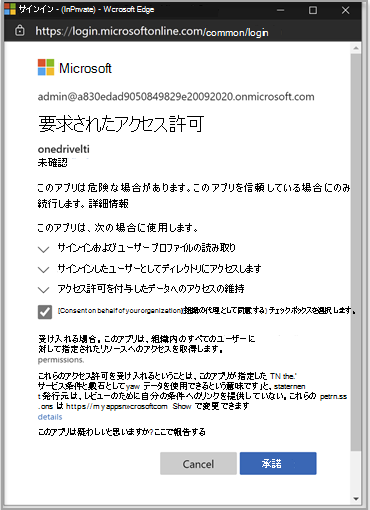
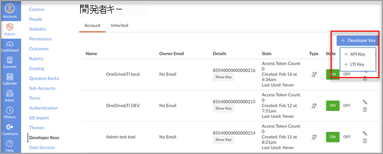

# ラーニング管理システムで Microsoft OneDrive を使用する

> [!IMPORTANT]
> 一部の情報は、市販される前に大幅に変更される可能性があるプレリリース製品に関するものです。 Microsoft は、ここに記載された情報に関して、明示または黙示を問わず、いかなる保証も行いません。

学習管理システム (LMS) で Microsoft OneDrive を使用する利点について説明します。

**365 Microsoft Officeワークフローに直接取り込む**

Microsoft OneDrive ラーニング ツール相互運用性 (LTI) アプリは、LMS と統合して、Microsoft OneDrive および Microsoft Office 365 を次のような最も重要なワークフローに直接取り込むための機能です。

- リソースの添付とコンテンツの整理。
- 共同ドキュメントの開始。
- 割り当ての作成と評価。

**セキュリティで保護され、最新の LTI 標準に完全に準拠**

Microsoft OneDrive LTI アプリは、LTI 1.3 および LTI Advantage と互換性があります。 この利点により、高度にセキュリティで保護され、緊密に統合されたユーザー エクスペリエンスが可能になります。

**モダンでリッチなユーザー エクスペリエンス**

Microsoft OneDrive LTI アプリは、LMS エクスペリエンスに最高の Microsoft を提供します。 新しく拡張された Microsoft OneDrive ファイル ピッカーと、Office ファイルの豊富な編集エクスペリエンスを備えた、よりモダンなユーザー エクスペリエンスを提供することで、LMS の既存の Office 365 統合を改善しています。 Microsoft は今後、Microsoft OneDrive LTI アプリを完全に所有します。つまり、Microsoft から自動的に最新の機能を常に取得できます。

Microsoft OneDrive LTI アプリでは、次の機能を使用できます。

- リッチ Officeから Word ドキュメント、PowerPoint プレゼンテーション、Excel など、365 のファイルを添付します。

- 365 Office割り当てを配布します。

- 個人用およびコースの Microsoft OneDrive ファイルを表示および整理します。

- コースメンバーが共有ドキュメントでリアルタイムで共同作業できるコラボレーションを作成します。

- 個人アカウントと学校アカウントを含む複数の Microsoft OneDrive アカウントにアクセスします。

- 365 Officeをコース モジュールに統合します。

- LMS でシングル サインオンを行う場合は、Microsoft アカウントを使用します。

## Canvas との統合

この統合を実行するユーザーは、Canvas の管理者であり、Microsoft 365 テナントの管理者である必要があります。

1. テナント管理者アカウントを使用して Microsoft Azure portal にサインインします。 Azure テナント管理者には、グループ管理者の役割も必要です。

    

2. Microsoft [OneDrive LTI ポータルにサインインします](https://odltiappnl.azurewebsites.net/admin)。

3. サインインを完了するためのアクセス許可を受け入れる。

    

4. **[LTI テナントの追加] を選択します**。

     

5. ドロップダウン **から [キャンバスとして LTI コンシューマー** **プラットフォーム** ] を選択します。

6. [ **キャンバスベース URL] を選択し** 、[次へ] を **選択します**。

    ![[キャンバス] を選択し、ベース URL を追加する](../media/lti-media/lti-canvas-base-url.png)

   次の画面には、機密であるフィールドが表示されます。

7. ? **から [次へ** ] を選択します。 」ページが表示されます。 レビュー担当者はここで空白を入力できますか?

8. [ **次へ** ] を選択すると、機密の情報が表示されます。

   Azure portal の最後の画面には、Canvas インスタンスを追加するための次の手順が表示されます。

9. この画面から開発者キーをコピーします。 Canvas インスタンスを作成するときに使用します。

## Canvas インスタンスの追加

1. Canvas インスタンスで、[管理者開発者キー **] の選択**  >  **を解除します**。

2. [開発者 **キー] のドロップダウンで [LTI** キー **] を選択します**。

   

3. 開発者キーをここに貼り付けます。

     

   キーが OFF モードで **作成** される

   

4. 強調表示されたテキストをコピーします。
    これは、Microsoft OneDrive LTI ポータルのクライアント ID として機能します。

5. Microsoft OneDrive LTI ポータルの **[クライアント ID]** フィールドにテキストを貼り付け、[次へ] を **選択します**。

6. **[保存]** を選択します。

7. [LTI テナントの表示] **を選択して設定を表示します**。
