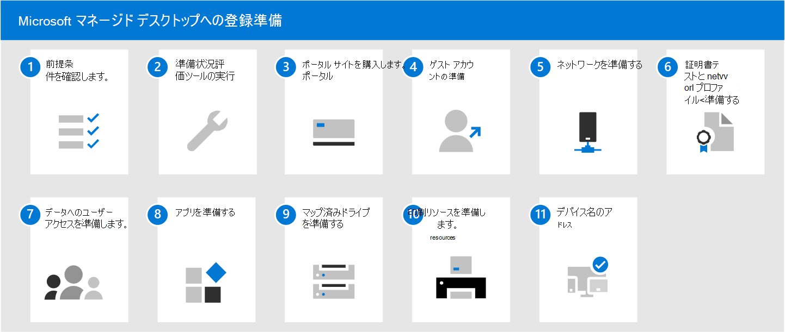

# Microsoft マネージド デスクトップへの登録準備

次の記事では、登録の準備のために組織で実行する必要がある手順について説明します。これには、次の手順が含まれます。

- 環境が主要な前提条件を満たしていることを確認する
- ネットワークの構成
- 証明書のセットアップ
- サービスに含めるアプリの準備

準備評価ツールを実行したら、他の手順を任意の順序または並列で実行できます。 環境によっては、一部の手順が適切でない場合があります。

1. [Microsoft マネージド デスクトップの前提条件](prerequisites.md)を確認します。
1. [準備状況の評価ツール](readiness-assessment-tool.md)を実行します。
1. [ポータル サイト](../get-started/company-portal.md)を購入します。
1. [ゲスト アカウントの前提条件](guest-accounts.md)を確認します。
1. [ネットワーク構成](network.md)をチェックします。
1. [証明書とネットワーク プロファイル](certs-wifi-lan.md)を準備します。
1. [データへのユーザー アクセスを準備します](authentication.md)。
1. [アプリを準備します](apps.md)。
1. [マップ済みドライブを準備します](mapped-drives.md)。
1. [印刷リソースを準備します](printing.md)。
1. [デバイス名](address-device-names.md)をアドレス指定します。
