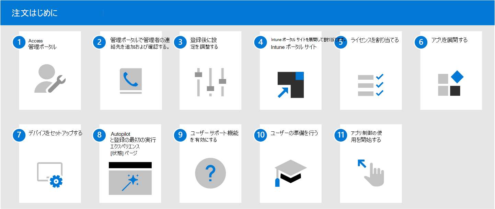

# Microsoft マネージド デスクトップの使用を開始する

登録の準備ができたので、[Microsoft エンドポイント マネージャー](https://endpoint.microsoft.com/) を開き、**[テナント管理]** に移動します。 **[Microsoft マネージド デスクトップ]** サブセクションで **[テナントの登録]** を選択し、ウィザードに従ってテナントを Microsoft マネージド デスクトップ に登録します。

> [!NOTE]
> 登録を完了するには、グローバル管理者としてログインする必要があります。 詳細については、[[管理ポータルへのアクセス]](access-admin-portal.md) を参照してください。

登録が完了したら、以下の手順に従ってサービスを構成します。 この順番に従うことをお勧めしますが、必須ではありません。

 

1. [管理ポータル](access-admin-portal.md)にアクセスします。
1. [管理ポータルで管理者の連絡先を追加および確認する](add-admin-contacts.md)。
1. [登録後に設定を調整する](conditional-access.md)。
1. [Intune ポータル サイト](company-portal.md)を展開して割り当てます。
1. [ライセンスを割り当てる](assign-licenses.md)。
1. [アプリを展開する](deploy-apps.md)。
1. [デバイスをセットアップする](set-up-devices.md)。
1. [Autopilot と登録ステータス ページの初回実行時エクスペリエンス](esp-first-run.md)のセットアップ。
1. [ユーザー サポート機能を有効にする](enable-support.md)。
1. [ユーザーがデバイスを使えるようにする](get-started-devices.md)。
1. [アプリ制御の使用を開始する](get-started-app-control.md)。