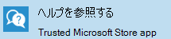

# ユーザーのヘルプGetting help for users

組織内のユーザーが Microsoft マネージド デスクトップ デバイスのヘルプを利用するには、ヘルプアプリと電話サポートの 2 つの方法があります。There are two ways that users in your organization can get help with their Microsoft Managed Desktop devices: **Get Help** app, or phone support. これらの両方のサポート オプションは、24 時間 365 日ユーザーが利用できます。Both of these support options are available to users 24 hours a day, 7 days a week.
 
>[!NOTE]
>これらのサポート オプションは、テスト グループ内のデバイスでは使用できません。These support options are not available for devices in the Test group.

## ヘルプ アプリを取得するGet Help app

ユーザーにサポートを提供するための推奨される方法は、ユーザー デバイスに組み込まれる使いやすいインターフェイスである Get **Help** です。The preferred method for providing support to your users is **Get Help**, an easy-to-use interface built into the user device.  

ヘルプは、すべての Microsoft マネージド デスクトップ デバイスにインストールされ、タスク バーにピン留めされているアプリケーションです。Get Help is an application that’s installed on all Microsoft Managed Desktop devices and is pinned to the task bar. 

- ユーザーは、指定された電話番号へのコールバックを要求するか、サービス担当者とオンラインでチャットできます。Users can request a callback to a provided phone number, or chat online with a service rep.
- Microsoft マネージド デスクトップ のサポートスコープ外の要求は、電話でローカルの IT ヘルプデスクにリダイレクトされます。Requests that fall outside of Microsoft Managed Desktop support scope are redirected to the local IT helpdesk via phone call.

> [!NOTE]
> Get Help アプリの表示言語は、ユーザーがデバイスのセットアップ時またはデバイス設定で別の言語を選択した場合でも、英語のみです。The display language for the Get Help app is English only, even if a user has selected a different language when setting up their device or in device settings. 

### 前提条件Prerequisites
ユーザーがアプリからヘルプを取得するには、次の前提条件が満たされていることを確認します。For your users to be able to get help through the app, make sure these prerequisites are met:

- デバイスは、「新しいデバイスを自分で登録する」などの [「Microsoft マネージド](../get-started/set-up-devices.md)デスクトップ デバイスのセットアップ」のいずれかの方法を使用して、Microsoft マネージド デスクトップに [登録する必要があります](../get-started/register-devices-self.md)。The device must be registered with Microsoft Managed Desktop using one of the methods in [Set up Microsoft Managed Desktop devices](../get-started/set-up-devices.md), such as [Register new devices yourself](../get-started/register-devices-self.md).
- デバイスの表示言語は、英語 (en-us、en-gb、en-au、en-nz、en-ca) に設定する必要があります。The display language for the device must be set to any of these English-language locales: en-us, en-gb, en-au, en-nz, or en-ca.
- ヘルプ アプリを最新の情報にしてください。The Get Help app should be up to date. 状態を確認するには、Microsoft Store でアプリの更新プログラムを確認します。To confirm its status, check for app updates in the Microsoft Store.
- デバイス [から特定](../get-ready/network.md#endpoints-allowed-that-are-necessary-for-microsoft-managed-desktop) のエンドポイントにアクセスできる必要があります。Certain [endpoints](../get-ready/network.md#endpoints-allowed-that-are-necessary-for-microsoft-managed-desktop) must be accessible from the device.

> [!NOTE]
> Get Help アプリは、デバイスが完全に機能するために展開された後、最大 1 時間かかる場合があります。The Get Help app can take up to one hour after a device is deployed to fully function.

これらの前提条件を確認し、Get Help アプリがまだ機能しない場合は、IT 管理者がサポート要求を [送信する必要があります](admin-support.md)。If you've checked these prerequisites and the Get Help app still isn't working, you as an IT admin should file a [support request](admin-support.md).

## 電話によるサポートPhone support

Microsoft マネージド デスクトップ デバイスを使用しているユーザーは、通話可能な無料電話番号にもアクセスできます。Users with Microsoft Managed Desktop devices also have access to toll-free phone numbers they can call. この番号は、ヘルプを表示できない場合に使用するためのものになります。The numbers are meant to be used when Get Help isn’t available. たとえば、ユーザーがデバイスにサインインできない場合や、デバイスが壊れている場合などです。For example, if they can’t sign in to the device, or the device is broken. 電話サポートの電話番号は次のとおりです。Here are the phone numbers for phone support:

- 米国: +1 855 425 0216United States: +1 855 425 0216
- カナダ (カナダを除く): +1 855 425 0216Canada (excluding Quebec): +1 855 425 0216
- 英国: +44 800 026 0698United Kingdom: +44 800 026 0698
- ベルギー: +32 800 58533Belgium: +32 800 58533
- ルクセンブルク: +352 800 40119Luxembourg: +352 800 40119
- オーストラリア: +61 180 037 0619Australia: +61 180 037 0619
- ニュージーランド: +64 988 44380New Zealand: +64 988 44380
- スウェーデン: +46 20 120 3554Sweden: +46 20 120 3554
- ノルウェー: +47 800 62584Norway: +47 800 62584
- アイスランド: +354 800 9006Iceland: +354 800 9006
- アイルランド: +353 1 800 832272Ireland: +353 1 800 832272
- デンマーク: +45 80 40 04 01Denmark: +45 80 40 04 01
- フィンランド: +358 800 525088Finland: +358 800 525088

>[!NOTE]
>ID を確認するには、電話で組織のメール アドレスを準備する必要があります。You'll need to have your organizational email address ready when you call to verify your identity. 

## その他のリソースMore resources
- [Microsoft マネージド デスクトップの管理者サポート](admin-support.md)。[Admin support for Microsoft Managed Desktop](admin-support.md). 
- [Microsoft マネージド デスクトップのサポート](../service-description/support.md)。[Support for Microsoft Managed Desktop](../service-description/support.md).
- Microsoft マネージド デスクトップを既に購読している場合は[、Microsoft Endpoint Manager](https://endpoint.microsoft.com/)の [テナント管理] メニューの [Microsoft マネージド デスクトップ] セクションにあるオンライン リソースの Microsoft マネージド デスクトップ管理者ガイドで、詳細な手順、プロセス フロー、作業手順、FAQ を確認できます。If you already subscribe to Microsoft Managed Desktop, you can find detailed procedures, process flows, work instructions, and FAQs in the Microsoft Managed Desktop Admin Guide in the **Online resources** under the Microsoft Managed Desktop section of the **Tenant administration** menu in [Microsoft Endpoint Manager](https://endpoint.microsoft.com/).
