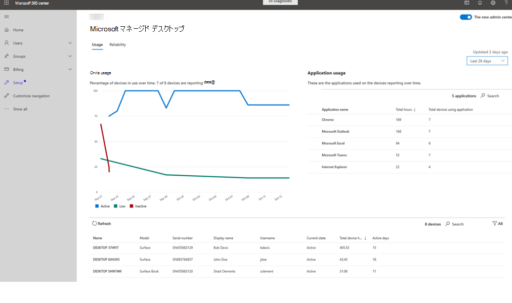

# 使用状況の分析情報
このビューは、Microsoft マネージドデスクトップデバイスの使用指標を提供します。 このような目的で、アプリが実行中で、フォーカスがある場合、アプリは "使用中" と見なされます。

利用状況データを表示するには、[ **利用状況** ] タブを選択します。

## デバイスの使用状況

[ **デバイスの使用状況** ] 領域には、レポートデバイスの使用レベルが時間の経過に従って表示されます。また、登録されているデバイスの数がレポートされるデータの数も表示されます。 このページに表示されるすべてのデータについて、右上のドロップダウンメニューを使用して、レポートデータを過去14日または28日のどちらで表示するかを変更できます。

使用レベルは、次の用語で分類します。

- **アクティブ:** 少なくとも55時間の使用率
- **低:** 使用率が 8 ~ 55 時間
- **非アクティブ:** 使用率が8時間未満

## アプリケーションの使用状況

[ **アプリケーションの使用状況** ] 領域には、使用状況の順にアプリケーションが詳細に表示されます。また、管理対象デバイスの使用時間に関する情報も表示されます。 また、特定のアプリケーションを使用している管理対象デバイスの合計数も表示します。 特定のアプリケーションが一覧にない場合は、[ **検索** ] を選択して検索します。

## デバイスの詳細
詳細エリアには、特定のデバイスに関する情報が表示されます。これには、デバイスの合計時間数や、期間内のアクティブな日数が含まれます。 フィルターを使用して、"アクティブ"、"非アクティブ"、または "低" 使用率パターン、または "未報告" であるデバイスの表示を制限します。 
