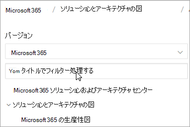

# Microsoft 365 ドキュメント ナビゲーション ガイド

このトピックでは、Microsoft 365の技術ドキュメント領域をナビゲートするためのヒントとテクニックについて説明します。  

## [ハブ] ページ

Microsoft 365 ハブ ページは[https://aka.ms/microsoft365docs](./index.yml)、関連するMicrosoft 365コンテンツを検索するためのエントリ ポイントです。

このページに戻るには、Microsoft 365技術ドキュメント セット内のすべてのページの上部にある **ヘッダーからMicrosoft 365** を選択します。

## TOC 検索 
docs.microsoft.com では、上部にあるフィルター検索ボックスを使用して、目次のコンテンツを検索できます。

## バージョン フィルター
Microsoft 365技術ドキュメントには、ドイツOffice 365や 21 Vianet (中国) が運営するOffice 365など、その他の製品のコンテンツが用意されています。 これらのバージョン間で機能が異なる場合があるため、コンテンツ自体が異なる場合があります。

バージョン フィルターを使用して、適切なバージョンのMicrosoft 365のコンテンツが表示されていることを確認できます。

## パン粉

階層リンクは、ヘッダーの下と目次の上にあり、現在のアーティクルが目次のどこにあるかを示します。  これは、読み取るコンテンツの種類にコンテキストを設定するだけでなく、目次ツリーをバックアップすることもできます。

## アーティクル セクションのナビゲーション

右側のナビゲーション ウィンドウを使用すると、アーティクル内のセクションにすばやく移動したり、アーティクル内の場所を特定したりできます。  

## ドキュメントのフィードバックを送信する

記事内で問題が見つかる場合は、ページの下部までスクロールして [コンテンツ フィードバック] を選択することで、その記事のSQL **コンテンツ** チームにフィードバックを送信できます。

## Microsoft 365ドキュメントに貢献する

自分でコンテンツを編集できる docs.microsoft.com 知っていましたか? これを行うと、ドキュメントが改善されるだけでなく、ページの共同作成者としてもクレジットされます。 作業を開始するには、次を参照してください。

- [Microsoft Docs共同作成者ガイド](/contribute/)

## 次の手順

- Microsoft 365[の技術ドキュメントを概要](index.yml)します。