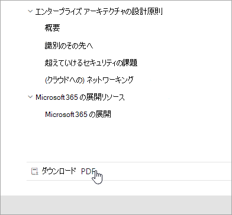

# Microsoft 365ドキュメントのナビゲーション ガイド

このトピックでは、技術的なドキュメント領域を移動するためのヒントMicrosoft 365方法について説明します。  

## ハブ ページ

[Microsoft 365ハブ] ページは、関連するコンテンツを検索するエントリ [https://aka.ms/microsoft365docs](./index.yml) Microsoft 365です。

技術ドキュメント セット内のすべてのページの上部にあるヘッダー  Microsoft 365を選択すると、常にこのページMicrosoft 365移動できます。

## オフラインドキュメント

オフライン システムでドキュメントをMicrosoft 365する場合は、技術ドキュメントのどこにいても PDF をMicrosoft 365できます。

PDF を作成する場合は、すべての目次の下部にある **[PDF** のダウンロード] リンクを選択します。

## TOC 検索 
この docs.microsoft.com 上部にあるフィルター検索ボックスを使用して、目次内のコンテンツを検索できます。

![[フィルター ボックスを使用する]](media/m365-filter-by-title.png)

## バージョン フィルター
このMicrosoft 365技術ドキュメントには、21 Vianet (中国) がOffice 365、Office 365を含む追加製品のコンテンツが提供されています。 機能は、これらのバージョンによって異なる場合があります。そのため、コンテンツ自体が異なる場合があります。

バージョン フィルターを使用して、適切なバージョンのコンテンツが表示Microsoft 365。

## Breadcrumbs

Breadcrumbs は、ヘッダーの下と目次の上にあり、現在の記事が目次のどこに存在するのか示します。  これにより、コンテキストを読み取るコンテンツの種類に設定できるだけでなく、目次ツリーを移動できます。

## 記事セクションのナビゲーション

右側のナビゲーション ウィンドウを使用すると、記事内のセクションにすばやく移動し、記事内の場所を特定できます。  

## ドキュメントのフィードバックを送信する

記事内で問題が見つけた場合は、ページの下部までスクロールして [コンテンツ フィードバック] を選択して、その記事の SQL コンテンツ チームにフィードバックを **送信できます**。

## ドキュメントにMicrosoft 365する

自分でコンテンツを編集できると知 docs.microsoft.com? その場合は、ドキュメントが改善されるだけでなく、ページの投稿者としてクレジットされます。 開始するには、以下を参照してください。

- [Microsoft Docs 投稿者ガイド](/contribute/)

## 次の手順

- テクニカル ドキュメントのMicrosoft 365[を開始します](index.yml)。