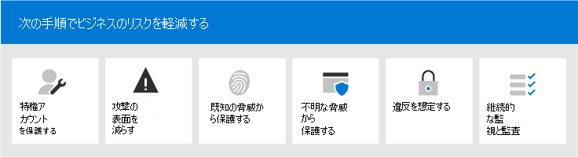
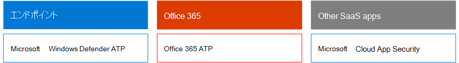
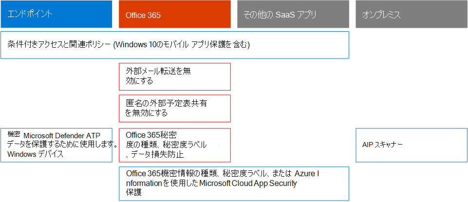

# Microsoft 365ビジネス意思決定者向けセキュリティ (BDM)

この記事では、組織が現在、組織が Microsoft 365 環境で直面している最も一般的な脅威と攻撃のシナリオと、これらのリスクを軽減するための推奨されるアクションについて説明します。 Microsoft 365には、事前に構成されたさまざまなセキュリティ機能が付属しますが、クラウド サービスにアクセスするために使用される独自の ID、データ、およびデバイスをセキュリティで保護する責任を顧客として必要とします。 このガイダンスは、Kozeta Beam (Microsoft Cloud Security Architect) と Thiagaraj Sundararajan (Microsoft シニア コンサルタント) によって開発されました。

この記事は、テナント、電子メール、および SharePoint など、最も重要なサービスと資産の管理に使用されるアカウントの保護を始め、作業の優先順位によって整理されています。 これは、セキュリティに近づく方法を提供し、次のスプレッドシートと一緒に動作し、組織内の関係者やチームとの進捗状況を追跡することができます[。BDMs](https://github.com/MicrosoftDocs/microsoft-365-docs/raw/public/microsoft-365/downloads/Microsoft-365-BDM-security-recommendations-spreadsheet.xlsx)スプレッドシートの Microsoft 365 セキュリティ。 

Microsoft は、テナント内の Secure Score ツールを提供し、通常のアクティビティに基づいてセキュリティの態勢を自動的に分析し、スコアを割り当て、セキュリティ改善の推奨事項を提供します。 この記事で推奨されるアクションを実行する前に、現在のスコアと推奨事項に注意してください。 この記事で推奨されるアクションは、スコアを増やします。 目標は、最大スコアを達成するのではなく、ユーザーの生産性に悪影響を及ぼさない方法で環境を保護する機会を認識する方法です。 「Microsoft [Secure Score」を参照してください](defender/microsoft-secure-score.md)。

始める前にもう 1 つ。 . . 監査ログを [有効にしてください](../compliance/search-the-audit-log-in-security-and-compliance.md)。 インシデントや侵害を調査する必要がある場合は、後でこのデータが必要になります。 

## 特権アカウントの保護

最初の手順として、これらのアカウントには重要なサービスとリソースを管理および変更するためのアクセス権とアクセス許可が付与され、侵害された場合に組織全体に悪影響を及ぼす可能性があるので、環境内の重要なアカウントに保護の層を追加することをお勧めします。 特権アカウントの保護は、侵害されたアカウントのアクセス許可を管理アカウントに昇格する攻撃者から保護する最も効果的な方法の 1 つです。 

|推奨事項  |E3 |E5  |
|---------|---------|---------|
|すべての管理アカウントに多要素認証 (MFA) を適用します。||| 
|Azure Azure Active Directory (Azure AD) Privileged Identity Management (PIM) を実装して、Azure ADリソースと Azure リソースに just-in-time 特権アクセスを適用します。 また、アクセス権を持つユーザーを検出し、特権アクセスを確認できます。|         | |
|特権アクセス管理を実装して、特権管理タスクに対する詳細なアクセス制御を管理Office 365。 |         | |
|サービスを管理するには、特権アクセス ワークステーション (PAW) を構成して使用します。 インターネットを閲覧し、管理アカウントに関連しない電子メールを確認する場合は、同じワークステーションを使用しない。|  | | 

次の図は、これらの機能を示しています。

追加の推奨事項:
- オンプレミスから同期されるアカウントに、クラウド サービスの管理者ロールが割り当てられていないか確認します。 これにより、攻撃者がオンプレミス アカウントを適用してクラウド サービスへの管理アクセスを取得するのを防ぐのに役立ちます。 
- サービス アカウントに管理者ロールが割り当てられていないか確認します。 多くの場合、これらのアカウントは監視され、有効期限が切れないパスワードで設定されます。 まず、AADConnect および ADFS サービス アカウントが既定でグローバル管理者ではないか確認します。
- 管理者アカウントからライセンスを削除します。 特定の管理者アカウントにライセンスを割り当てる特定の使用例がない限り、これらのアカウントからライセンスを削除します。 

## 攻撃の表面を減らす

次のフォーカス領域は、攻撃の表面を減らすことです。 これは、ユーザーとサービスへの最小限の労力と影響で実現できます。 攻撃の表面領域を減らすことで、攻撃者は組織に対して攻撃を開始する方法が少なくなっています。

次に、いくつかの例を示します:
- POP3、IMAP、および SMTP プロトコルを無効にします。 最新のほとんどの組織では、これらの古いプロトコルは使用されなくなりました。 これらを安全に無効にし、必要に応じて例外のみを許可できます。 
- テナント内のグローバル管理者の数を最小限に抑えます。 これにより、すべてのクラウド アプリケーションの攻撃領域が直接減少します。 
- 環境で使用されなくなったサーバーとアプリケーションを廃止します。 
- 使用されなくなったアカウントを無効にして削除するためのプロセスを実装します。 

## 既知の脅威から保護する

既知の脅威には、マルウェア、侵害されたアカウント、フィッシングが含まれます。 これらの脅威に対する一部の保護は、ユーザーに直接影響を与え、迅速に実装できる一方で、より多くの計画とユーザートレーニングが必要な場合もあります。 

|推奨事項  |E3  |E5  |
|---------|---------|---------|
|**多要素認証をセットアップし、サインイン リスク ポリシーを** 含む推奨条件付きアクセス ポリシーを使用します。 Microsoft では、すべてのクラウド アプリを保護するために一緒に動作する一連のポリシーを推奨し、テストしました。Office 365およびMicrosoft 365しています。 「Identity [and device access configurations」を参照してください](./office-365-security/microsoft-365-policies-configurations.md)。 | ||
|**すべてのユーザーに多要素認証が必要です**。 推奨される条件付きアクセス ポリシーを実装するために必要なライセンスが必要ない場合は、少なくともすべてのユーザーに多要素認証が必要です。|||
|**メール内のマルウェアに対する保護のレベルを上げる**。 ユーザー Office 365またはMicrosoft 365にはマルウェアに対する保護が含まれますが、マルウェアに一般的に使用されるファイルの種類を含む添付ファイルをブロックすることで、この保護を強化できます。|||
|**標的型フィッシング攻撃からメールを保護します**。 1 つ以上のカスタム ドメインを Office 365または Microsoft 365環境に構成した場合は、ターゲットフィッシング対策保護を構成できます。 Office 365 の Defender の一部であるフィッシング対策保護は、悪意のある偽装ベースのフィッシング攻撃や他のフィッシング攻撃から組織を保護するのに役立ちます。 カスタム ドメインを構成していない場合は、これを行う必要があります。| ||
|**電子メールでのランサムウェア攻撃から保護します**。 ランサムウェアは、ファイルを暗号化したり、コンピューターの画面をロックしたりして、データへのアクセスを取り去る。 その後、データへのアクセスを返すのと引き換えに、通常はBitcoinのような暗号化の形で「身代金」を求め、被害者から金銭を強要しようとする。 1 つ以上のメール フロー ルールを作成して、ランサムウェアに一般的に使用されるファイル拡張子をブロックしたり、電子メールでこれらの添付ファイルを受け取るユーザーに警告したりすることで、ランサムウェアからの防御を支援できます。|||
|**ビジネスを行う国からの接続をブロックします**。 Azure AD条件付きアクセス ポリシーを作成して、これらの国からの接続をブロックし、テナントの周囲に地理的ファイアウォールを効果的に作成します。| ||

次の図は、これらの機能を示しています。

## 未知の脅威から保護する

特権アカウントに追加の保護を追加し、既知の攻撃から保護した後、未知の脅威からの保護に注意を移してください。 より決定された高度な敵対者は、組織を攻撃するために革新的で新しい未知の方法を使用します。 Microsoft は、数十億を超えるデバイス、アプリケーション、およびサービスを収集した膨大なデータを使用して、Windows、Office 365、Azure で Office 365 の Defender を実行して、Zero-Day 攻撃を防止し、サンド ボックス環境を利用し、コンテンツへのアクセスを許可する前に有効性を確認することができます。 

|推奨事項  |E3  |E5  |
|---------|---------|---------|
|**Microsoft Defender for Office 365:** * セーフ添付ファイル * セーフリンク * Microsoft Defender for Endpoint for SharePoint、OneDrive、Microsoft Teams * セキュリティ保護のための Defender Office 365フィッシング対策|         | |
|**Microsoft Defender for Endpoint の機能を構成します**。 * Windows Defender ウイルス対策  * エクスプロイト保護   * 攻撃表面の縮小   * ハードウェア ベースの分離  * フォルダー アクセスの制御     |         | |
|**このMicrosoft Cloud App Security** を使用して SaaS アプリを検出し、動作分析と異常検出の使用を開始します。 |         | |

次の図は、これらの機能を示しています。

追加の推奨事項:
- TLS を使用したメールのようなパートナー チャネル通信をセキュリティで保護します。
- 通信Teamsパートナーにのみフェデレーションを開きます。
- 送信者ドメイン、個々の送信者、または送信元 IP を許可リストに追加しない。これにより、スパムやマルウェアのチェックを回避できます。一般的な方法として、ユーザーが独自の受け入れドメインや、電子メール フローの問題が許可リストに報告されている可能性のあるその他のドメインを追加します。 [スパムと接続フィルター] ボックスの一覧にドメインを追加しない場合は、すべてのスパム チェックがバイパスされる可能性があります。 
- 送信スパム通知を有効にする - 内部ユーザーが外部からスパムメールを送信している場合に、ヘルプデスクまたは IT 管理者チームに内部的に配布リストへの送信スパム通知を有効にします。 これは、アカウントが侵害されたというインジケーターである可能性があります。
- すべてのユーザーに対してリモート PowerShell を無効にします。リモート PowerShell は主に管理者が管理目的またはプログラムによる API アクセスのためにサービスにアクセスするために使用されます。 管理者以外のユーザーがアクセスするビジネス要件がない限り、管理者以外のユーザーに対してこのオプションを無効にし、偵察を避けることをお勧めします。 
- 管理者以外のすべての管理者Microsoft Azure管理ポータルへのアクセスをブロックします。 これを行うには、管理者を除くすべてのユーザーをブロックする条件付きアクセス ルールを作成します。 

## 違反を想定する

Microsoft は、脅威や攻撃を防止するためにあらゆる手段を講じながら、常に "違反を想定する" 考え方で作業することをお勧めします。 攻撃者が何とか環境に侵入した場合でも、攻撃者が環境からデータや ID 情報を引き出さなくてもいいです。 このため、社会保障番号、クレジット カード番号、追加の個人情報、その他の組織レベルの機密情報などの機密データ漏洩に対する保護を有効にすることをお勧めします。 

"違反を想定する" という考え方では、ゼロトラスト ネットワーク戦略を実装する必要があります。つまり、ユーザーがネットワークの内部であるからといって完全に信頼されていないという意味です。 代わりに、ユーザーが実行できる操作の承認の一環として、条件のセットが指定され、そのような条件が満たされた場合、特定のコントロールが適用されます。 条件には、デバイスの正常性状態、アクセスするアプリケーション、実行されている操作、およびユーザー リスクが含まれます。 たとえば、デバイス登録アクションは常に MFA 認証をトリガーして、ルージュ デバイスが環境に追加されていないことを確認する必要があります。 

また、ゼロトラスト ネットワーク戦略では、情報の保存場所を知り、分類、保護、保持に適切なコントロールを適用する必要があります。 最も重要で機密性の高い資産を効果的に保護するには、まず、これらの資産の場所を特定し、インベントリを取得する必要があります。これは困難な場合があります。 次に、組織と一緒にガバナンス戦略を定義します。 組織の分類スキーマを定義し、ポリシー、ラベル、および条件を構成するには、慎重な計画と準備が必要です。 これは IT に基づくプロセスではないと認識することが重要です。 法務およびコンプライアンス チームと一緒に、組織のデータに適した分類とラベル付けスキーマを開発してください。

Microsoft 365保護機能を使用すると、どのような情報が保存されているのか、どこに保存されているのか、さらに保護が必要な情報を見つめることができます。 情報保護は継続的なプロセスであり、Microsoft 365 機能を使用すると、ユーザーが機密情報を使用して配布する方法、情報が現在保存されている場所、および情報が流れる場所を可視化できます。 また、適切なラベルと保護が適用されるのを確認するために規制されている情報を扱うユーザーの方法も確認できます。

|推奨事項 |E3|E5 |
|---------|---------|---------|
|**条件付きアクセスと関連するポリシー** を確認して最適化し、ゼロトラスト ネットワークの目標に合わせて調整します。 既知の脅威からの保護には、一連の推奨ポリシー [の実装が含まれます](./office-365-security/microsoft-365-policies-configurations.md)。 これらのポリシーの実装を確認して、ネットワークにアクセスしたハッカーからアプリとデータを保護します。 セキュリティ情報保護 (WIP) を有効Windows 10推奨Windows Intune アプリ保護ポリシー。 WIP は、電子メール、ソーシャル メディア、パブリック クラウドなど、アプリやサービスを通じて組織データが偶発的に漏洩しないように保護します。 |         ||
|**外部メール転送を無効にします**。 ユーザーのメールボックスにアクセスするハッカーは、メールを自動的に転送するメールボックスを設定することで、メールを盗む可能性があります。 これは、ユーザーの認識がなくても発生する可能性があります。 メール フロー ルールを構成することで、この問題を回避できます。| ||
|**匿名の外部予定表の共有を無効にします**。 既定では、外部の匿名予定表の共有が許可されます。 [予定表の共有を無効](/exchange/sharing/sharing-policies/modify-a-sharing-policy) にして、機密情報の潜在的なリークを減らします。| ||
|**機密データのデータ損失防止ポリシーを構成します**。 セキュリティ コンプライアンス センターでデータ損失防止ポリシーを作成し、クレジット カード番号、社会保障番号、銀行口座番号などの機密データを検出して &amp; 保護します。 Microsoft 365には、データ損失防止ポリシーで使用できる多くの定義済みの機密情報の種類が含まれています。 また、環境に合った機密データ用に独自の機密情報の種類を作成することもできます。 |||
|**データ分類と情報保護ポリシーを実装します**。 機密ラベルを実装し、これらを使用して機密データを分類して保護を適用します。 これらのラベルは、データ損失防止ポリシーでも使用できます。 Azure Information Protection ラベルを使用している場合は、他の管理センターで新しいラベルを作成しないようにすることをお勧めします。|         ||
|**サードパーティのアプリとサービスのデータを保護するには、次の** Cloud App Security。 Salesforce、box、Cloud App Securityなど、サード パーティ製のクラウド アプリ全体で機密情報を保護するためのセキュリティ ポリシーを構成Dropbox。 機密情報の種類と、ポリシーで作成した機密ラベルをCloud App Security SaaS アプリ全体に適用できます。   Microsoft Cloud App Securityプロセスを幅広く適用できます。 ポリシーは、継続的なコンプライアンス スキャン、法的な電子情報開示タスク、公開で共有される機密性の高いコンテンツの DLP を提供するために設定できます。 Cloud App Securityは、20 を超えるメタデータ フィルター (アクセス レベル、ファイルの種類など) に基づいて任意のファイルの種類を監視できます。 |         ||
|**[Microsoft Defender for Endpoint を使用して](/windows/security/threat-protection/microsoft-defender-atp/information-protection-in-windows-overview)、ユーザー** が自分のデバイスに機密情報を保存Windowsします。 |         ||
|**[AIP スキャナーを使用して](/azure/information-protection/deploy-aip-scanner) 、サーバーとファイル共有間の情報を識別および分類します**。 AIP レポート ツールを使用して結果を表示し、適切なアクションを実行します。|         ||

次の図は、これらの機能を示しています。

## 継続的な監視と監査

最後に、Microsoft 365 環境と Windows とデバイスの継続的な監視と監査は、侵入を迅速に検出して修復するために重要です。 Secure Score、Security Center、Microsoft Intelligent Graph の高度な分析などのツールは、テナントに貴重な情報を提供し、膨大な量の脅威インテリジェンスとセキュリティ データをリンクして、比類のない脅威の保護と検出を提供します。

|推奨事項 |E3 |E5 |
|---------|---------|---------|
|監査ログ **が有効** になっていることを確認します。|||
|**週に 1** 回セキュリティで保護されたスコアを確認する - セキュリティスコアは、会社のセキュリティ状態にアクセスし、セキュリティスコアの推奨事項に基づいてアクションを実行するための中心的な場所です。 このチェックは毎週実行する必要があります。|||
|Microsoft **Defender を使用して、次のOffice 365** 使用します。 * 脅威の調査と対応機能  * 自動調査と対応 |         ||
|エンドポイント **に Microsoft Defender を使用する**:  *    [エンドポイントの検出と応答](/windows/security/threat-protection/microsoft-defender-atp/overview-endpoint-detection-response)   * 自動調査と修復 セキュア スコア  *    [高度な検索](/windows/security/threat-protection/microsoft-defender-atp/advanced-hunting-overview)  |         ||
|クラウド **Microsoft Cloud App Security** で異常な動作を検出し、ランサムウェア、侵害されたユーザー、または不正なアプリケーションを特定し、リスクの高い使用状況を分析し、組織のリスクを制限するために自動的に修復します。|         ||
|**Sentinel Microsoft Azure現在** の SIEM ツールを使用して、環境全体の脅威を監視します。 |         ||
|**[Microsoft Defender for Identity を展開](/azure-advanced-threat-protection/what-is-atp)** して、オンプレミスの Active Directory 環境を対象とした脅威を監視および保護します。   |         | |
|Azure Defender _ **を使用** して、ハイブリッドワークロードとクラウド ワークロード全体の脅威を監視します。 Azure Defender_には、リソース時間またはトランザクションに基づいて支払われる無料の機能層と標準レベルの機能が含まれます。|         |         |

次の図は、これらの機能を示しています。

推奨される監視アクションの上位:
- **Microsoft Secure Score を毎週確認** する - Secure score は、テナントのセキュリティ状態にアクセスし、トップ推奨事項に基づいてアクションを実行するための中心的な場所です。 このチェックは毎週実行する必要があります。 セキュリティで保護されたスコアには、Azure AD、Intune、Cloud App Security、Microsoft Defender for Endpoint、および Microsoft Defender Office 365。 
- **リスクの高いログインを** 毎週確認する - Azure AD管理センターを使用して、リスクの高いサインインを毎週確認します。 推奨される ID およびデバイス アクセス ルール セットには、危険なサインインにパスワード変更を適用するポリシーが含まれています。  
- **トップ マルウェアと** フィッシング ユーザーを毎週確認する - microsoft Defender for Office 365 Threat Explorer を使用して、マルウェアとフィッシングの対象となる上位ユーザーを確認し、これらのユーザーが影響を受ける理由の根本原因を調べた。