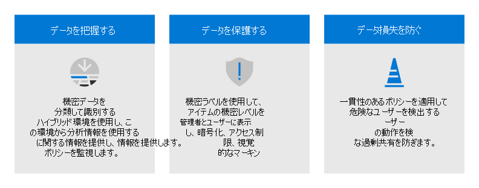

# Microsoft 365 ゼロ トラスト展開プラン

この記事では、ゼロ トラストセキュリティを構築する展開計画について説明します。Microsoft 365。 ゼロ信頼は、侵害を前提とする新しいセキュリティ モデルであり、制御されていないネットワークから発生した場合と同様に各要求を検証します。 要求の発信元やアクセスするリソースに関係なく、ゼロ信頼モデルは「信頼しない、常に確認する」ことを教えています。

## ゼロトラストセキュリティアーキテクチャ

ゼロトラストのアプローチは、デジタル資産全体にわたって拡張され、統合されたセキュリティ哲学とエンドツーエンド戦略として機能します。 

次の図は、ゼロ信頼に貢献する主な要素を示しています。

<!---

-->

:::image type="content" source="../media/zero-trust/zero-trust-architecture.png" alt-text="ゼロトラストセキュリティアーキテクチャ" lightbox="../media/zero-trust/zero-trust-architecture.png":::

この図について:
- セキュリティ ポリシーの適用は、ゼロ信頼アーキテクチャの中心にあります。 これには、ユーザー アカウントのリスク、デバイスの状態、および設定したその他の条件とポリシーを考慮した条件付きアクセスによる多要素認証が含まれます。
- ID、デバイス、データ、アプリ、ネットワーク、その他のインフラストラクチャ コンポーネントはすべて、適切なセキュリティで構成されます。 これらの各コンポーネントに対して構成されるポリシーは、全体的なゼロ信頼戦略と調整されます。 たとえば、デバイス ポリシーは正常なデバイスの基準を決定し、条件付きアクセス ポリシーでは、特定のアプリとデータにアクセスするために正常なデバイスが必要です。
- 脅威保護とインテリジェンスは、環境を監視し、現在のリスクを表面化し、攻撃を修復するために自動化されたアクションを実行します。

<!---
For more information about this architecture, including deployment objectives for your entire digital estate, see [Zero Trust Rapid Modernization Plan (RaMP)](https://review.docs.microsoft.com/security/zero-trust/zero-trust-ramp-overview?branch=zt-content-prototype). 
-->

ゼロ トラストの詳細については、「Microsoft のゼロ トラスト [ガイダンス センター」を参照してください](/security/zero-trust)。

## ゼロ信頼の Microsoft 365展開

Microsoft 365は、ゼロトラストを環境に組み込むのに役立つ多くのセキュリティおよび情報保護機能を備えて意図的に構築されています。 多くの機能を拡張して、組織が使用する他の SaaS アプリやこれらのアプリ内のデータへのアクセスを保護できます。

この図は、ゼロ信頼機能を展開する作業を表しています。 この作業は、一緒に構成できる作業単位に分割され、一番下から上に作業し、前提条件の作業が完了するようにします。

:::image type="content" source="../media/zero-trust/m365-zero-trust-deployment-stack.png" alt-text="Microsoft 365 ゼロトラスト展開スタック" lightbox="../media/zero-trust/m365-zero-trust-deployment-stack.png":::

この図について:
- ゼロ信頼は、ID とデバイス保護の基礎から始まります。 
- 脅威保護機能は、この基盤の上に構築され、セキュリティ脅威のリアルタイム監視と修復を提供します。 
- 情報保護とガバナンスは、特定の種類のデータを対象とした高度な制御を提供し、最も価値のある情報を保護し、個人情報の保護を含むコンプライアンス基準を遵守するのに役立ちます。

## 手順 1. ゼロトラスト ID とデバイス アクセス保護を構成する - 開始点ポリシー

最初の手順は、ID とデバイス アクセス保護を構成してゼロトラスト基盤を構築します。 

:::image type="content" source="../media/zero-trust/m365-zero-trust-architecture-step-1b.png" alt-text="ゼロトラスト ID とデバイス アクセス保護を構成する" lightbox="../media/zero-trust/m365-zero-trust-architecture-step-1b.png":::

これを実現 [するには、「ゼロトラスト ID とデバイス](office-365-security/microsoft-365-policies-configurations.md) アクセス保護」を参照してください。 この一連の記事では、ID およびデバイス アクセスの前提条件構成のセットと、Azure Active Directory (Azure AD) 条件付きアクセス、Microsoft Intune、および Microsoft 365 へのアクセスをセキュリティで保護するためのその他のポリシーのセットについて説明します。 エンタープライズ クラウド アプリとサービス、その他の SaaS サービス、およびアプリケーション プロキシで公開されたオンプレミス アプリケーションAzure ADします。

|Includes  |前提条件  |含めない  |
|---------|---------|---------|
|3 層の保護に推奨される ID およびデバイス アクセス ポリシー。 - 開始点 - Enterprise (推奨) - 特殊  その他の推奨事項: - 外部ユーザー (ゲスト) - Microsoft Teams - SharePoint Online - Microsoft Defender for Cloud Apps| Microsoft E3 または E5  Azure Active Directoryモードのいずれかを使用します。 - クラウド専用 - パスワード ハッシュ同期 (PHS) 認証を使用したハイブリッド - パススルー認証付きハイブリッド (PTA) - フェデレーション     |管理対象デバイスを必要とするポリシーのデバイス登録。 デバイスを登録するには、「Intune でエンドポイントを管理する」を参照してください。 |
| | | |

まず、開始点層を実装します。 これらのポリシーでは、デバイスを管理に登録する必要がなされません。 

:::image type="content" source="../media/zero-trust/identity-access-starting-point-tier.png" alt-text="ゼロトラスト ID とデバイス アクセス ポリシー - 開始点層" lightbox="../media/zero-trust/identity-access-starting-point-tier.png":::

## 手順 2。 Intune を使用してエンドポイントを管理する

次に、デバイスを管理に登録し、より高度なコントロールで保護を開始します。 

:::image type="content" source="../media/zero-trust/m365-zero-trust-architecture-step-2.png" alt-text="Intune を使用してエンドポイントを管理する" lightbox="../media/zero-trust/m365-zero-trust-architecture-step-2.png":::

これを実現 [するには、「Intune でデバイスを](../solutions/manage-devices-with-intune-overview.md) 管理する」を参照してください。 

|Includes  |前提条件  |含めない  |
|---------|---------|---------|
|Intune でデバイスを登録する - 企業所有のデバイス - Autopilot/automated - 登録  ポリシーの構成 - アプリ保護ポリシー - コンプライアンス ポリシー - デバイス プロファイル ポリシー | エンドポイントを Azure AD     | 以下を含む情報保護機能の構成 - 機密情報の種類 - ラベル - DLP ポリシー これらの機能については、「手順 5」を参照してください。 データの保護と管理 (この記事の後半)。       |
|    |         |         |

## 手順 3. ゼロトラスト ID とデバイス アクセス保護の追加 — Enterpriseポリシー

デバイスを管理に登録すると、推奨されるゼロトラスト ID とデバイス アクセス ポリシーの完全なセットを実装し、準拠デバイスを必要とします。

:::image type="content" source="../media/zero-trust/m365-zero-trust-architecture-enterprise-policies.png" alt-text="デバイス管理を使用したゼロ信頼 ID とアクセス ポリシー" lightbox="../media/zero-trust/m365-zero-trust-architecture-enterprise-policies.png":::

共通 ID[とデバイス アクセス ポリシーに戻り](office-365-security/identity-access-policies.md)、ポリシーを Enterpriseします。  

:::image type="content" source="../media/zero-trust/identity-access-enterprise-tier.png" alt-text="ゼロ信頼 ID とアクセス ポリシー - Enterprise (推奨) 層" lightbox="../media/zero-trust/identity-access-enterprise-tier.png":::

## 手順 4. 評価、パイロット、および展開Microsoft 365 Defender

Microsoft 365 Defender は、エンドポイント、電子メール、アプリケーション、ID など、Microsoft 365 環境全体から信号、脅威、およびアラート データを自動的に収集、関連付け、分析する拡張検出および応答 (XDR) ソリューションです。

:::image type="content" source="../media/zero-trust/m365-zero-trust-architecture-defender.png" alt-text="ゼロMicrosoft 365 Defenderアーキテクチャへの追加" lightbox="../media/zero-trust/m365-zero-trust-architecture-defender.png":::

[評価と[パイロット] にMicrosoft 365 Defender](defender/eval-overview.md)コンポーネントのパイロットと展開に関する方法Microsoft 365 Defenderします。 

|Includes  |前提条件  |含めない  |
|---------|---------|---------|
| すべてのコンポーネントの評価環境とパイロット環境を設定します。 - Id の Defender - Defender for Office 365 - Defender for Endpoint - Microsoft Defender for Cloud Apps  脅威から保護する   脅威の調査と対応   | 各コンポーネントのアーキテクチャ要件については、ガイドを参照Microsoft 365 Defender。        | Azure AD Id Protection は、このソリューション ガイドには含まれていません。 これは、「手順 1: ゼロトラスト ID とデバイス アクセス保護を構成する」に含まれています。        |
|    |         |         |

## 手順 5.  機密データの保護と管理

Microsoft Information Protection (MIP) を実装すれば、機密情報がどこに保存されていても、どこに移動しても、それらの情報の検出、分類、保護が可能になります。

MIP 機能は Microsoft 365 コンプライアンスに含まれており、データを把握し、データを保護し、データの損失を防止するためのツールを提供しています。

:::image type="content" source="../media/zero-trust/m365-zero-trust-architecture-info-protect.png" alt-text="情報保護機能は、ポリシーの適用を通じてデータを保護します" lightbox="../media/zero-trust/m365-zero-trust-architecture-info-protect.png":::

この作業は、この記事の前に示した展開スタックの上部で表しますが、いつでもこの作業を開始できます。 

Microsoft Information Protection、特定のビジネス目標を達成するために使用できるフレームワーク、プロセス、および機能を提供します。

詳細については[、「Microsoft Information Protection」をMicrosoft 365。](../compliance/information-protection.md) 
