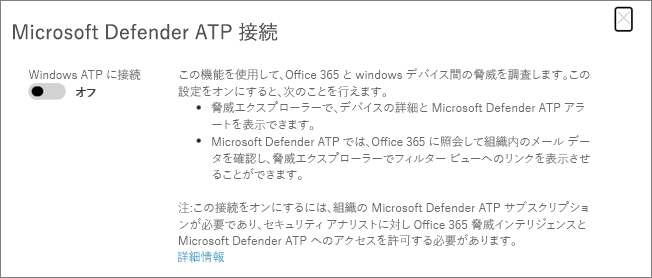

# Microsoft Defender for Endpoint と共Office 365 の Microsoft Defender を使用する

[!INCLUDE [Microsoft 365 Defender rebranding](../includes/microsoft-defender-for-office.md)]

[Microsoft Defender for Office 365 は](defender-for-office-365.md) 、Microsoft Defender for Endpoint で動作 [するように構成できます](/windows/security/threat-protection)。

Microsoft Defender for Office 365 と Microsoft Defender for Endpoint を統合すると、ユーザーのデバイスが危険にさらされている場合、セキュリティ運用チームが迅速に監視し、アクションを実行できます。 たとえば、統合が有効になると、セキュリティ運用チームは、検出された電子メール メッセージの影響を受ける可能性のあるデバイスと、Microsoft Defender for Endpoint のデバイスに対して生成された最近のアラートの数を確認できます。

次の図は、Microsoft Defender for **Endpoint** 統合を有効にした場合の [デバイス] タブの外観を示しています。

この例では、検出された電子メール メッセージの受信者が 4 つのデバイスを持ち、1 つはアラートを持っているのを確認できます。 デバイスのリンクをクリックすると、Microsoft Defender セキュリティ センター () でページが開きます <https://securitycenter.windows.com> 。

> [!TIP]
> **[Microsoft Defender セキュリティ センターの詳細 (Microsoft Defender](/windows/security/threat-protection/microsoft-defender-atp/use)** for Endpoint ポータルとも呼ばれます)。

## 要件

- 組織には、Microsoft Defender for Office 365 (または Office 365 E5) と Microsoft Defender for Endpoint が必要です。

- グローバル管理者またはセキュリティ管理者の役割 (セキュリティ管理者など) がセキュリティ コンプライアンス センターに割り当てられている& [必要があります](https://protection.office.com)。 (「 [セキュリティ コンプライアンス センターのアクセス許可&」を参照してください](permissions-in-the-security-and-compliance-center.md))

- セキュリティ コンプライアンス センターと Microsoft Defender セキュリティ センターの両方のエクスプローラー (またはリアルタイム検出 [)](threat-explorer.md) &アクセスできる必要があります。

## Microsoft Defender for Office 365 と Microsoft Defender for Endpoint を統合するには

Microsoft Defender for Office 365 と Microsoft Defender for Endpoint の統合は、セキュリティ & コンプライアンス センターと Microsoft Defender セキュリティ センターの両方を使用してセットアップされます。

1. グローバル管理者またはセキュリティ管理者として、アクセスして <https://protection.office.com> サインインします。 (これにより、コンプライアンス センター Office 365 &にアクセスできます)。

2. ナビゲーション ウィンドウで、[脅威管理エクスプローラー] **を** \> **選択します**。

   ![[脅威の管理] メニューの [エクスプローラー]](../../media/ThreatMgmt-Explorer-nav.png)

3. 画面の右上隅で、[Defender **for Endpoint Settings (MDE Settings) ] を選択します**。

4. [Microsoft Defender for Endpoint 接続] ダイアログ ボックスで、[エンドポイント用 **Microsoft Defender に接続する] をオンにします**。

   

5. Microsoft Defender セキュリティ センター ( ) に移動します <https://securitycenter.windows.com> 。

6. ナビゲーション バーで、[設定] を **選択します**。 次に、[全般] **で 、[** 高度な機能 **] を選択します**。

7. **365 脅威インテリジェンスOfficeまで** 下にスクロールし、接続を有効にしてください。

   

## 関連記事

[365 の脅威の調査と対応Office](office-365-ti.md)

[Microsoft Defender for Office 365](defender-for-office-365.md)

[Microsoft Defender for Endpoint](/windows/security/threat-protection)