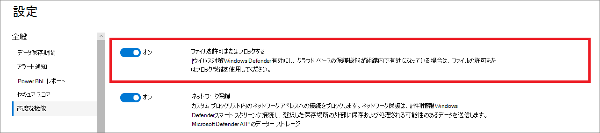

# Defender for Endpoint で高度な機能を構成するConfigure advanced features in Defender for Endpoint

**適用対象:****Applies to:**
- [Microsoft Defender for EndpointMicrosoft Defender for Endpoint](https://go.microsoft.com/fwlink/p/?linkid=2154037)
- [Microsoft 365 DefenderMicrosoft 365 Defender](https://go.microsoft.com/fwlink/?linkid=2118804)

[!INCLUDE [Microsoft 365 Defender rebranding](../../includes/microsoft-defender.md)]

> Defender for Endpoint を体験してみませんか?Want to experience Defender for Endpoint? [無料試用版にサインアップしてください。Sign up for a free trial.](https://www.microsoft.com/microsoft-365/windows/microsoft-defender-atp?ocid=docs-wdatp-advancedfeats-abovefoldlink)

使用する Microsoft セキュリティ製品によっては、Defender for Endpoint を統合できる高度な機能がいくつか用意されている場合があります。Depending on the Microsoft security products that you use, some advanced features might be available for you to integrate Defender for Endpoint with.

## 高度な機能を有効にするEnable advanced features

1. ナビゲーション ウィンドウで、[基本設定]**セットアップの [高度な**  >  **機能] を選択します**。In the navigation pane, select **Preferences setup** > **Advanced features**.
2. 構成する高度な機能を選択し、設定を [オン] と [オフ] **の間で切り** 替 **えます**。Select the advanced feature you want to configure and toggle the setting between **On** and **Off**.
3. [設定 **の保存] をクリックします**。Click **Save preferences**.

次の高度な機能を使用して、潜在的に悪意のあるファイルから保護され、セキュリティ調査中により良い洞察を得る。Use the following advanced features to get better protected from potentially malicious files and gain better insight during security investigations.

## 自動調査Automated investigation

この機能を有効にし、サービスの自動調査および修復機能を利用します。Turn on this feature to take advantage of the automated investigation and remediation features of the service. 詳細については、「自動調査 [」を参照してください](automated-investigations.md)。For more information, see [Automated investigation](automated-investigations.md).

## ライブ応答Live response

適切なアクセス許可を持つユーザーがデバイスでライブ応答セッションを開始できるよう、この機能を有効にします。Turn on this feature so that users with the appropriate permissions can start a live response session on devices.

役割の割り当ての詳細については、「役割の作成と [管理」を参照してください](user-roles.md)。For more information about role assignments, see [Create and manage roles](user-roles.md).

## サーバーのライブ応答Live response for servers
この機能を有効にし、適切なアクセス許可を持つユーザーがサーバーでライブ応答セッションを開始できます。Turn on this feature so that users with the appropriate permissions can start a live response session on servers.

役割の割り当ての詳細については、「役割の作成と [管理」を参照してください](user-roles.md)。For more information about role assignments, see [Create and manage roles](user-roles.md).

## ライブ応答の署名されていないスクリプトの実行Live response unsigned script execution

この機能を有効にすると、ライブ応答セッションで署名されていないスクリプトを実行できます。Enabling this feature allows you to run unsigned scripts in a live response session.

## PUA を常に修復するAlways remediate PUA
望ましくない可能性のあるアプリケーション (PUA) は、コンピューターの動作が遅くなる、予期しない広告を表示する、または最悪の場合は予期しないソフトウェアや望ましくない可能性のある他のソフトウェアをインストールするソフトウェアのカテゴリです。Potentially unwanted applications (PUA) are a category of software that can cause your machine to run slowly, display unexpected ads, or at worst, install other software which might be unexpected or unwanted. 

この機能を有効にし、PUA 保護がデバイスで構成されていない場合でも、不要な可能性のあるアプリケーション (PUA) がテナント内のすべてのデバイスで修復されます。Turn on this feature so that potentially unwanted applications (PUA) are remediated on all devices in your tenant even if PUA protection is not configured on the devices. これにより、ユーザーがデバイスに不要なアプリケーションを誤ってインストールすることを防役立ちます。This will help protect users from inadvertently installing unwanted applications on their device. オフにすると、修復はデバイスの構成に依存します。When turned off, remediation is dependent on the device configuration. 

## スコープ付きデバイス グループ内への相関関係の制限Restrict correlation to within scoped device groups
この構成は、ローカルの SOC 操作でアラートの相関関係をアクセスできるデバイス グループにのみ制限する場合に使用できます。This configuration can be used for scenarios where local SOC operations would like to limit alert correlations only to device groups that they can access. この設定を有効にすると、デバイス グループをまたがったアラートで構成されるインシデントは、1 つのインシデントとは見なされません。By turning this setting on, an incident composed of alerts that cross device groups will no longer be considered a single incident. ローカル SOC は、関連するデバイス グループの 1 つへのアクセス権を持つため、インシデントに対してアクションを実行できます。The local SOC can then take action on the incident because they have access to one of the device groups involved. ただし、グローバル SOC では、1 つのインシデントではなく、デバイス グループ別に複数の異なるインシデントが表示されます。However, global SOC will see several different incidents by device group instead of one incident. この設定を有効にしない場合は、組織全体のインシデントの相関関係の利点を上回る場合は、この設定を有効にすることをお勧めしません。We do not recommend turning this setting on unless doing so outweighs the benefits of incident correlation across the entire organization
>[!NOTE]
>この設定を変更すると、将来のアラートの相関関係にのみ影響します。Changing this setting impacts future alert correlations only.

## ブロック モードEDR有効にするEnable EDR in block mode
ブロック モードでのエンドポイントの検出と応答 (EDR) は、パッシブ モードで実行されている場合でも、悪意のあるMicrosoft Defender ウイルス対策からの保護を提供します。Endpoint detection and response (EDR) in block mode provides protection from malicious artifacts, even when Microsoft Defender Antivirus is running in passive mode. オンにすると、EDRモードでデバイスで検出された悪意のあるアーティファクトや動作がブロックされます。When turned on, EDR in block mode blocks malicious artifacts or behaviors that are detected on a device. EDRモードでは、侵害後に検出された悪意のあるアーティファクトを修復するために、舞台裏で動作します。EDR in block mode works behind the scenes to remediate malicious artifacts that are detected post breach.

## Autoresolve 修復されたアラートAutoresolve remediated alerts

Windows 10 Version 1809 以降に作成されたテナントの場合、自動調査と修復機能は既定で構成され、自動分析結果の状態が "脅威が見つかりません" または "修復済み" であるアラートを解決します。For tenants created on or after Windows 10, version 1809, the automated investigation and remediation capability is configured by default to resolve alerts where the automated analysis result status is "No threats found" or "Remediated".  アラートを自動解決したくない場合は、手動で機能をオフにする必要があります。If you don't want to have alerts auto-resolved, you'll need to manually turn off the feature.

> [!TIP]
> そのバージョンより前に作成されたテナントの場合は、[高度な機能] ページからこの機能を手動で [有効にする必要](https://securitycenter.windows.com/preferences2/integration) があります。For tenants created prior to that version, you'll need to manually turn this feature on from the [Advanced features](https://securitycenter.windows.com/preferences2/integration) page.

> [!NOTE]
>
> - 自動解決アクションの結果は、デバイスで検出されたアクティブなアラートに基づくデバイス リスク レベルの計算に影響を与える可能性があります。The result of the auto-resolve action may influence the Device risk level calculation which is based on the active alerts found on a device.
> - セキュリティ運用アナリストが手動でアラートの状態を "進行中" または "解決済み" に設定した場合、自動解決機能は上書きされません。If a security operations analyst manually sets the status of an alert to "In progress" or "Resolved" the auto-resolve capability will not overwrite it.

## ファイルを許可またはブロックするAllow or block file

ブロックは、組織が次の要件を満たしている場合にのみ使用できます。Blocking is only available if your organization fulfills these requirements:

- アクティブMicrosoft Defender ウイルス対策マルウェア対策ソリューションとして使用し、Uses Microsoft Defender Antivirus as the active antimalware solution and,
- クラウドベースの保護機能が有効になっているThe cloud-based protection feature is enabled

この機能を使用すると、ネットワーク内の悪意のある可能性のあるファイルをブロックできます。This feature enables you to block potentially malicious files in your network. ファイルをブロックすると、組織内のデバイスでファイルが読み取り、書き込み、または実行されるのを防ぐ。Blocking a file will prevent it from being read, written, or executed on devices in your organization.

ファイルを **許可またはブロックするには** 、次の手順を実行します。To turn **Allow or block** files on:

1. ナビゲーション ウィンドウで、[エンドポイントの全般 **詳細設定設定** ファイルを許可またはブロック  >    >    >    >  **する] を選択します**。In the navigation pane, select **Settings** > **Endpoints** > **General** > **Advanced features** > **Allow or block file**.

1. [オン] と [オフ]**の間で設定を\*\*\*\*切り替えます**。Toggle the setting between **On** and **Off**.

    

1. ページ **の下部にある [基本** 設定の保存] を選択します。Select **Save preferences** at the bottom of the page.

この機能を有効にした後、ファイルのプロファイルページの [インジケーターの追加] タブを使用してファイルをブロックできます。After turning on this feature, you can [block files](respond-file-alerts.md#allow-or-block-file) via the **Add Indicator** tab on a file's profile page.

## カスタム ネットワーク インジケーターCustom network indicators

この機能を有効にすることで、IP アドレス、ドメイン、または URL のインジケーターを作成し、カスタム インジケーター リストに基づいて許可またはブロックするかどうかを決定できます。Turning on this feature allows you to create indicators for IP addresses, domains, or URLs, which determine whether they will be allowed or blocked based on your custom indicator list.

この機能を使用するには、デバイスがバージョン 1709 以降Windows 10実行している必要があります。To use this feature, devices must be running Windows 10 version 1709 or later. また、ブロック モードでネットワーク保護を行い、マルウェア対策プラットフォームのバージョン 4.18.1906.3 以降は [KB 4052623](https://go.microsoft.com/fwlink/?linkid=2099834)を参照してください。They should also have network protection in block mode and version 4.18.1906.3 or later of the antimalware platform [see KB 4052623](https://go.microsoft.com/fwlink/?linkid=2099834).

詳細については、「指標の管理 [」を参照してください](manage-indicators.md)。For more information, see [Manage indicators](manage-indicators.md).

> [!NOTE]
> ネットワーク保護は、Defender for Endpoint データで選択した場所の外部にある可能性がある場所で要求を処理する評判サービスを活用します。Network protection leverages reputation services that process requests in locations that might be outside of the location you have selected for your Defender for Endpoint data.

## タンパープロテクションTamper protection
一部の種類のサイバー攻撃では、悪いアクターがコンピューターでウイルス対策保護などのセキュリティ機能を無効にしようとします。During some kinds of cyber attacks, bad actors try to disable security features, such as anti-virus protection, on your machines. 悪いアクターは、データに簡単にアクセスしたり、マルウェアをインストールしたり、データ、ID、デバイスを悪用したりするために、セキュリティ機能を無効にしています。Bad actors like to disable your security features to get easier access to your data, to install malware, or to otherwise exploit your data, identity, and devices.

タンパープロテクションは基本的Microsoft Defender ウイルス対策ロックし、アプリやメソッドを通じてセキュリティ設定が変更されるのを防ぐ。Tamper protection essentially locks Microsoft Defender Antivirus and prevents your security settings from being changed through apps and methods.

この機能は、組織でクラウド ベースMicrosoft Defender ウイルス対策が有効になっている場合に使用できます。This feature is available if your organization uses Microsoft Defender Antivirus and Cloud-based protection is enabled. 詳細については、「クラウドで提供される保護を通じて、Microsoft Defender ウイルス対策テクノロジを使用[する」を参照してください](cloud-protection-microsoft-defender-antivirus.md)。For more information, see [Use next-generation technologies in Microsoft Defender Antivirus through cloud-delivered protection](cloud-protection-microsoft-defender-antivirus.md).

セキュリティ ソリューションとその重要な機能に対する望ましくない変更を防止するために、改ざん防止を有効にしてください。Keep tamper protection turned on to prevent unwanted changes to your security solution and its essential features.

## ユーザーの詳細を表示するShow user details

この機能を有効にし、ユーザーの詳細がユーザーの詳細を表示Azure Active Directory。Turn on this feature so that you can see user details stored in Azure Active Directory. 詳細には、ユーザー アカウント エンティティを調査する際のユーザーの画像、名前、タイトル、および部署情報が含まれます。Details include a user's picture, name, title, and department information  when investigating user account entities. ユーザー アカウント情報は、次のビューで確認できます。You can find user account information in the following views:

- セキュリティ運用ダッシュボードSecurity operations dashboard
- アラート キューAlert queue
- [デバイスの詳細] ページDevice details page

詳細については、「ユーザー アカウントの [調査」を参照してください](investigate-user.md)。For more information, see [Investigate a user account](investigate-user.md).

## Skype for Business 統合Skype for Business integration

この統合をSkype for Businessすることで、ユーザーとのコミュニケーションをSkype for Business、電子メール、または電話を使用できます。Enabling the Skype for Business integration gives you the ability to communicate with users using Skype for Business, email, or phone. これは、ユーザーと通信し、リスクを軽減する必要がある場合に便利です。This can be handy when you need to communicate with the user and mitigate risks.

> [!NOTE]
> デバイスがネットワークから分離されている場合は、Outlook および Skype 通信を有効にし、ネットワークから切断されている間にユーザーに通信できるポップアップが表示されます。When a device is being isolated from the network, there's a pop-up where you can choose to enable Outlook and Skype communications which allows communications to the user while they are disconnected from the network. この設定は、デバイスがSkypeモードOutlook通信に適用されます。This setting applies to Skype and Outlook communication when devices are in isolation mode.

## Id 統合用 Microsoft DefenderMicrosoft Defender for Identity integration

Microsoft Defender for Identity との統合により、別の Microsoft Identity セキュリティ製品に直接ピボットできます。The integration with Microsoft Defender for Identity allows you to pivot directly into another Microsoft Identity security product. Microsoft Defender for Identity は、侵害された疑いのあるアカウントと関連するリソースに関する追加の分析情報を使用して調査を強化します。Microsoft Defender for Identity augments an investigation with additional insights about a suspected compromised account and related resources. この機能を有効にすると、識別の観点からネットワーク全体をピボットすることで、デバイスベースの調査機能を強化できます。By enabling this feature, you'll enrich the device-based investigation capability by pivoting across the network from an identify point of view.

> [!NOTE]
> この機能を有効にするには、適切なライセンスが必要です。You'll need to have the appropriate license to enable this feature.

## Office 365脅威インテリジェンス接続Office 365 Threat Intelligence connection

この機能は、アクティブなユーザーまたは脅威インテリジェンス Office 365 E5がある場合にのみ使用できます。This feature is only available if you have an active Office 365 E5 or the Threat Intelligence add-on. 詳細については、「E5 製品のOffice 365 Enterpriseを参照してください。For more information, see the Office 365 Enterprise E5 product page.

この機能を有効にした場合、microsoft Defender for Office 365 のデータを Microsoft 365 Defender に組み込み、Office 365 メールボックスと Windows デバイス全体で包括的なセキュリティ調査を行えます。When you turn this feature on, you'll be able to incorporate data from Microsoft Defender for Office 365 into Microsoft 365 Defender to conduct a comprehensive security investigation across Office 365 mailboxes and Windows devices.

> [!NOTE]
> この機能を有効にするには、適切なライセンスが必要です。You'll need to have the appropriate license to enable this feature.

脅威インテリジェンスでコンテキスト デバイスのOffice 365を受け取る場合は、[セキュリティ とコンプライアンス] ダッシュボードで Defender for Endpoint &する必要があります。To receive contextual device integration in Office 365 Threat Intelligence, you'll need to enable the Defender for Endpoint settings in the Security & Compliance dashboard. 詳細については、「脅威の調査 [と対応」を参照してください](/microsoft-365/security/office-365-security/office-365-ti)。For more information, see [Threat investigation and response](/microsoft-365/security/office-365-security/office-365-ti).

## Microsoft 脅威エキスパート - ターゲット攻撃通知Microsoft Threat Experts - Targeted Attack Notifications

2 つの Microsoft Threat Expert コンポーネントの中で、標的型攻撃通知は一般提供です。Out of the two Microsoft Threat Expert components, targeted attack notification is in general availability. エキスパートオンデマンド機能はまだプレビュー中です。Experts-on-demand capability is still in preview. experts-on-demand 機能は、プレビューを申請し、アプリケーションが承認されている場合にのみ使用できます。You can only use the experts-on-demand capability if you have applied for preview and your application has been approved. ターゲット攻撃通知は、Defender for Endpoint ポータルMicrosoft 脅威エキスパート、構成した場合は電子メールを介して、ターゲット攻撃通知を受信できます。You can receive targeted attack notifications from Microsoft Threat Experts through your Defender for Endpoint portal's alerts dashboard and via email if you configure it.

> [!NOTE]
> Defender for Endpoint Microsoft 脅威エキスパートの機能は、エンドポイントの E5 ライセンスで[Enterprise Mobility + Security。](https://www.microsoft.com/cloud-platform/enterprise-mobility-security)The Microsoft Threat Experts capability in Defender for Endpoint is available with an E5 license for [Enterprise Mobility + Security](https://www.microsoft.com/cloud-platform/enterprise-mobility-security).
## Microsoft Cloud App SecurityMicrosoft Cloud App Security

この設定を有効にすると、Defender for Endpoint シグナルMicrosoft Cloud App Securityに転送され、クラウド アプリケーションの使用状況を詳細に確認できます。Enabling this setting forwards Defender for Endpoint signals to Microsoft Cloud App Security to provide deeper visibility into cloud application usage. 転送されたデータは、ユーザーのデータと同じ場所にCloud App Securityされます。Forwarded data is stored and processed in the same location as your Cloud App Security data.

> [!NOTE]
> この機能は、E5 ライセンスを使用して[、Enterprise Mobility + Securityを実行](https://www.microsoft.com/cloud-platform/enterprise-mobility-security)しているWindows 10 バージョン 1709 [(KB4493441](https://support.microsoft.com/help/4493441)の OS ビルド 16299.1085)、Windows 10 バージョン 1803 (OS ビルド 17134.704 [KB449364)、Windows 10 Version 1809](https://support.microsoft.com/help/4493464)(OS ビルド 17763.379 および[KB4489899)、](https://support.microsoft.com/help/4489899)または Windows 10 以降のバージョン。This feature will be available with an E5 license for [Enterprise Mobility + Security](https://www.microsoft.com/cloud-platform/enterprise-mobility-security) on devices running Windows 10, version 1709 (OS Build 16299.1085 with [KB4493441](https://support.microsoft.com/help/4493441)), Windows 10, version 1803 (OS Build 17134.704 with [KB4493464](https://support.microsoft.com/help/4493464)), Windows 10, version 1809 (OS Build 17763.379 with [KB4489899](https://support.microsoft.com/help/4489899)), or later Windows 10 versions.

## Microsoft セキュア スコアMicrosoft Secure Score

Microsoft Defender for Endpoint シグナルをセキュリティ センターの Microsoft Secure Score に転送Microsoft 365します。Forwards Microsoft Defender for Endpoint signals to Microsoft Secure Score in the Microsoft 365 security center. この機能を有効にすることで、Microsoft Secure Score でデバイスのセキュリティ状態を確認できます。Turning on this feature gives Microsoft Secure Score visibility into the device's security posture. 転送されたデータは、Microsoft Secure Score データと同じ場所に保存および処理されます。Forwarded data is stored and processed in the same location as your Microsoft Secure Score data.

### Microsoft Defender for Identity ポータルから Microsoft Defender for Endpoint の統合を有効にするEnable the Microsoft Defender for Endpoint integration from the Microsoft Defender for Identity portal

Microsoft Defender for Identity でコンテキスト デバイスの統合を受け取る場合は、Microsoft Defender for Identity ポータルで機能を有効にする必要があります。To receive contextual device integration in Microsoft Defender for Identity, you'll also need to enable the feature in the Microsoft Defender for Identity portal.

1. グローバル管理者または [セキュリティ管理者の](https://portal.atp.azure.com/) 役割を持つ Microsoft Defender for Identity ポータルにログインします。Log in to the [Microsoft Defender for Identity portal](https://portal.atp.azure.com/) with a Global Administrator or Security Administrator role.

2. [インスタンス **の作成] をクリックします**。Click **Create your instance**.

3. [統合] 設定を [オン] **に切り替え、[** 保存] を **クリックします**。Toggle the Integration setting to **On** and click **Save**.

両方のポータルの統合手順を完了すると、デバイスの詳細またはユーザーの詳細ページに関連するアラートを表示できます。After completing the integration steps on both portals, you'll be able to see relevant alerts in the device details or user details page.

## Web コンテンツ フィルタリングWeb content filtering
望ましくないコンテンツを含む Web サイトへのアクセスをブロックし、すべてのドメインで Web アクティビティを追跡します。Block access to websites containing unwanted content and track web activity across all domains. ブロックする Web コンテンツ カテゴリを指定するには、Web コンテンツ フィルター ポリシー [を作成します](https://security.microsoft.com/preferences2/web_content_filtering_policy)。To specify the web content categories you want to block, create a [web content filtering policy](https://security.microsoft.com/preferences2/web_content_filtering_policy). Microsoft Defender for Endpoint セキュリティ ベースラインを展開する場合は、ブロック モードでネットワーク [保護を行います](https://devicemanagement.microsoft.com/#blade/Microsoft_Intune_Workflows/SecurityBaselineSummaryMenu/overview/templateType/2)。Ensure you have network protection in block mode when deploying the [Microsoft Defender for Endpoint security baseline](https://devicemanagement.microsoft.com/#blade/Microsoft_Intune_Workflows/SecurityBaselineSummaryMenu/overview/templateType/2).

## Microsoft コンプライアンス センターとエンドポイント通知を共有するShare endpoint alerts with Microsoft Compliance Center
エンドポイント のセキュリティアラートとそのトリアージの状態を Microsoft コンプライアンス センターに転送し、警告を使用してインサイダーリスク管理ポリシーを強化し、内部リスクを害する前に修復することができます。Forwards endpoint security alerts and their triage status to Microsoft Compliance Center, allowing you to enhance insider risk management policies with alerts and remediate internal risks before they cause harm. 転送されたデータは、ユーザーのデータと同じ場所にOffice 365されます。Forwarded data is processed and stored in the same location as your Office 365 data.

Insider リスク管理設定で [セキュリティ ポリシー](/microsoft-365/compliance/insider-risk-management-settings#indicators) 違反インジケーターを構成すると、Defender for Endpoint アラートが該当するユーザーのインサイダー リスク管理と共有されます。After configuring the [Security policy violation indicators](/microsoft-365/compliance/insider-risk-management-settings#indicators) in the insider risk management settings, Defender for Endpoint alerts will be shared with insider risk management for applicable users.

## Microsoft Intune接続Microsoft Intune connection

Defender for Endpoint は、デバイス リスクベースの条件付[Microsoft Intune](/intune/what-is-intune)[アクセスを有効にするアプリケーションと統合できます](/intune/advanced-threat-protection#enable-windows-defender-atp-in-intune)。Defender for Endpoint can be integrated with [Microsoft Intune](/intune/what-is-intune) to [enable device risk-based conditional access](/intune/advanced-threat-protection#enable-windows-defender-atp-in-intune). この機能 [を有効に](configure-conditional-access.md)した場合、Defender for Endpoint デバイス情報を Intune と共有し、ポリシーの適用を強化できます。When you [turn on this feature](configure-conditional-access.md), you'll be able to share Defender for Endpoint device information with Intune, enhancing policy enforcement.

> [!IMPORTANT]
> この機能を使用するには、Intune と Defender for Endpoint の両方で統合を有効にする必要があります。You'll need to enable the integration on both Intune and Defender for Endpoint to use this feature. 特定の手順の詳細については、「Endpoint 用 [Defender で条件付きアクセスを構成する」を参照してください](configure-conditional-access.md)。For more information on specific steps, see [Configure Conditional Access in Defender for Endpoint](configure-conditional-access.md).

この機能は、次の場合にのみ使用できます。This feature is only available if you have the following:

- E5 (または E5) Enterprise Mobility + Security E3およびWindowsライセンスMicrosoft 365 EnterpriseテナントA licensed tenant for Enterprise Mobility + Security E3, and Windows E5 (or Microsoft 365 Enterprise E5)
- アクティブなMicrosoft Intune環境で、Intune が管理するデバイスWindows 10 Azure AD[参加しています](/azure/active-directory/devices/concept-azure-ad-join/)。An active Microsoft Intune environment, with Intune-managed Windows 10 devices [Azure AD-joined](/azure/active-directory/devices/concept-azure-ad-join/).

### 条件付きアクセス ポリシーConditional Access policy

Intune 統合を有効にした場合、Intune は従来の条件付きアクセス (CA) ポリシーを自動的に作成します。When you enable Intune integration, Intune will automatically create a classic Conditional Access (CA) policy. この従来の CA ポリシーは、Intune に状態レポートを設定する前提条件です。This classic CA policy is a prerequisite for setting up status reports to Intune. 削除する必要があります。It should not be deleted.

> [!NOTE]
> Intune によって作成される従来の CA ポリシーは、エンドポイントの構成に使用される最新の条件付きアクセス ポリシーとは異なります。The classic CA policy created by Intune is distinct from modern [Conditional Access policies](/azure/active-directory/conditional-access/overview/), which are used for configuring endpoints.

## デバイス検出Device discovery
追加のアプライアンスや面倒なプロセス変更を必要とせずに、企業ネットワークに接続されている管理されていないデバイスを見つけるのに役立ちます。Helps you find unmanaged devices connected to your corporate network without the need for extra appliances or cumbersome process changes. オンボード デバイスを使用すると、ネットワーク内の管理されていないデバイスを見つけて、脆弱性とリスクを評価できます。Using onboarded devices, you can find unmanaged devices in your network and assess vulnerabilities and risks. 詳細については、「デバイスの検出 [」を参照してください](device-discovery.md)。For more information, see [Device discovery](device-discovery.md).

> [!NOTE]
> フィルターをいつでも適用して、デバイス インベントリ リストから管理されていないデバイスを除外できます。You can always apply filters to exclude unmanaged devices from the device inventory list. また、API クエリのオンボーディング状態列を使用して、管理されていないデバイスをフィルター処理することもできます。You can also use the onboarding status column on API queries to filter out unmanaged devices. 

## プレビュー機能Preview features

Defender for Endpoint プレビュー リリースの新機能について説明します。Learn about new features in the Defender for Endpoint preview release. プレビュー エクスペリエンスをオンにして、今後の機能を試してみてください。Try upcoming features by turning on the preview experience.

今後の機能にアクセスできます。これは、機能が一般に利用可能になる前に全体的なエクスペリエンスを向上させるためにフィードバックを提供できます。You'll have access to upcoming features, which you can provide feedback on to help improve the overall experience before features are generally available.

## 関連項目Related topics

- [データ保持設定の更新Update data retention settings](data-retention-settings.md)
- [アラート通知を構成するConfigure alert notifications](configure-email-notifications.md)
