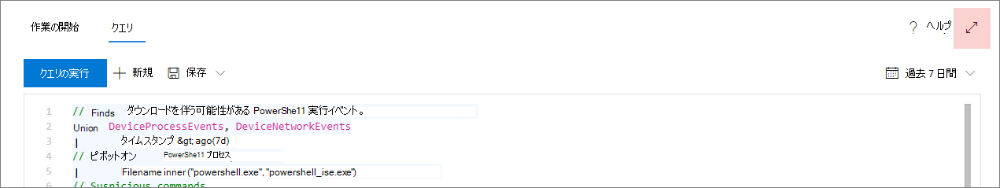

# <a name="learn-the-advanced-hunting-query-language"></a>高度な捜索のクエリ言語について学習する

[!INCLUDE [Microsoft 365 Defender rebranding](../../includes/microsoft-defender.md)]

**適用対象:**
- [Defender for Endpoint](https://go.microsoft.com/fwlink/?linkid=2154037)

> Defender for Endpoint を体験してみませんか? [無料試用版にサインアップします。](https://www.microsoft.com/microsoft-365/windows/microsoft-defender-atp?ocid=docs-wdatp-advancedhunting-abovefoldlink)

高度な捜索は、[Kusto クエリ言語](https://docs.microsoft.com/azure/kusto/query/)に基づいています。 Kusto 演算子とステートメントを使用して、特殊なスキーマ内の情報を検索するクエリを作成 [できます](advanced-hunting-schema-reference.md)。 これらの概念をよりよく理解するために、最初のクエリを実行します。

## <a name="try-your-first-query"></a>最初のクエリを試してみる

Microsoft Defender セキュリティ センターで、[高度な検索 **] に移動して** 、最初のクエリを実行します。 次の例を使用してください。

```kusto
// Finds PowerShell execution events that could involve a download
union DeviceProcessEvents, DeviceNetworkEvents
| where Timestamp > ago(7d)
// Pivoting on PowerShell processes
| where FileName in~ ("powershell.exe", "powershell_ise.exe")
// Suspicious commands
| where ProcessCommandLine has_any("WebClient",
    "DownloadFile",
    "DownloadData",
    "DownloadString",
    "WebRequest",
    "Shellcode",
    "http",
    "https")
| project Timestamp, DeviceName, InitiatingProcessFileName, InitiatingProcessCommandLine, 
FileName, ProcessCommandLine, RemoteIP, RemoteUrl, RemotePort, RemoteIPType
| top 100 by Timestamp
```
**[高度な検索でこのクエリを実行する](https://securitycenter.windows.com/hunting?query=H4sIAAAAAAAEAI2TT0vDQBDF5yz4HUJPFcTqyZsXqyCIBFvxKNGWtpo_NVlbC8XP7m8mado0K5Zls8nkzdu3b2Z70pNAbmUmqYyk4D2UTJYyllwGMmWNGQHrN_NNvsSBzUBrbMFMiWieAx3xDEBl4GL4AuNd8B0bNgARENcdUmIZ3yM5liPwac3bN-YZPGPU5ET1rWDc7Ox4uod8YDp4MzI-GkjlX4Ne2nly0zEkKzFWh4ZE5sSuTN8Ehq5couvEMnvmUAhez-HsRBMipVa_W_OG6vEfGtT12JRHpqV064e1Kx04NsxFzXxW1aFjp_djXmDRPbfY3XMMcLogTz2bWZ2KqmIJI6q6wKe2WYnrRsa9KVeU9kCBBo2v7BzPxF_Bx2DKiqh63SGoRoc6Njti48z_yL71XHQAcgAur6rXRpcqH3l-4knZF23Utsbq2MircEqmw-G__xR1TdZ1r7zb7XLezmx3etkvGr-ze6NdGdW92azUfpcdluWvr-aqbh_nofnqcWI3aYyOsBV7giduRUO7187LMKTT5rxvHHX80_t8IeeMgLquvL7-Ak3q-kz8BAAA&runQuery=true&timeRangeId=week)**

### <a name="describe-the-query-and-specify-the-tables-to-search"></a>クエリを記述し、検索するテーブルを指定する
クエリの先頭に短いコメントが追加され、それが何を行うのかを説明しています。 このコメントは、後でクエリを保存し、組織内の他のユーザーと共有する場合に役立ちます。

```kusto
// Finds PowerShell execution events that could involve a download
```
クエリ自体は、通常、テーブル名の後にパイプ ( ) で始まる複数の要素で始まる `|` 。 この例では、まず 2 つのテーブルの共用体を作成し、必要に応じてパイプ要素  `DeviceProcessEvents` `DeviceNetworkEvents` を追加します。

```kusto
union DeviceProcessEvents, DeviceNetworkEvents
```
### <a name="set-the-time-range"></a>時間範囲を設定する
最初のパイプ処理された要素は、前の 7 日間にスコープ設定された時間フィルターです。 時間範囲を制限すると、クエリのパフォーマンスが向上し、管理可能な結果が返され、時間が取れなかることができます。

```kusto
| where Timestamp > ago(7d)
```

### <a name="check-specific-processes"></a>特定のプロセスを確認する
時間範囲の直後に、PowerShell アプリケーションを表すプロセス ファイル名を検索します。

```kusto
// Pivoting on PowerShell processes
| where FileName in~ ("powershell.exe", "powershell_ise.exe")
```

### <a name="search-for-specific-command-strings"></a>特定のコマンド文字列を検索する
その後、クエリは、PowerShell を使用してファイルをダウンロードするために通常使用されるコマンド ライン内の文字列を検索します。

```kusto
// Suspicious commands
| where ProcessCommandLine has_any("WebClient",
    "DownloadFile",
    "DownloadData",
    "DownloadString",
    "WebRequest",
    "Shellcode",
    "http",
    "https")
```

### <a name="customize-result-columns-and-length"></a>結果の列と長さをカスタマイズする 
クエリで検索するデータが明確に識別されたので、結果の外観を定義できます。 `project` 特定の列を返し、 `top` 結果の数を制限します。 これらの演算子は、結果の形式が適切で、合理的に大きく、処理が容易であることを確認するのに役立ちます。

```kusto
| project Timestamp, DeviceName, InitiatingProcessFileName, InitiatingProcessCommandLine, 
FileName, ProcessCommandLine, RemoteIP, RemoteUrl, RemotePort, RemoteIPType
| top 100 by Timestamp
```

[クエリ **の実行] を** 選択して結果を表示します。 クエリ エディターの右上にある展開アイコンを使用して、検索クエリと結果に注目します。 



>[!TIP]
>クエリ結果をグラフとして表示し、フィルターをすばやく調整できます。 ガイダンスについては、「 [クエリ結果の操作」を参照してください。](advanced-hunting-query-results.md)

## <a name="learn-common-query-operators-for-advanced-hunting"></a>高度な捜索のための一般的なクエリ演算子を学習する

最初のクエリを実行し、そのコンポーネントに関する一般的なアイデアを得たばかりです。 少しバックトラックし、いくつかの基本を学ぶ時間です。 高度な捜索で使用される Kusto クエリ言語は、次のような一般的な演算子をサポートします。

| 演算子 | 説明および使用法 |
|--|--|
| `where` | 述語に適合する行のサブセットにテーブルをフィルター処理します。 |
| `summarize` | 入力テーブルの内容を集約したテーブルを作成します。 |
| `join` | 各テーブルから指定された列の値を照合して、2 つのテーブルの行を結合し、新しいテーブルを作成します。 |
| `count` | 入力レコード セットのレコード数を返します。 |
| `top` | 指定された列によって並べ替えられた最初の N レコードを返します。 |
| `limit` | 指定された行数まで返します。 |
| `project` | 新しい計算列を含める、名前を変更する、またはドロップする列を選択し、挿入します。 |
| `extend` | 計算列を作成し、結果セットに追加します。 |
| `makeset` |  Expr がグループ内でとる個別の値のセットの動的 (JSON) 配列を返します。 |
| `find` | テーブルのセットで述語と一致する行を検索します。 |

これらの演算子の実例を確認するには、高度な検索ページの **[開始** ] セクションから実行します。

## <a name="understand-data-types"></a>データ型について

高度な検索では、次の一般的な種類を含む Kusto データ型がサポートされています。

| データ型 | 説明とクエリの意味 |
|--|--|
| `datetime` | 通常、イベントのタイムスタンプを表すデータと時刻の情報。 [サポートされている日時形式を参照してください。](https://docs.microsoft.com/azure/data-explorer/kusto/query/scalar-data-types/datetime) |
| `string` | 文字列は、UTF-8 ( ) または二重引用符 ( `'` ) で囲まれます `"` 。 [文字列の詳細](https://docs.microsoft.com/azure/data-explorer/kusto/query/scalar-data-types/string) |
| `bool` | このデータ型は、サポート `true` または `false` 状態です。 [サポートされているリテラルと演算子を参照してください。](https://docs.microsoft.com/azure/data-explorer/kusto/query/scalar-data-types/bool) |
| `int` | 32 ビット整数  |
| `long` | 64 ビット整数 |

これらのデータ型の詳細については [、「Kusto スカラー データ型」を参照してください](https://docs.microsoft.com/azure/data-explorer/kusto/query/scalar-data-types/)。

## <a name="get-help-as-you-write-queries"></a>クエリを記述するときにヘルプを参照する
次の機能を利用して、クエリをより速く記述します。

- **Autosuggest**-you write queries, advanced hunting providess suggestions from IntelliSense.
- **スキーマ ツリー**: テーブルの一覧とその列を含むスキーマ表現が、作業領域の横に表示されます。 詳細については、アイテムにカーソルを合わせてください。 アイテムをダブルクリックして、クエリ エディターに挿入します。
- **[スキーマ参照](advanced-hunting-schema-reference.md#get-schema-information-in-the-security-center)**-テーブルと列の説明、サポートされているイベントの種類 (値) とサンプル クエリを含むポータル `ActionType` 内参照

## <a name="work-with-multiple-queries-in-the-editor"></a>エディターで複数のクエリを処理する
クエリ エディターを使用して、複数のクエリを実験できます。 複数のクエリを使用するには、次のコマンドを実行します。

- 各クエリを空の行で分離します。
- クエリを実行する前に、クエリの任意の部分にカーソルを置き、そのクエリを選択します。 これにより、選択したクエリだけが実行されます。 別のクエリを実行するには、カーソルを適切に移動し、[クエリの実行] **を選択します**。


 _むクエリ エディター_

## <a name="use-sample-queries"></a>サンプル クエリを使用する

[**はじめに**] セクションでは、一般的に使用されている演算子を使用した簡単なクエリーをいくつか提供します。 これらのクエリを実行して、少し変更してみてください。

![[高度な検索の開始] タブの画像](images/atp-advanced-hunting.png)

> [!NOTE]
> 基本的なクエリ サンプルとは別に、特定の脅威の捜索シナリオの[共有クエリ](advanced-hunting-shared-queries.md)にアクセスすることもできます。 ページの左側または GitHub クエリ リポジトリで共有 [クエリを確認します](https://aka.ms/hunting-queries)。

## <a name="access-comprehensive-query-language-reference"></a>包括的なクエリ言語リファレンスにアクセスする

クエリ言語の詳細については [、「Kusto クエリ言語のドキュメント」を参照してください](https://docs.microsoft.com/azure/kusto/query/)。

## <a name="related-topics"></a>関連項目
- [高度な検出の概要](advanced-hunting-overview.md)
- [クエリ結果を操作する](advanced-hunting-query-results.md)
- [共有クエリを使用する](advanced-hunting-shared-queries.md)
- [スキーマを理解する](advanced-hunting-schema-reference.md)
- [クエリのベスト プラクティスを適用する](advanced-hunting-best-practices.md)
