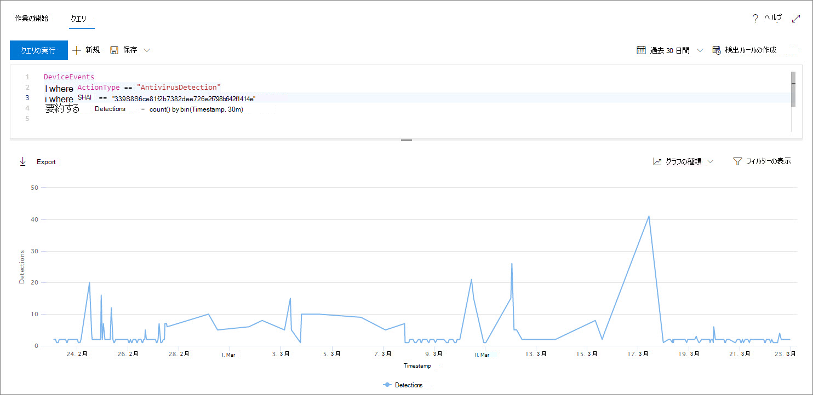

# <a name="work-with-advanced-hunting-query-results"></a>高度な検索クエリの結果を処理する

[!INCLUDE [Microsoft 365 Defender rebranding](../../includes/microsoft-defender.md)]

**適用対象:**
- [Microsoft Defender for Endpoint](https://go.microsoft.com/fwlink/?linkid=2154037)

>Defender for Endpoint を体験してみませんか? [無料試用版にサインアップします。](https://www.microsoft.com/microsoft-365/windows/microsoft-defender-atp?ocid=docs-wdatp-advancedhunting-abovefoldlink)

高度な検索クエリを[](advanced-hunting-overview.md)作成して非常に正確な情報を取得することもできますが、クエリの結果を処理して、さらに詳しい分析情報を得て、特定のアクティビティとインジケーターを調査することもできます。 クエリ結果に対して次のアクションを実行できます。

- 結果を表またはグラフとして表示する
- 表とグラフのエクスポート
- 詳細なエンティティ情報にドリルダウンする
- 結果から直接クエリを調整するか、フィルターを適用する

## <a name="view-query-results-as-a-table-or-chart"></a>クエリ結果を表またはグラフとして表示する
既定では、高度な検索ではクエリ結果が表形式データとして表示されます。 グラフと同じデータを表示することもできます。 高度な検索では、次のビューがサポートされています。

| ビューの種類 | 説明 |
| -- | -- |
| **表** | クエリ結果を表形式で表示する |
| **縦棒グラフ** | X 軸上の一連の一意の項目を、高さが別のフィールドの数値を表す垂直バーとしてレンダリングされます。 |
| **積み上げ列グラフ** | x 軸上の一連の一意のアイテムを、高さが 1 つ以上の他のフィールドの数値を表す積み上げ縦棒としてレンダリングされます。 |
| **円グラフ** | 一意のアイテムを表す断面円グラフをレンダリングします。 各円グラフのサイズは、別のフィールドの数値を表します。 |
| **ドーナツ グラフ** | 一意のアイテムを表す断面円弧をレンダリングします。 各円弧の長さは、別のフィールドの数値を表します。 |
| **折れ線グラフ** | 一連の一意の項目の数値をプロットし、プロットされた値を接続する |
| **散布図** | 一連の一意の項目の数値をプロットする |
| **エリア グラフ** | 一連の一意の項目の数値をプロットし、プロットされた値の下のセクションを塗りつぶし |

### <a name="construct-queries-for-effective-charts"></a>効果的なグラフのクエリを作成する
グラフをレンダリングする場合、高度な検索では、関心のある列と集計する数値が自動的に識別されます。 意味のあるグラフを取得するには、表示する特定の値を返すクエリを作成します。 サンプル クエリと結果のグラフを次に示します。

#### <a name="alerts-by-severity"></a>重大度別のアラート
グラフを `summarize` 作成する値の数値カウントを取得するには、演算子を使用します。 以下のクエリでは、演算子 `summarize` を使用して重大度別のアラート数を取得します。

```kusto
DeviceAlertEvents
| summarize Total = count() by Severity
```
結果をレンダリングすると、各重大度値が個別の列として列グラフに表示されます。


 *として表示する*

#### <a name="alert-severity-by-operating-system"></a>オペレーティング システムによるアラートの重大度
演算子を使用して、 `summarize` 複数のフィールドの値をグラフ化する結果を準備することもできます。 たとえば、アラートの重大度がオペレーティング システム (OS) 全体に分散される方法を理解できます。 

次のクエリでは、演算子を使用してテーブルから OS 情報を取得し、列と列の両方の値をカウント `join` `DeviceInfo` `summarize` `OSPlatform` `Severity` します。

```kusto
DeviceAlertEvents
| join DeviceInfo on DeviceId
| summarize Count = count() by OSPlatform, Severity
```
これらの結果は、積み上げ列グラフを使用して最適に視覚化されます。


 *表示* される重大度

#### <a name="top-ten-device-groups-with-alerts"></a>アラートを含む上位 10 個のデバイス グループ
有限ではない値のリストを扱う場合は、演算子を使用して、最も多くのインスタンスを持つ値のみを `Top` グラフ化できます。 たとえば、アラートが最も多い上位 10 個のデバイス グループを取得するには、次のクエリを使用します。

```kusto
DeviceAlertEvents
| join DeviceInfo on DeviceId
| summarize Count = count() by MachineGroup
| top 10 by Count
```
上位グループ間の分布を効果的に表示するには、円グラフ ビューを使用します。


 *クエリ結果のイメージ*

#### <a name="malware-detections-over-time"></a>マルウェアの検出時間の過ぎ
演算子を `summarize` 関数と一緒に使用すると、時間のとともに特定のインジケーター `bin()` に関連するイベントを確認できます。 以下のクエリは、EICAR テスト ファイルの検出を 30 分間隔でカウントし、そのファイルの検出のスパイクを示します。

```kusto
DeviceEvents
| where ActionType == "AntivirusDetection"
| where SHA1 == "3395856ce81f2b7382dee72602f798b642f14140"
| summarize Detections = count() by bin(Timestamp, 30m)
```
以下の線グラフは、テスト マルウェアの検出が多い期間を明確に強調表示しています。 


 *の画像*


## <a name="export-tables-and-charts"></a>表とグラフのエクスポート
クエリを実行した後、[エクスポート] **を選択** して、結果をローカル ファイルに保存します。 選択したビューは、結果のエクスポート方法を決定します。

- **テーブル ビュー** - クエリ結果は表形式で Microsoft Excel ブックとしてエクスポートされます。
- **任意のグラフ** - クエリ結果は、レンダリングされたグラフの JPEG イメージとしてエクスポートされます。

## <a name="drill-down-from-query-results"></a>クエリ結果からドリルダウンする
クエリ結果で、デバイス、ファイル、ユーザー、IP アドレス、URL などのエンティティに関する詳細を表示するには、エンティティ識別子をクリックします。 これにより、選択したエンティティの詳細なプロファイル ページが開きます。

クエリ結果のレコードをすばやく検査するには、対応する行を選択して [レコードの検査] パネルを開きます。 パネルには、選択したレコードに基づいて次の情報が表示されます。

- **アセット** - レコード内に見つかった主な資産 (メールボックス、デバイス、およびユーザー) の要約ビューで、リスクや露出レベルなどの利用可能な情報が充実しています。
- **プロセス ツリー** : プロセス情報を含むレコード用に生成され、利用可能なコンテキスト情報を使用して強化されたグラフ。一般に、より多くの列を返すクエリを実行すると、より豊富なプロセス ツリーが生成される可能性があります。
- **[すべての詳細** ] - レコード内の列のすべての値を一覧表示します。

## <a name="tweak-your-queries-from-the-results"></a>結果からクエリを絞り込む
結果セットの値を右クリックすると、クエリがすばやく強化されます。 次のようなオプションを使用できます。

- 選択した値 (`==`) を明示的に検索する
- 選択した値をクエリ (`!=`) から除外する 
- クエリに値を追加するためのより高度な演算子 `contains`、`starts with`、および `ends with` を取得する 


## <a name="filter-the-query-results"></a>クエリ結果をフィルター処理する
右側のウィンドウに表示されるフィルターは、結果セットの概要を示します。 各列には、ウィンドウ内に独自のセクションが含まれます。各列には、その列にある値とインスタンスの数が一覧表示されます。

含める値または除外する値のボタンを選択して、クエリ `+` `-` を絞り込む。 次に、[クエリの **実行] を選択します**。


フィルターを適用してクエリを変更し、クエリを実行すると、結果がそれに応じて更新されます。

## <a name="related-topics"></a>関連項目
- [高度な追求の概要](advanced-hunting-overview.md)
- [クエリ言語の説明](advanced-hunting-query-language.md)
- [共有クエリを使用する](advanced-hunting-shared-queries.md)
- [スキーマを理解する](advanced-hunting-schema-reference.md)
- [クエリのベスト プラクティスを適用する](advanced-hunting-best-practices.md)
- [カスタム検出の概要](overview-custom-detections.md)
