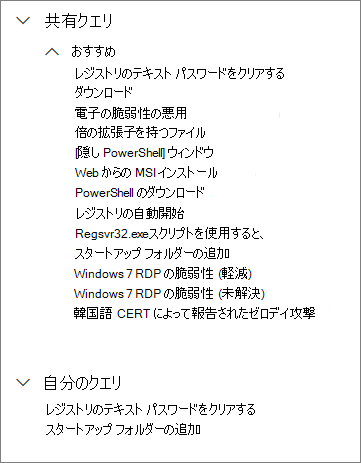
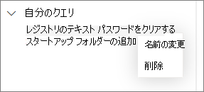

# 高度な捜索で共有クエリを使用する

[!INCLUDE [Microsoft 365 Defender rebranding](../../includes/microsoft-defender.md)]

**適用対象:**
- [Microsoft Defender for Endpoint](https://go.microsoft.com/fwlink/p/?linkid=2154037)

>Defender for Endpoint を体験してみませんか? [無料試用版にサインアップします。](https://www.microsoft.com/microsoft-365/windows/microsoft-defender-atp?ocid=docs-wdatp-advancedhunting-abovefoldlink)

[高度な捜索](advanced-hunting-overview.md)クエリは、同じ組織内のユーザー間で共有できます。 また、GitHub で公開されているクエリも検索できます。 これらのクエリを使用すると、クエリを最初から作成することなく、特定の脅威の捜索シナリオを迅速に実行できます。

## クエリを保存、変更、共有する
新規または既存のクエリを保存して、自分のみアクセスできるようにしたり、組織内の他のユーザーと共有したりできます。

1. [共有クエリ] または [マイ クエリ]の下から、新しいクエリを入力するか、既存のクエリ **を読み込む。**

2. 保存 **オプションから [** 保存 **] または [** 名前を付けて保存] を選択します。 既存のクエリを上書きしないようにするには、[名前を付けて保存] **を選択します**。

3. クエリの名前を入力します。

   

4. クエリを保存するフォルダーを選択します。
    - **共有クエリ** - 組織内のすべてのユーザーに共有される
    - [**マイ クエリ**] — 自分のみアクセス可能
    
5. [**保存**] を選択します。

## クエリを削除または名前を変更する
1. 名前を変更または削除するクエリを右クリックします。

    

2. [**削除**] を選択して、削除を確認します。 または、[**名前の変更**] を選択して、クエリに新しい名前を入力ます。

## クエリへの直接リンクを作成する
高度な検索クエリ エディターでクエリを直接開くリンクを生成するには、クエリを最終処理し、[リンクの共有] **を選択します**。

## GitHub リポジトリ内のクエリにアクセスする  
Microsoft のセキュリティ調査員は、[GitHub の指定された公開リポジトリ](https://github.com/Microsoft/WindowsDefenderATP-Hunting-Queries)で高度な捜索クエリを定期的に共有しています。 このリポジトリは投稿できます。 投稿するには、[GitHub に無料で参加](https://github.com/)してください。 

>[!TIP]
>また、Microsoft のセキュリティ調査員は高度な捜索クエリも提供しています。これを使用して、新たな脅威に関連するアクティビティやインジケータを特定できます。 これらのクエリは、Microsoft Defender セキュリティ センターの[脅威の分析](threat-analytics.md)レポートの一部として提供されます。

## 関連項目
- [高度な追求の概要](advanced-hunting-overview.md)
- [クエリ言語の説明](advanced-hunting-query-language.md)
- [クエリ結果を操作する](advanced-hunting-query-results.md)
- [スキーマを理解する](advanced-hunting-schema-reference.md)
- [クエリのベスト プラクティスを適用する](advanced-hunting-best-practices.md)
- [カスタム検出の概要](overview-custom-detections.md)
