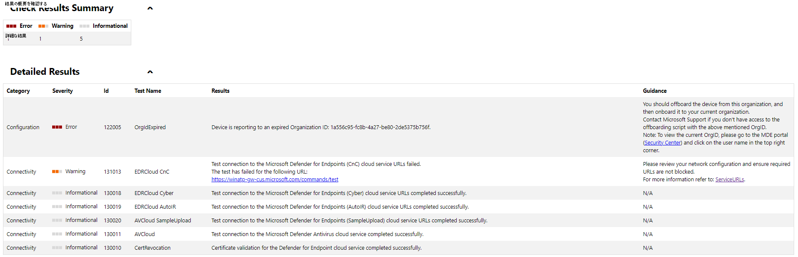
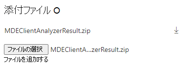

# クライアント アナライザーの HTML レポートについて

**適用対象:**
- [Microsoft Defender for Endpoint](https://go.microsoft.com/fwlink/p/?linkid=2146631)

クライアント アナライザーは、HTML 形式でレポートを生成します。 レポートを確認して潜在的なセンサーの問題を特定し、トラブルシューティングを行う方法について説明します。

レポートを理解するには、次の例を使用します。

 有効期限が切れた組織 ID にオンボードされ、必要な Microsoft Defender for Endpoint URL の 1 つに到達できなかったコンピューターのアナライザーからの出力例:

- スクリプトのバージョンとスクリプト ランタイムの一番上に参照用の一覧が表示されます
- [ **デバイス情報]** セクションには、アナライザーが実行されているデバイスを一意に識別するための基本的な OS とデバイス識別子が表示されます。
- エンドポイント **セキュリティの詳細は**、Microsoft Defender for Endpoint 関連のプロセスに関する一般的な情報を提供します(Microsoft Defender ウイルス対策センサー プロセスを含む)。 重要なプロセスが期待通りオンラインではない場合、色は赤に変わります。

  

- [ **結果の確認の概要]** で、アナライザーによって検出されたエラー、警告、または情報イベントの集計カウントが表示されます。
- [詳細 **な結果] には** 、分析プログラムによって行われた観測値に基づいて、結果とガイダンスを含むリスト (重大度別に並べ替え) が表示されます。

## Microsoft へのサポート チケットを開き、Analyzer の結果を含める

サポート チケットを開く際 [に](contact-support.md#open-a-service-request)アナライザーの結果ファイルを含めるには、[添付ファイル] セクションを使用 **し、ファイル** を含 `MDEClientAnalyzerResult.zip` めます。

> [!NOTE]
> ファイル サイズが 25 MB を超える場合、ケースに割り当てられたサポート エンジニアは、分析用に大きなファイルをアップロードするための専用の安全なワークスペースを提供します。
