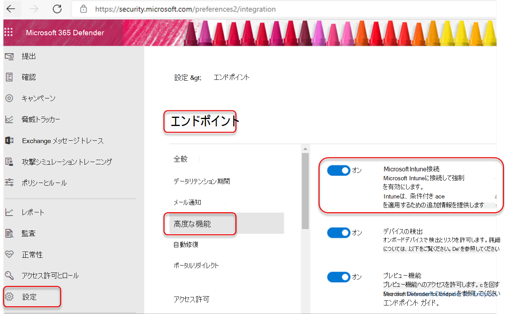
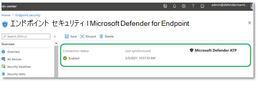
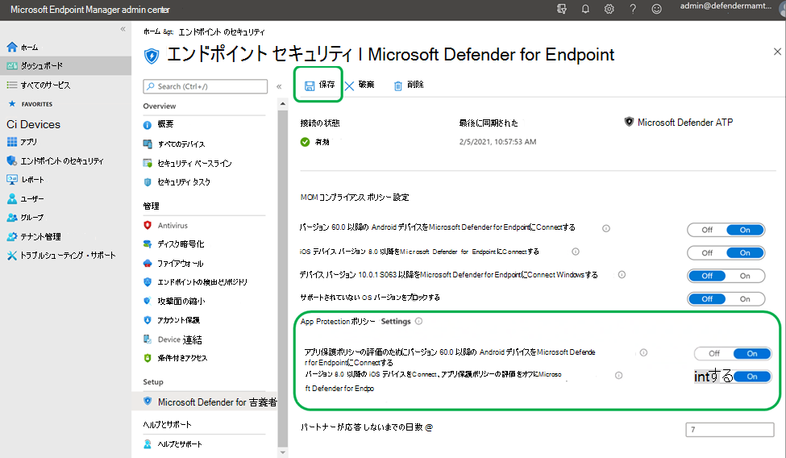
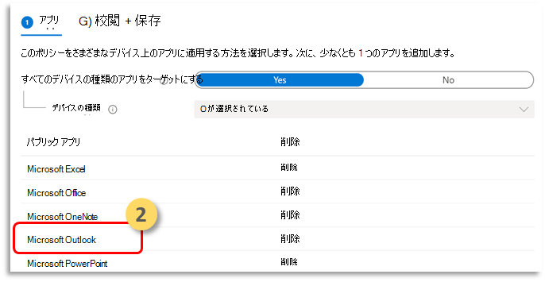
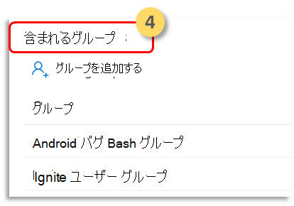
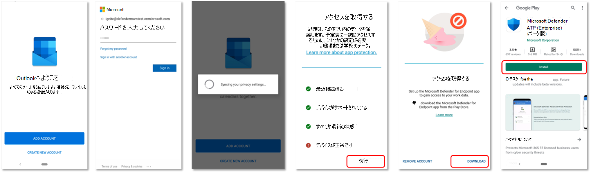

# アプリ保護ポリシー (MAM) を使用して Microsoft Defender for Endpoint リスクシグナルを構成する

[!INCLUDE [Microsoft 365 Defender rebranding](../../includes/microsoft-defender.md)]

**適用対象:**
- [Microsoft Defender for Endpoint](https://go.microsoft.com/fwlink/p/?linkid=2154037)
- [Microsoft 365 Defender](https://go.microsoft.com/fwlink/?linkid=2118804)

モバイル デバイス管理 (MDM) シナリオでエンタープライズ ユーザーを既に保護している Android 上の Microsoft Defender for Endpoint は、Intune モバイル デバイス管理 (MDM) を使用して登録されていないデバイスのモバイル アプリ管理 (MAM) のサポートを拡張しました。 また、このサポートは、他のエンタープライズ モビリティ管理ソリューションを使用しているお客様にも拡張しますが、モバイル アプリケーション管理 (MAM) には Intune を使用します。この機能を使用すると、アプリケーション内で組織のデータを管理および保護できます。

Microsoft Defender for Endpoint on Android の脅威情報は、Intune アプリ保護ポリシーによってこれらのアプリを保護するために活用されます。 アプリ保護ポリシー (APP) は、組織のデータを安全に保つか、管理アプリに含まれるか確認するルールです。 管理アプリケーションにはアプリ保護ポリシーが適用され、Intune で管理できます。  

Android 上のエンドポイント用 Microsoft Defender は、MAM の両方の構成をサポートしています
- **Intune MDM + MAM**: IT 管理者は、Intune モバイル デバイス管理 (MDM) に登録されているデバイスでアプリ保護ポリシーを使用してアプリのみを管理できます。
- **デバイス登録なしの** MAM : デバイス登録なしの MAM、または MAM-WE を使用すると 、IT 管理者は Intune MDM に登録されていないデバイスでアプリ保護ポリシーを使用してアプリを管理できます。 つまり、サードパーティの EMM プロバイダーに登録されているデバイスでは、Intune によってアプリを管理できます。 上記の両方の構成を使用してアプリを管理するには、管理者センターで Intune[をMicrosoft エンドポイント マネージャーする必要があります。](https://go.microsoft.com/fwlink/?linkid=2109431)

この機能を有効にするには、管理者が Microsoft Defender for Endpoint と Intune 間の接続を構成し、アプリ保護ポリシーを作成し、対象のデバイスとアプリケーションにポリシーを適用する必要があります。 
 
エンド ユーザーは、デバイスに Microsoft Defender for Endpoint をインストールし、オンボーディング フローをアクティブ化するための手順を実行する必要があります。

## 管理者の前提条件

- **Microsoft Defender for the microsoft Defender for Endpoint-Intuneコネクタが有効になっているか検証する**

  a. [次へ] security.microsoft.com。 

  b. [**接続設定 >有効>高度> Microsoft Intuneエンドポイント]** を選択します。

  c. 接続が有効ではない場合は、トグルを選択してオンにし、[基本設定の保存 **] を選択します**。

  

  d. [Microsoft Defender **for Microsoft エンドポイント マネージャー (Intune)** に移動し、Microsoft Defender for Endpoint-Intune有効かどうかを検証します。

  

- **アプリ保護ポリシー (APP) の Android コネクタで Microsoft Defender for Endpoint を有効にする**
  
  アプリ保護ポリシー用に Intune Microsoft エンドポイント マネージャーコネクタを構成します。

  a. Microsoft Defender for **Endpoint >テナント管理コネクタと>に移動します**。

  b. Android のアプリ保護ポリシーのトグルをオンにします (次のスクリーンショットを参照)。

  c. **[保存]** を選択します。

  

- **アプリ保護ポリシーを作成する** 
 
アプリ保護ポリシーを作成して、Microsoft Defender for Endpoint リスクシグナルに基づいて管理アプリのデータへのアクセスをブロックまたはワイプします。
Microsoft Defender for Endpoint は、アプリ保護ポリシー (APP、 MAM とも呼ばれる) で使用される脅威信号を送信するように構成できます。 この機能を使用すると、Microsoft Defender for Endpoint を使用して管理対象アプリを保護できます。

1. ポリシーを作成する  
アプリ保護ポリシー (APP) は、組織のデータを安全に保つか、管理アプリに含まれるか確認するルールです。 ポリシーには、ユーザーが "企業" データにアクセスまたは移動しようとするときに適用されるルール、またはユーザーがアプリ内に入っているときに禁止または監視される一連のアクションを指定できます。 

2. アプリを追加する  
    a. このポリシーをさまざまなデバイス上のアプリに適用する方法を選択します。 次に、少なくとも 1 つのアプリを追加します。  
    このポリシーが管理されていないデバイスに適用されるかどうかを指定するには、このオプションを使用します。 Android の場合は、Android デバイス、デバイス管理者、または管理Enterpriseポリシーを指定できます。 また、任意の管理状態のデバイス上のアプリにポリシーをターゲットにすることもできます。
モバイル アプリの管理ではデバイス管理が必要ではないので、管理デバイスと管理されていないデバイスの両方で会社のデータを保護できます。 管理はユーザー ID を中心とします。デバイス管理の要件は削除されます。 企業は、MDM を使用する場合と使用しない場合でも、アプリ保護ポリシーを同時に使用できます。 たとえば、会社が発行した電話と自分の個人用タブレットの両方を使用する従業員を考えます。 会社の電話は MDM に登録され、アプリ保護ポリシーによって保護され、個人用デバイスはアプリ保護ポリシーでのみ保護されます。

    b. [アプリの選択] 
    管理アプリは、アプリ保護ポリシーが適用され、Intune で管理できるアプリです。 [Intune SDK](/mem/intune/developer/app-sdk)に統合されたアプリ、または Intune アプリによってラップされたアプリは、Intune アプリ[App Wrapping Tool](/mem/intune/developer/apps-prepare-mobile-application-management)ポリシーを使用して管理できます。 これらのツールを使用して[構築](/mem/intune/apps/apps-supported-intune-apps)Microsoft Intune、パブリックに使用できる保護されたアプリの公式リストを参照してください。

    *例: Outlookアプリとして使用する*

    

 3. 保護ポリシーのサインイン セキュリティ要件を設定します。  
[ **デバイスの条件>最大許容** デバイス脅威レベルの設定] を選択 **し、値** を入力します。 次に、[  **アクション] を選択します。[アクセスをブロックする] を選択します**。 Android 上のエンドポイント用 Microsoft Defender は、このデバイス脅威レベルを共有します。

    

- **ポリシーを適用する必要があるユーザー グループを割り当てる。** 
  [含 **まれるグループ] を選択します**。 次に、関連するグループを追加します。 

    

## エンド ユーザーの前提条件
- ブローカー アプリをインストールする必要がある
    - Intune ポータル サイト
    
- ユーザーが管理アプリに必要なライセンスを持ち、アプリがインストールされている

### エンド ユーザーのオンボーディング 

1. たとえば、管理アプリケーションにサインインOutlook。 デバイスが登録され、アプリケーション保護ポリシーがデバイスに同期されます。 アプリケーション保護ポリシーは、デバイスの正常性状態を認識します。  

2. **[続行]** を選択します。 Android アプリで Microsoft Defender for Endpoint のダウンロードとセットアップを推奨する画面が表示されます。

3. [ダウンロード **] を選択します**。 アプリ ストア (Google プレイ) にリダイレクトされます。 

4.  Microsoft Defender for Endpoint (Mobile) アプリをインストールし、管理アプリのオンボーディング画面を起動します。

  

5.  [続行 **] をクリック>起動します**。 Microsoft Defender for Endpoint アプリのオンボーディング/アクティブ化フローが開始されます。 手順に従ってオンボーディングを完了します。 [管理アプリのオンボーディング] 画面に自動的にリダイレクトされ、デバイスが正常に機能する状態が示されます。

6. [ **続行] を** 選択して管理アプリケーションにログインします。 

## 関連項目

- [Android 用 Microsoft Defender for Endpoint の概要](microsoft-defender-endpoint-android.md)
- [Microsoft Intune を使用した Android 用 Microsoft Defender for Endpoint の展開](android-intune.md)
