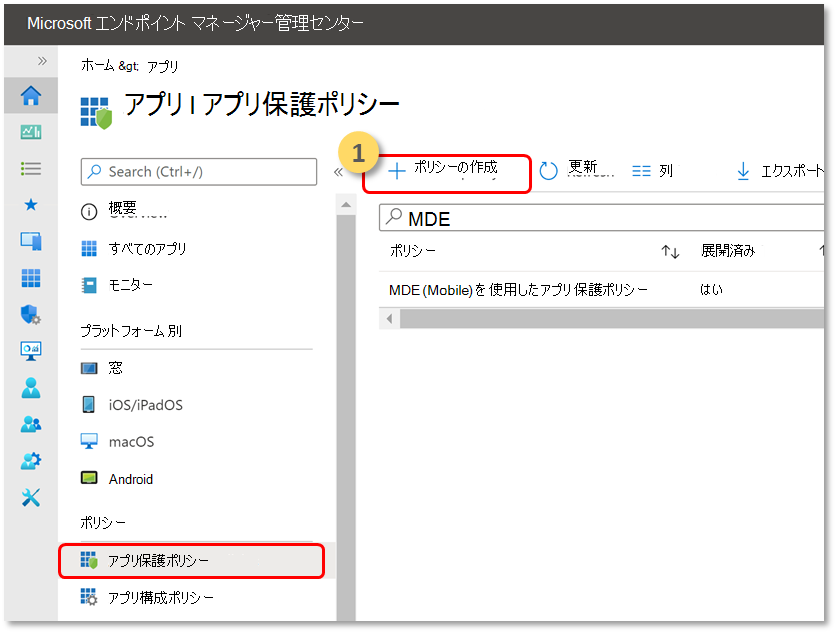
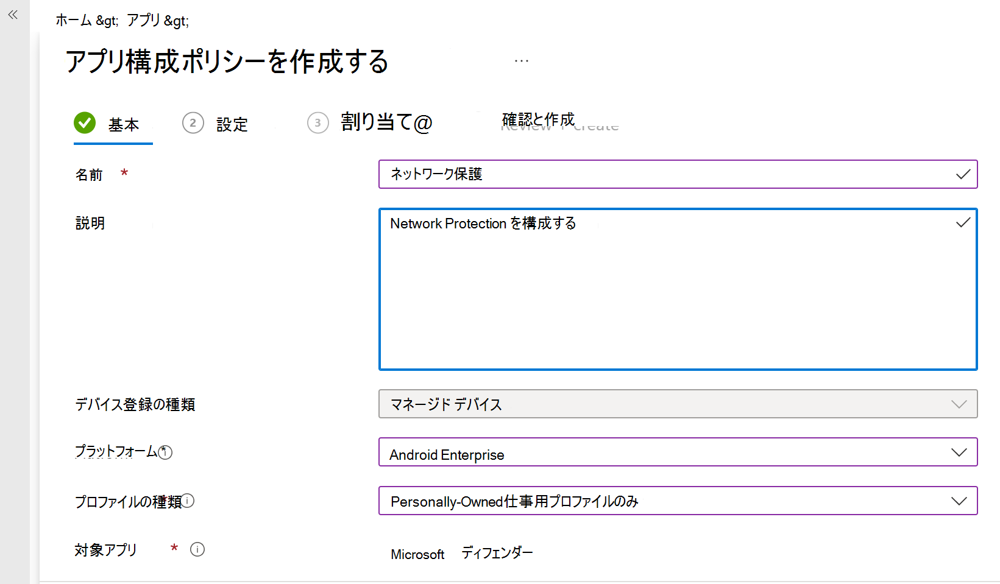

# Android 機能用 Defender for Endpoint を構成する

[!INCLUDE [Microsoft 365 Defender rebranding](../../includes/microsoft-defender.md)]

**適用対象:**
- [Microsoft Defender for Endpoint Plan 1](https://go.microsoft.com/fwlink/p/?linkid=2154037)
- [Microsoft Defender for Endpoint Plan 2](https://go.microsoft.com/fwlink/p/?linkid=2154037)
- [Microsoft 365 Defender](https://go.microsoft.com/fwlink/?linkid=2118804)

## Android 上の Defender for Endpoint を使用した条件付きアクセス

Microsoft Intune および Azure Active Directory と共に Android 上の Microsoft Defender for Endpoint を使用すると、デバイス のリスク レベルに基づいて、デバイスコンプライアンスと条件付きアクセス ポリシーを適用できます。 Defender for Endpoint は、Intune を介してこの機能を活用するためにデプロイできる Mobile Threat Defense (MTD) ソリューションです。

Android と条件付きアクセスで Defender for Endpoint を設定する方法の詳細については、「 [Defender for Endpoint and Intune](/mem/intune/protect/advanced-threat-protection)」を参照してください。

## カスタム インジケーターを構成する

> [!NOTE]
> Android 上の Defender for Endpoint では、IP アドレスと URL/ドメインのカスタム インジケーターの作成のみがサポートされます。

Android 上の Defender for Endpoint を使用すると、管理者は Android デバイスをサポートするようにカスタム インジケーターを構成できます。 カスタム インジケーターを構成する方法の詳細については、「インジケーターの [管理](manage-indicators.md)」を参照してください。

## Web 保護を構成する
Android 上の Defender for Endpoint を使用すると、IT 管理者は Web 保護機能を構成できます。 この機能は、Microsoft Endpoint Manager 管理センター内で使用できます。

> [!NOTE]
> Android 上の Defender for Endpoint は、Web 保護機能を提供するために VPN を使用します。 これは通常の VPN ではなく、デバイスの外部でトラフィックを受け取らないローカル/セルフループ VPN です。
> 詳細については、「 [Android を実行するデバイスで Web 保護を構成する」を](/mem/intune/protect/advanced-threat-protection-manage-android)参照してください。

## ネットワーク保護
>[!NOTE]
>Microsoft Defender for Endpoint の Network Protection はパブリック プレビュー段階になりました。 次の情報は、市販される前に大幅に変更される可能性のあるプレリリース済み製品に関連しています。 Microsoft は、ここに記載された情報に関して、明示または黙示を問わず、いかなる保証も行いません。

この機能は、Wi-Fi ネットワークの主な攻撃ベクトルである悪意のあるWi-Fi関連の脅威と不正な証明書に対する保護を提供します。 管理者は、Microsoft Endpoint Manager 管理センターでルート証明機関 (CA) とプライベート ルート CA 証明書を一覧表示し、エンドポイントとの信頼を確立できます。 セキュリティで保護されたネットワークに接続するためのガイド付きエクスペリエンスをユーザーに提供し、関連する脅威が検出された場合に通知します。 

これには、Microsoft Endpoint Manager 管理センター内から機能を構成する機能や、信頼できる証明書を追加する機能など、柔軟性を提供するための管理コントロールがいくつか含まれています。 管理者は、 [プライバシー制御](android-configure.md) を有効にして、Defender for Endpoint によって Android デバイスから送信されるデータを構成することもできます。

Microsoft Defender for endpoint のネットワーク保護は、既定で有効になっています。 管理者は、次の手順を使用して **、Android デバイスでネットワーク保護を構成できます。**

1. Microsoft Endpoint Manager 管理者で、アプリ>アプリ構成ポリシーに移動します。 新しいアプリ構成ポリシーを作成します。
    > [!div class="mx-imgBorder"]
    > 
1. ポリシーを一意に識別するための名前と説明を入力します。 プラットフォームとして **[Android Enterprise] を** 選択し、プロファイルの種類として **[個人用の仕事用プロファイルのみ] を** 、対象アプリとして **[Microsoft Defender] を** 選択します。
    > [!div class="mx-imgBorder"]
    > 
1. [設定] ページで **[構成デザイナーの使用** ] を選択し、キーとして **[Microsoft Defender でネットワーク保護を有効にする] を** 追加し、値 **を "0"** として追加して、ネットワーク保護を拡張します。 (ネットワーク保護は既定で有効になっています)
    > [!div class="mx-imgBorder"]
    > ![[ネットワーク保護ポリシーを有効にする] を選択する方法のイメージ](images/selectnp.png)
    
    > [!div class="mx-imgBorder"]
    > 
1. 組織が本質的にプライベートである可能性のあるルート CA を使用している場合は、Intune (MDM ソリューション) とユーザーのデバイスの間に明示的な信頼を確立して、防御側が不正な証明書としてフラグを検出しないようにする必要があります。  

    ルート CA の信頼を確立するには、キーとして **"Trusted CA certificate list for Network Protection (Preview)" を** 使用し、値に **"証明書拇印のコンマ区切りリスト" を追加します**。
    > [!div class="mx-imgBorder"]
    > 

1. ネットワーク保護に関連するその他の構成については、次のキーと適切な対応する値を追加します。
 

    | 構成キー| 説明|
    |---|---|
    |Network Protection のプライバシーを有効にする|1 - 有効 、0 - 無効;この設定は、ネットワーク保護でプライバシーを有効または無効にするために IT 管理者によって管理されます。|
    |ユーザーがネットワークと証明書を信頼できるようにする|1 - 有効 、0 - 無効;この設定は、セキュリティで保護されていない疑わしいネットワークと悪意のある証明書を信頼して信頼するために、エンド ユーザーのアプリ内エクスペリエンスを有効または無効にするために IT 管理者によって使用されます。|
    |ネットワーク保護アラートの自動修復|1 - 有効 、0 - 無効;この設定は、IT 管理者が、より安全なWi-Fi アクセス ポイントへの切り替えや Defender によって検出された疑わしい証明書の削除など、ユーザーが修復アクティビティを実行したときに送信される修復アラートを有効または無効にするために使用されます。|
1. ポリシーを適用する必要がある必要なグループを追加します。 ポリシーを確認して作成します。

## プライバシー コントロール

> [!IMPORTANT]
> Android 上の Microsoft Defender for Endpoint のプライバシー コントロールはプレビュー段階です。 次の情報は、市販される前に大幅に変更される可能性のあるプレリリース済み製品に関連しています。 Microsoft は、ここに記載された情報に関して、明示または黙示を問わず、いかなる保証も行いません。

Android デバイスから Defender for Endpoint によって送信されるデータを構成するには、次のプライバシー制御を使用できます。

|脅威レポート     |詳細      |
|--------------------|-------------|
|マルウェア レポート |管理者はマルウェア レポートのプライバシー制御を設定できます。プライバシーが有効になっている場合、Defender for Endpoint はマルウェア アラート レポートの一部としてマルウェア アプリ名とその他のアプリの詳細を送信しません |
|フィッシング レポート |管理者はフィッシング レポートのプライバシー制御を設定できます。プライバシーが有効になっている場合、Defender for Endpoint はフィッシング アラート レポートの一部として安全でない Web サイトのドメイン名と詳細を送信しません |
|アプリの脆弱性評価 (Android のみ) |既定では、仕事用プロファイルにインストールされているアプリに関する情報のみが、脆弱性評価のために送信されます。 管理者はプライバシーを無効にして個人用アプリを含めることができます|

## BYOD デバイス用アプリの脆弱性評価を構成する

Android 上の Microsoft Defender for Endpoint のバージョン 1.0.3425.0303 から、オンボードされたモバイル デバイスにインストールされている OS とアプリの脆弱性評価を実行できます。

> [!NOTE]
> 脆弱性評価は、Microsoft Defender for Endpoint の [Microsoft Defender 脆弱性管理](../defender-vulnerability-management/defender-vulnerability-management.md) の一部です。 

**個人用デバイス (BYOD) からのアプリに関連するプライバシーに関する注意事項:**

- 仕事用プロファイルを持つ Android Enterprise の場合、仕事用プロファイルにインストールされているアプリのみがサポートされます。
- 他の BYOD モードの場合、既定では、アプリの脆弱性評価は有効 **になりません** 。 ただし、デバイスが管理者モードの場合、管理者は Microsoft Endpoint Manager を使用してこの機能を明示的に有効にして、デバイスにインストールされているアプリの一覧を取得できます。 詳細については、以下の詳細を参照してください。

### デバイス管理者モードのプライバシーを構成する

ターゲット ユーザーの **デバイス管理者** モードでデバイスからの **アプリの脆弱性評価を有効にするには**、次の手順に従います。 

> [!NOTE]
> 既定では、デバイス管理モードで登録されているデバイスでは、この設定はオフになっています。

1. [Microsoft Endpoint Manager 管理センター](https://go.microsoft.com/fwlink/?linkid=2109431)で、[**デバイス** > **構成プロファイルの****作成] プロファイル** > に移動し、次の設定を入力します。

   - **プラットフォーム**: Android デバイス管理者を選択する
   - **プロファイル**: [カスタム] を選択し、[作成] をクリックします。

2. [ **基本]** セクションで、プロファイルの名前と説明を指定します。

3. **構成設定** で、[**OMA-URI 設定の** 追加] を選択します。

   - **名前**: この OMA-URI 設定の一意の名前と説明を入力して、後で簡単に検索できるようにします。
   - OMA-URI: **./Vendor/MSFT/DefenderATP/DefenderTVMPrivacyMode**
   - [データ型]: ドロップダウン リストから [整数] を選択します。
   - 値: 0 と入力してプライバシー設定を無効にします (既定では、値は 1 です)

4. [ **次へ** ] をクリックし、このプロファイルを対象のデバイス/ユーザーに割り当てます。

### Android Enterprise の仕事用プロファイルのプライバシーを構成する

Defender for Endpoint は、仕事用プロファイル内のアプリの脆弱性評価をサポートします。 ただし、対象ユーザーに対してこの機能をオフにする場合は、次の手順を使用できます。

1. [Microsoft Endpoint Manager 管理センター](https://go.microsoft.com/fwlink/?linkid=2109431)で、**Apps** > **App 構成ポリシー** > の **[管理対象デバイス** の **追加]** >  に移動します。
2. ポリシーに名前を付けます。 **プラットフォーム > Android Enterprise**;プロファイルの種類を選択します。
3. ターゲット アプリとして **Microsoft Defender for Endpoint** を選択します。
4. [設定] ページで、[**構成デザイナーの使用**] を選択し、キーとして **DefenderTVMPrivacyMode** を追加し、値の種類を **整数** として追加します。
   - 仕事用プロファイルでアプリの脆弱性を無効にするには、値を `1` 入力し、このポリシーをユーザーに割り当てます。 既定では、この値は `0`.
   - キーが設定されている `0`ユーザーの場合、Defender for Endpoint は、脆弱性評価のために、仕事用プロファイルからバックエンド サービスにアプリの一覧を送信します。
5. [ **次へ** ] をクリックし、このプロファイルを対象のデバイス/ユーザーに割り当てます。

上記のプライバシー制御をオンまたはオフにしても、デバイスコンプライアンスチェックや条件付きアクセスには影響しません。

## フィッシング アラート レポートのプライバシーを構成する

フィッシングレポートのプライバシー制御を使用すると、フィッシング脅威レポートのドメイン名または Web サイト情報の収集を無効にすることができます。 これにより、悪意のある Web サイトまたはフィッシング Web サイトが Defender for Endpoint によって検出され、ブロックされたときに、組織がドメイン名を収集するかどうかを柔軟に選択できます。

### Android デバイス管理者が登録したデバイスでフィッシング アラート レポートのプライバシーを構成します。

ターゲット ユーザーに対して有効にするには、次の手順に従います。

1. [Microsoft Endpoint Manager 管理センター](https://go.microsoft.com/fwlink/?linkid=2109431)で、[**デバイス** > **構成プロファイルの****作成] プロファイル** > に移動し、次の設定を入力します。

   - **プラットフォーム**: Android デバイス管理者を選択します。
   - **プロファイル**: [カスタム] を選択し、[ **作成**] をクリックします。

2. [ **基本]** セクションで、プロファイルの名前と説明を指定します。

3. **構成設定** で、[**OMA-URI 設定の** 追加] を選択します。

   - **名前**: この OMA-URI 設定の一意の名前と説明を入力して、後で簡単に検索できるようにします。
   - OMA-URI: **./Vendor/MSFT/DefenderATP/DefenderExcludeURLInReport**
   - [データ型]: ドロップダウン リストから [整数] を選択します。
   - 値: 1 と入力してプライバシー設定を有効にします。 既定値は 0 です。

4. [ **次へ** ] をクリックし、このプロファイルを対象のデバイス/ユーザーに割り当てます。

このプライバシー制御を使用すると、デバイスコンプライアンスチェックや条件付きアクセスには影響しません。

### Android Enterprise の仕事用プロファイルでフィッシング アラート レポートのプライバシーを構成する

次の手順に従って、仕事用プロファイルで対象ユーザーのプライバシーを有効にします。

1. [Microsoft Endpoint Manager 管理センター](https://go.microsoft.com/fwlink/?linkid=2109431)で、**Apps** > **App 構成ポリシー** > の **[管理対象デバイス** の **追加]** >  に移動します。
2. ポリシーに名前を付けます。 **Platform > Android Enterprise** は、プロファイルの種類を選択します。
3. ターゲット アプリとして **Microsoft Defender for Endpoint** を選択します。
4. [設定] ページで、[ **構成デザイナーの使用** ] を選択し、キーとして **DefenderExcludeURLInReport** を追加し、値の型を Integer として追加 **します**。
   - **プライバシーを有効にするには、「1」と入力します**。 既定値は 0 です。
5. [ **次へ** ] をクリックし、このプロファイルを対象のデバイス/ユーザーに割り当てます。

上記のプライバシー制御をオンまたはオフにしても、デバイスコンプライアンスチェックや条件付きアクセスには影響しません。

## マルウェアの脅威レポートのプライバシーを構成する

マルウェア脅威レポートのプライバシー制御を使用すると、マルウェア脅威レポートからアプリの詳細 (名前とパッケージ情報) の収集を無効にすることができます。 これにより、組織は、悪意のあるアプリが検出されたときにアプリ名を収集するかどうかを柔軟に選択できます。

### Android デバイス管理者が登録したデバイスでマルウェア アラート レポートのプライバシーを構成します。

ターゲット ユーザーに対して有効にするには、次の手順に従います。

1. [Microsoft Endpoint Manager 管理センター](https://go.microsoft.com/fwlink/?linkid=2109431)で、[**デバイス** > **構成プロファイルの****作成] プロファイル** > に移動し、次の設定を入力します。

   - **プラットフォーム**: Android デバイス管理者を選択します。
   - **プロファイル**: [カスタム] を選択し、[ **作成**] をクリックします。

2. [ **基本]** セクションで、プロファイルの名前と説明を指定します。

3. **構成設定** で、[**OMA-URI 設定の** 追加] を選択します。

   - **名前**: この OMA-URI 設定の一意の名前と説明を入力して、後で簡単に検索できるようにします。
   - OMA-URI: **./Vendor/MSFT/DefenderATP/DefenderExcludeAppInReport**
   - [データ型]: ドロップダウン リストから [整数] を選択します。
   - 値: 1 と入力してプライバシー設定を有効にします。 既定値は 0 です。

4. [ **次へ** ] をクリックし、このプロファイルを対象のデバイス/ユーザーに割り当てます。

このプライバシー制御を使用すると、デバイスコンプライアンスチェックや条件付きアクセスには影響しません。 たとえば、悪意のあるアプリを持つデバイスでは、常にリスク レベルが "中" になります。

### Android Enterprise の仕事用プロファイルでマルウェア アラート レポートのプライバシーを構成する

次の手順に従って、仕事用プロファイルで対象ユーザーのプライバシーを有効にします。

1. [Microsoft Endpoint Manager 管理センター](https://go.microsoft.com/fwlink/?linkid=2109431)で、**Apps** > **App 構成ポリシー** > の **[管理対象デバイス** の **追加]** >  に移動します。
2. ポリシーに名前を付けます。 **Platform > Android Enterprise** は、プロファイルの種類を選択します。
3. ターゲット アプリとして **Microsoft Defender for Endpoint** を選択します。
4. [設定] ページで、[**構成デザイナーの使用**] を選択し、キーとして **DefenderExcludeAppInReport** を追加し、値の型を **Integer** として追加します。
   - **プライバシーを有効にするには、「1」と入力します**。 既定値は 0 です。
5. [ **次へ** ] をクリックし、このプロファイルを対象のデバイス/ユーザーに割り当てます。

このプライバシー制御を使用すると、デバイスコンプライアンスチェックや条件付きアクセスには影響しません。 たとえば、悪意のあるアプリを持つデバイスでは、常にリスク レベルが "中" になります。

## 関連トピック

- [Android 用 Microsoft Defender for Endpoint の概要](microsoft-defender-endpoint-android.md)
- [Microsoft Intune を使用した Android 用 Microsoft Defender for Endpoint の展開](android-intune.md)
