# Microsoft Intune を使用した Android 用 Microsoft Defender for Endpoint の展開Deploy Microsoft Defender for Endpoint on Android with Microsoft Intune 

[!INCLUDE [Microsoft 365 Defender rebranding](../../includes/microsoft-defender.md)]

**適用対象:****Applies to:**
- [Microsoft Defender for EndpointMicrosoft Defender for Endpoint](https://go.microsoft.com/fwlink/p/?linkid=2154037)
- [Microsoft 365 DefenderMicrosoft 365 Defender](https://go.microsoft.com/fwlink/?linkid=2118804)

> Microsoft Defender ATP を試してみたいですか?Want to experience Microsoft Defender for Endpoint? [無料試用版にサインアップしてください。Sign up for a free trial.](https://www.microsoft.com/microsoft-365/windows/microsoft-defender-atp?ocid=docs-wdatp-exposedapis-abovefoldlink) 

登録されているデバイスで Android に Defender for Endpoint を展開するIntune ポータル サイト説明します。Learn how to deploy Defender for Endpoint on Android on Intune Company Portal enrolled devices. Intune デバイスの登録の詳細については、「デバイスの登録  [」を参照してください](https://docs.microsoft.com/mem/intune/user-help/enroll-device-android-company-portal)。For more information about Intune device enrollment, see  [Enroll your device](https://docs.microsoft.com/mem/intune/user-help/enroll-device-android-company-portal).

> [!NOTE]
> **Android 上のエンドポイントの Defender が Google Play で [利用できる](https://play.google.com/store/apps/details?id=com.microsoft.scmx)****Defender for Endpoint on Android is now available on [Google Play](https://play.google.com/store/apps/details?id=com.microsoft.scmx)**  
> Intune から Google Play に接続して、デバイス管理者モードと Android ネットワーク モードで Defender for Endpoint アプリを展開Enterpriseできます。You can connect to Google Play from Intune to deploy Defender for Endpoint app across Device Administrator and Android Enterprise entrollment modes.
アプリの更新は、Google Play 経由で自動的に行います。Updates to the app are automatic via Google Play.

## デバイス管理者が登録したデバイスに展開するDeploy on Device Administrator enrolled devices

**デバイス管理者が登録したデバイスで Android Intune ポータル サイト Defender for Endpoint を展開する****Deploy Defender for Endpoint on Android on Intune Company Portal - Device Administrator enrolled devices**

Android に Defender for Endpoint を展開する方法について、Intune ポータル サイトデバイス管理者が登録したデバイスについて説明します。Learn how to deploy Defender for Endpoint on Android on Intune Company Portal - Device Administrator enrolled devices. 

### Android ストア アプリとして追加するAdd as Android store app

1. 管理 [Microsoft エンドポイント マネージャーで、アプリ] [Androidアプリ] [Android ストア アプリの追加] に移動し、[ \>  \> 選択] を **選択します**。 **\>**In [Microsoft Endpoint Manager admin center](https://go.microsoft.com/fwlink/?linkid=2109431) , go to **Apps** \> **Android Apps** \> **Add \> Android store app** and choose **Select**.

   

2. [アプリの **追加] ページで** 、[アプリ情報] *セクションに次の情報* を入力します。On the **Add app** page and in the *App Information* section enter: 

   - **名前****Name** 
   - **説明****Description**
   - **Publisher** Microsoft として設定します。**Publisher** as Microsoft.
   - **アプリ ストア URL as** https://play.google.com/store/apps/details?id=com.microsoft.scmx (Defender for Endpoint app Google Play ストア URL)**App store URL** as https://play.google.com/store/apps/details?id=com.microsoft.scmx (Defender for Endpoint app Google Play Store URL) 

   その他のフィールドはオプションです。Other fields are optional. **[次へ]** を選択します。Select **Next**.

   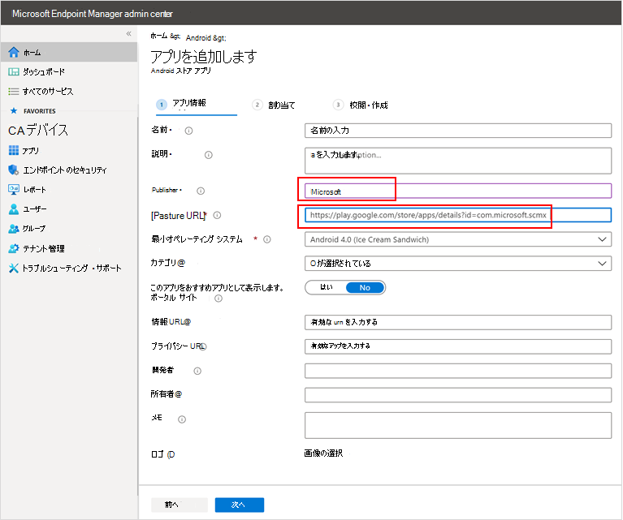

3. [割り *当て] セクション* で、[必須] セクションに移動 **し** 、[グループの追加] **を選択します。**In the *Assignments* section, go to the **Required** section and select **Add group.** その後、Android アプリで Defender for Endpoint をターゲットとするユーザー グループを選択できます。You can then choose the user group(s) that you would like to target Defender for Endpoint on Android app. [選択 **] と [** 次へ] の順 **に選択します**。Choose **Select** and then **Next**.

    >[!NOTE]
    >選択したユーザー グループは、Intune に登録されたユーザーで構成する必要があります。The selected user group should consist of Intune enrolled users.

    > [!div class="mx-imgBorder"]

    > 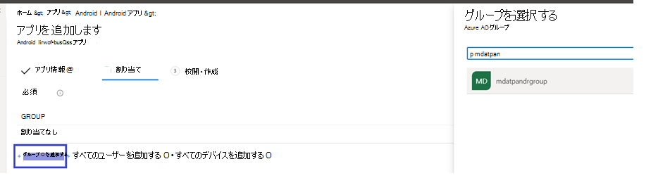

4. [レビュー **+ 作成] セクション** で、入力した情報が正しいか確認し、[作成] を **選択します**。In the **Review+Create** section, verify that all the information entered is correct and then select **Create**.

    しばらくすると、Defender for Endpoint アプリが正常に作成され、ページの右上隅に通知が表示されます。In a few moments, the Defender for Endpoint app would be created successfully, and a notification would show up at the top-right corner of the page.

    

5. 表示されるアプリ情報ページの [モニター]セクションで、[デバイスのインストール状態] を選択して、デバイスのインストールが正常に完了したと確認します。In the app information page that is displayed, in the **Monitor** section, select **Device install status** to verify that the device installation has completed successfully.

    > [!div class="mx-imgBorder"]
    > 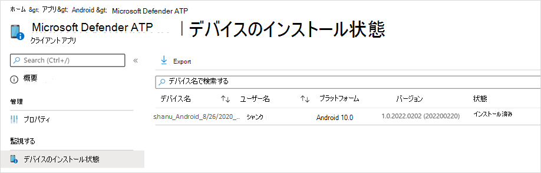

### オンボーディングとチェックの状態を完了するComplete onboarding and check status

1. Android 上の Defender for Endpoint がデバイスにインストールされた後、アプリ アイコンが表示されます。Once Defender for Endpoint on Android has been installed on the device, you'll see the app icon.

    

2. Microsoft Defender for Endpoint アプリ アイコンをタップし、画面の指示に従ってアプリのオンボーディングを完了します。Tap the Microsoft Defender for Endpoint app icon and follow the on-screen instructions to complete onboarding the app. 詳細には、Android の Defender for Endpoint で必要な Android アクセス許可のエンド ユーザーによる承諾が含まれます。The details include end-user acceptance of Android permissions required by Defender for Endpoint on Android.

3. オンボードが正常に完了すると、デバイスはデバイス の [デバイス] リストに表示Microsoft Defender セキュリティ センター。Upon successful onboarding, the device will start showing up on the Devices list in Microsoft Defender Security Center.

    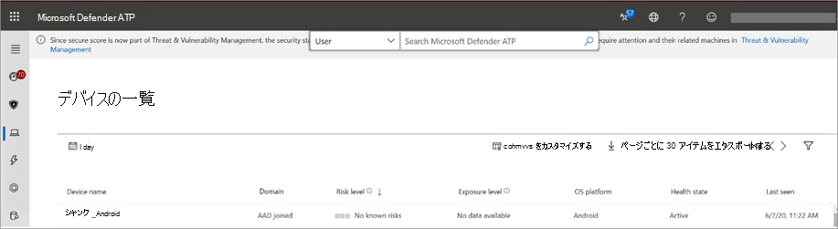

## 登録済みデバイスEnterprise Android に展開するDeploy on Android Enterprise enrolled devices

Android 上のエンドポイントの Defender は、登録Enterprise Android をサポートします。Defender for Endpoint on Android supports Android Enterprise enrolled devices.

Intune でサポートされる登録オプションの詳細については、「登録オプション」 [を参照してください](https://docs.microsoft.com/mem/intune/enrollment/android-enroll)。For more information on the enrollment options supported by Intune, see [Enrollment Options](https://docs.microsoft.com/mem/intune/enrollment/android-enroll).

**現在、仕事用プロファイルと企業所有の完全に管理されたユーザー デバイス登録を持つ個人所有のデバイスは、展開のためにサポートされています。****Currently, Personally owned devices with work profile and Corporate-owned fully managed user device enrollments are supported for deployment.**

## Android に Microsoft Defender for Endpoint を Managed Google Play アプリとして追加するAdd Microsoft Defender for Endpoint on Android as a Managed Google Play app

管理された Google Play に Microsoft Defender for Endpoint アプリを追加するには、以下の手順に従います。Follow the steps below to add Microsoft Defender for Endpoint app into your managed Google Play.

1. 管理 [Microsoft エンドポイント マネージャーで、アプリの Androidアプリの追加] に移動 \>  \> **し、[** 管理された Google Play アプリ]**を選択します**。In [Microsoft Endpoint Manager admin center](https://go.microsoft.com/fwlink/?linkid=2109431) , go to **Apps** \> **Android Apps** \> **Add** and select **Managed Google Play app**.

    > [!div class="mx-imgBorder"]
    > 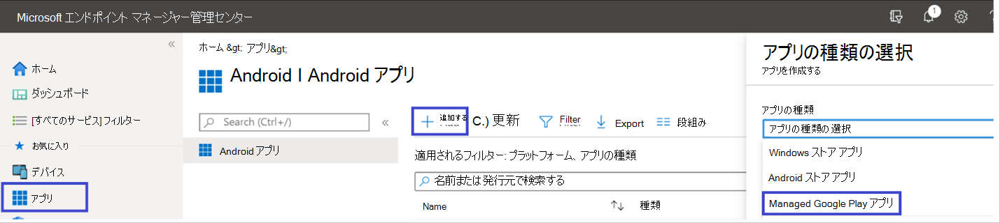

2. その後読み込まれる管理された Google Play ページで、検索ボックスに移動し **、Microsoft Defender を参照します。**On your managed Google Play page that loads subsequently, go to the search box and lookup **Microsoft Defender.** 検索では、Managed Google Play に Microsoft Defender for Endpoint アプリが表示されます。Your search should display the Microsoft Defender for Endpoint app in your Managed Google Play. アプリの検索結果から Microsoft Defender for Endpoint アプリをクリックします。Click on the Microsoft Defender for Endpoint app from the Apps search result.

    

3. 次に表示される [アプリの説明] ページで、Defender for Endpoint でアプリの詳細を確認できる必要があります。In the App description page that comes up next, you should be able to see app details on Defender for Endpoint. ページの情報を確認し、[承認] を **選択します**。Review the information on the page and then select **Approve**.

    > [!div class="mx-imgBorder"]
    > 

4. Defender for Endpoint が動作するために取得するアクセス許可が表示されます。You'll be presented with the permissions that Defender for Endpoint obtains for it to work. それらを確認し、[承認] を **選択します**。Review them and then select **Approve**.

    

5. [承認の設定] ページが表示されます。You'll be presented with the Approval settings page. このページでは、Android 上の Defender for Endpoint が要求する可能性がある新しいアプリのアクセス許可を処理する設定が確認されます。The page confirms your preference to handle new app permissions that Defender for Endpoint on Android might ask. 選択肢を確認し、希望するオプションを選択します。Review the choices and select your preferred option. **[完了]** を選択します。Select **Done**.

    既定では、[アプリが新しいアクセス許可を要求するときに承認済みの状態を維持する] を *選択します。*By default, managed Google Play selects *Keep approved when app requests new permissions*

    > [!div class="mx-imgBorder"]
    > ![[通知のイメージ] タブ](images/ffecfdda1c4df14148f1526c22cc0236.png)

6. アクセス許可処理の選択が行われたら、[同期] を **選択して** Microsoft Defender for Endpoint をアプリの一覧に同期します。After the permissions handling selection is made, select **Sync** to sync Microsoft Defender for Endpoint to your apps list.

    > [!div class="mx-imgBorder"]
    > 

7. 同期は数分で完了します。The sync will complete in a few minutes.

    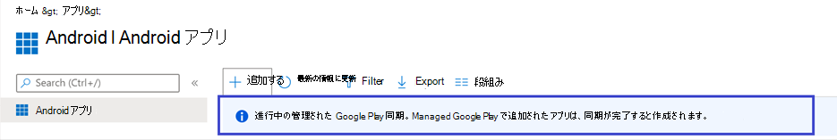

8. [Android アプリ **] 画面で** [更新] ボタンを選択すると、Microsoft Defender for Endpoint がアプリの一覧に表示されます。Select the **Refresh** button in the Android apps screen and Microsoft Defender for Endpoint should be visible in the apps list.

    > [!div class="mx-imgBorder"]
    > 

9. Defender for Endpoint は、Intune 経由で管理対象デバイスのアプリ構成ポリシーをサポートします。Defender for Endpoint supports App configuration policies for managed devices via Intune. この機能は、該当する Android アクセス許可を自動付与するために利用できます。そのため、エンド ユーザーは、これらのアクセス許可を受け入れる必要がなされません。This capability can be leveraged to autogrant applicable Android permission(s), so the end user does not need to accept these permission(s).

    1. [アプリ **] ページで** 、[アプリ構成ポリシー>に移動し、[> **デバイス>追加する] に移動します**。In the **Apps** page, go to **Policy > App configuration policies > Add > Managed devices**.

       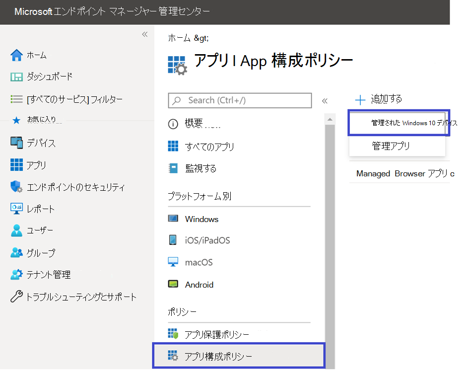

    1. [アプリ構成 **ポリシーの作成] ページ** で、次の詳細を入力します。In the **Create app configuration policy** page, enter the following details:
    
        - 名前: エンドポイント用 Microsoft Defender。Name: Microsoft Defender for Endpoint.
        - [**プラットフォームとして Android Enterprise]** を選択します。Choose **Android Enterprise** as platform.
        - [プロファイル **の種類] として [作業プロファイル** のみ] を選択します。Choose **Work Profile only** as Profile Type.
        - [**アプリの選択] を** クリックし、[Microsoft Defender ATP]**を選択** し **、[OK] を選択し、[次** へ] を **選択します**。Click **Select App**, choose **Microsoft Defender ATP**, select **OK** and then **Next**.
    
        > [!div class="mx-imgBorder"]
        > 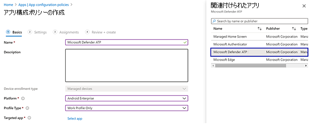

    1. [アクセス **設定]** ページで、[アクセス許可] セクションの [追加] をクリックして、サポートされているアクセス許可の一覧を表示します。In the **Settings** page, go to the Permissions section click on Add to view the list of supported permissions. [アクセス許可の追加] セクションで、次のアクセス許可を選択します。In the Add Permissions section, select the following permissions:

       - 外部ストレージ (読み取り)External storage (read)
       - 外部ストレージ (書き込み)External storage (write)

       次に **[OK]** を選択します。Then select **OK**.

       > [!div class="mx-imgBorder"]
      > 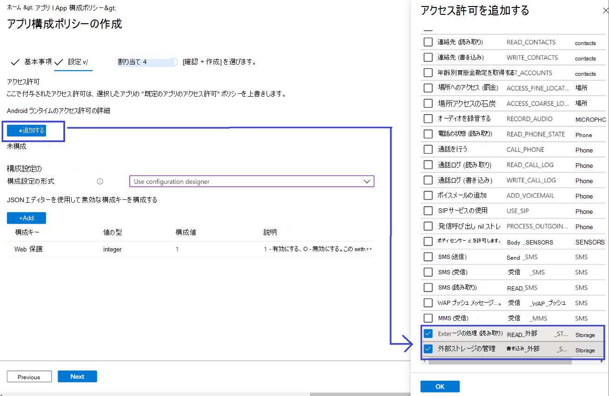

    1. これで、両方のアクセス許可が一覧表示され、[アクセス許可の状態] ドロップダウンで [自動入力] を選択し、[次へ] を選択して、両方を自動入力 **できます**。You should now see both the permissions listed and now you can autogrant both by choosing autogrant in the **Permission state** drop-down and then select **Next**.

       > [!div class="mx-imgBorder"]
       > 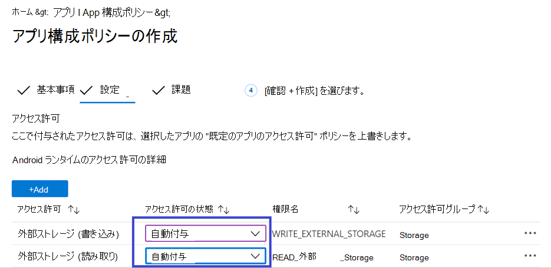

    1. [割 **り当て]** ページで、このアプリ構成ポリシーを割り当てるユーザー グループを選択します。In the **Assignments** page, select the user group to which this app config policy would be assigned to. [グループ **の選択] をクリック** して、該当するグループを含め、選択し、[次へ] を **選択します**。Click **Select groups to include** and selecting the applicable group and then selecting **Next**.  ここで選択したグループは、通常、エンドポイント Android アプリ用 Microsoft Defender を割り当てるのと同じグループです。The group selected here is usually the same group to which you would assign Microsoft Defender for Endpoint Android app. 

       > [!div class="mx-imgBorder"]
       > 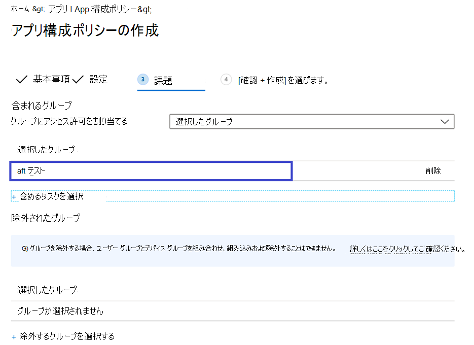
    

     1. 次に **表示される [確認と作成** ] ページで、すべての情報を確認し、[作成] を **選択します**。In the **Review + Create** page that comes up next, review all the information and then select **Create**.  
    
        ストレージアクセス許可を自動指定する Defender for Endpoint のアプリ構成ポリシーが、選択したユーザー グループに割り当てられます。The app configuration policy for Defender for Endpoint autogranting the storage permission is now assigned to the selected user group.

        > [!div class="mx-imgBorder"]
        > 

10. [**プロパティMicrosoft Defender ATP** 編集] の一覧で [アプリ \>  \> **の設定] を** \> **選択します**。Select **Microsoft Defender ATP** app in the list \> **Properties** \> **Assignments** \> **Edit**.

    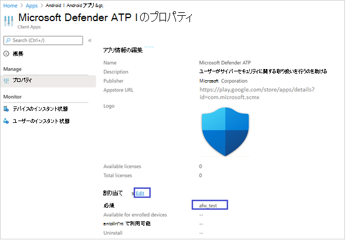

11. アプリを必須アプリとして *ユーザー* グループに割り当てる。Assign the app as a *Required* app to a user group. デバイスの次回の同期中に、アプリを使用して作業プロファイルに自動的ポータル サイトされます。It is automatically installed in the *work profile* during the next sync of the device via Company Portal app. この割り当ては、[必須]セクション [グループの追加] に移動し、ユーザー グループを選択して [選択 \> ] をクリックすることで **実行できます**。This assignment can be done by navigating to the *Required* section \> **Add group,** selecting the user group and click **Select**.

    > [!div class="mx-imgBorder"]
    > 

12. [アプリケーション **の編集] ページ** で、上記で入力した情報を確認します。In the **Edit Application** page, review all the information that was entered above. 次に、[ **確認] + [保存] の** 順に選択し **、[保存] を** 再度選択して割り当てを開始します。Then select **Review + Save** and then **Save** again to commence assignment.

### Always-on VPN の自動セットアップAuto Setup of Always-on VPN 
Defender for Endpoint は、Intune 経由で管理対象デバイスのデバイス構成ポリシーをサポートします。Defender for Endpoint supports Device configuration policies for managed devices via Intune. この機能は、Android Enterprise 登録済みデバイス上の **Always-on VPN** の自動セットアップに利用できます。そのため、エンド ユーザーはオンボーディング中に VPN サービスをセットアップする必要がなされません。This capability can be leveraged to **Auto setup of Always-on VPN** on Android Enterprise enrolled devices, so the end user does not need to set up VPN service while onboarding.
1.  [**デバイス]** で、[**構成プロファイルプロファイル** の作成] Android Enterpriseデバイス登録の種類に基づいて、次のいずれかの [デバイス制限  >    >    >  の選択] を選択します。On **Devices**, select **Configuration Profiles** > **Create Profile** > **Platform** > **Android Enterprise** Select **Device restrictions** under one of the following, based on your device enrollment type 
- **完全管理、専用、および作業Corporate-Ownedプロファイル****Fully Managed, Dedicated, and Corporate-Owned Work Profile**
- **個人所有の作業プロファイル****Personally owned Work Profile**

[**作成**] を選択します。Select **Create**.
 
   > 
    
2. **構成設定** 構成プロファイル **を一** 意 **に識別するための名前** と説明を指定します。**Configuration Settings** Provide a **Name** and a **Description** to uniquely identify the configuration profile. 

   > 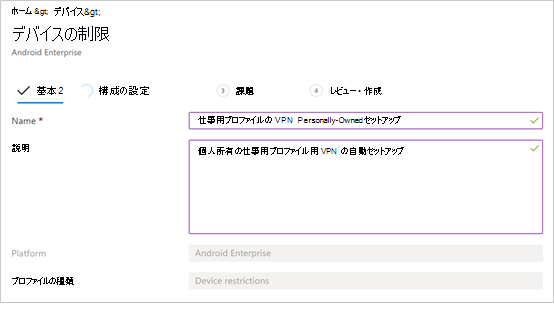
   
 3. [接続 **] を選択し** 、VPN を構成します。Select **Connectivity** and configure VPN:
- 作業 **プロファイルで Always-on VPN** Setup a VPN クライアントを有効にして、可能な限り VPN に自動的に接続して再接続します。Enable **Always-on VPN** Setup a VPN client in the work profile to automatically connect and reconnect to the VPN whenever possible. 特定のデバイス上の常時接続 VPN 用に構成できる VPN クライアントは 1 つのみです。そのため、1 つのデバイスに展開する常時接続 VPN ポリシーは 1 つ以下にしてください。Only one VPN client can be configured for always-on VPN on a given device, so be sure to have no more than one always-on VPN policy deployed to a single device. 
- [VPN **クライアント** のカスタム] ドロップダウン リスト [カスタム VPN] を選択します。この場合、Web 保護機能を提供するために使用される Defender for Endpoint VPN です。Select **Custom** in VPN client dropdown list Custom VPN in this case is Defender for Endpoint VPN which is used to provide the Web Protection feature. 
    > [!NOTE]
    > この VPN の自動セットアップを機能するには、Microsoft Defender for Endpoint アプリをユーザーのデバイスにインストールする必要があります。Microsoft Defender for Endpoint app must be installed on user’s device, in order to functioning of auto setup of this VPN.

- Google Play **ストアで** Microsoft Defender for Endpoint アプリのパッケージ ID を入力します。Enter **Package ID** of the Microsoft Defender for Endpoint app in Google Play store. Defender アプリの URL https://play.google.com/store/apps/details?id=com.microsoft.scmx の場合、パッケージ ID は **com.microsoft.scmx です**。For the Defender app URL https://play.google.com/store/apps/details?id=com.microsoft.scmx, Package ID is **com.microsoft.scmx**  
- **ロックダウン モード** 構成されていません (既定)**Lockdown mode** Not configured (Default) 

     
   
4. **割り当て**[割  **り当て]** ページで、このアプリ構成ポリシーを割り当てる   ユーザー グループを選択します。**Assignment** In the **Assignments** page, select the user group to which this app config policy would be assigned to. [グループ **の選択]** をクリックして、該当するグループを含め、選択し、[次へ] を **クリックします**。Click **Select groups** to include and selecting the applicable group and then click **Next**. ここで選択したグループは、通常、エンドポイント Android アプリ用 Microsoft Defender を割り当てるのと同じグループです。The group selected here is usually the same group to which you would assign Microsoft Defender for Endpoint Android app. 

     

5. 次に **表示される [確認と作成** ] ページで、すべての情報を確認し、[作成] を **選択します**。In the **Review + Create** page that comes up next, review all the information and then select **Create**. これで、デバイス構成プロファイルが選択したユーザー グループに割り当てられます。The device configuration profile is now assigned to the selected user group.    

    

## オンボーディングとチェックの状態を完了するComplete onboarding and check status

1. [デバイスのインストール状態] をクリックして、Android 上の Microsoft Defender for Endpoint のインストール状態 **を確認します**。Confirm the installation status of Microsoft Defender for Endpoint on Android by clicking on the **Device Install Status**. デバイスがここに表示されるのを確認します。Verify that the device is displayed here.

    > [!div class="mx-imgBorder"]
    > 

2. デバイスで、作業プロファイルにアクセスしてオンボーディングの状態を **検証できます**。On the device, you can validate the onboarding status by going to the **work profile**. Defender for Endpoint が使用可能で、個人用所有のデバイスに仕事用プロファイルが登録 **されているのを確認します**。Confirm that Defender for Endpoint is available and that you are enrolled to the **Personally owned devices with work profile**.  企業所有の完全に管理されたユーザー デバイスに登録されている場合は、デバイス上に 1 つのプロファイルが作成され、Defender for Endpoint が使用可能なと確認できます。If you are enrolled to a **Corporate-owned, fully managed user device**, you will have a single profile on the device where you can confirm that Defender for Endpoint is available.

    

3. アプリがインストールされると、アプリを開いてアクセス許可を受け入れ、オンボーディングが成功する必要があります。When the app is installed, open the app and accept the permissions and then your onboarding should be successful.

    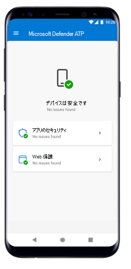

4. この段階では、デバイスは Android 上の Defender for Endpoint に正常にオンボードされます。At this stage the device is successfully onboarded onto Defender for Endpoint on Android. [デバイス] ページに移動 [して](https://securitycenter.microsoft.com)、Microsoft Defender セキュリティ センターを **確認できます。**You can verify this on the [Microsoft Defender Security Center](https://securitycenter.microsoft.com) by navigating to the **Devices** page.

    

## 関連項目Related topics
- [Android 用 Microsoft Defender for Endpoint の概要Overview of Microsoft Defender for Endpoint on Android](microsoft-defender-endpoint-android.md)
- [Android 機能用に Microsoft Defender for Endpoint を構成するConfigure Microsoft Defender for Endpoint on Android features](android-configure.md)
