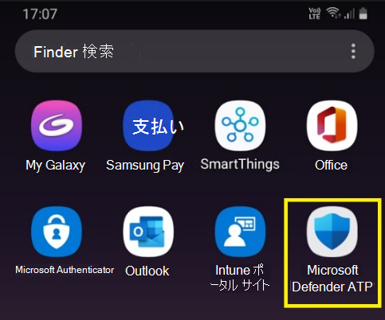
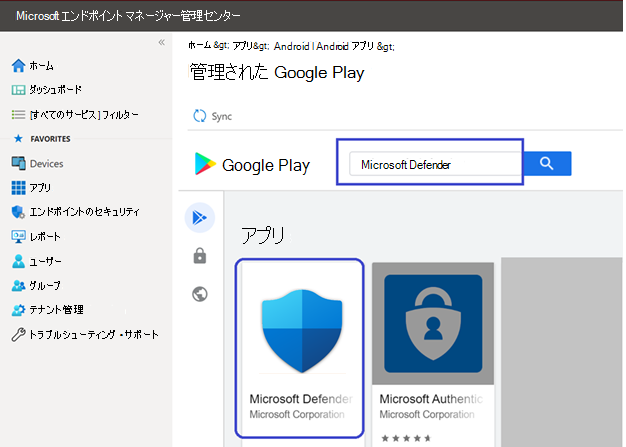
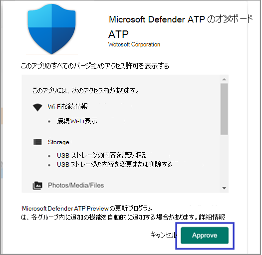
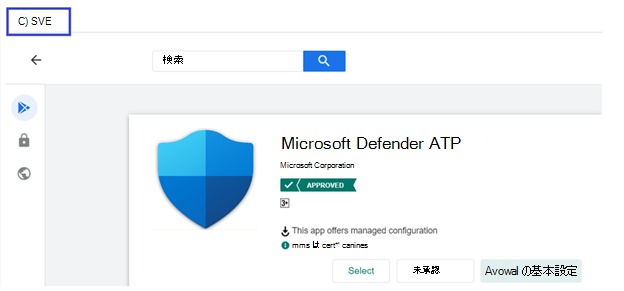
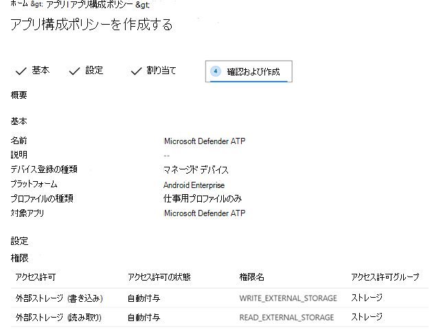
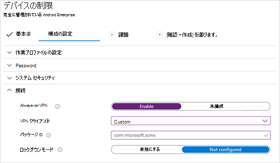
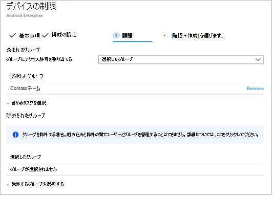
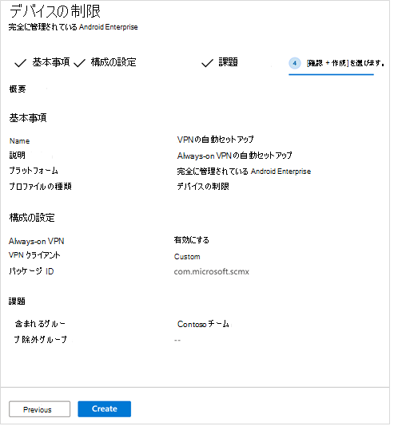
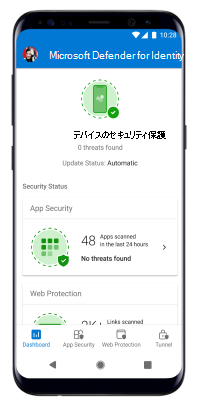

# Microsoft Intune を使用した Android 用 Microsoft Defender for Endpoint の展開

[!INCLUDE [Microsoft 365 Defender rebranding](../../includes/microsoft-defender.md)]

**適用対象:**
- [Microsoft Defender for Endpoint](https://go.microsoft.com/fwlink/p/?linkid=2154037)
- [Microsoft 365 Defender](https://go.microsoft.com/fwlink/?linkid=2118804)

> Microsoft Defender ATP を試してみたいですか? [無料試用版にサインアップしてください。](https://signup.microsoft.com/create-account/signup?products=7f379fee-c4f9-4278-b0a1-e4c8c2fcdf7e&ru=https://aka.ms/MDEp2OpenTrial?ocid=docs-wdatp-exposedapis-abovefoldlink)

登録されているデバイスで Android に Defender for Endpoint を展開するIntune ポータル サイト説明します。 Intune デバイスの登録の詳細については、「デバイスの登録  [」を参照してください](/mem/intune/user-help/enroll-device-android-company-portal)。

> [!NOTE]
> **Android 上のエンドポイントの Defender が Google Play で [利用できる](https://play.google.com/store/apps/details?id=com.microsoft.scmx)**
>
> Intune から Google Play に接続して、デバイス管理者と Android ユーザー登録モード全体に Defender for Endpoint アプリを展開Enterpriseできます。
>
> アプリの更新は、Google Play 経由で自動的に行います。

## デバイス管理者が登録したデバイスに展開する

**デバイス管理者が登録したデバイスで Android Intune ポータル サイト Defender for Endpoint を展開する**

Android に Defender for Endpoint を展開する方法について、Intune ポータル サイトデバイス管理者が登録したデバイスについて説明します。

### Android ストア アプリとして追加する

1. 管理 [Microsoft エンドポイント マネージャーで、アプリ] [Androidアプリ] [Android ストア アプリの追加] に移動し、[ \>  \> 選択] を **選択します**。 **\>**

   :::image type="content" alt-text="管理センターのMicrosoft エンドポイント マネージャー Android ストア アプリケーションを追加します。" source="images/mda-addandroidstoreapp.png" lightbox="images/mda-addandroidstoreapp.png":::

2. [アプリの **追加] ページで** 、[アプリ情報] *セクションに次の情報* を入力します。

   - **名前**
   - **説明**
   - **Publisher** Microsoft として設定します。
   - **アプリ ストア URL as** https://play.google.com/store/apps/details?id=com.microsoft.scmx (Defender for Endpoint app Google Play ストア URL)

   その他のフィールドはオプションです。 **[次へ]** を選択します。

   :::image type="content" alt-text="管理センターのMicrosoft エンドポイント マネージャーアプリ情報を追加します。" source="images/mda-addappinfo.png" lightbox="images/mda-addappinfo.png":::

3. [割り *当て] セクション* で、[必須] セクションに移動 **し** 、[グループの追加] **を選択します。** その後、Android アプリで Defender for Endpoint をターゲットとするユーザー グループを選択できます。 [選択 **] と [** 次へ] の順 **に選択します**。

    > [!NOTE]
    > 選択したユーザー グループは、Intune に登録されたユーザーで構成する必要があります。
    >
    > :::image type="content" alt-text="管理センターで選択Microsoft エンドポイント マネージャーグループのイメージ。" source="images/363bf30f7d69a94db578e8af0ddd044b.png" lightbox="images/363bf30f7d69a94db578e8af0ddd044b.png":::

4. [レビュー **+ 作成] セクション** で、入力した情報が正しいか確認し、[作成] を **選択します**。

    しばらくすると、Defender for Endpoint アプリが正常に作成され、ページの右上隅に通知が表示されます。

    :::image type="content" alt-text="Defender for Endpoint Microsoft エンドポイント マネージャーの管理センター通知のイメージ。" source="images/86cbe56f88bb6e93e9c63303397fc24f.png" lightbox="images/86cbe56f88bb6e93e9c63303397fc24f.png":::

5. 表示されるアプリ情報ページの [モニター]セクションで、[デバイスのインストール状態] を選択して、デバイスのインストールが正常に完了したと確認します。

    :::image type="content" alt-text="管理センター Microsoft エンドポイント マネージャーインストールのイメージ。" source="images/513cf5d59eaaef5d2b5bc122715b5844.png" lightbox="images/513cf5d59eaaef5d2b5bc122715b5844.png":::

### オンボーディングとチェックの状態を完了する

1. Android 上の Defender for Endpoint がデバイスにインストールされた後、アプリ アイコンが表示されます。

    

2. Microsoft Defender for Endpoint アプリ アイコンをタップし、画面の指示に従ってアプリのオンボーディングを完了します。 詳細には、Android の Defender for Endpoint で必要な Android アクセス許可のエンド ユーザーによる承諾が含まれます。

3. オンボードが正常に完了すると、デバイスはデバイス の [デバイス] リストに表示Microsoft Defender セキュリティ センター。

    :::image type="content" alt-text="Defender for Endpoint ポータルのデバイスのイメージ。" source="images/9fe378a1dce0f143005c3aa53d8c4f51.png" lightbox="images/9fe378a1dce0f143005c3aa53d8c4f51.png":::

## 登録済みデバイスEnterprise Android に展開する

Android 上のエンドポイントの Defender は、登録Enterprise Android をサポートします。

Intune でサポートされる登録オプションの詳細については、「登録オプション」 [を参照してください](/mem/intune/enrollment/android-enroll)。

**現在、仕事用プロファイルと企業所有の完全に管理されたユーザー デバイス登録を持つ個人所有のデバイスは、展開のためにサポートされています。**

## Android に Microsoft Defender for Endpoint を Managed Google Play アプリとして追加する

管理された Google Play に Microsoft Defender for Endpoint アプリを追加するには、以下の手順に従います。

1. 管理 [Microsoft エンドポイント マネージャーで、アプリの Androidアプリの追加] に移動 \>  \> **し、[** 管理された Google Play アプリ]**を選択します**。

    :::image type="content" alt-text="管理センター Microsoft エンドポイント マネージャー Google play のイメージ。" source="images/579ff59f31f599414cedf63051628b2e.png" lightbox="images/579ff59f31f599414cedf63051628b2e.png":::

2. その後読み込まれる管理された Google Play ページで、検索ボックスに移動してと入力します `Microsoft Defender` 。 検索では、Managed Google Play に Microsoft Defender for Endpoint アプリが表示されます。 アプリの検索結果から Microsoft Defender for Endpoint アプリをクリックします。

    

3. 次に表示される [アプリの説明] ページで、Defender for Endpoint でアプリの詳細を確認できる必要があります。 ページの情報を確認し、[承認] を **選択します**。

    > [!div class="mx-imgBorder"]
    > 

4. Defender for Endpoint が動作するために取得するアクセス許可が表示されます。 それらを確認し、[承認] を **選択します**。

    

5. [承認の設定] ページが表示されます。 このページでは、Android 上の Defender for Endpoint が要求する可能性がある新しいアプリのアクセス許可を処理する設定が確認されます。 選択肢を確認し、希望するオプションを選択します。 [**完了**] を選択します。

    既定では、[アプリが新しいアクセス許可を要求するときに承認済みの状態を維持する] を *選択します。*

    > [!div class="mx-imgBorder"]
    > ![[通知のイメージ] タブ。](images/ffecfdda1c4df14148f1526c22cc0236.png)

6. アクセス許可処理の選択が行われたら、[同期] を **選択して** Microsoft Defender for Endpoint をアプリの一覧に同期します。

    > [!div class="mx-imgBorder"]
    > 

7. 同期は数分で完了します。

    :::image type="content" alt-text="Android アプリの画像。" source="images/9fc07ffc150171f169dc6e57fe6f1c74.png" lightbox="images/9fc07ffc150171f169dc6e57fe6f1c74.png":::

8. [Android アプリ **] 画面で** [更新] ボタンを選択すると、Microsoft Defender for Endpoint がアプリの一覧に表示されます。

    :::image type="content" alt-text="Android アプリの一覧の画像。" source="images/fa4ac18a6333335db3775630b8e6b353.png" lightbox="images/fa4ac18a6333335db3775630b8e6b353.png":::

9. Defender for Endpoint は、Intune 経由で管理対象デバイスのアプリ構成ポリシーをサポートします。 この機能は、該当する Android アクセス許可を自動付与するために利用できます。そのため、エンド ユーザーは、これらのアクセス許可を受け入れる必要がなされません。

    1. [アプリ **] ページで** 、[アプリ構成ポリシー>に移動し、[> **デバイス>追加する] に移動します**。

       :::image type="content" alt-text="管理センター android Microsoft エンドポイント マネージャーデバイスのイメージ。" source="images/android-mem.png":::

    1. [アプリ構成 **ポリシーの作成] ページ** で、次の詳細を入力します。

        - 名前: エンドポイント用 Microsoft Defender。
        - [**プラットフォームとして Android Enterprise]** を選択します。
        - [プロファイル **の種類] として [作業プロファイル** のみ] を選択します。
        - [アプリ **の選択] を** クリックし **、[Microsoft Defender ATP] を選択** し **、[OK] を選択し、[次** へ] を **選択します**。

        :::image type="content" alt-text="アプリ構成ポリシーの作成ページのイメージ。" source="images/android-create-app.png" lightbox="images/android-create-app.png":::

    1. [アクセス **設定]** ページで、[アクセス許可] セクションの [追加] をクリックして、サポートされているアクセス許可の一覧を表示します。 [アクセス許可の追加] セクションで、次のアクセス許可を選択します。

       - 外部ストレージ (読み取り)
       - 外部ストレージ (書き込み)

       次に [**OK**] を選びます。

       :::image type="content" alt-text="Android のイメージは、アプリ構成ポリシーを作成します。" source="images/android-create-app-config.png" lightbox="images/android-create-app-config.png":::

    1. これで、両方のアクセス許可が一覧表示され、[アクセス許可の状態] ドロップダウンで [自動入力] を選択し、[次へ] を選択して、両方を自動入力 **できます**。

       :::image type="content" alt-text="Android 自動付与アプリ構成ポリシーの作成のイメージ。" source="images/android-auto-grant.png" lightbox="images/android-auto-grant.png":::

    1. [割 **り当て]** ページで、このアプリ構成ポリシーを割り当てるユーザー グループを選択します。 [グループ **の選択] をクリック** して、該当するグループを含め、選択し、[次へ] を **選択します**。 ここで選択したグループは、通常、エンドポイント Android アプリ用 Microsoft Defender を割り当てるのと同じグループです。

       :::image type="content" alt-text="アプリ構成ポリシーの作成のイメージ。" source="images/android-select-group.png" lightbox="images/android-select-group.png":::

    1. 次に **表示される [確認と作成** ] ページで、すべての情報を確認し、[作成] を **選択します**。

        ストレージアクセス許可を自動指定する Defender for Endpoint のアプリ構成ポリシーが、選択したユーザー グループに割り当てられます。

        > [!div class="mx-imgBorder"]
        > 

10. [**プロパティの割り当ての** 編集] の一覧で [Microsoft Defender ATP \>  \> **アプリ] を** \> **選択します**。

    :::image type="content" alt-text="アプリの一覧の画像。" source="images/mda-properties.png" lightbox="images/mda-properties.png":::

11. アプリを必須アプリとして *ユーザー* グループに割り当てる。 デバイスの次回の同期中に、アプリを使用して作業プロファイルに自動的ポータル サイトされます。 この割り当ては、[必須]セクション [グループの追加] に移動し、ユーザー グループを選択して [選択 \> ] をクリックすることで **実行できます**。

    > [!div class="mx-imgBorder"]
    > 

12. [アプリケーション **の編集] ページ** で、上記で入力した情報を確認します。 次に、[ **確認] + [保存] の** 順に選択し **、[保存] を** 再度選択して割り当てを開始します。

### Always-on VPN の自動セットアップ

Defender for Endpoint は、Intune 経由で管理対象デバイスのデバイス構成ポリシーをサポートします。 この機能は、Android Enterprise 登録済みデバイス上の **Always-on VPN** の自動セットアップに利用できます。そのため、エンド ユーザーはオンボーディング中に VPN サービスをセットアップする必要がなされません。

1. [**デバイス] で**、[**構成プロファイル] [** \> **プロファイル プラットフォームの** \>  \> **作成] Android Enterprise**

   デバイス **登録の種類に** 基づいて、[次のいずれかのデバイス制限] を選択します。
   - **完全管理、専用、および作業Corporate-Ownedプロファイル**
   - **個人所有の作業プロファイル**

   **[作成]** を選択します。

   :::image type="content" alt-text="デバイス構成プロファイルのイメージを作成します。" source="images/1autosetupofvpn.png":::

2. **構成設定** 構成プロファイル **を一** 意 **に識別するための名前** と説明を指定します。

   :::image type="content" alt-text="デバイス構成プロファイルのイメージ 名前と説明。" source="images/2autosetupofvpn.png":::

3. [接続 **] を選択し** 、VPN を構成します。

   - **Always-on VPN を有効にする**

     作業プロファイルで VPN クライアントをセットアップして、可能な限り VPN に自動的に接続して再接続します。 特定のデバイス上の常時接続 VPN 用に構成できる VPN クライアントは 1 つのみです。そのため、1 つのデバイスに展開する常時接続 VPN ポリシーは 1 つ以下にしてください。

   - [VPN **クライアントの** カスタム] ドロップダウン リストを選択する

     この場合のカスタム VPN は Defender for Endpoint VPN で、Web Protection 機能を提供するために使用されます。

     > [!NOTE]
     > この VPN の自動セットアップを機能するには、Microsoft Defender for Endpoint アプリをユーザーのデバイスにインストールする必要があります。

   - Google Play **ストアで** Microsoft Defender for Endpoint アプリのパッケージ ID を入力します。 Defender アプリの URL <https://play.google.com/store/apps/details?id=com.microsoft.scmx> の場合、パッケージ ID は **com.microsoft.scmx です**。

   - **ロックダウン モード** 構成されていません (既定)

     
     :::image type="content" alt-text="デバイス構成プロファイルのイメージは、Always-on VPN を有効にします。" source="images/3autosetupofvpn.png":::

4. **割り当て**

   [割 **り当て]** ページで、このアプリ構成ポリシーを割り当てるユーザー グループを選択します。 [ **グループを選択** して含める] を選択し、該当するグループを選択し、[次へ] を **選択します**。 ここで選択したグループは、通常、エンドポイント Android アプリ用 Microsoft Defender を割り当てるのと同じグループです。

   

5. 次に **表示される [確認と作成** ] ページで、すべての情報を確認し、[作成] を **選択します**。
これで、デバイス構成プロファイルが選択したユーザー グループに割り当てられます。

   

## 状態を確認し、オンボーディングを完了する

1. [デバイスのインストール状態] をクリックして、Android 上の Microsoft Defender for Endpoint のインストール状態 **を確認します**。 デバイスがここに表示されるのを確認します。

    > [!div class="mx-imgBorder"]
    > 

2. デバイスで、作業プロファイルにアクセスしてオンボーディングの状態を **検証できます**。 Defender for Endpoint が使用可能で、個人用所有のデバイスに仕事用プロファイルが登録 **されているのを確認します**。 企業所有の完全に管理されたユーザー デバイスに登録されている場合は、デバイス上に 1 つのプロファイルが作成され、Defender for Endpoint が使用可能なと確認できます。

    

3. アプリがインストールされると、アプリを開いてアクセス許可を受け入れ、オンボーディングが成功する必要があります。

    

4. この段階では、デバイスは Android 上の Defender for Endpoint に正常にオンボードされます。 [デバイス] ページに移動 [して](https://securitycenter.microsoft.com)、Microsoft Defender セキュリティ センターを **確認できます。**

    :::image type="content" alt-text="エンドポイント ポータル用 Microsoft Defender のイメージ。" source="images/9fe378a1dce0f143005c3aa53d8c4f51.png" lightbox="images/9fe378a1dce0f143005c3aa53d8c4f51.png":::

## 関連トピック

- [Android 用 Microsoft Defender for Endpoint の概要](microsoft-defender-endpoint-android.md)
- [Android 機能用に Microsoft Defender for Endpoint を構成する](android-configure.md)
