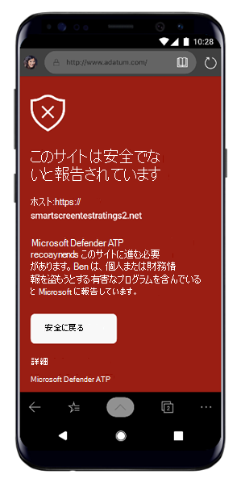
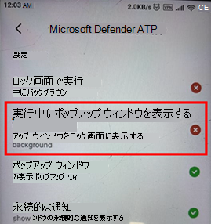

# Android 上の Microsoft Defender for Endpoint の問題のトラブルシューティング

[!INCLUDE [Microsoft 365 Defender rebranding](../../includes/microsoft-defender.md)]

**適用対象:**
- [Microsoft Defender for Endpoint](https://go.microsoft.com/fwlink/p/?linkid=2154037)
- [Microsoft 365 Defender](https://go.microsoft.com/fwlink/?linkid=2118804)

> Microsoft Defender ATP を試してみたいですか? [無料試用版にサインアップしてください。](https://signup.microsoft.com/create-account/signup?products=7f379fee-c4f9-4278-b0a1-e4c8c2fcdf7e&ru=https://aka.ms/MDEp2OpenTrial?ocid=docs-wdatp-exposedapis-abovefoldlink)

デバイスのオンボード時に、アプリのインストール後にサインインの問題が表示される場合があります。

オンボーディング中に、アプリがデバイスにインストールされた後にサインインの問題が発生する可能性があります。

この記事では、サインオンの問題に対処するためのソリューションを提供します。

## サインインに失敗しました - 予期しないエラー

**サインインに失敗しました: 予期しない***エラーが発生した場合は、後で試してください*

:::image type="content" alt-text="サインインに失敗したエラーのイメージ 予期しないエラー。" source="images/f9c3bad127d636c1f150d79814f35d4c.png":::

**メッセージ：**

予期しないエラー、後で試す

**原因:**

古いバージョンの "Microsoft Authenticator" アプリがデバイスにインストールされています。

**解決方法:**

Google Play ストアから最新バージョン[とMicrosoft Authenticator](https://play.google.com/store/apps/details?androidid=com.azure.authenticator)をインストールし、もう一度やり直してください

## サインインに失敗しました - 無効なライセンス

**サインインに失敗しました:** *ライセンスが無効です。管理者に問い合わせてください*

:::image type="content" alt-text="サインインに失敗したイメージは、管理者に問い合わせてください。" source="images/920e433f440fa1d3d298e6a2a43d4811.png":::

**メッセージ:** *無効なライセンス、管理者に問い合わせてください*

**原因:**

ライセンスが割りMicrosoft 365されていないか、組織にサブスクリプションのライセンスMicrosoft 365 Enterpriseです。

**解決方法:**

ヘルプについては、管理者に問い合わせてください。

## 安全でないサイトを報告する

フィッシング Web サイトは、お客様の個人情報または財務情報を取得する目的で信頼できる Web サイトになりすます。 フィッシング サイト [の可能性がある Web サイトを報告](https://www.microsoft.com/wdsi/filesubmission/exploitguard/networkprotection) する場合は、[ネットワーク保護に関するフィードバックを提供する] ページをご覧ください。

## 一部の OEM デバイスでフィッシング ページがブロックされない

**適用対象:** 特定の OEM のみ

- **Xiaomi**

Android 用 Defender for Endpoint によって検出されるフィッシングや有害な Web の脅威は、一部の Xiaomi デバイスではブロックされません。 次の機能は、これらのデバイスでは機能しません。

**原因:**

Xiaomi デバイスには、新しいアクセス許可モデルが含まれます。 これにより、Defender for Endpoint for Android では、バックグラウンドで実行されている間にポップアップ ウィンドウが表示されなかっています。

Xiaomi デバイスのアクセス許可: "バックグラウンドで実行中にポップアップ ウィンドウを表示する"

**解決方法:**

Xiaomi デバイスで必要なアクセス許可を有効にします。

- バックグラウンドで実行中にポップアップ ウィンドウを表示します。

## 一部の OEM デバイスでのオンボーディング中に '永続的な保護' のアクセス許可を許可できない

**適用対象:** 特定の OEM デバイスのみ。

- **Xiaomi with Android 11**

Defender App は、アプリのオンボーディングの一環としてデバイスに対するバッテリーの最適化/永続的な保護のアクセス許可を求め、許可を選択すると、アクセス許可を設定できなかったというエラーが返されます。 これは、"Permanent Protection" と呼ばれる最後のアクセス許可にのみ影響します。 

**原因:**

Xiaomi は、Android 11 のバッテリー最適化のアクセス許可を変更しました。 Defender は、バッテリーの最適化を無視するようにこの設定を構成することを許可されません。

**解決方法:**

OEM と一緒に、アプリのオンボーディング画面からこのアクセス許可を有効にするソリューションを探しています。 この問題が解決された場合は、ドキュメントを更新します。
ユーザーは、次の手順に従って、デバイス設定から同じアクセス許可を有効にできます。 

1. デバイスの **[設定]** に移動します。

2. [バッテリーの最適化] を **検索して選択します**。

   ![[バッテリーの最適化] を検索して選択します。](images/search-battery-optimisation.png)

3. [ **アプリの特別なアクセス] で**、[バッテリーの **最適化] を選択します**。

   ![[アプリの特別なアクセス] で、[バッテリーの最適化] を選択します。](images/special-app-access.png)

4. [ドロップダウン] を [すべてのアプリ] **に変更します**。

   ![[すべてのアプリ] を表示するドロップダウンを変更するには、手順 1 を実行します。](images/show-all-apps-2.png)

   ![[すべてのアプリ] を表示するドロップダウンを変更するには、手順 2 を実行します。](images/show-all-apps-1.png)

5. [Microsoft Defender Endpoint] を見つけて、[ **最適化しない] を選択します**。

   ![[Microsoft Defender Endpoint] を見つけて、[最適化しない] を選択します。](images/select-dont-optimise.png)

[Microsoft Defender Endpoint オンボーディング] 画面に戻り、[ **許可**] を選択すると、ダッシュボード画面にリダイレクトされます。

## アプリ内フィードバックの送信

ユーザーが上記のセクションでまだ解決されていない問題に直面しているか、リストされている手順を使用して解決できない場合、ユーザーは診断データと共にアプリ内フィードバックを **提供できます**。 その後、ログを調査して適切なソリューションを提供できます。 ユーザーは、次の手順に従って同じ操作を実行できます。

1.  デバイスで **MDE アプリケーション** を開き、左上隅 **にある** プロファイル アイコンをクリックします。

    :::image type="content" alt-text="[プロファイル] アイコンをクリックします。" source="images/select-profile-icon-1.jpg":::

2.  [フィードバックに関する&] を選択します。

    :::image type="content" alt-text="ヘルプとフィードバックを選択します。" source="images/selecthelpandfeedback2.png":::

3.  [Microsoft にフィードバックを送信する] を選択します。

    :::image type="content" alt-text="[フィードバックを Microsoft に送信する] を選択します。" source="images/send-feedback-to-microsoft-3.jpg":::

4.  指定されたオプションから選択します。 問題を報告するには、[問題を報告する] を選択します。

    :::image type="content" alt-text="問題を報告する。" source="images/report-issue-4.jpg":::

5.  直面している問題の詳細を入力し、[診断データの送信] をオンにしてください。 チームがソリューションまたはフォローアップで連絡を取り戻す場合は、[電子メール アドレスを含める] をオンにすることをお勧めします。

    :::image type="content" alt-text="詳細を追加し、診断データを添付します。" source="images/finalsubmit5.png":::

6.  [送信] をクリックして、フィードバックを正常に送信します。
