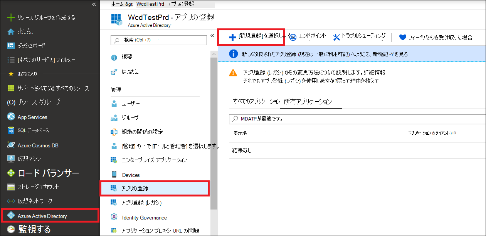
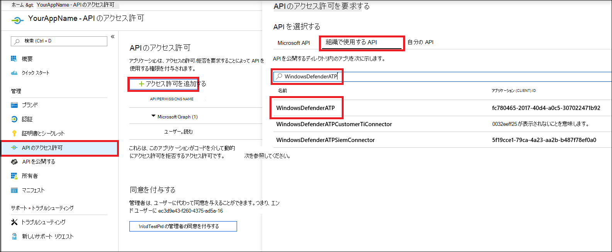
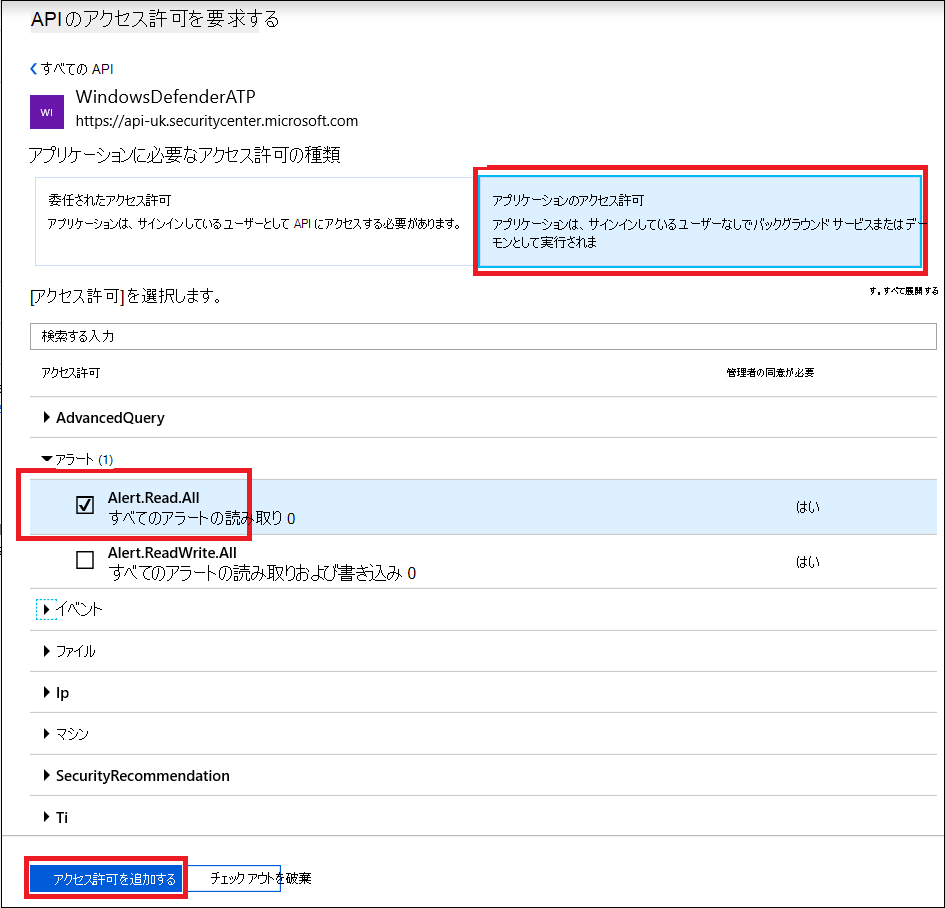
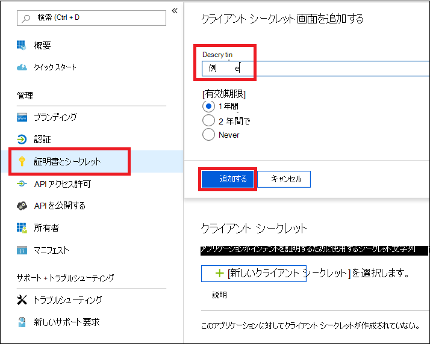
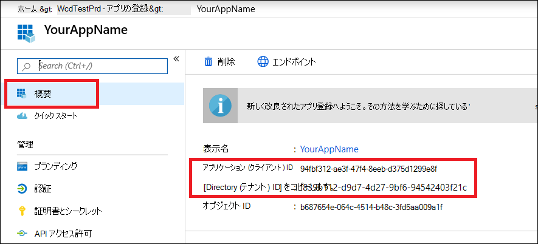
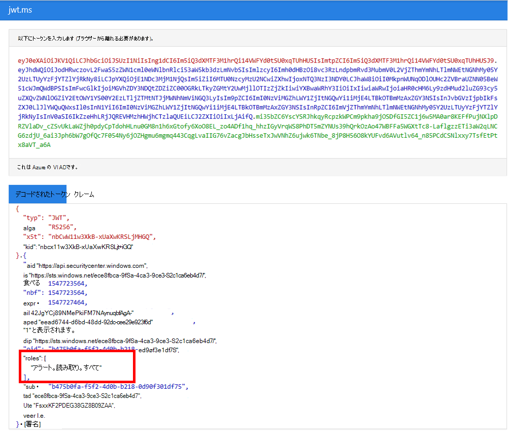

# <a name="microsoft-defender-for-endpoint-api---hello-world"></a>エンドポイント API 用 Microsoft Defender - Hello World

[!INCLUDE [Microsoft 365 Defender rebranding](../../includes/microsoft-defender.md)]


**適用対象:**
- [Microsoft Defender for Endpoint](https://go.microsoft.com/fwlink/?linkid=2154037)


- Microsoft Defender ATP を試してみたいですか? [無料試用版にサインアップしてください。](https://signup.microsoft.com/create-account/signup?products=7f379fee-c4f9-4278-b0a1-e4c8c2fcdf7e&ru=https://aka.ms/MDEp2OpenTrial?ocid=docs-wdatp-exposedapis-abovefoldlink)

[!include[Microsoft Defender for Endpoint API URIs for US Government](../../includes/microsoft-defender-api-usgov.md)]

[!include[Improve request performance](../../includes/improve-request-performance.md)]


## <a name="get-alerts-using-a-simple-powershell-script"></a>簡単な PowerShell スクリプトを使用してアラートを取得する

### <a name="how-long-it-takes-to-go-through-this-example"></a>この例ではどのくらいの時間が必要ですか?

2 つの手順で 5 分しかかからな

- アプリケーションの登録
- 使用例: 短い PowerShell スクリプトのコピー/貼り付けだけが必要

### <a name="do-i-need-a-permission-to-connect"></a>接続するアクセス許可が必要ですか?

アプリケーション登録ステージでは、ユーザー Azure Active Directory (Azure AD) テナントにグローバル管理者の役割が必要です。 

### <a name="step-1---create-an-app-in-azure-active-directory"></a>手順 1 - アプリを作成Azure Active Directory

1. グローバル管理者ユーザー [を使用](https://portal.azure.com) して Azure **にログオン** します。

2. [アプリの **登録Azure Active Directory** \> **新しい登録]** \> **に移動します**。

   

3. 登録フォームで、アプリケーションの名前を選択し、[登録] を **クリックします**。

4. アプリケーションが Defender for Endpoint にアクセスし、"すべてのアラートの読み取り" アクセス許可 **を割り当てるのを許可** します。

   - アプリケーション ページで **、[API アクセス** 許可の追加] アクセス許可 API をクリックします。組織で \>  \> WindowsDefenderATP >を使用し **、[WindowsDefenderATP] をクリックします**。 

   - **注**: WindowsDefenderATP は元のリストには表示されません。 テキスト ボックスに名前を書き込み始め、表示を確認する必要があります。

   

   - [ **アプリケーションのアクセス許可** \> **] Alert.Read.All >** [アクセス許可の追加 **] をクリックします。**

   

   **重要な注意**: 関連するアクセス許可を選択する必要があります。 'すべてのアラートの読み取り' は、一例にすら限定されます。

     例えば

     - 高度 [なクエリを実行するには、[](run-advanced-query-api.md)高度なクエリの実行] アクセス許可を選択します。
     - コンピューター [を分離するには、[](isolate-machine.md)コンピューターの分離] アクセス許可を選択します。
     - 必要なアクセス許可を決定するには、呼び出す API の **[** アクセス許可] セクションを参照してください。

5. [同意 **の付与] をクリックします。**

   - **注**: アクセス許可を追加する度に、[新しい **アクセス許可を** 有効にするための同意の付与] をクリックする必要があります。

   

6. アプリケーションにシークレットを追加します。

   - [ **証明書とシークレット&クリックし、** シークレットに説明を追加し、[追加] を **クリックします**。

    **重要**: [追加] をクリックした後 **、生成されたシークレット値をコピーします**。 退出後に取得できない!

    

7. アプリケーション ID とテナント ID を書き出します。

   - アプリケーション ページで、[概要] に移動 **し** 、次をコピーします。

   

完了! アプリケーションの登録に成功しました!

### <a name="step-2---get-a-token-using-the-app-and-use-this-token-to-access-the-api"></a>手順 2 - アプリを使用してトークンを取得し、このトークンを使用して API にアクセスします。

- 以下のスクリプトを PowerShell ISE またはテキスト エディターにコピーし、"Get-Token.ps1"**として保存** します。
- このスクリプトを実行すると、トークンが生成され、作業フォルダーに ""Latest-token.txt"**という名前で保存** されます。

   ```powershell
   # That code gets the App Context Token and save it to a file named "Latest-token.txt" under the current directory
   # Paste below your Tenant ID, App ID and App Secret (App key).

   $tenantId = '' ### Paste your tenant ID here
   $appId = '' ### Paste your Application ID here
   $appSecret = '' ### Paste your Application secret here

   $resourceAppIdUri = 'https://api.securitycenter.microsoft.com'
   $oAuthUri = "https://login.microsoftonline.com/$TenantId/oauth2/token"
   $authBody = [Ordered] @{
       resource = "$resourceAppIdUri"
       client_id = "$appId"
       client_secret = "$appSecret"
       grant_type = 'client_credentials'
   }
   $authResponse = Invoke-RestMethod -Method Post -Uri $oAuthUri -Body $authBody -ErrorAction Stop
   $token = $authResponse.access_token
   Out-File -FilePath "./Latest-token.txt" -InputObject $token
   return $token
   ```

- サニティ チェック:
  - スクリプトを実行します。
  - ブラウザーで次の場所に移動します。 <https://jwt.ms/>
  - トークン (ファイルのコンテンツ) をLatest-token.txtします。
  - 上部ボックスに貼り付けます。
  - [役割] セクションを探します。 Alert.Read.All ロールを検索します。

  

### <a name="lets-get-the-alerts"></a>アラートを取得できます。

- 以下のスクリプトでは、API **Get-Token.ps1** を使用して、過去 48 時間のアラートを取得します。
- 前のスクリプトを保存したのと同じフォルダーにこのスクリプト **を保存** Get-Token.ps1。
- スクリプトは、スクリプトと同じフォルダー内のデータを含む 2 つのファイル (json と csv) を作成します。

  ```powershell
  # Returns Alerts created in the past 48 hours.

  $token = ./Get-Token.ps1       #run the script Get-Token.ps1  - make sure you are running this script from the same folder of Get-Token.ps1

  # Get Alert from the last 48 hours. Make sure you have alerts in that time frame.
  $dateTime = (Get-Date).ToUniversalTime().AddHours(-48).ToString("o")

  # The URL contains the type of query and the time filter we create above
  # Read more about other query options and filters at   Https://TBD- add the documentation link
  $url = "https://api.securitycenter.microsoft.com/api/alerts?`$filter=alertCreationTime ge $dateTime"

  # Set the WebRequest headers
  $headers = @{
      'Content-Type' = 'application/json'
      Accept = 'application/json'
      Authorization = "Bearer $token"
  }

  # Send the webrequest and get the results.
  $response = Invoke-WebRequest -Method Get -Uri $url -Headers $headers -ErrorAction Stop

  # Extract the alerts from the results.
  $alerts =  ($response | ConvertFrom-Json).value | ConvertTo-Json

  # Get string with the execution time. We concatenate that string to the output file to avoid overwrite the file
  $dateTimeForFileName = Get-Date -Format o | foreach {$_ -replace ":", "."}

  # Save the result as json and as csv
  $outputJsonPath = "./Latest Alerts $dateTimeForFileName.json"
  $outputCsvPath = "./Latest Alerts $dateTimeForFileName.csv"

  Out-File -FilePath $outputJsonPath -InputObject $alerts
  ($alerts | ConvertFrom-Json) | Export-CSV $outputCsvPath -NoTypeInformation
  ```

完了です! 成功したのは次の場合です。

- 作成および登録およびアプリケーション
- そのアプリケーションに通知を読み取るアクセス許可が付与されている
- API の接続
- PowerShell スクリプトを使用して、過去 48 時間に作成されたアラートを返す

## <a name="related-topic"></a>関連トピック

- [エンドポイント API 用 Microsoft Defender](exposed-apis-list.md)
- [アプリケーション コンテキストを使用して Microsoft Defender for Endpoint にアクセスする](exposed-apis-create-app-webapp.md)
- [ユーザー コンテキストを使用して Microsoft Defender for Endpoint にアクセスする](exposed-apis-create-app-nativeapp.md)
