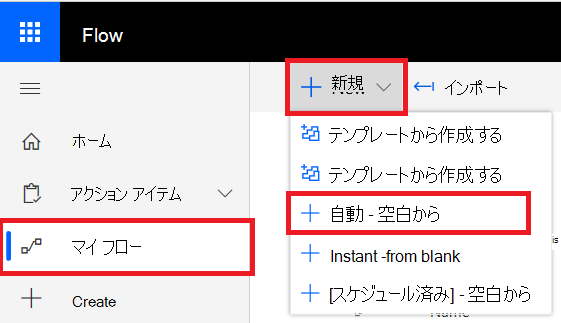

# Microsoft Power Automate (以前はMicrosoft Flow)、Azure Functions

[!INCLUDE [Microsoft 365 Defender rebranding](../../includes/microsoft-defender.md)]

**適用対象:**
- [Microsoft Defender for Endpoint](https://go.microsoft.com/fwlink/p/?linkid=2154037)
- [Microsoft 365 Defender](https://go.microsoft.com/fwlink/?linkid=2118804)

- Microsoft Defender ATP を試してみたいですか? [無料試用版にサインアップしてください。](https://www.microsoft.com/microsoft-365/windows/microsoft-defender-atp?ocid=docs-wdatp-exposedapis-abovefoldlink)

セキュリティ手順の自動化は、最新のセキュリティ 運用センターの標準要件です。 専門的なサイバー防御者がいないので、SOC は最も効率的な方法で作業し、自動化が必要です。 Microsoft Power Automateは、このために正確に構築されたさまざまなコネクタをサポートしています。 数分以内にエンドツーエンドのプロシージャオートメーションを構築できます。

Microsoft Defender API には、多くの機能Flow公式のコネクタがあります。

> [!NOTE]
> プレミアム コネクタライセンスの前提条件の詳細については、「Premium [Connectors のライセンス」を参照してください](/power-automate/triggers-introduction#licensing-for-premium-connectors)。

## 使用例

次の例では、テナントで新Flowアラートが発生する場合にトリガーされる新しいアラートを作成する方法を示します。

1. Microsoft Power Automate[にログインします](https://flow.microsoft.com)。

2. [マイ フロー **] [**  >  **新しい**  >  **自動入力から] 空白に移動します**。

    

3. ユーザーの名前を選択しFlow"Microsoft Defender ATP Triggers" をトリガーとして検索し、新しいアラート トリガーを選択します。

    

これで、新Flow発生するごとにトリガーされるメッセージが表示されます。

ここで行う必要があるのは、次の手順を選択する必要があります。
たとえば、アラートの重大度が高い場合にデバイスを分離し、そのデバイスに関する電子メールを送信できます。
アラート トリガーは、アラート ID とコンピューター ID のみを提供します。 コネクタを使用して、これらのエンティティを展開できます。

### コネクタを使用して Alert エンティティを取得する

1. 新しい **手順で [Microsoft Defender ATP]** を選択します。

2. [アラート **] - [単一のアラート API を取得する] を選択します**。

3. 最後の **手順の [アラート ID]** を [入力] に **設定します**。

    

### アラートの重大度が [高] の場合はデバイスを分離する

1. 新 **しい手順として** 条件を追加します。

2. アラートの重大度が High に **等しいか確認** します。

   [はい] の場合は **、[コンピューター ID]** とコメントを含む Microsoft Defender ATP - [コンピューターの分離] アクションを追加します。

    

3. アラートと分離に関する電子メールを送信する新しい手順を追加します。 メール コネクタや Gmail など、非常に使いやすいOutlookがあります。

4. フローを保存します。

また、高度な検索 **クエリを** 実行するスケジュールされたフローを作成できます。

## 関連トピック
- [エンドポイント API 用 Microsoft Defender](apis-intro.md)
