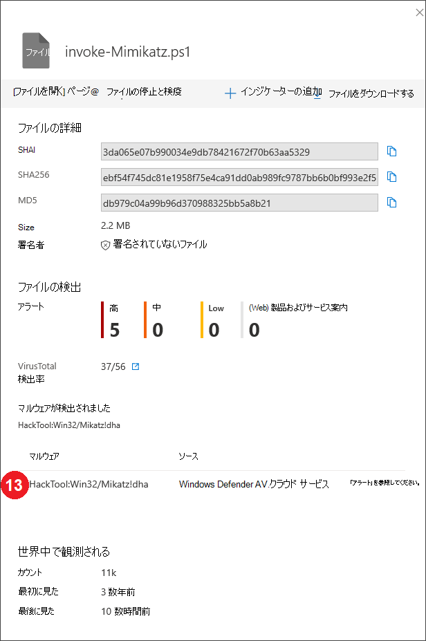
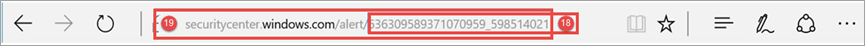

# Microsoft Defender for Endpoint detections API フィールドMicrosoft Defender for Endpoint detections API fields

[!INCLUDE [Microsoft 365 Defender rebranding](../../includes/microsoft-defender.md)]

**適用対象:****Applies to:**
- [Microsoft Defender for EndpointMicrosoft Defender for Endpoint](https://go.microsoft.com/fwlink/p/?linkid=2154037)
- [Microsoft 365 DefenderMicrosoft 365 Defender](https://go.microsoft.com/fwlink/?linkid=2118804)

>Defender for Endpoint を体験してみませんか?Want to experience Defender for Endpoint? [無料試用版にサインアップしてください。Sign up for a free trial.](https://www.microsoft.com/microsoft-365/windows/microsoft-defender-atp?ocid=docs-wdatp-apiportalmapping-abovefoldlink)

検出 API の一部として公開されるデータ フィールドと、そのデータ フィールドが検出 API にマップMicrosoft 365 Defender。Understand what data fields are exposed as part of the detections API and how they map to Microsoft 365 Defender.

>[!Note]
>- [Defender for Endpoint Alert](alerts.md) は、1 つ以上の検出から構成されます。[Defender for Endpoint Alert](alerts.md) is composed from one or more detections.
>- **Microsoft Defender ATP 検出は** 、デバイスで発生した疑わしいイベントとその関連するアラートの詳細から **構成** されます。**Microsoft Defender ATP Detection** is composed from the suspicious event occurred on the Device and its related **Alert** details.
>- Microsoft Defender for Endpoint Alert API は、アラートの使用に関する最新の API であり、各アラートに関連する証拠の詳細な一覧を含む。The Microsoft Defender for Endpoint Alert API is the latest API for alert consumption and contain a detailed list of related evidence for each alert. 詳細については、「Alert メソッドと[プロパティ」および「List alerts」](alerts.md)[を参照してください](get-alerts.md)。For more information, see [Alert methods and properties](alerts.md) and [List alerts](get-alerts.md).

## 検出 API フィールドとポータル マッピングDetections API fields and portal mapping
次の表に、検出 API ペイロードで公開されている使用可能なフィールドの一覧を示します。The following table lists the available fields exposed in the detections API payload. 入力された値の例と、ポータルでのデータの反映方法に関する参照を示します。It shows examples for the populated values and a reference on how data is reflected on the portal.

[ArcSight] フィールド列には、Defender for Endpoint フィールドと ArcSight の組み込みフィールドとの間の既定のマッピングが含まれます。The ArcSight field column contains the default mapping between the Defender for Endpoint fields and the built-in fields in ArcSight. SIEM 統合機能を有効にし、組織のニーズに合わせて変更できる場合は、ポータルからマッピング ファイルをダウンロードできます。You can download the mapping file from the portal when you enable the SIEM integration feature and you can modify it to match the  needs of your organization. 詳細については、「Defender [for Endpoint で SIEM 統合を有効にする」を参照してください](enable-siem-integration.md)。For more information, see [Enable SIEM integration in Defender for Endpoint](enable-siem-integration.md).

フィールド番号は、以下の画像の数値と一致します。Field numbers match the numbers in the images below.

> [!div class="mx-tableFixed"]
> 
> | ポータル ラベルPortal   label   | SIEM フィールド名SIEM field name           | ArcSight フィールドArcSight field      | 値の例Example value                                                                      | 説明Description                                                                                                                                                                    |
> |------------------|---------------------------|---------------------|------------------------------------------------------------------------------------|--------------------------------------------------------------------------------------------------------------------------------------------------------------------------------|
> | 11                | AlertTitleAlertTitle                | namename                | Microsoft Defender AV が 「ミカッツ」 の重大度の高いマルウェアを検出しましたMicrosoft Defender AV detected 'Mikatz' high-severity malware | すべての検出で使用可能な値。Value available for every Detection.                                                                                                                                               |
> | 22                | 重要度Severity                  | deviceSeveritydeviceSeverity      | 高High                                                                             | すべての検出で使用可能な値。Value available for every Detection.                                                                                                                                               |
> | 33                | CategoryCategory                  | deviceEventCategorydeviceEventCategory | マルウェアMalware                                                               | すべての検出で使用可能な値。Value available for every Detection.                                                                                                                                               |
> | 4 4                | 検出ソースDetection source                    | sourceServiceNamesourceServiceName   | ウイルス対策Antivirus                                                                 | Microsoft Defender ウイルス対策または Defender for Endpoint。Microsoft Defender Antivirus or  Defender for Endpoint. すべての検出で使用可能な値。Value available for every Detection.                                                                                         |
> | 5 5                | MachineNameMachineName               | sourceHostNamesourceHostName      | desktop-4a5ngd6desktop-4a5ngd6                                                                           | すべての検出で使用可能な値。Value available for every Detection.                                                                                                                                               |
> | 6 6                | FileNameFileName                  | fileNamefileName            | Robocopy.exeRobocopy.exe                                                                       | ファイルまたはプロセスに関連付けられた検出に使用できます。Available for detections associated   with a file or process.                                                                                                                      |
> | 7 7                | FilePathFilePath                  | filePathfilePath            | C:\Windows\System32\Robocopy.exeC:\Windows\System32\Robocopy.exe                                                   | ファイルまたはプロセスに関連付けられた検出に使用できます。Available for detections associated   with a file or process.                                                                                                                     |
> | 8 8                | UserDomainUserDomain                | sourceNtDomainsourceNtDomain      | CONTOSOCONTOSO                                                                            | Defender for Endpoint の動作ベースの検出に使用できる、アクティビティを実行しているユーザー コンテキストのドメイン。The domain of the user context   running the activity, available for Defender for Endpoint behavioral based detections.                                                           |
> | 9 9                | UserNameUserName                  | sourceUserNamesourceUserName      | liz.Beanliz.bean                                                                           | Defender for Endpoint の動作ベースの検出に使用できる、アクティビティを実行しているユーザー コンテキスト。The user context running the   activity, available for Defender for Endpoint behavioral based detections.                                                                           |
> | 10 10               | Sha1Sha1                      | fileHashfileHash            | 3da065e07b990034e9db7842167f70b63aa53293da065e07b990034e9db7842167f70b63aa5329                                           | ファイルまたはプロセスに関連付けられた検出に使用できます。Available for detections associated   with a file or process.                                                                                                                      |
> | 11 11               | Sha256Sha256                    | deviceCustomString6deviceCustomString6 | ebf54f745dc81e1958f75e4ca91dd0ab989fc9787bb6b0bf993e2f5ebf54f745dc81e1958f75e4ca91dd0ab989fc9787bb6b0bf993e2f5                   | Microsoft Defender AV 検出に使用できます。Available for Microsoft Defender AV detections.                                                                                                                                    |
> | 12 12               | Md5Md5                       | deviceCustomString5deviceCustomString5 | db979c04a99b96d370988325bb5a8b21db979c04a99b96d370988325bb5a8b21                                                   | Microsoft Defender AV 検出に使用できます。Available for Microsoft Defender AV detections.                                                                                                                                    |
> | 13 13               | ThreatNameThreatName                | deviceCustomString1deviceCustomString1  | HackTool:Win32/ミカッツ!dhaHackTool:Win32/Mikatz!dha                                                         | Microsoft Defender AV 検出に使用できます。Available for Microsoft Defender AV detections.                                                                                                                                    |
> | 14 14               | IpAddressIpAddress                 | sourceAddresssourceAddress       | 218.90.204.141218.90.204.141                                                                     | ネットワーク イベントに関連付けられた検出に使用できます。Available for detections associated   to network events. たとえば、「悪意のあるネットワーク宛先への通信」などです。For example, 'Communication to a malicious network   destination'.                                                        |
> | 1515               | UrlUrl                       | requestUrlrequestUrl          | down.esales360.cndown.esales360.cn                                                                  | ネットワーク イベントに関連付けられた検出に使用できます。Available for detections associated to   network events. たとえば、「悪意のあるネットワーク宛先への通信」などです。For example, 'Communication to a malicious network   destination'.                                                         |
> | 16 16               | RemediationIsSuccessRemediationIsSuccess      | deviceCustomNumber2deviceCustomNumber2 | TRUETRUE                                                                               | Microsoft Defender AV 検出に使用できます。Available for Microsoft Defender AV detections. ArcSight の値は、TRUE の場合は 1、FALSE の場合は 0 です。ArcSight value is 1 when TRUE and 0 when FALSE.                                                                                    |
> | 17 17               | WasExecutingWhileDetectedWasExecutingWhileDetected | deviceCustomNumber1deviceCustomNumber1 | FALSEFALSE                                                                              | Microsoft Defender AV 検出に使用できます。Available for Microsoft Defender AV detections. ArcSight の値は、TRUE の場合は 1、FALSE の場合は 0 です。ArcSight value is 1 when TRUE and 0 when FALSE.                                                                                    |
> | 18 18               | AlertIdAlertId                   | 外部IDexternalId          | 636210704265059241_673569822636210704265059241_673569822                                                       | すべての検出で使用可能な値。Value available for every Detection.                                                                                                                                               |
> | 1919               | LinkToWDATPLinkToWDATP               | flexString1flexString1         | `https://securitycenter.windows.com/alert/636210704265059241_673569822`            | すべての検出で使用可能な値。Value available for every Detection.                                                                                                                                               |
> | 2020               | AlertTimeAlertTime                 | deviceReceiptTimedeviceReceiptTime   | 2017-05-07T01:56:59.3191352Z2017-05-07T01:56:59.3191352Z                                                       | イベントが発生した時刻。The time the event occurred. すべての検出で使用可能な値。Value available for every Detection.                                                                                       |
> |  2121               | MachineDomainMachineDomain             | sourceDnsDomainsourceDnsDomain     | contoso.comcontoso.com                                                                        | AAD 参加デバイスに関連しないドメイン名。Domain name not relevant for AAD   joined devices. すべての検出で使用可能な値。Value available for every Detection.                                                                                           |
> | 2222               | ActorActor                     | deviceCustomString4deviceCustomString4 | ボロンBORON                                                                                   | 既知のアクター グループに関連するアラートで使用できます。Available for alerts related to a   known actor group.                                                                                                                         |
> | 21+521+5             | ComputerDnsNameComputerDnsName           | マッピングなしNo mapping          | liz-bean.contoso.comliz-bean.contoso.com                                                               | デバイスの完全修飾ドメイン名。The device fully qualified   domain name. すべての検出で使用可能な値。Value available for every Detection.                                                                                                    |
> |                  | LogOnUsersLogOnUsers                | sourceUserIdsourceUserId        | contoso\liz-Bean;  contoso\jay-hardeecontoso\liz-bean;   contoso\jay-hardee                                             | イベント時の対話型ログオン ユーザーのドメインとユーザー。The domain and user of the   interactive logon user/s at the time of the event. 注: バージョン 1607 Windows 10デバイスの場合、ドメイン情報は使用できません。Note: For devices on   Windows 10 version 1607, the domain information will not be available. |
> |                  | InternalIPv4ListInternalIPv4List          | マッピングなしNo mapping          | 192.168.1.7, 10.1.14.1192.168.1.7, 10.1.14.1                                                             | アクティブ なネットワーク インターフェイスの IPV4 内部 IPV4 の一覧。List of IPV4 internal IPs for active network interfaces.                                                                                                                                                                               |
> |                  | InternalIPv6ListInternalIPv6List          | マッピングなしNo mapping          | fd30:0000:0000:0001:ff4e:003e:0009:000e, FE80:CD00:0000:0CDE:1257:0000:211E:729Cfd30:0000:0000:0001:ff4e:003e:0009:000e,   FE80:CD00:0000:0CDE:1257:0000:211E:729C | アクティブ なネットワーク インターフェイスの IPV6 内部 IPV6 の一覧。List of IPV6 internal IPs for active network interfaces.                                                                                                                                                                               |
| | LinkToMTPLinkToMTP | マッピングなしNo mapping | `https://security.microsoft.com/alert/da637370718981685665_16349121` | すべての検出で使用可能な値。Value available for every Detection.
| | IncidentLinkToMTPIncidentLinkToMTP | マッピングなしNo mapping | `"https://security.microsoft.com/incidents/byalert?alertId=da637370718981685665_16349121&source=SIEM` | すべての検出で使用可能な値。Value available for every Detection.
| | IncidentLinkToWDATPIncidentLinkToWDATP | マッピングなしNo mapping | `https://securitycenter.windows.com/incidents/byalert?alertId=da637370718981685665_16349121&source=SIEM` | すべての検出で使用可能な値。Value available for every Detection.
> | 内部フィールドInternal   field | LastProcessedTimeUtcLastProcessedTimeUtc      | マッピングなしNo mapping          | 2017-05-07T01:56:58.9936648Z2017-05-07T01:56:58.9936648Z                                                       | イベントがバックエンドに到着した時刻。Time when event arrived at the   backend. このフィールドは、検出が取得される時間範囲の要求パラメーターを設定するときに使用できます。This field can be used when setting the request parameter for the range of time that detections are retrieved.                         |
> |                  | スキーマの一部ではないNot part of the schema    | deviceVendordeviceVendor        |                                                                                    | ArcSight マッピングの静的値 - 'Microsoft'。Static value in the ArcSight   mapping - 'Microsoft'.                                                                                                                          |
> |                  | スキーマの一部ではないNot part of the schema    | deviceProductdeviceProduct       |                                                                                    | ArcSight マッピングの静的値 - 'Microsoft Defender ATP'。Static value in the ArcSight   mapping - 'Microsoft Defender ATP'.                                                                                                               |
> |                  | スキーマの一部ではないNot part of the schema    | deviceVersiondeviceVersion       |                                                                                    | ArcSight マッピングの静的な値 - '2.0' は、マッピング バージョンの識別に使用されます。Static value in the ArcSight   mapping - '2.0', used to identify the mapping versions.                                                                                         

## 関連項目Related topics
- [エンドポイント向け Microsoft Defender で SIEM 統合を有効にするEnable SIEM integration in Microsoft Defender for Endpoint](enable-siem-integration.md)
- [エンドポイント検出用の Microsoft Defender をプルする ArcSight の構成Configure ArcSight to pull Microsoft Defender for Endpoint detections](configure-arcsight.md)
- [REST API を使用したエンドポイント検出用の Microsoft Defender のプルPull Microsoft Defender for Endpoint detections using REST API](pull-alerts-using-rest-api.md)
- [SIEM ツール統合に関する問題のトラブルシューティングTroubleshoot SIEM tool integration issues](troubleshoot-siem.md)
