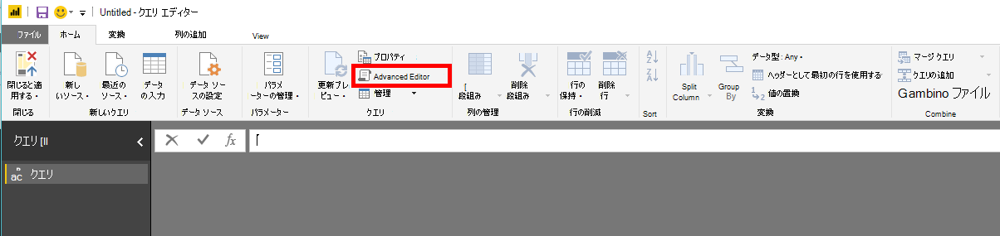
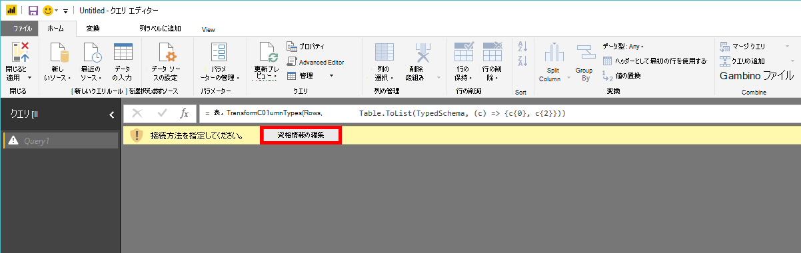
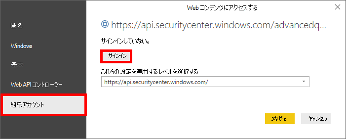
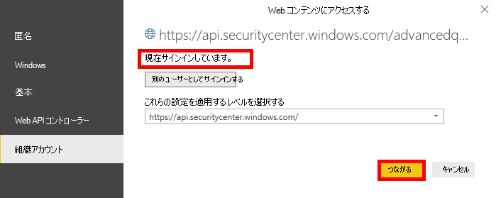

# <a name="create-custom-reports-using-power-bi"></a>Power BI を使用してカスタム レポートを作成する

[!INCLUDE [Microsoft 365 Defender rebranding](../../includes/microsoft-defender.md)]

**適用対象:**
- [Microsoft Defender for Endpoint](https://go.microsoft.com/fwlink/p/?linkid=2154037)
- [Microsoft 365 Defender](https://go.microsoft.com/fwlink/?linkid=2118804)


- Microsoft Defender ATP を試してみたいですか? [無料試用版にサインアップしてください。](https://www.microsoft.com/microsoft-365/windows/microsoft-defender-atp?ocid=docs-wdatp-exposedapis-abovefoldlink) 

[!include[Microsoft Defender for Endpoint API URIs for US Government](../../includes/microsoft-defender-api-usgov.md)]

[!include[Improve request performance](../../includes/improve-request-performance.md)]

このセクションでは、Defender for Endpoint API の上に Power BI レポートを作成する方法について説明します。

最初の例は、Power BI を Advanced Hunting API に接続する方法を示し、2 番目の例では、マシン アクションやアラートなどの OData API への接続を示しています。

## <a name="connect-power-bi-to-advanced-hunting-api"></a>Power BI を高度なハンティング API に接続する

- Microsoft Power BI を開く

- [データ **の空のクエリ**  >  **の取得] をクリックします。**

    

- [高度 **なエディター] をクリックします。**

    

- 以下をコピーし、エディターに貼り付けます。

```
    let 
        AdvancedHuntingQuery = "DeviceEvents | where ActionType contains 'Anti' | limit 20",

        HuntingUrl = "https://api.securitycenter.microsoft.com/api/advancedqueries",

        Response = Json.Document(Web.Contents(HuntingUrl, [Query=[key=AdvancedHuntingQuery]])),

        TypeMap = #table(
            { "Type", "PowerBiType" },
            {
                { "Double",   Double.Type },
                { "Int64",    Int64.Type },
                { "Int32",    Int32.Type },
                { "Int16",    Int16.Type },
                { "UInt64",   Number.Type },
                { "UInt32",   Number.Type },
                { "UInt16",   Number.Type },
                { "Byte",     Byte.Type },
                { "Single",   Single.Type },
                { "Decimal",  Decimal.Type },
                { "TimeSpan", Duration.Type },
                { "DateTime", DateTimeZone.Type },
                { "String",   Text.Type },
                { "Boolean",  Logical.Type },
                { "SByte",    Logical.Type },
                { "Guid",     Text.Type }
            }),

        Schema = Table.FromRecords(Response[Schema]),
        TypedSchema = Table.Join(Table.SelectColumns(Schema, {"Name", "Type"}), {"Type"}, TypeMap , {"Type"}),
        Results = Response[Results],
        Rows = Table.FromRecords(Results, Schema[Name]),
        Table = Table.TransformColumnTypes(Rows, Table.ToList(TypedSchema, (c) => {c{0}, c{2}}))

    in Table

```

- [完了] を **クリックします。**

- [資格情報 **の編集] をクリックします。**

    

- [**組織アカウント]**  >  **[サインイン] の選択**

    

- 資格情報を入力し、サインインを待つ

- [接続 **] をクリックします。**

    

- これでクエリの結果がテーブルとして表示され、その上にビジュアライゼーションのビルドを開始できます。

- このテーブルを複製し、名前を変更し、高度な検索クエリを内部で編集して、必要なデータを取得できます。

## <a name="connect-power-bi-to-odata-apis"></a>Power BI を OData API に接続する

- 上記の例との唯一の違いは、エディター内のクエリです。 

- 以下をコピーしてエディターに貼り付け、組織から **すべての Machine Actions** をプルします。

```
    let

        Query = "MachineActions",

        Source = OData.Feed("https://api.securitycenter.microsoft.com/api/" & Query, null, [Implementation="2.0", MoreColumns=true])
    in
        Source

```

- アラートとコンピューターでも同 **じ操作** を **実行できます**。

- クエリ フィルターに OData クエリを使用することもできます [。「Using OData Queries」を参照してください。](exposed-apis-odata-samples.md)


## <a name="power-bi-dashboard-samples-in-github"></a>GitHub の Power BI ダッシュボードのサンプル
詳細については、「Power BI レポート テンプレート [」を参照してください](https://github.com/microsoft/MicrosoftDefenderATP-PowerBI)。

## <a name="sample-reports"></a>サンプル レポート
Microsoft Defender for Endpoint Power BI レポートサンプルを表示します。 詳細については、「Browse [code samples 」を参照してください](https://docs.microsoft.com/samples/browse/?products=mdatp)。


## <a name="related-topic"></a>関連トピック
- [エンドポイント API の Defender](apis-intro.md)
- [高度な追及 API](run-advanced-query-api.md)
- [OData クエリの使用](exposed-apis-odata-samples.md)
