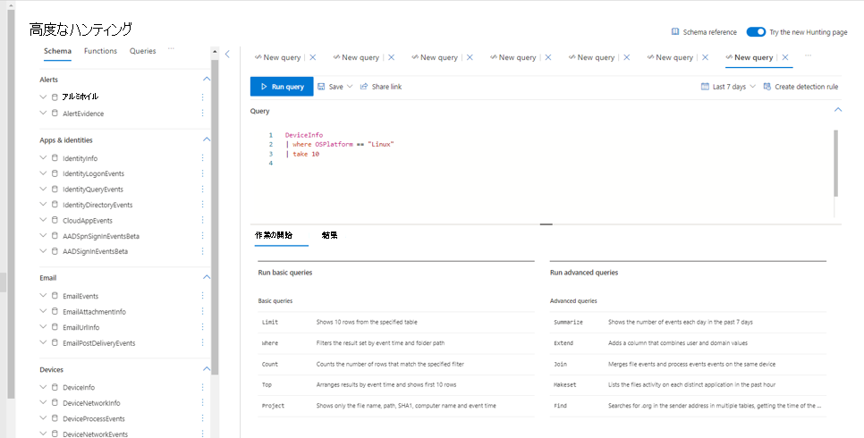
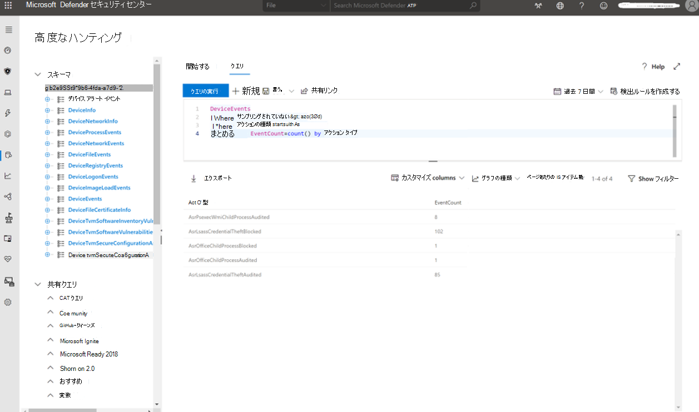
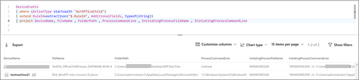

# 手順 4: ASR ルールを運用化する

攻撃表面の縮小 (ASR) ルールを完全に展開した後は、ASR 関連のアクティビティを監視して対応するプロセスが整っている必要があります。

## 誤検知の管理

任意の脅威保護ソリューションで誤検知/負が発生する可能性があります。 誤検知とは、エンティティ (ファイルやプロセスなど) が検出され、悪意のあるエンティティとして識別される場合ですが、エンティティは実際には脅威ではありません。 対照的に、偽陰性とは、脅威として検出されたのではなく悪意のあるエンティティです。 誤検知と誤検知の詳細については、「 [Address false positives/negatives in Microsoft Defender for Endpoint」を参照してください。](defender-endpoint-false-positives-negatives.md)

## レポートの管理

レポートの一貫性のある定期的なレビューは、ASR ルールの展開を維持し、新たに出現する脅威に近付く重要な側面です。 組織では、ASR ルールで報告されたイベントを最新の状態に保つ、ケイデンスに関する ASR ルール イベントのスケジュールされたレビューを行う必要があります。 組織の規模に応じて、レビューは毎日、時間別、または継続的な監視である場合があります。

## 検索

この機能の最も強力な機能[の 1 つはMicrosoft 365 Defender](https://security.microsoft.com)高度な狩猟です。 高度な狩猟に精通していない場合は、「高度な狩猟を使用して脅威を積極的に探す」 [を参照してください](/windows/security/threat-protection/microsoft-defender-atp/advanced-hunting-overview)。

> [!div class="mx-imgBorder"]
> 

高度な検索はクエリ ベース (Kusto Query Language) の脅威検索ツールで、Microsoft Defender ATP Endpoint Detection and Response (EDR) がすべてのコンピューターから収集するキャプチャされた (生の) データを最大 30 日間探索できます。 高度な検索を通じて、イベントを積極的に検査して、興味深いインジケーターやエンティティを見つけ出します。 データへの柔軟なアクセスにより、既知の脅威と潜在的な脅威の両方に対して、無制限な捜索が容易になります。

高度な検索を通じて、ASR ルール情報を抽出し、レポートを作成し、特定の ASR ルール監査またはブロック イベントのコンテキストに関する詳細な情報を取得できます。

 ASR ルール イベントは、ポータルの詳細な検索セクションの DeviceEvents テーブルからMicrosoft 365 Defenderできます。 たとえば、次のような単純なクエリは、過去 30 日間、ASR ルールをデータ ソースとして持つすべてのイベントをレポートし、アクションタイプカウントで集計します。この場合は ASR ルールの実際のコード名になります。

進む狩猟ポータルに表示される ASR イベントは、1 時間ごとに見られる一意のプロセスに調整されます。 ASR イベントの時刻は、その 1 時間以内に初めてイベントが表示されます。

> [!div class="mx-imgBorder"]
> 

> [!div class="mx-imgBorder"]
> 

上記は、187 イベントが AsrLsassCredentialTheft に登録されたと示しています。

- 102 for Blocked
- 85 for Audited
- AsrOfficeChildProcess の 2 つのイベント (1 は監査済み、1 はブロック)
- AsrPsexecWmiChildProcessAudited の 8 つのイベント

AsrOfficeChildProcess ルールに焦点を当て、関連する実際のファイルとプロセスの詳細を取得する場合は、ActionType のフィルターを変更し、集計行を必要なフィールドの投影に置き換えます (この場合は DeviceName、FileName、FolderPath など)。

> [!div class="mx-imgBorder"]
> 

> [!div class="mx-imgBorder"]
> 

高度な検索の真の利点は、好きなクエリを形成できるという利点です。 クエリを整形することで、個々のコンピューターで何かを特定するか、環境全体から分析情報を抽出するかに関係なく、何が起こっていたかの正確なストーリーを確認できます。

ハンティング オプションの詳細については、「 [Demystifying attack surface reduction rules - Part 3」を参照してください](https://techcommunity.microsoft.com/t5/microsoft-defender-for-endpoint/demystifying-attack-surface-reduction-rules-part-3/ba-p/1360968)。

## この展開コレクションのトピック

[ASR ルールの展開の前提条件](attack-surface-reduction-rules-deployment.md)

[手順 1: ASR ルールの展開を計画する](attack-surface-reduction-rules-deployment-plan.md)

[手順 2: ASR ルールをテストする](attack-surface-reduction-rules-deployment-test.md)

[手順 3: ASR ルールを実装する](attack-surface-reduction-rules-deployment-implement.md)
