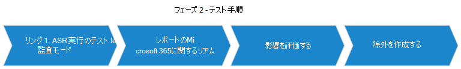
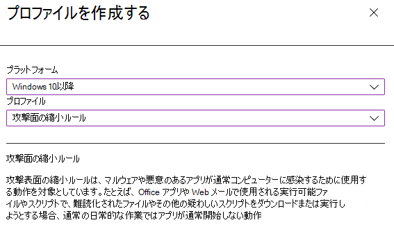
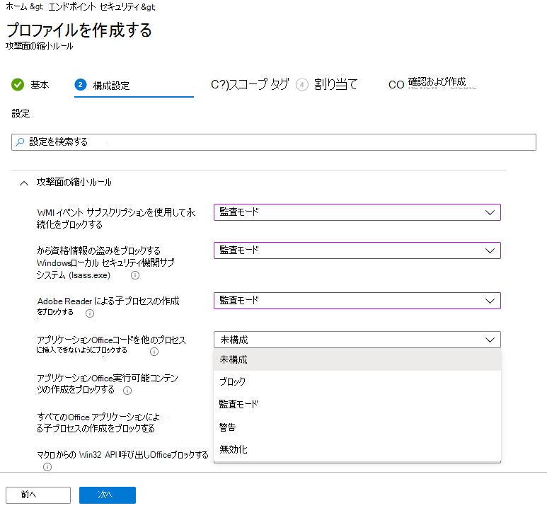
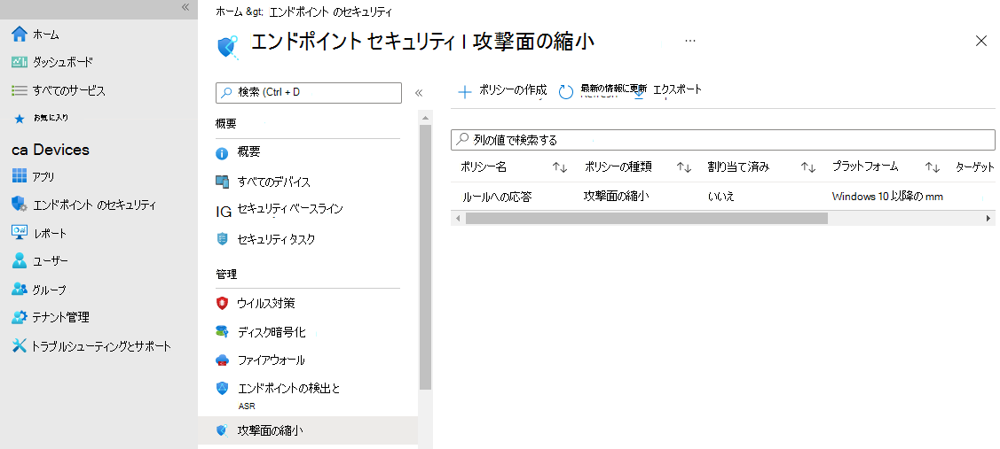
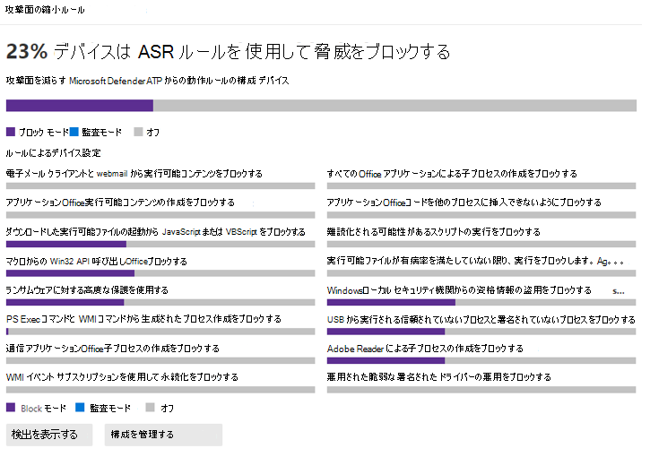
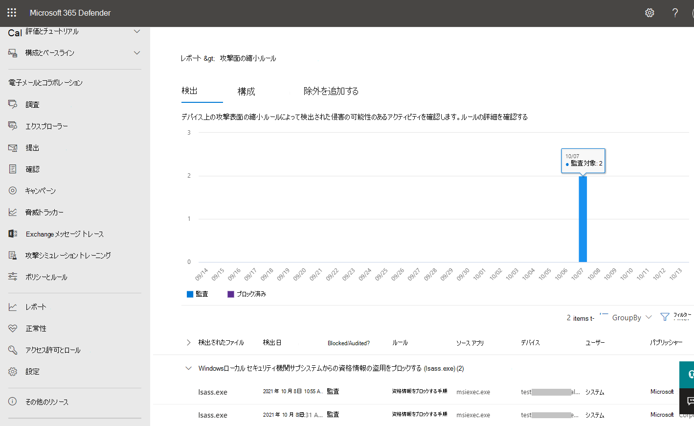
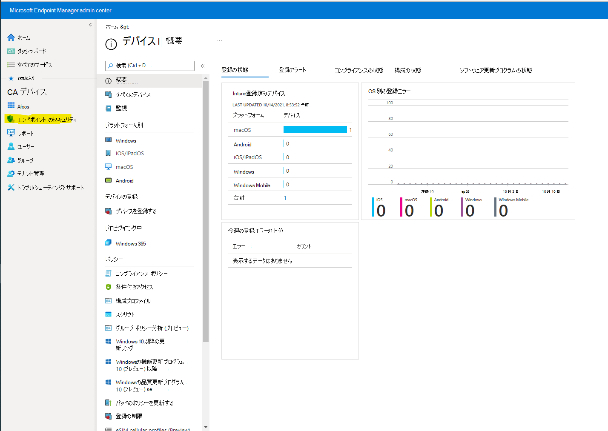
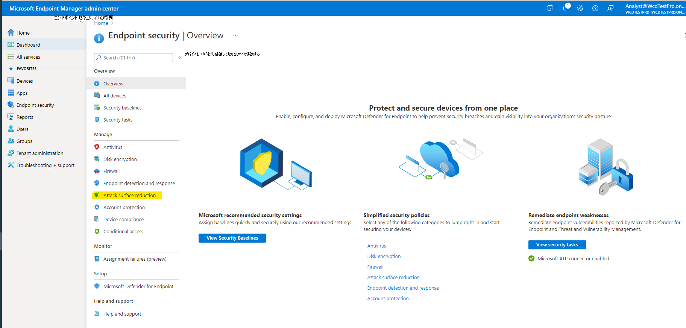

# 攻撃表面の縮小ルールの展開フェーズ 2: test

リング 1 で ASR ルールの展開を開始します。

> [!div class="mx-imgBorder"]
> 

## 手順 1: 監査を使用して ASR ルールをテストする

ルールが [監査] に設定されている ASR ルールをオンにして、リング 1 のチャンピオン ユーザーまたはデバイスからテストフェーズを開始します。 通常、テスト フェーズ中にトリガーされるルールを特定できるよう、すべてのルール (監査) を有効にしてください。 [監査] に設定されているルールは、通常、ルールが適用されるエンティティまたはエンティティの機能には影響を与えず、評価のためにログに記録されたイベントを生成します。エンド ユーザーには影響しません。

### MEM を使用して ASR ルールを構成する

カスタム ASR Microsoft エンドポイント マネージャー (MEM) エンドポイント セキュリティを使用して構成できます。

1. 管理[Microsoft エンドポイント マネージャーを開く](https://endpoint.microsoft.com/#home)
2. [エンドポイント セキュリティ **攻撃]**  >  **表面の縮小に移動します**。
3. **[ポリシーを作成する]** を選択します。
4. [**プラットフォーム]** で **、[Windows 10] を** 選択し、[**プロファイル**] で [攻撃表面の縮小ルール]**を選択します**。
  
    > [!div class="mx-imgBorder"]
    > 

5. **[作成]** をクリックします。
6. [プロファイル **の作成]** ウィンドウの [基本] **タブ** で、[名前] **で** ポリシーの名前を追加します。 [ **説明]** で、ASR ルール ポリシーの説明を追加します。
7. [構成 **設定] タブの** [ **攻撃表面** 縮小ルール] で、すべてのルールを監査モード **に設定します**。

    > [!div class="mx-imgBorder"]
    > 

    >[!Note]
    >一部の ASR ルール モードの一覧にはバリエーションがあります。 _[ブロック]_ と _[有効] は_ 、同じ機能を提供します。

8. [省略可能][スコープ タグ **] ウィンドウ** で、特定のデバイスにタグ情報を追加できます。 また、役割ベースのアクセス制御タグとスコープ タグを使用して、適切な管理者が適切な Intune オブジェクトに対する適切なアクセスと可視性を確保することもできます。 詳細については、「Intune で分散 IT に役割ベースの [アクセス制御 (RBAC) タグとスコープ タグを使用する」を参照してください](/mem/intune/fundamentals/scope-tags)。
9. [割 **り当て]** ウィンドウで、ユーザーまたはデバイス グループにプロファイルを展開または "割り当て" できます。 詳細: デバイス[プロファイルの割り当て (Microsoft Intune](/mem/intune/configuration/device-profile-assign#exclude-groups-from-a-profile-assignment)
10. [確認と作成] ウィンドウ **で設定を確認** します。 [作成 **] を** クリックしてルールを適用します。

   > [!div class="mx-imgBorder"]
   > 

ASR ルールの新しい攻撃表面縮小ポリシーは、[エンドポイント セキュリティ ポリシー] に **|攻撃表面の縮小**。

   > [!div class="mx-imgBorder"]
   > 

## 手順 2: サイト ポータルの [攻撃表面縮小ルール] レポート ページMicrosoft 365 Defenderする

[ASR ルールレポート] ページは、Microsoft 365 Defender  >  **レポート攻撃** 表面の縮小  >  **ルールに表示されます**。 このページには、次の 3 つのタブがあります。

- Detections
- 構成
- 除外の追加

### [検出] タブ

検出された監査イベントとブロックされたイベントの 30 日間のタイムラインを提供します。

> [!div class="mx-imgBorder"]
> ![[攻撃表面の縮小ルールの検出] タブ](images/asr-defender365-01.png)

[攻撃表面の縮小ルール] ウィンドウには、ルールごとに検出されたイベントの概要が表示されます。

>[!Note]
>ASR ルール レポートにはいくつかのバリエーションがあります。 Microsoft は、一貫性のあるエクスペリエンスを提供するために ASR ルール レポートの動作を更新中です。

> [!div class="mx-imgBorder"]
> 

[ **検出の表示] をクリック** して、[検出 **] タブを開** きます。

> [!div class="mx-imgBorder"]
> 

**[GroupBy] ウィンドウと** **[フィルター] ウィンドウ** には、次のオプションがあります。

**GroupBy は**、結果セットを次のグループに返します。

- グループ化なし
- 検出されたファイル
- 監査またはブロック
- Rule
- ソース アプリ
- Device
- User
- Publisher

> [!div class="mx-imgBorder"]
> 

**フィルター** によって [ **ルールのフィルター]** ページが開き、選択した ASR ルールのみを結果の範囲に設定できます。

> [!div class="mx-imgBorder"]
> 

>[!Note]
>Microsoft Microsoft 365 Security E5 または A5、Windows E5、または A5 ライセンスをお持ちの場合は、次のリンクをクリックすると、[Microsoft  Defender 365 Reports > 攻撃表面の縮小] > タブが開きます。

### [構成] タブ

ASR ルールの集約状態である[オフ]、[監査]、または [ブロック] の各リストをコンピューター単位で表示します。

> [!div class="mx-imgBorder"]
> ![攻撃表面の縮小ルール [構成] タブ](images/asr-defender365-configurations.png)

[構成] タブで、ASR ルールを確認するデバイスを選択することで、デバイスごとにどの ASR ルールが有効になっているか、どのモードで有効になっているのか確認できます。

> [!div class="mx-imgBorder"]
> 

[**開始] リンク** は、Microsoft エンドポイント マネージャー管理センターを開き、ASR のエンドポイント保護ポリシーを作成または変更できます。

> [!div class="mx-imgBorder"]
> 

[エンドポイント セキュリティ] |[概要] で、[ **攻撃表面の縮小] を選択します**。

> [!div class="mx-imgBorder"]
> 

Endpoint Security |攻撃表面の縮小ウィンドウが開きます。

> [!div class="mx-imgBorder"]
> ![[エンドポイント セキュリティ] [Asr] ウィンドウ](images/asr-defender365-05b-mem3.png)

>[!Note]
>Microsoft Defender 365 E5 (または Windows E5?) ライセンスをお持ちの場合、このリンクは Microsoft Defender 365 Reports > Attack surface reductions > [Configurations](https://security.microsoft.com/asr?viewid=configuration)タブを開きます。

### 除外の追加

このタブには、検出されたエンティティ (誤検知など) を除外対象として選択するメソッドが表示されます。 除外が追加された場合、予想される影響の概要がレポートに表示されます。

>[!Note]
> Microsoft Defender ウイルス対策の除外は ASR ルールによって適用されます。  「 [拡張機能、名前、または場所に基づいて除外を構成して検証する」を参照してください](configure-extension-file-exclusions-microsoft-defender-antivirus.md)。

> [!div class="mx-imgBorder"]
> 

> [!Note]
>Microsoft Defender 365 E5 (または Windows E5?) ライセンスをお持ちの場合、このリンクは Microsoft Defender 365 Reports > 攻撃表面の縮小 > [除外][タブを開](https://security.microsoft.com/asr?viewid=exclusions)きます。

## この展開コレクションのその他のトピック

[ASR ルールの展開ガイド - 概要](attack-surface-reduction-rules-deployment.md)

[ASR ルールの展開フェーズ 1 - 計画](attack-surface-reduction-rules-deployment-phase-1.md)

[ASR ルールの展開フェーズ 3 - 実装](attack-surface-reduction-rules-deployment-phase-3.md)

[ASR ルールの展開フェーズ 4 - 運用化](attack-surface-reduction-rules-deployment-phase-4.md)
