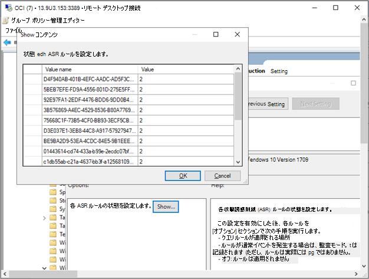

# グループ ポリシーをWindows 10デバイスにオンボードするOnboard the Windows 10 devices using Group Policy 

[!INCLUDE [Microsoft 365 Defender rebranding](../../includes/microsoft-defender.md)]

**適用対象:****Applies to:**

- グループ ポリシーGroup Policy
- [Microsoft Defender for EndpointMicrosoft Defender for Endpoint](https://go.microsoft.com/fwlink/p/?linkid=2154037)
- [Microsoft 365 DefenderMicrosoft 365 Defender](https://go.microsoft.com/fwlink/?linkid=2118804)

>Defender for Endpoint を体験してみませんか?Want to experience Defender for Endpoint? [無料試用版にサインアップしてください。Sign up for a free trial.](https://www.microsoft.com/microsoft-365/windows/microsoft-defender-atp?ocid=docs-wdatp-configureendpointsgp-abovefoldlink)

> [!NOTE]
> グループ ポリシー (GP) 更新プログラムを使用してパッケージを展開するには、サーバー 2008 R2 以降Windowsする必要があります。To use Group Policy (GP) updates to deploy the package, you must be on Windows Server 2008 R2 or later.
>
> サーバー Windows 2019 では、グループ ポリシーの基本設定で作成される XML ファイルの NT AUTHORITY\Well-Known-System-Account を NT AUTHORITY\SYSTEM に置き換える必要があります。For Windows Server 2019, you may need to replace NT AUTHORITY\Well-Known-System-Account with NT AUTHORITY\SYSTEM of the XML file that the Group Policy preference creates.

## グループ ポリシーを使用してデバイスをオンボードするOnboard devices using Group Policy

[エンドポイント用 Defender [Visio展開](https://github.com/MicrosoftDocs/microsoft-365-docs/raw/public/microsoft-365/security/defender-endpoint/downloads/mdatp-deployment-strategy.vsdx)] のさまざまなパスを確認するには、PDF またはドキュメントを参照してください。Check out the [PDF](https://github.com/MicrosoftDocs/microsoft-365-docs/raw/public/microsoft-365/security/defender-endpoint/downloads/mdatp-deployment-strategy.pdf)  or  [Visio](https://github.com/MicrosoftDocs/microsoft-365-docs/raw/public/microsoft-365/security/defender-endpoint/downloads/mdatp-deployment-strategy.vsdx) to see the various paths in deploying Defender for Endpoint.

1. サービス オンボーディング ウィザードから.zipした gp 構成 *パッケージ*(WindowsDefenderATPOnboardingPackage.zip) を開きます。Open the GP configuration package .zip file (*WindowsDefenderATPOnboardingPackage.zip*) that you downloaded from the service onboarding wizard. また、次のポータルから[パッケージをMicrosoft 365 Defenderすることもできます](https://security.microsoft.com/)。You can also get the package from [Microsoft 365 Defender portal](https://security.microsoft.com/):

    1. ナビゲーション ウィンドウで、[エンドポイント **デバイス設定**  >    >  **オンボーディング]**   >  **を選択します**。In the navigation pane, select **Settings** > **Endpoints** > **Device management**  > **Onboarding**.

    1. オペレーティング システムWindows 10を選択します。Select Windows 10 as the operating system.

    1. [展開方法 **] フィールドで** 、[グループ ポリシー] **を選択します**。In the **Deployment method** field, select **Group policy**.

    1. [パッケージ **のダウンロード] を** クリックし、.zip保存します。Click **Download package** and save the .zip file.

2. デバイスからアクセスできる.zipファイルの内容を読み取り専用の共有場所に抽出します。Extract the contents of the .zip file to a shared, read-only location that can be accessed by the device. *OptionalParamsPolicy* というフォルダーと *WindowsDefenderATPOnboardingScript.cmd というファイルが必要です*。You should have a folder called *OptionalParamsPolicy* and the file *WindowsDefenderATPOnboardingScript.cmd*.

3. グループ ポリシー [管理コンソール](/internet-explorer/ie11-deploy-guide/group-policy-and-group-policy-mgmt-console-ie11) (GPMC) を開き、構成するグループ ポリシー オブジェクト (GPO) を右クリックし、[編集] を **クリックします**。Open the [Group Policy Management Console](/internet-explorer/ie11-deploy-guide/group-policy-and-group-policy-mgmt-console-ie11) (GPMC), right-click the Group Policy Object (GPO) you want to configure and click **Edit**.

4. グループ ポリシー **管理エディターで、[\*\*\*\*コンピューターの構成**] 、[基本設定] の順に移動し、[コントロール パネルの **設定] に移動します**。In the **Group Policy Management Editor**, go to **Computer configuration**, then **Preferences**, and then **Control panel settings**.

5. [スケジュールされたタスク **] を** 右クリックし、[新規] をポイントし、[イミディエイト タスク] (少なくとも Windows **7) をクリックします**。Right-click **Scheduled tasks**, point to **New**, and then click **Immediate Task (At least Windows 7)**.

6. 開く **[タスク]** ウィンドウで、[全般] タブ **に移動** します。[セキュリティ **オプション] で、[\*\*\*\*ユーザーまたはグループの変更**] をクリックし、[SYSTEM] と入力し、[名前の確認] をクリック **して** **[OK] をクリックします**。In the **Task** window that opens, go to the **General** tab. Under **Security options** click **Change User or Group** and type SYSTEM and then click **Check Names** then **OK**. NT AUTHORITY\SYSTEM は、タスクが実行されるユーザー アカウントとして表示されます。NT AUTHORITY\SYSTEM appears as the user account the task will run as.

7. [ **ユーザーがログオンするかどうかを実行する] を選択し** 、[最高の特権で実行する **] チェック ボックスを** オンにします。Select **Run whether user is logged on or not** and check the **Run with highest privileges** check box.

8. [操作] タブ **に移動し** 、[新規] **をクリックします。** [アクション **] フィールドで [プログラム** の開始] が選択 **されている必要** があります。Go to the **Actions** tab and click **New...** Ensure that **Start a program** is selected in the **Action** field. 共有  *WindowsDefenderATPOnboardingScript.cmd* ファイルの NetBIOS パスを入力します。Enter the NetBIOS path of the shared  *WindowsDefenderATPOnboardingScript.cmd* file.

9. **[OK] を** クリックし、開いている GPMC ウィンドウを閉じます。Click **OK** and close any open GPMC windows.

> [!TIP]
> デバイスのオンボード後、検出テストを実行して、デバイスがサービスに適切にオンボードされていることを確認できます。After onboarding the device, you can choose to run a detection test to verify that the device is properly onboarded to the service. 詳細については、「新しくオンボードされた Defender for Endpoint デバイスで検出テストを実行 [する」を参照してください](run-detection-test.md)。For more information, see [Run a detection test on a newly onboarded Defender for Endpoint device](run-detection-test.md).

## エンドポイントの追加の Defender 構成設定Additional Defender for Endpoint configuration settings
デバイスごとに、詳細分析用にファイルを送信する要求が行われたときに、デバイスからサンプルをMicrosoft 365 Defenderできるかどうかを指定できます。For each device, you can state whether samples can be collected from the device when a request is made through Microsoft 365 Defender to submit a file for deep analysis.

グループ ポリシー (GP) を使用して、ディープ分析機能で使用されるサンプル共有の設定などの設定を構成できます。You can use Group Policy (GP) to configure settings, such as settings for the sample sharing used in the deep analysis feature.

### サンプル コレクション設定の構成Configure sample collection settings

1. GP 管理デバイスで、構成パッケージから次のファイルをコピーします。On your GP management device, copy the following files from the  configuration package:

    - _AtpConfiguration.admx を_ _C: \\ \\ policyDefinitions Windowsコピーする_Copy _AtpConfiguration.admx_ into _C:\\Windows\\PolicyDefinitions_

    - _AtpConfiguration.adml_ を C: Windows _\\ \\ PolicyDefinitions \\ en-US にコピーする_Copy _AtpConfiguration.adml_ into _C:\\Windows\\PolicyDefinitions\\en-US_

    グループ ポリシー管理用テンプレートに [セントラル ストア](https://support.microsoft.com/help/3087759/how-to-create-and-manage-the-central-store-for-group-policy-administra)を使用している場合は、構成パッケージから次のファイルをコピーします。If you are using a [Central Store for Group Policy Administrative Templates](https://support.microsoft.com/help/3087759/how-to-create-and-manage-the-central-store-for-group-policy-administra), copy the following files from the  configuration package:

    - SysVol ポリシー _\\ \\ \<forest.root\> \\ \\ \<forest.root\> \\ \\ PolicyDefinitions に AtpConfiguration.admx をコピーする_Copy _AtpConfiguration.admx_ into _\\\\\<forest.root\>\\SysVol\\\<forest.root\>\\Policies\\PolicyDefinitions_

    - _AtpConfiguration.adml を_ _\\ \\ \<forest.root\> \\ SysVol \\ \<forest.root\> \\ ポリシー \\ PolicyDefinitions \\ en-US にコピーする_Copy _AtpConfiguration.adml_ into _\\\\\<forest.root\>\\SysVol\\\<forest.root\>\\Policies\\PolicyDefinitions\\en-US_

2. グループ ポリシー [管理コンソールを開き](/internet-explorer/ie11-deploy-guide/group-policy-and-group-policy-mgmt-console-ie11)、構成する GPO を右クリックし、[編集] を **クリックします**。Open the [Group Policy Management Console](/internet-explorer/ie11-deploy-guide/group-policy-and-group-policy-mgmt-console-ie11), right-click the GPO you want to configure and click **Edit**.

3. グループ ポリシー **管理エディターで、[コンピューター** の構成] **に移動します**。In the **Group Policy Management Editor**, go to **Computer configuration**.

4. [ポリシー **] をクリックし**、[管理 **用テンプレート] をクリックします**。Click **Policies**, then **Administrative templates**.

5. [コンポーネント **Windows] をクリック** し **、[ATP] Windows Defenderをクリックします**。Click **Windows components** and then **Windows Defender ATP**.

6. デバイスからのサンプル共有を有効または無効にする場合に選択します。Choose to enable or disable sample sharing from your devices.

> [!NOTE]
> 値を設定しない場合、既定値はサンプル コレクションを有効にします。If you don't set a value, the default value is to enable sample collection.

## その他の推奨構成設定Other recommended configuration settings

### エンドポイント保護構成の更新Update endpoint protection configuration

オンボーディング スクリプトを構成したら、同じグループ ポリシーの編集を続けてエンドポイント保護構成を追加します。After configuring the onboarding script, continue editing the same group policy to add endpoint protection configurations. グループ ポリシーの編集は、Windows 10または Server 2019 を実行しているシステムから実行し、必要なすべての機能をMicrosoft Defender ウイルス対策します。Perform group policy edits from a system running Windows 10 or Server 2019 to ensure you have all of the required Microsoft Defender Antivirus capabilities. Defender ATP 構成設定を登録するには、グループ ポリシー オブジェクトを閉じて再度開く必要がある場合があります。You may need to close and reopen the group policy object to register the Defender ATP configuration settings.

すべてのポリシーは 、 の下に位置します `Computer Configuration\Policies\Administrative Templates` 。All policies are located under `Computer Configuration\Policies\Administrative Templates`.

**ポリシーの場所:** \Windows コンポーネント\atp Windows Defender**Policy location:** \Windows Components\Windows Defender ATP

ポリシーPolicy | SettingSetting
:---|:---
Enable\Disable Sample collectionEnable\Disable Sample collection| [有効] - [コンピューターでサンプル コレクションを有効にする] チェック ボックスをオンにします。Enabled - "Enable sample collection on machines" checked

 

**ポリシーの場所:** \Windows コンポーネント\Microsoft Defender ウイルス対策**Policy location:**  \Windows Components\Microsoft Defender Antivirus

ポリシーPolicy | SettingSetting
:---|:---
望ましくない可能性があるアプリケーションの検出を構成するConfigure detection for potentially unwanted applications | 有効、ブロックEnabled, Block

 

**ポリシーの場所:** \Windows コンポーネント\Microsoft Defender ウイルス対策\MAPS**Policy location:** \Windows Components\Microsoft Defender Antivirus\MAPS

ポリシーPolicy | SettingSetting
:---|:---
Microsoft MAPS に参加するJoin Microsoft MAPS | 有効、高度なマップEnabled, Advanced MAPS
詳細な分析が必要な場合にファイル サンプルを送信するSend file samples when further analysis is required | 有効、安全なサンプルの送信Enabled, Send safe samples

 

**ポリシーの場所:** \Windows コンポーネント\Microsoft Defender ウイルス対策\リアルタイム保護**Policy location:** \Windows Components\Microsoft Defender Antivirus\Real-time Protection

ポリシーPolicy | SettingSetting
:---|:---
リアルタイム保護をオフにするTurn off real-time protection|無効Disabled
動作の監視を有効にするTurn on behavior monitoring|EnabledEnabled
ダウンロードしたファイルと添付ファイルをスキャンするScan all downloaded files and attachments|EnabledEnabled
コンピューター上のファイルとプログラムのアクティビティを監視するMonitor file and program activity on your computer|EnabledEnabled

 

**ポリシーの場所:** \Windows コンポーネント\Microsoft Defender ウイルス対策\Scan**Policy location:**  \Windows Components\Microsoft Defender Antivirus\Scan

これらの設定は、エンドポイントの定期的なスキャンを構成します。These settings configure periodic scans of the endpoint. 毎週のクイック スキャンを実行することをお勧めします。パフォーマンスが許容されます。We recommend performing a weekly quick scan, performance permitting.

ポリシーPolicy | SettingSetting 
:---|:---
スケジュールされたスキャンを実行する前に、最新のウイルスとスパイウェアのセキュリティ インテリジェンスを確認するCheck for the latest virus and spyware security intelligence before running a scheduled scan |EnabledEnabled

 

**ポリシーの場所:** \Windows コンポーネント\Microsoft Defender ウイルス対策\Microsoft Defender Exploit Guard\Attack Surface Reduction**Policy location:** \Windows Components\Microsoft Defender Antivirus\Microsoft Defender Exploit Guard\Attack Surface Reduction

[攻撃表面の縮小ルールのカスタマイズ] から攻撃表面の縮小 GUID [の現在のリストを取得する](customize-attack-surface-reduction.md)Get the current list of attack surface reduction GUIDs from [Customize attack surface reduction rules](customize-attack-surface-reduction.md)

1. [攻撃表面 **縮小の構成] ポリシーを開** きます。Open the **Configure Attack Surface Reduction** policy.

1. **[有効]** を選択します。Select **Enabled**.

1. [表示] **ボタンを** 選択します。Select the **Show** button.

1. [値の名前] フィールドに **、値が** 2 の各 GUID を追加します。Add each GUID in the **Value Name** field with a Value of 2.

   これにより、監査専用に設定されます。This will set each up for audit only.

   

ポリシーPolicy | SettingSetting
:---|:---
フォルダー アクセスの制御を構成するConfigure Controlled folder access| 有効、監査モードEnabled, Audit Mode

## グループ ポリシーを使用してデバイスをオフボードするOffboard devices using Group Policy

セキュリティ上の理由から、Offboard デバイスに使用されるパッケージは、ダウンロード日から 30 日後に期限切れになります。For security reasons, the package used to Offboard devices will expire 30 days after the date it was downloaded. デバイスに送信された期限切れのオフボード パッケージは拒否されます。Expired offboarding packages sent to a device will be rejected. オフボード パッケージをダウンロードすると、パッケージの有効期限が通知され、パッケージ名にも含まれます。When downloading an offboarding package you will be notified of the packages expiry date and it will also be included in the package name.

> [!NOTE]
> オンボーディングポリシーとオフボード ポリシーを同じデバイスに同時に展開し、それ以外の場合は予期しない競合を引き起こす可能性があります。Onboarding and offboarding policies must not be deployed on the same device at the same time, otherwise this will cause unpredictable collisions.

1. ポータルからオフボード パッケージ[Microsoft 365 Defenderします](https://security.microsoft.com/)。Get the offboarding package from [Microsoft 365 Defender portal](https://security.microsoft.com/):

    1. ナビゲーション ウィンドウで、[エンドポイント **デバイス** 設定  >  **オフ**  >  **ボード]**  >  **を選択します**。In the navigation pane, select **Settings** > **Endpoints** > **Device management** > **Offboarding**.

    1. オペレーティング システムWindows 10を選択します。Select Windows 10 as the operating system.

    1. [展開方法 **] フィールドで** 、[グループ ポリシー] **を選択します**。In the **Deployment method** field, select **Group policy**.

    1. [パッケージ **のダウンロード] を** クリックし、.zip保存します。Click **Download package** and save the .zip file.

2. デバイスからアクセスできる.zipファイルの内容を読み取り専用の共有場所に抽出します。Extract the contents of the .zip file to a shared, read-only location that can be accessed by the device. *-MM-DD.cmd WindowsDefenderATPOffboardingScript_valid_until_YYYYという名前のファイルが必要です*。You should have a file named *WindowsDefenderATPOffboardingScript_valid_until_YYYY-MM-DD.cmd*.

3. グループ ポリシー [管理コンソール](/internet-explorer/ie11-deploy-guide/group-policy-and-group-policy-mgmt-console-ie11) (GPMC) を開き、構成するグループ ポリシー オブジェクト (GPO) を右クリックし、[編集] を **クリックします**。Open the [Group Policy Management Console](/internet-explorer/ie11-deploy-guide/group-policy-and-group-policy-mgmt-console-ie11) (GPMC), right-click the Group Policy Object (GPO) you want to configure and click **Edit**.

4. グループ ポリシー **管理エディターで、[\*\*\*\*コンピューターの構成**] 、[基本設定] の順に移動し、[コントロール パネルの **設定] に移動します**。In the **Group Policy Management Editor**, go to **Computer configuration,** then **Preferences**, and then **Control panel settings**.

5. [スケジュールされたタスク] **を右クリック** し、[新規] をポイント **し**、[イミディエイト タスク] **をクリックします**。Right-click **Scheduled tasks**, point to **New**, and then click **Immediate task**.

6. 開く **[タスク]** ウィンドウで、[全般] タブ **に移動** します。[セキュリティ オプション] の [ローカル SYSTEM ユーザー アカウント (BUILTIN\SYSTEM) **を選択します**。In the **Task** window that opens, go to the **General** tab. Choose the local SYSTEM user account (BUILTIN\SYSTEM) under **Security options**.

7. [ **ユーザーがログオンするかどうかを実行する] を選択し** 、[最高の特権で実行する **]** チェック ボックスをオンにします。Select **Run whether user is logged on or not** and check the **Run with highest privileges** check-box.

8. [アクション] タブ **に移動し** 、[ **新規...] をクリックします**。[アクション **] フィールドで [プログラム** の開始] が選択 **されている必要** があります。Go to the **Actions** tab and click **New...**. Ensure that **Start a program** is selected in the **Action** field. 共有ファイル *-MM-DD.cmd ファイルWindowsDefenderATPOffboardingScript_valid_until_YYYY NetBIOS パスを入力* します。Enter the NetBIOS path of the shared *WindowsDefenderATPOffboardingScript_valid_until_YYYY-MM-DD.cmd* file.

9. **[OK] を** クリックし、開いている GPMC ウィンドウを閉じます。Click **OK** and close any open GPMC windows.

> [!IMPORTANT]
> Offboarding を使用すると、デバイスはポータルへのセンサー データの送信を停止しますが、デバイスからのデータ (通知への参照を含む) は最大 6 か月間保持されます。Offboarding causes the device to stop sending sensor data to the portal but data from the device, including reference to any alerts it has had will be retained for up to 6 months.

## デバイス構成の監視Monitor device configuration

グループ ポリシーでは、デバイス上のポリシーの展開を監視するオプションはありません。With Group Policy there isn’t an option to monitor deployment of policies on the devices. 監視は、ポータルまたはさまざまな展開ツールを使用して直接実行できます。Monitoring can be done directly on the portal, or by using the different deployment tools.

## ポータルを使用してデバイスを監視するMonitor devices using the portal

1. [ポータル] [Microsoft 365 Defender移動します](https://security.microsoft.com/)。Go to [Microsoft 365 Defender portal](https://security.microsoft.com/).
2. [デバイス **インベントリ] をクリックします**。Click **Devices inventory**.
3. デバイスが表示されているのを確認します。Verify that devices are appearing.

> [!NOTE]
> デバイスが [デバイス] リストに表示を開始するには、数日 **かかる場合があります**。It can take several days for devices to start showing on the **Devices list**. これには、ポリシーがデバイスに配布される時間、ユーザーがログオンする前にかかる時間、エンドポイントがレポートを開始するのにかかる時間が含まれます。This includes the time it takes for the policies to be distributed to the device, the time it takes before the user logs on, and the time it takes for the endpoint to start reporting.

## 関連項目Related topics

- [デバイスをWindows 10デバイスをオンボードMicrosoft Endpoint Configuration ManagerOnboard Windows 10 devices using Microsoft Endpoint Configuration Manager](configure-endpoints-sccm.md)
- [モバイル デバイス管理ツールを使用した Windows 10 デバイスのオンボードOnboard Windows 10 devices using Mobile Device Management tools](configure-endpoints-mdm.md)
- [ローカル スクリプトを使用した Windows 10 デバイスのオンボードOnboard Windows 10 devices using a local script](configure-endpoints-script.md)
- [非永続的な仮想デスクトップ インフラストラクチャ (VDI) デバイスのオンボードOnboard non-persistent virtual desktop infrastructure (VDI) devices](configure-endpoints-vdi.md)
- [新しくオンボードされた Microsoft Defender for Endpoint デバイスで検出テストを実行するRun a detection test on a newly onboarded Microsoft Defender for Endpoint devices](run-detection-test.md)
- [Microsoft Defender for Endpoint オンボーディングの問題のトラブルシューティングTroubleshoot Microsoft Defender for Endpoint onboarding issues](troubleshoot-onboarding.md)
