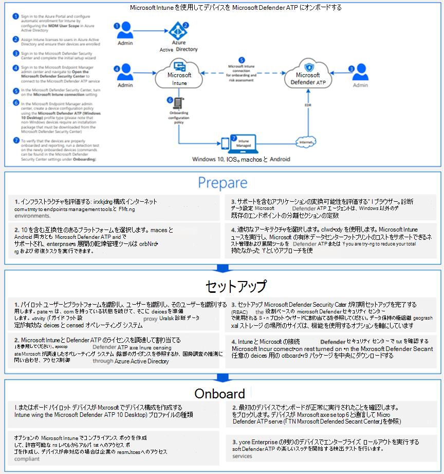

# モバイル デバイス管理Windows 10使用してデバイスをオンボードする

[!INCLUDE [Microsoft 365 Defender rebranding](../../includes/microsoft-defender.md)]

**適用対象:**
- [Microsoft Defender for Endpoint](https://go.microsoft.com/fwlink/p/?linkid=2154037)
- [Microsoft 365 Defender](https://go.microsoft.com/fwlink/?linkid=2118804)

> Defender for Endpoint を体験してみませんか? [無料試用版にサインアップしてください。](https://signup.microsoft.com/create-account/signup?products=7f379fee-c4f9-4278-b0a1-e4c8c2fcdf7e&ru=https://aka.ms/MDEp2OpenTrial?ocid=docs-wdatp-configureendpointsmdm-abovefoldlink)

モバイル デバイス管理 (MDM) ソリューションを使用してデバイスを構成できます。 Defender for Endpoint は、デバイスを管理OMA-URIsポリシーを作成するためのユーザー情報を提供することで、MDM をサポートします。

Defender for Endpoint CSP の使用の詳細については [、「WindowsAdvancedThreatProtection CSP」](https://msdn.microsoft.com/library/windows/hardware/mt723296(v=vs.85).aspx) および [「WindowsAdvancedThreatProtection DDF ファイル」を参照してください](https://msdn.microsoft.com/library/windows/hardware/mt723297(v=vs.85).aspx)。

## 始める前に

デバイスを使用している場合Microsoft Intune MDM が登録されている必要があります。 それ以外の場合、設定は正常に適用されません。

MDM を有効にする方法の詳細については、「デバイスMicrosoft Intune [(Microsoft Intune) 」を参照してください](/mem/intune/enrollment/device-enrollment)。

## デバイスを使用したオンボード Microsoft Intune

[エンドポイント用 Defender [Visio展開](https://github.com/MicrosoftDocs/microsoft-365-docs/raw/public/microsoft-365/security/defender-endpoint/downloads/mdatp-deployment-strategy.vsdx)] のさまざまなパスを確認するには、PDF またはドキュメントを参照してください。

Intune の指示に [従います](/intune/advanced-threat-protection)。

Defender for Endpoint CSP の使用の詳細については [、「WindowsAdvancedThreatProtection CSP」](https://msdn.microsoft.com/library/windows/hardware/mt723296(v=vs.85).aspx) および [「WindowsAdvancedThreatProtection DDF ファイル」を参照してください](https://msdn.microsoft.com/library/windows/hardware/mt723297(v=vs.85).aspx)。

> [!NOTE]
>
> - オンボード **デバイスの正常性状態ポリシーでは** 、読み取り専用プロパティが使用され、修復できません。
> - 診断データレポートの頻度の構成は、バージョン 1703 の Windows 10デバイスでのみ使用できます。

[MICROSOFT](https://github.com/MicrosoftDocs/microsoft-365-docs/raw/public/microsoft-365/security/defender-endpoint/downloads/mdatp-deployment-strategy.pdf) Defender for Endpoint[の展開](https://github.com/MicrosoftDocs/microsoft-365-docs/raw/public/microsoft-365/security/defender-endpoint/downloads/mdatp-deployment-strategy.vsdx)Visioパスを確認するには、PDF またはドキュメントを参照してください。

## 検出テストを実行してオンボーディングを確認する
デバイスのオンボード後、検出テストを実行して、デバイスがサービスに適切にオンボードされていることを確認できます。 詳細については、「新しくオンボードされた Microsoft Defender for Endpoint デバイスで検出テストを実行する [」を参照してください](run-detection-test.md)。

## モバイル デバイス管理ツールを使用したオフボードデバイスと監視デバイス

セキュリティ上の理由から、Offboard デバイスに使用されるパッケージは、ダウンロード日から 30 日後に期限切れになります。 デバイスに送信された期限切れのオフボード パッケージは拒否されます。 オフボード パッケージをダウンロードすると、パッケージの有効期限が通知され、パッケージ名にも含まれます。

> [!NOTE]
> オンボーディングポリシーとオフボード ポリシーを同じデバイスに同時に展開し、それ以外の場合は予期しない競合を引き起こす可能性があります。

1. ポータルからオフボード パッケージ[Microsoft 365 Defenderします](https://security.microsoft.com/)。

   1. ナビゲーション ウィンドウで、[エンドポイント **デバイス** 設定  >  **オフ**  >  **ボード]**  >  **を選択します**。

   1. オペレーティング システムWindows 10を選択します。

   1. [展開 **方法] フィールドで**、[**モバイル デバイスの管理/ 管理] を選択Microsoft Intune。**

   1. [ **パッケージのダウンロード]** をクリックし、ファイルを.zipします。

2. パッケージを展開するネットワーク管理者がアクセスできる共有の読み取り専用の場所に、.zip ファイルの内容を抽出します。 *"-MM-DD.offboarding WindowsDefenderATP_valid_until_YYYYという名前のファイルが必要です*。

3. 次のサポートMicrosoft Intune OMA-URI 設定を展開するには、次のカスタム構成ポリシーを使用します。
   - OMA-URI: ./Device/Vendor/MSFT/WindowsAdvancedThreatProtection/Offboarding
   - 日付の種類: 文字列
   - 値: [ファイルのコンテンツから値をコピーして貼りWindowsDefenderATP_valid_until_YYYY-MM-DD.offboarding ファイル]

ポリシー設定の詳細については、「Microsoft Intuneのポリシー設定[Windows 10」を参照Microsoft Intune。](/intune/deploy-use/windows-10-policy-settings-in-microsoft-intune)

> [!NOTE]
> オフ **ボードデバイスの正常性状態** ポリシーでは、読み取り専用プロパティが使用され、修復できません。

> [!IMPORTANT]
> Offboarding を使用すると、デバイスはポータルへのセンサー データの送信を停止しますが、デバイスからのデータ (通知への参照を含む) は最大 6 か月間保持されます。

## 関連項目

- [グループ ポリシー Windows 10デバイスのオンボード](configure-endpoints-gp.md)
- [デバイスをWindows 10デバイスをオンボードMicrosoft Endpoint Configuration Manager](configure-endpoints-sccm.md)
- [ローカル スクリプトを使用した Windows 10 デバイスのオンボード](configure-endpoints-script.md)
- [非永続的な仮想デスクトップ インフラストラクチャ (VDI) デバイスのオンボード](configure-endpoints-vdi.md)
- [新しくオンボードされた Microsoft Defender for Endpoint デバイスで検出テストを実行する](run-detection-test.md)
- [Microsoft Defender for Endpoint オンボーディングの問題のトラブルシューティング](troubleshoot-onboarding.md)
