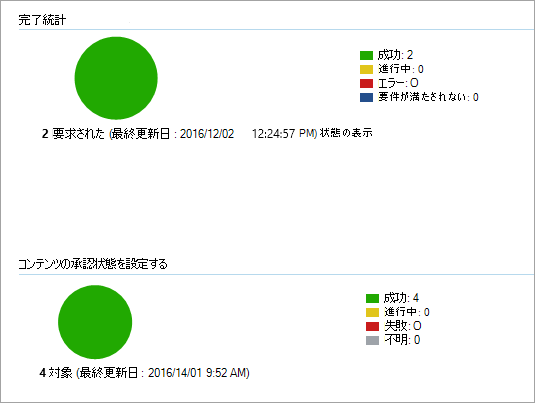

# <a name="onboard-the-windows-devices-using-configuration-manager"></a>Configuration Manager をWindowsデバイスのオンボード

[!INCLUDE [Microsoft 365 Defender rebranding](../../includes/microsoft-defender.md)]

**適用対象:**

- [Microsoft Defender for Endpoint](https://go.microsoft.com/fwlink/p/?linkid=2154037)
- [Microsoft 365 Defender](https://go.microsoft.com/fwlink/?linkid=2118804)
- Microsoft Endpoint Configuration Manager現在のブランチ
- System Center 2012 R2 Configuration Manager

> Defender for Endpoint を試す場合は、 [無料試用版にサインアップしてください。](https://signup.microsoft.com/create-account/signup?products=7f379fee-c4f9-4278-b0a1-e4c8c2fcdf7e&ru=https://aka.ms/MDEp2OpenTrial?ocid=docs-wdatp-configureendpointssccm-abovefoldlink)

## <a name="supported-client-operating-systems"></a>サポートされているクライアント オペレーティング システム

実行している Configuration Manager のバージョンに基づいて、次のクライアント オペレーティング システムをオンボードできます。

- **Configuration Manager バージョン 1910 以前**:
  - クライアント を実行しているWindows 10
- **Configuration Manager バージョン 2002 以降**:

  Configuration Manager バージョン 2002 から、次のオペレーティング システムをオンボードできます。

  - Windows 8.1
  - Windows 10
  - Windows 11
  - Windows Server 2012 R2
  - Windows Server 2016
  - Windows Server 2016バージョン 1803 以降
  - Windows Server 2019
  - Windows Server 2022

> [!NOTE]
> Windows Server 2012 R2、Windows Server 2016、Windows Server 2019、Windows Server 2022 をオンボードする方法の詳細については、「オンボード Windows[サーバー」を参照](configure-server-endpoints.md)してください。

### <a name="onboard-devices-using-system-center-configuration-manager"></a>デバイスを使用したオンボード System Center Configuration Manager

[MICROSOFT](https://download.microsoft.com/download/5/6/0/5609001f-b8ae-412f-89eb-643976f6b79c/mde-deployment-strategy.pdf) Defender for Endpoint[の展開](https://download.microsoft.com/download/5/6/0/5609001f-b8ae-412f-89eb-643976f6b79c/mde-deployment-strategy.vsdx)Visioパスを確認するには、PDF またはドキュメントを参照してください。

1. サービス オンボーディング ウィザードからダウンロード *.zipファイル*(WindowsDefenderATPOnboardingPackage.zip) の Configuration Manager 構成パッケージを開きます。 また、次のポータルから[パッケージをMicrosoft 365 Defenderすることもできます](https://security.microsoft.com/)。
    1. ナビゲーション ウィンドウで、[エンドポイント **デバイス設定** \>  \> **オンボーディング]** \> **を選択します**。
    2. オペレーティング Windows 10としてWindows 11 を選択します。
    3. [展開方法 **] フィールド** で、[System Center Configuration Manager **2012/2012 R2/1511/1602] を選択します**。
    4. [ **パッケージのダウンロード]** を選択し、ファイルを.zipします。

2. パッケージを展開するネットワーク管理者がアクセスできる共有の読み取り専用の場所に、.zip ファイルの内容を抽出します。 *WindowsDefenderATPOnboardingScript.cmd という名前のファイルが必要です*。

3. [2012 R2 Configuration Manager](/previous-versions/system-center/system-center-2012-R2/gg699369\(v=technet.10\))の「パッケージとプログラム」の記事の手順に従ってSystem Centerパッケージを展開します。

   パッケージを展開する定義済みのデバイス コレクションを選択します。

> [!NOTE]
> Defender for Endpoint は、アウトオブボックス エクスペリエンス [(OOBE)](https://answers.microsoft.com/windows/wiki/windows_10/how-to-complete-the-windows-10-out-of-box/47e3f943-f000-45e3-8c5c-9d85a1a0cf87) フェーズ中のオンボーディングをサポートしない。 インストールまたはアップグレードの実行後にユーザーが OOBE をWindows確認します。
>
> Configuration Manager アプリケーションで検出ルールを作成して、デバイスがオンボードされたのを継続的に確認できます。 アプリケーションは、パッケージやプログラムとは異なる種類のオブジェクトです。
> デバイスがまだオンボードされていない場合 (保留中の OOBE の完了その他の理由により)、Configuration Manager は、ルールが状態の変更を検出するまで、デバイスのオンボードを再試行します。
>
> この動作は、"OnboardingState" レジストリ値 (タイプ REG_DWORD) が 1 の場合に検出ルールチェックを作成することで実現できます。
> このレジストリ値は、"HKLM\SOFTWARE\Microsoft\Windows Advanced Threat Protection\Status" の下にあります。
詳細については[、「Configure Detection Methods in System Center 2012 R2 Configuration Manager」を参照してください](/previous-versions/system-center/system-center-2012-R2/gg682159\(v=technet.10\)#step-4-configure-detection-methods-to-indicate-the-presence-of-the-deployment-type)。

### <a name="configure-sample-collection-settings"></a>サンプル コレクション設定の構成

デバイスごとに構成値を設定して、Microsoft 365 Defender から詳細分析用にファイルを送信する要求が行われたときに、デバイスからサンプルを収集できるかどうかを示します。

> [!NOTE]
> これらの構成設定は、通常、Configuration Manager を介して行われます。

Configuration Manager で構成アイテムのコンプライアンス ルールを設定して、デバイスのサンプル共有設定を変更できます。

このルールは、対象デバイスのレジストリ キーの値を設定して、苦情を確実に受け取るコンプライアンス ルール構成項目を修復する必要があります。

構成は、次のレジストリ キー エントリを使用して設定されます。

```text
Path: "HKLM\SOFTWARE\Policies\Microsoft\Windows Advanced Threat Protection"
Name: "AllowSampleCollection"
Value: 0 or 1
```

ここで、キーの種類は D-WORD です。 使用可能な値は次のとおりです。

- 0: このデバイスからのサンプル共有を許可しない
- 1: このデバイスからすべての種類のファイルを共有できます

レジストリ キーが存在しない場合の既定値は 1 です。

コンプライアンスの詳細については、「System Center Configuration Manager [System Center 2012 R2](/previous-versions/system-center/system-center-2012-R2/gg682139\(v=technet.10\))Configuration Manager のコンプライアンス設定の概要」を参照してください。

## <a name="other-recommended-configuration-settings"></a>その他の推奨構成設定

デバイスをサービスにオンボーディングした後、以下の推奨構成設定でデバイスを有効にすることで、含まれている脅威保護機能を活用することが重要です。

### <a name="device-collection-configuration"></a>デバイス コレクションの構成

バージョン 2002 以降のエンドポイント構成マネージャーを使用している場合は、展開を拡大してサーバーまたはダウンレベルのクライアントを含める方法を選択できます。

### <a name="next-generation-protection-configuration"></a>次世代の保護構成

次の構成設定をお勧めします。

#### <a name="scan"></a>スキャン

- USB ドライブなどのリムーバブル 記憶域デバイスをスキャンする: はい

#### <a name="real-time-protection"></a>リアルタイム保護

- 動作監視を有効にする: はい
- ダウンロード時およびインストール前に望ましくない可能性があるアプリケーションに対する保護を有効にする: はい

#### <a name="cloud-protection-service"></a>クラウド保護サービス

- Cloud Protection Service メンバーシップの種類: 高度なメンバーシップ

#### <a name="attack-surface-reduction"></a>攻撃面の縮小

使用可能なすべてのルールを [監査] に構成します。

> [!NOTE]
> これらのアクティビティをブロックすると、正当なビジネス プロセスが中断される可能性があります。 最善の方法は、すべてを監査に設定し、有効にしても安全な設定を特定し、誤検知検出を持つエンドポイントでこれらの設定を有効にします。

#### <a name="network-protection"></a>ネットワーク保護

監査モードまたはブロック モードでネットワーク保護を有効にする前に、サポート ページから入手できるマルウェア対策プラットフォーム更新プログラムがインストール [されていることを確認してください](https://support.microsoft.com/help/4560203/windows-defender-anti-malware-platform-binaries-are-missing)。

#### <a name="controlled-folder-access"></a>コントロールされたフォルダー アクセス

監査モードで機能を 30 日以上有効にします。 この期間が終了した後、検出を確認し、保護されたディレクトリへの書き込みを許可するアプリケーションの一覧を作成します。

詳細については、「管理フォルダー アクセス [の評価」を参照してください](evaluate-controlled-folder-access.md)。

## <a name="run-a-detection-test-to-verify-onboarding"></a>検出テストを実行してオンボーディングを確認する

デバイスのオンボード後、検出テストを実行して、デバイスがサービスに適切にオンボードされていることを確認できます。 詳細については、「新しくオンボードされた Microsoft Defender for Endpoint デバイスで検出テストを実行する [」を参照してください](run-detection-test.md)。

## <a name="offboard-devices-using-configuration-manager"></a>Configuration Manager を使用したオフボード デバイス

セキュリティ上の理由から、Offboard デバイスに使用されるパッケージは、ダウンロード日から 30 日後に期限切れになります。 デバイスに送信された期限切れのオフボード パッケージは拒否されます。 オフボード パッケージをダウンロードすると、パッケージの有効期限が通知され、パッケージ名にも含まれます。

> [!NOTE]
> オンボーディングポリシーとオフボード ポリシーを同じデバイスに同時に展開し、それ以外の場合は予期しない競合を引き起こす可能性があります。

### <a name="offboard-devices-using-microsoft-endpoint-manager-current-branch"></a>現在のブランチを使用Microsoft エンドポイント マネージャーオフボード デバイス

現在のブランチでMicrosoft エンドポイント マネージャー場合は、「[オフボード構成ファイルを作成する」を参照してください](/configmgr/protect/deploy-use/windows-defender-advanced-threat-protection#create-an-offboarding-configuration-file)。

### <a name="offboard-devices-using-system-center-2012-r2-configuration-manager"></a>2012 R2 Configuration Manager System Centerを使用するオフボード デバイス

1. ポータルからオフボード パッケージ[Microsoft 365 Defenderします](https://security.microsoft.com/)。
    1. ナビゲーション ウィンドウで、[エンドポイント **デバイス** 設定 \> **オフ** \> **ボード]** \> **を選択します**。  
    1. オペレーティング Windows 10としてWindows 11 を選択します。
    1. [展開方法 **] フィールド** で、[System Center Configuration Manager **2012/2012 R2/1511/1602] を選択します**。
    1. [ **パッケージのダウンロード]** を選択し、ファイルを.zipします。

2. パッケージを展開するネットワーク管理者がアクセスできる共有の読み取り専用の場所に、.zip ファイルの内容を抽出します。 *-MM-DD.cmd WindowsDefenderATPOffboardingScript_valid_until_YYYYという名前のファイルが必要です*。

3. [2012 R2 Configuration Manager](/previous-versions/system-center/system-center-2012-R2/gg699369\(v=technet.10\))の「パッケージとプログラム」の記事の手順に従ってSystem Centerパッケージを展開します。

   パッケージを展開する定義済みのデバイス コレクションを選択します。

> [!IMPORTANT]
> Offboarding を使用すると、デバイスはポータルへのセンサー データの送信を停止しますが、デバイスからのデータ (通知への参照を含む) は最大 6 か月間保持されます。

## <a name="monitor-device-configuration"></a>デバイス構成の監視

現在のブランチでMicrosoft エンドポイント マネージャー場合は、Configuration Manager コンソールの組み込みの Defender for Endpoint ダッシュボードを使用します。 詳細については [、「Defender for Endpoint - Monitor」を参照してください](/configmgr/protect/deploy-use/windows-defender-advanced-threat-protection#monitor)。

2012 R2 Configuration Manager System Center使用している場合、監視は次の 2 つの部分で構成されます。

1. 構成パッケージが正しく展開され、ネットワーク内のデバイスで実行 (または正常に実行) されていることを確認します。

2. デバイスが Defender for Endpoint サービスに準拠しているのを確認します (これにより、デバイスはオンボーディング プロセスを完了し、引き続きサービスにデータを報告できます)。

### <a name="confirm-the-configuration-package-has-been-correctly-deployed"></a>構成パッケージが正しく展開されていることを確認する

1. Configuration Manager コンソールで、ナビゲーション ウィンドウ **の** 下部にある [監視] をクリックします。

2. [概要 **] を選択** し、[ **展開] を選択します**。

3. パッケージ名を使用して展開を選択します。

4. [完了統計] と [コンテンツ **の状態] の下の** 状態インジケーター **を確認します**。

    失敗した展開 (エラー、要件が満たされていないデバイス、または失敗した状態) がある場合は、デバイスのトラブルシューティングが必要な場合があります。  詳細については [、「Troubleshoot Microsoft Defender for Endpoint オンボーディングの問題」を参照してください](troubleshoot-onboarding.md)。

    

### <a name="check-that-the-devices-are-compliant-with-the-microsoft-defender-for-endpoint-service"></a>デバイスが Microsoft Defender for Endpoint サービスに準拠しているのを確認する

2012 R2 Configuration Manager で構成アイテムのコンプライアンス System Center設定して、展開を監視できます。

このルールは *、対象となる* デバイスのレジストリ キーの値を監視する、修復されていないコンプライアンス ルール構成アイテムである必要があります。

次のレジストリ キー エントリを監視します。

```console
Path: "HKLM\SOFTWARE\Microsoft\Windows Advanced Threat Protection\Status"
Name: "OnboardingState"
Value: "1"
```

詳細については[、「2012 R2](/previous-versions/system-center/system-center-2012-R2/gg682139\(v=technet.10\))Configuration Manager のコンプライアンスSystem Center概要」を参照してください。

## <a name="related-topics"></a>関連トピック

- [グループ ポリシー Windowsデバイスのオンボード](configure-endpoints-gp.md)
- [モバイル Windowsツールを使用してデバイスをオンボードする](configure-endpoints-mdm.md)
- [ローカル Windowsを使用してデバイスをオンボードする](configure-endpoints-script.md)
- [非永続的な仮想デスクトップ インフラストラクチャ (VDI) デバイスのオンボード](configure-endpoints-vdi.md)
- [新しくオンボードされた Microsoft Defender for Endpoint デバイスで検出テストを実行する](run-detection-test.md)
- [Microsoft Defender for Endpoint オンボーディングの問題のトラブルシューティング](troubleshoot-onboarding.md)
