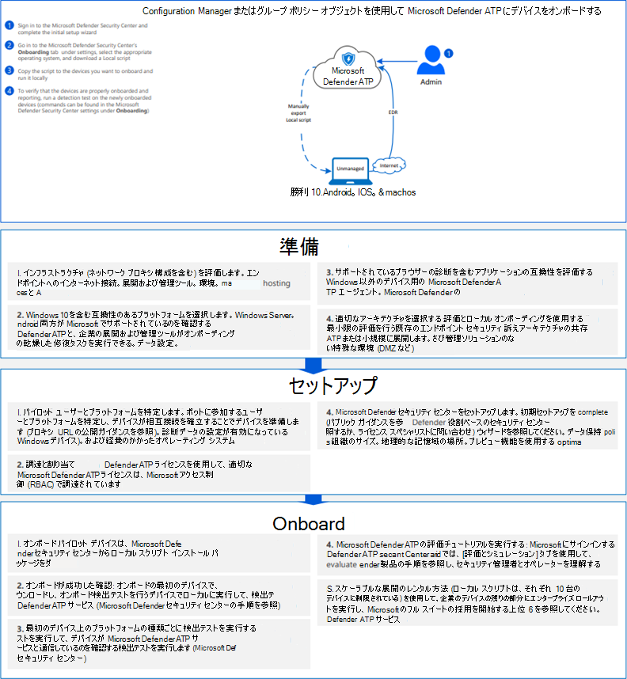

# <a name="onboard-the-windows-10-devices-using-a-local-script"></a>ローカル スクリプトをWindows 10デバイスにオンボードする

[!INCLUDE [Microsoft 365 Defender rebranding](../../includes/microsoft-defender.md)]

- [Microsoft 365 Defender](https://go.microsoft.com/fwlink/?linkid=2118804)

> Defender for Endpoint を試す場合は、 [無料試用版にサインアップしてください。](https://signup.microsoft.com/create-account/signup?products=7f379fee-c4f9-4278-b0a1-e4c8c2fcdf7e&ru=https://aka.ms/MDEp2OpenTrial?ocid=docs-wdatp-configureendpointsscript-abovefoldlink)

また、個々のデバイスを Defender for Endpoint に手動でオンボードすることもできます。 ネットワーク内のすべてのデバイスのオンボーディングにコミットする前に、サービスをテストするときに最初にこれを行う必要があります。

> [!IMPORTANT]
> このスクリプトは、最大 10 台のデバイスで使用するために最適化されています。
>
> 大規模に展開するには、他の [展開オプションを使用します](configure-endpoints.md)。 たとえば、オンボーディング スクリプトを 10 台以上のデバイスに展開し、グループ ポリシーを使用してオンボード Windows 10 デバイスで使用[できます](configure-endpoints-gp.md)。

## <a name="onboard-devices"></a>デバイスのオンボード

[](images/onboard-script.png#lightbox)

[[](https://github.com/MicrosoftDocs/microsoft-365-docs/raw/public/microsoft-365/security/defender-endpoint/downloads/mdatp-deployment-strategy.pdf)エンドポイント用 Defender [Visio展開](https://github.com/MicrosoftDocs/microsoft-365-docs/raw/public/microsoft-365/security/defender-endpoint/downloads/mdatp-deployment-strategy.vsdx)] のさまざまなパスを確認するには、PDF またはドキュメントを参照してください。

1. サービス オンボーディング ウィザードから.zipした gp 構成 *パッケージ*(WindowsDefenderATPOnboardingPackage.zip) を開きます。 Defender ポータルからパッケージを取得[Microsoft 365することもできます](https://security.microsoft.com/)。
    1. ナビゲーション ウィンドウで、[エンドポイント **デバイス設定** \>  \> **オンボーディング]** \> **を選択します**。
    2. オペレーティング システムWindows 10を選択します。
    3. [展開方法 **] フィールドで** 、[ローカル スクリプト] **を選択します**。
    4. [パッケージ **のダウンロード] を** クリックし、.zip保存します。

2. 構成パッケージの内容を、オンボードするデバイスの場所 (デスクトップなど) に展開します。 *WindowsDefenderATPLocalOnboardingScript.cmd という名前のファイルが必要です*。

3. デバイスで管理者特権のコマンド ライン プロンプトを開き、スクリプトを実行します。
   1. **[スタート]** をクリックし、「**cmd**」と入力します。
   2. **[コマンド プロンプト]** を右クリックして **[管理者として実行]** を選択します。

     ![[管理者スタート メニュー実行] をポイントするウィンドウ のウィンドウ](images/run-as-admin.png)

4. スクリプト ファイルの場所を入力します。 ファイルをデスクトップにコピーした場合は *、「%userprofile%\Desktop\WindowsDefenderATPLocalOnboardingScript.cmd」と入力します。*

5. Enter キーを **押** するか **、[OK] をクリックします**。

デバイスが準拠し、センサー データが正しく報告されていることを手動で検証する方法については、「Microsoft Defender for Endpoint オンボーディングの問題のトラブルシューティング」 [を参照してください](troubleshoot-onboarding.md)。

> [!TIP]
> デバイスのオンボード後、検出テストを実行して、デバイスがサービスに適切にオンボードされていることを確認できます。 詳細については、「新しくオンボードされた Microsoft Defender for Endpoint エンドポイントで検出テストを実行する [」を参照してください](run-detection-test.md)。

## <a name="configure-sample-collection-settings"></a>サンプル コレクション設定の構成

デバイスごとに構成値を設定して、Microsoft 365 Defender から詳細分析用にファイルを送信する要求が行われたときに、デバイスからサンプルを収集できるかどうかを示します。

regedit を使用するか *、.reg* ファイルを作成して実行することで、デバイスのサンプル共有設定 *を手動で構成* できます。

構成は、次のレジストリ キー エントリを使用して設定されます。

```console
Path: "HKLM\SOFTWARE\Policies\Microsoft\Windows Advanced Threat Protection"
Name: "AllowSampleCollection"
Value: 0 or 1
```

Name 型は D-WORD です。 使用可能な値は次のいずれかです。

- 0 - このデバイスからのサンプル共有を許可しない
- 1 - このデバイスからすべての種類のファイルを共有できます

レジストリ キーが存在しない場合の既定値は 1 です。

## <a name="run-a-detection-test-to-verify-onboarding"></a>検出テストを実行してオンボーディングを確認する

デバイスのオンボード後、検出テストを実行して、デバイスがサービスに適切にオンボードされていることを確認できます。 詳細については、「新しくオンボードされた Microsoft Defender for Endpoint デバイスで検出テストを実行する [」を参照してください](run-detection-test.md)。

## <a name="offboard-devices-using-a-local-script"></a>ローカル スクリプトを使用してデバイスをオフボードする

セキュリティ上の理由から、Offboard デバイスに使用されるパッケージは、ダウンロード日から 30 日後に期限切れになります。 デバイスに送信された期限切れのオフボード パッケージは拒否されます。 オフボード パッケージをダウンロードすると、パッケージの有効期限が通知され、パッケージ名にも含まれます。

> [!NOTE]
> オンボーディングポリシーとオフボード ポリシーを同じデバイスに同時に展開し、それ以外の場合は予期しない競合を引き起こす可能性があります。

1. ポータルからオフボード パッケージ[Microsoft 365 Defenderします](https://security.microsoft.com/)。
    1. ナビゲーション ウィンドウで、[エンドポイント **デバイス** 設定 \> **オフ** \> **ボード]** \> **を選択します**。
    2. オペレーティング システムWindows 10を選択します。
    3. [展開方法 **] フィールドで** 、[ローカル スクリプト] **を選択します**。
    4. [パッケージ **のダウンロード] を** クリックし、.zip保存します。

2. デバイスがアクセスできる共有.zipファイルの内容を読み取り専用の場所に抽出します。 *-MM-DD.cmd WindowsDefenderATPOffboardingScript_valid_until_YYYYという名前のファイルが必要です*。

3. デバイスで管理者特権のコマンド ライン プロンプトを開き、スクリプトを実行します。
   1. **[スタート]** をクリックし、「**cmd**」と入力します。
   2. **[コマンド プロンプト]** を右クリックして **[管理者として実行]** を選択します。

      ![[管理者スタート メニュー実行] をポイントするウィンドウ のウィンドウ](images/run-as-admin.png)

4. スクリプト ファイルの場所を入力します。 ファイルをデスクトップにコピーした場合は *、「%userprofile%\Desktop\WindowsDefenderATPOffboardingScript_valid_until_YYYY-MM-DD.cmd」と入力します。*

5. Enter キーを **押** するか **、[OK] をクリックします**。

> [!IMPORTANT]
> Offboarding を使用すると、デバイスはポータルへのセンサー データの送信を停止しますが、デバイスからのデータ (通知への参照を含む) は最大 6 か月間保持されます。

## <a name="monitor-device-configuration"></a>デバイス構成の監視

「オンボードの問題のトラブルシューティング」の異[](troubleshoot-onboarding.md)なる検証手順に従って、スクリプトが正常に完了し、エージェントが実行されたことを確認できます。

監視は、ポータルまたはさまざまな展開ツールを使用して直接実行することもできます。

### <a name="monitor-devices-using-the-portal"></a>ポータルを使用してデバイスを監視する

1. [ポータル] Microsoft 365 Defender移動します。
2. [デバイス **インベントリ] をクリックします**。
3. デバイスが表示されているのを確認します。

## <a name="related-topics"></a>関連項目

- [グループ ポリシー Windows 10デバイスのオンボード](configure-endpoints-gp.md)
- [デバイスをWindows 10デバイスをオンボードMicrosoft Endpoint Configuration Manager](configure-endpoints-sccm.md)
- [モバイル デバイス管理ツールを使用した Windows 10 デバイスのオンボード](configure-endpoints-mdm.md)
- [非永続的な仮想デスクトップ インフラストラクチャ (VDI) デバイスのオンボード](configure-endpoints-vdi.md)
- [新しくオンボードされた Microsoft Defender for Endpoint デバイスで検出テストを実行する](run-detection-test.md)
- [Microsoft Defender for Endpoint オンボーディングの問題のトラブルシューティング](troubleshoot-onboarding.md)
