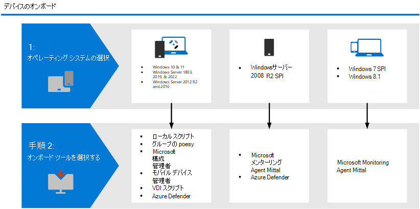

# Defender for Endpoint のデバイスWindowsオンボーディング ツールとメソッド

[!INCLUDE [Microsoft 365 Defender rebranding](../../includes/microsoft-defender.md)]

**適用対象:**
- [Microsoft Defender for Endpoint](https://go.microsoft.com/fwlink/p/?linkid=2154037)
- [Microsoft 365 Defender](https://go.microsoft.com/fwlink/?linkid=2118804)
- [Microsoft 365 エンドポイントのデータ損失防止 (DLP)](/microsoft-365/compliance/endpoint-dlp-learn-about)
- [Microsoft 365インサイダーリスク管理](/microsoft-365/compliance/insider-risk-management)

> Defender for Endpoint を試す場合は、 [無料試用版にサインアップしてください。](https://signup.microsoft.com/create-account/signup?products=7f379fee-c4f9-4278-b0a1-e4c8c2fcdf7e&ru=https://aka.ms/MDEp2OpenTrial?ocid=docs-wdatp-assignaccess-abovefoldlink)

Defender for Endpoint サービスがセンサー データを取得できるよう、組織内のデバイスを構成する必要があります。 組織内のデバイスを構成するために使用できるさまざまな方法と展開ツールがあります。

一般に、オンボーディングWindowsデバイスを特定し、デバイスまたは環境に適した対応するツールに従います。

## エンドポイントオンボーディング ツール
オンボードするエンドポイントWindowsに応じて、次の表に示す対応するツールまたはメソッドを使用します。

Windowsデバイス | オンボーディング ツールまたはメソッド
:---|:---
|<ul><li> Windows 10</li> <li>Windows Server 1803 および 2019、および 2022</li> <li>Windows Server 2012 R2 および 2016  [[1](#fn1)]</li></ul>  |   [ローカル スクリプト (最大 10 台のデバイス)](configure-endpoints-script.md)    [グループ ポリシー](configure-endpoints-gp.md)    [Microsoft Endpoint Configuration Manager](configure-endpoints-sccm.md)   [Microsoft エンドポイント マネージャー/ モバイル デバイス管理 (Intune)](configure-endpoints-mdm.md)     [VDI スクリプト](configure-endpoints-vdi.md)    **注**: ローカル スクリプトは概念実証に適していますが、実稼働環境での展開には使用できません。 実稼働展開の場合は、グループ ポリシー、グループ ポリシー、Microsoft Endpoint Configuration Manager Intune を使用することをお勧めします。
|<ul><li> Windows Server 2008 R2 SP1 </li></ul>| [Microsoft Monitoring Agent (MMA)](onboard-downlevel.md)  [クラウド用の以前のバージョンの](onboard-downlevel.md)Windows[または Microsoft Defender for Cloud のオンボード](/azure/security-center/security-center-wdatp)    **注**: Microsoft Monitoring Agent Azure Log Analytics エージェントです。 詳細については [、「Log Analytics エージェントの概要」を参照してください](/azure/azure-monitor/platform/log-analytics-agent)。  
|<ul><li> Windows 7 SP1 </li> <li>  Windows 7 SP1 Pro </li> <li>  Windows 8.1 Pro </li> <li> Windows 8.1 Enterprise</li></ul>  | [Microsoft Monitoring Agent (MMA)](onboard-downlevel.md)    **注**: Microsoft Monitoring Agent Azure Log Analytics エージェントです。 詳細については [、「Log Analytics エージェントの概要」を参照してください](/azure/azure-monitor/platform/log-analytics-agent)。

(<a id="fn1">1</a>) Windows Server 2016および Windows Server 2012 R2 は、オンボード サーバーの指示に従ってオンボード[Windowsがあります](configure-server-endpoints.md#windows-server-2012-r2-and-windows-server-2016)。

トピック|説明
:---|:---
[グループ ポリシーを使用してデバイスをオンボードする](configure-endpoints-gp.md)|グループ ポリシーを使用して構成パッケージをデバイスに展開します。
[Microsoft Endpoint Configuration Manager を使用したデバイスのオンボード](configure-endpoints-sccm.md)|Microsoft エンドポイント マネージャー (現在のブランチ) バージョン 1606 または Microsoft エンドポイント マネージャー (現在のブランチ) バージョン 1602 以前を使用して、デバイスに構成パッケージを展開できます。
[モバイル デバイス管理ツールを使用したデバイスのオンボード](configure-endpoints-mdm.md)|モバイル デバイス管理ツールまたは Microsoft Intune を使用して、構成パッケージをデバイスに展開します。
[ローカル スクリプトを使用したデバイスのオンボード](configure-endpoints-script.md)|ローカル スクリプトを使用してエンドポイントに構成パッケージを展開する方法について説明します。
[非永続的な仮想デスクトップ インフラストラクチャ (VDI) デバイスのオンボード](configure-endpoints-vdi.md)|構成パッケージを使用して VDI デバイスを構成する方法について説明します。

> Defender for Endpoint を試す場合は、 [無料試用版にサインアップしてください。](https://signup.microsoft.com/create-account/signup?products=7f379fee-c4f9-4278-b0a1-e4c8c2fcdf7e&ru=https://aka.ms/MDEp2OpenTrial?ocid=docs-wdatp-configureendpoints-belowfoldlink)

デバイスのオンボード後、検出テストを実行して、デバイスがサービスに適切にオンボードされていることを確認できます。 詳細については、「新しくオンボードされた Microsoft Defender for Endpoint デバイスで検出テストを実行する [」を参照してください](run-detection-test.md)。
