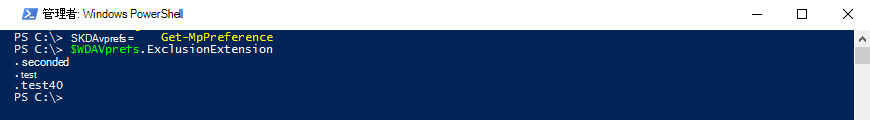

# <a name="configure-and-validate-exclusions-based-on-file-extension-and-folder-location"></a><span data-ttu-id="c023d-104">ファイル拡張子とフォルダーの場所に基づいて除外を構成および検証する</span><span class="sxs-lookup"><span data-stu-id="c023d-104">Configure and validate exclusions based on file extension and folder location</span></span>


<span data-ttu-id="c023d-105">**適用対象:**</span><span class="sxs-lookup"><span data-stu-id="c023d-105">**Applies to:**</span></span>

- [<span data-ttu-id="c023d-106">Microsoft Defender for Endpoint</span><span class="sxs-lookup"><span data-stu-id="c023d-106">Microsoft Defender for Endpoint</span></span>](/microsoft-365/security/defender-endpoint/)

> [!IMPORTANT]
> <span data-ttu-id="c023d-107">Microsoft Defender ウイルス対策除外は、エンドポイントの検出と応答[(EDR)、](/microsoft-365/security/defender-endpoint/overview-endpoint-detection-response)攻撃表面の縮小[(ASR)](/microsoft-365/security/defender-endpoint/attack-surface-reduction)ルール、フォルダー アクセスの制御など、他の Microsoft Defender for Endpoint 機能には[適用されません](/microsoft-365/security/defender-endpoint/controlled-folders)。</span><span class="sxs-lookup"><span data-stu-id="c023d-107">Microsoft Defender Antivirus exclusions don't apply to other Microsoft Defender for Endpoint capabilities, including [endpoint detection and response (EDR)](/microsoft-365/security/defender-endpoint/overview-endpoint-detection-response), [attack surface reduction (ASR) rules](/microsoft-365/security/defender-endpoint/attack-surface-reduction), and [controlled folder access](/microsoft-365/security/defender-endpoint/controlled-folders).</span></span> <span data-ttu-id="c023d-108">この記事で説明する方法を使用して除外するファイルは、アラートや他の検出EDRトリガーできます。</span><span class="sxs-lookup"><span data-stu-id="c023d-108">Files that you exclude using the methods described in this article can still trigger EDR alerts and other detections.</span></span> <span data-ttu-id="c023d-109">ファイルを広く除外するには、Microsoft Defender for Endpoint カスタム インジケーターに [ファイルを追加します](/microsoft-365/security/defender-endpoint/manage-indicators)。</span><span class="sxs-lookup"><span data-stu-id="c023d-109">To exclude files broadly, add them to the Microsoft Defender for Endpoint [custom indicators](/microsoft-365/security/defender-endpoint/manage-indicators).</span></span>

## <a name="exclusion-lists"></a><span data-ttu-id="c023d-110">除外リスト</span><span class="sxs-lookup"><span data-stu-id="c023d-110">Exclusion lists</span></span>

<span data-ttu-id="c023d-111">除外リストを変更することで、特定のファイルMicrosoft Defender ウイルス対策スキャンから除外できます。</span><span class="sxs-lookup"><span data-stu-id="c023d-111">You can exclude certain files from Microsoft Defender Antivirus scans by modifying exclusion lists.</span></span> <span data-ttu-id="c023d-112">**一般に、除外を適用する必要はない必要があります**。</span><span class="sxs-lookup"><span data-stu-id="c023d-112">**Generally, you shouldn't need to apply exclusions**.</span></span> <span data-ttu-id="c023d-113">Microsoft Defender ウイルス対策には、既知のオペレーティング システムの動作や一般的な管理ファイル (エンタープライズ管理、データベース管理、その他のエンタープライズ シナリオや状況で使用されるファイルなど) に基づく多くの自動除外が含まれます。</span><span class="sxs-lookup"><span data-stu-id="c023d-113">Microsoft Defender Antivirus includes many automatic exclusions based on known operating system behaviors and typical management files, such as those used in enterprise management, database management, and other enterprise scenarios and situations.</span></span>

> [!NOTE]
> <span data-ttu-id="c023d-114">除外は、望ましくない可能性のあるアプリ (PUA) の検出にも適用されます。</span><span class="sxs-lookup"><span data-stu-id="c023d-114">Exclusions apply to Potentially Unwanted Apps (PUA) detections as well.</span></span>

> [!NOTE]
> <span data-ttu-id="c023d-115">自動除外は、その他のWindows Server 2016にのみ適用されます。</span><span class="sxs-lookup"><span data-stu-id="c023d-115">Automatic exclusions apply only to Windows Server 2016 and above.</span></span> <span data-ttu-id="c023d-116">これらの除外は、アプリと PowerShell のWindows セキュリティ表示されません。</span><span class="sxs-lookup"><span data-stu-id="c023d-116">These exclusions are not visible in the Windows Security app and in PowerShell.</span></span>

<span data-ttu-id="c023d-117">この記事では、ファイルとフォルダーの除外リストを構成する方法について説明します。</span><span class="sxs-lookup"><span data-stu-id="c023d-117">This article  describes how to configure exclusion lists for the files and folders.</span></span> <span data-ttu-id="c023d-118">除外 [リストを定義する前に、「除外を](configure-exclusions-microsoft-defender-antivirus.md#recommendations-for-defining-exclusions) 定義するための推奨事項」を参照してください。</span><span class="sxs-lookup"><span data-stu-id="c023d-118">See [Recommendations for defining exclusions](configure-exclusions-microsoft-defender-antivirus.md#recommendations-for-defining-exclusions) before defining your exclusion lists.</span></span>

| <span data-ttu-id="c023d-119">除外</span><span class="sxs-lookup"><span data-stu-id="c023d-119">Exclusion</span></span> | <span data-ttu-id="c023d-120">例</span><span class="sxs-lookup"><span data-stu-id="c023d-120">Examples</span></span> | <span data-ttu-id="c023d-121">除外リスト</span><span class="sxs-lookup"><span data-stu-id="c023d-121">Exclusion list</span></span> |
|:---|:---|:---|
|<span data-ttu-id="c023d-122">特定の拡張子を持つファイル</span><span class="sxs-lookup"><span data-stu-id="c023d-122">Any file with a specific extension</span></span> | <span data-ttu-id="c023d-123">指定した拡張子を持つすべてのファイル (コンピューター上の任意の場所)。</span><span class="sxs-lookup"><span data-stu-id="c023d-123">All files with the specified extension, anywhere on the machine.</span></span> <p> <span data-ttu-id="c023d-124">有効な構文: `.test` と `test`</span><span class="sxs-lookup"><span data-stu-id="c023d-124">Valid syntax: `.test` and `test`</span></span>  | <span data-ttu-id="c023d-125">拡張機能の除外</span><span class="sxs-lookup"><span data-stu-id="c023d-125">Extension exclusions</span></span> |
|<span data-ttu-id="c023d-126">特定のフォルダーの下のファイル</span><span class="sxs-lookup"><span data-stu-id="c023d-126">Any file under a specific folder</span></span> | <span data-ttu-id="c023d-127">フォルダーの下のすべての `c:\test\sample` ファイル</span><span class="sxs-lookup"><span data-stu-id="c023d-127">All files under the `c:\test\sample` folder</span></span> | <span data-ttu-id="c023d-128">ファイルとフォルダーの除外</span><span class="sxs-lookup"><span data-stu-id="c023d-128">File and folder exclusions</span></span> |
| <span data-ttu-id="c023d-129">特定のフォルダー内の特定のファイル</span><span class="sxs-lookup"><span data-stu-id="c023d-129">A specific file in a specific folder</span></span> | <span data-ttu-id="c023d-130">ファイル `c:\sample\sample.test` のみ</span><span class="sxs-lookup"><span data-stu-id="c023d-130">The file `c:\sample\sample.test` only</span></span> | <span data-ttu-id="c023d-131">ファイルとフォルダーの除外</span><span class="sxs-lookup"><span data-stu-id="c023d-131">File and folder exclusions</span></span> |
| <span data-ttu-id="c023d-132">特定のプロセス</span><span class="sxs-lookup"><span data-stu-id="c023d-132">A specific process</span></span> | <span data-ttu-id="c023d-133">実行可能ファイル `c:\test\process.exe`</span><span class="sxs-lookup"><span data-stu-id="c023d-133">The executable file `c:\test\process.exe`</span></span> | <span data-ttu-id="c023d-134">ファイルとフォルダーの除外</span><span class="sxs-lookup"><span data-stu-id="c023d-134">File and folder exclusions</span></span> |

<span data-ttu-id="c023d-135">除外リストには、次の特性があります。</span><span class="sxs-lookup"><span data-stu-id="c023d-135">Exclusion lists have the following characteristics:</span></span>

- <span data-ttu-id="c023d-136">フォルダーの除外は、サブフォルダーが再解析ポイントである場合を含め、そのフォルダーの下のすべてのファイルとフォルダーに適用されます。</span><span class="sxs-lookup"><span data-stu-id="c023d-136">Folder exclusions apply to all files and folders under that folder, unless the subfolder is a reparse point.</span></span> <span data-ttu-id="c023d-137">Reparse ポイントサブフォルダーは個別に除外する必要があります。</span><span class="sxs-lookup"><span data-stu-id="c023d-137">Reparse point subfolders must be excluded separately.</span></span>
- <span data-ttu-id="c023d-138">パスまたはフォルダーが定義されていない場合、ファイル拡張子は、定義された拡張子を持つ任意のファイル名に適用されます。</span><span class="sxs-lookup"><span data-stu-id="c023d-138">File extensions apply to any file name with the defined extension if a path or folder is not defined.</span></span>

> [!IMPORTANT]
> - <span data-ttu-id="c023d-139">アスタリスク ( ) などのワイルドカードを使用 \* すると、除外ルールの解釈方法が変更されます。</span><span class="sxs-lookup"><span data-stu-id="c023d-139">Using wildcards such as the asterisk (\*) will alter how the exclusion rules are interpreted.</span></span> <span data-ttu-id="c023d-140">ワイルドカードの [動作に関する重要な](#use-wildcards-in-the-file-name-and-folder-path-or-extension-exclusion-lists) 情報については、「ファイル名とフォルダー パスまたは拡張子の除外リストでワイルドカードを使用する」セクションを参照してください。</span><span class="sxs-lookup"><span data-stu-id="c023d-140">See the [Use wildcards in the file name and folder path or extension exclusion lists](#use-wildcards-in-the-file-name-and-folder-path-or-extension-exclusion-lists) section for important information about how wildcards work.</span></span>
> - <span data-ttu-id="c023d-141">マップされたネットワーク ドライブを除外することはできません。</span><span class="sxs-lookup"><span data-stu-id="c023d-141">You cannot exclude mapped network drives.</span></span> <span data-ttu-id="c023d-142">実際のネットワーク パスを指定する必要があります。</span><span class="sxs-lookup"><span data-stu-id="c023d-142">You must specify the actual network path.</span></span>
> - <span data-ttu-id="c023d-143">Microsoft Defender ウイルス対策 サービスの開始後に作成され、除外リストに追加された再解析ポイントであるフォルダーは含まれません。</span><span class="sxs-lookup"><span data-stu-id="c023d-143">Folders that are reparse points that are created after the Microsoft Defender Antivirus service starts and that have been added to the exclusion list will not be included.</span></span> <span data-ttu-id="c023d-144">新しい再解析ポイントを有効な除外ターゲットとして認識するには、Windows を再起動してサービスを再起動する必要があります。</span><span class="sxs-lookup"><span data-stu-id="c023d-144">You must restart the service (by restarting Windows) for new reparse points to be recognized as a valid exclusion target.</span></span>

<span data-ttu-id="c023d-145">特定のプロセスで開いたファイルを除外するには、「プロセスで開いたファイルの除外を構成して検証 [する」を参照してください](configure-process-opened-file-exclusions-microsoft-defender-antivirus.md)。</span><span class="sxs-lookup"><span data-stu-id="c023d-145">To exclude files opened by a specific process, see [Configure and validate exclusions for files opened by processes](configure-process-opened-file-exclusions-microsoft-defender-antivirus.md).</span></span>

<span data-ttu-id="c023d-146">除外は、スケジュールされたスキャン[、](scheduled-catch-up-scans-microsoft-defender-antivirus.md)[オンデマンド](run-scan-microsoft-defender-antivirus.md)スキャン、リアルタイム保護[に適用されます](configure-real-time-protection-microsoft-defender-antivirus.md)。</span><span class="sxs-lookup"><span data-stu-id="c023d-146">The exclusions apply to [scheduled scans](scheduled-catch-up-scans-microsoft-defender-antivirus.md), [on-demand scans](run-scan-microsoft-defender-antivirus.md), and [real-time protection](configure-real-time-protection-microsoft-defender-antivirus.md).</span></span>

> [!IMPORTANT]
> <span data-ttu-id="c023d-147">グループ ポリシーで行われた除外リストの変更 **は、** アプリ内のリスト [にWindows セキュリティされます](microsoft-defender-security-center-antivirus.md)。</span><span class="sxs-lookup"><span data-stu-id="c023d-147">Exclusion list changes made with Group Policy **will show** in the lists in the [Windows Security app](microsoft-defender-security-center-antivirus.md).</span></span>
> <span data-ttu-id="c023d-148">アプリで行われたWindows セキュリティ **グループ** ポリシー リストには表示されない。</span><span class="sxs-lookup"><span data-stu-id="c023d-148">Changes made in the Windows Security app **will not show** in the Group Policy lists.</span></span>

<span data-ttu-id="c023d-149">既定では、リストに対して行われたローカルの変更 (PowerShell および WMI による変更を含む管理者特権を持つユーザー) は、グループ ポリシー、Configuration Manager、Intune によって定義 (展開) されたリストと結合されます。</span><span class="sxs-lookup"><span data-stu-id="c023d-149">By default, local changes made to the lists (by users with administrator privileges, including changes made with PowerShell and WMI) will be merged with the lists as defined (and deployed) by Group Policy, Configuration Manager, or Intune.</span></span> <span data-ttu-id="c023d-150">グループ ポリシーの一覧は、競合がある場合に優先されます。</span><span class="sxs-lookup"><span data-stu-id="c023d-150">The Group Policy lists take precedence when there are conflicts.</span></span>

<span data-ttu-id="c023d-151">ローカルで [定義された除外リスト](configure-local-policy-overrides-microsoft-defender-antivirus.md#merge-lists) とグローバルに定義された除外リストの結合方法を構成して、ローカルの変更で管理展開設定を上書きできます。</span><span class="sxs-lookup"><span data-stu-id="c023d-151">You can [configure how locally and globally defined exclusions lists are merged](configure-local-policy-overrides-microsoft-defender-antivirus.md#merge-lists) to allow local changes to override managed deployment settings.</span></span>

## <a name="configure-the-list-of-exclusions-based-on-folder-name-or-file-extension"></a><span data-ttu-id="c023d-152">フォルダー名またはファイル拡張子に基づいて除外の一覧を構成する</span><span class="sxs-lookup"><span data-stu-id="c023d-152">Configure the list of exclusions based on folder name or file extension</span></span>

### <a name="use-intune-to-configure-file-name-folder-or-file-extension-exclusions"></a><span data-ttu-id="c023d-153">Intune を使用してファイル名、フォルダー、またはファイル拡張子の除外を構成する</span><span class="sxs-lookup"><span data-stu-id="c023d-153">Use Intune to configure file name, folder, or file extension exclusions</span></span>

<span data-ttu-id="c023d-154">次の記事をご覧ください。</span><span class="sxs-lookup"><span data-stu-id="c023d-154">See the following articles:</span></span>
- [<span data-ttu-id="c023d-155">デバイス制限の設定を構成Microsoft Intune</span><span class="sxs-lookup"><span data-stu-id="c023d-155">Configure device restriction settings in Microsoft Intune</span></span>](/intune/device-restrictions-configure)
- [<span data-ttu-id="c023d-156">Microsoft Defender ウイルス対策 Intune のデバイス制限Windows 10設定</span><span class="sxs-lookup"><span data-stu-id="c023d-156">Microsoft Defender Antivirus device restriction settings for Windows 10 in Intune</span></span>](/intune/device-restrictions-windows-10#microsoft-defender-antivirus)

### <a name="use-configuration-manager-to-configure-file-name-folder-or-file-extension-exclusions"></a><span data-ttu-id="c023d-157">Configuration Manager を使用してファイル名、フォルダー、またはファイル拡張子の除外を構成する</span><span class="sxs-lookup"><span data-stu-id="c023d-157">Use Configuration Manager to configure file name, folder, or file extension exclusions</span></span>

<span data-ttu-id="c023d-158">詳細[については、「マルウェア対策ポリシーを作成](/configmgr/protect/deploy-use/endpoint-antimalware-policies#exclusion-settings)して展開する方法: 除外設定」を参照Microsoft エンドポイント マネージャー (現在のブランチ)。</span><span class="sxs-lookup"><span data-stu-id="c023d-158">See [How to create and deploy antimalware policies: Exclusion settings](/configmgr/protect/deploy-use/endpoint-antimalware-policies#exclusion-settings) for details on configuring Microsoft Endpoint Manager (current branch).</span></span>

### <a name="use-group-policy-to-configure-folder-or-file-extension-exclusions"></a><span data-ttu-id="c023d-159">グループ ポリシーを使用してフォルダーまたはファイル拡張子の除外を構成する</span><span class="sxs-lookup"><span data-stu-id="c023d-159">Use Group Policy to configure folder or file extension exclusions</span></span>

>[!NOTE]
><span data-ttu-id="c023d-160">ファイルへの完全修飾パスを指定すると、そのファイルだけが除外されます。</span><span class="sxs-lookup"><span data-stu-id="c023d-160">If you specify a fully qualified path to a file, then only that file is excluded.</span></span> <span data-ttu-id="c023d-161">フォルダーが除外で定義されている場合、そのフォルダーの下のすべてのファイルとサブディレクトリは除外されます。</span><span class="sxs-lookup"><span data-stu-id="c023d-161">If a folder is defined in the exclusion, then all files and subdirectories under that folder are excluded.</span></span>

1. <span data-ttu-id="c023d-162">グループ ポリシー管理コンピューターで、グループ ポリシー [管理](/previous-versions/windows/it-pro/windows-server-2008-R2-and-2008/cc731212(v=ws.11))コンソールを開き、構成するグループ ポリシー オブジェクトを右クリックし、[編集] をクリック **します**。</span><span class="sxs-lookup"><span data-stu-id="c023d-162">On your Group Policy management computer, open the [Group Policy Management Console](/previous-versions/windows/it-pro/windows-server-2008-R2-and-2008/cc731212(v=ws.11)), right-click the Group Policy Object you want to configure and click **Edit**.</span></span>

2. <span data-ttu-id="c023d-163">グループ ポリシー **管理エディターで、[コンピューター** の構成] に **移動し、[** 管理用 **テンプレート] を選択します**。</span><span class="sxs-lookup"><span data-stu-id="c023d-163">In the **Group Policy Management Editor** go to **Computer configuration** and select **Administrative templates**.</span></span>

3. <span data-ttu-id="c023d-164">ツリーを展開して、[**除外Windowsコンポーネント**  >  **Microsoft Defender ウイルス対策**  >  **展開します**。</span><span class="sxs-lookup"><span data-stu-id="c023d-164">Expand the tree to **Windows components** > **Microsoft Defender Antivirus** > **Exclusions**.</span></span>

4. <span data-ttu-id="c023d-165">編集用 **に [パスの除外]** 設定を開き、除外を追加します。</span><span class="sxs-lookup"><span data-stu-id="c023d-165">Open the **Path Exclusions** setting for editing, and add your exclusions.</span></span>

    1. <span data-ttu-id="c023d-166">オプションを [有効] に **設定します**。</span><span class="sxs-lookup"><span data-stu-id="c023d-166">Set the option to **Enabled**.</span></span>
    1. <span data-ttu-id="c023d-167">[オプション] **セクションで** 、[表示] **をクリックします**。</span><span class="sxs-lookup"><span data-stu-id="c023d-167">Under the **Options** section, click **Show**.</span></span>
    1. <span data-ttu-id="c023d-168">[値名] 列の下の各フォルダーを独自 **の行に指定** します。</span><span class="sxs-lookup"><span data-stu-id="c023d-168">Specify each folder on its own line under the **Value name** column.</span></span>
    1. <span data-ttu-id="c023d-169">ファイルを指定する場合は、ドライブ文字、フォルダー パス、ファイル名、拡張子など、ファイルへの完全修飾パスを入力してください。</span><span class="sxs-lookup"><span data-stu-id="c023d-169">If you are specifying a file, ensure that you enter a fully qualified path to the file, including the drive letter, folder path, file name, and extension.</span></span> <span data-ttu-id="c023d-170">[値 **] 列に「0」\*\*\*\*と入力** します。</span><span class="sxs-lookup"><span data-stu-id="c023d-170">Enter **0** in the **Value** column.</span></span>

5. <span data-ttu-id="c023d-171">その後で、**[OK]** を選択します。</span><span class="sxs-lookup"><span data-stu-id="c023d-171">Choose **OK**.</span></span>

6. <span data-ttu-id="c023d-172">[拡張機能 **の除外] 設定を** 開いて編集し、除外を追加します。</span><span class="sxs-lookup"><span data-stu-id="c023d-172">Open the **Extension Exclusions** setting for editing and add your exclusions.</span></span>

    1. <span data-ttu-id="c023d-173">オプションを [有効] に **設定します**。</span><span class="sxs-lookup"><span data-stu-id="c023d-173">Set the option to **Enabled**.</span></span>
    1. <span data-ttu-id="c023d-174">[オプション] **セクションで** 、[表示] **を選択します**。</span><span class="sxs-lookup"><span data-stu-id="c023d-174">Under the **Options** section, select **Show**.</span></span>
    1. <span data-ttu-id="c023d-175">[値名] 列の下に、それぞれのファイル拡張子 **を独自の行に入力** します。</span><span class="sxs-lookup"><span data-stu-id="c023d-175">Enter each file extension on its own line under the **Value name** column.</span></span>  <span data-ttu-id="c023d-176">[値 **] 列に「0」\*\*\*\*と入力** します。</span><span class="sxs-lookup"><span data-stu-id="c023d-176">Enter **0** in the **Value** column.</span></span>

7. <span data-ttu-id="c023d-177">その後で、**[OK]** を選択します。</span><span class="sxs-lookup"><span data-stu-id="c023d-177">Choose **OK**.</span></span>

<a id="ps"></a>

### <a name="use-powershell-cmdlets-to-configure-file-name-folder-or-file-extension-exclusions"></a><span data-ttu-id="c023d-178">PowerShell コマンドレットを使用してファイル名、フォルダー、またはファイル拡張子の除外を構成する</span><span class="sxs-lookup"><span data-stu-id="c023d-178">Use PowerShell cmdlets to configure file name, folder, or file extension exclusions</span></span>

<span data-ttu-id="c023d-179">PowerShell を使用して、拡張子、場所、またはファイル名に基づいてファイルの除外を追加または削除するには、3 つのコマンドレットと適切な除外リスト パラメーターを組み合わせて使用する必要があります。</span><span class="sxs-lookup"><span data-stu-id="c023d-179">Using PowerShell to add or remove exclusions for files based on the extension, location, or file name requires using a combination of three cmdlets and the appropriate exclusion list parameter.</span></span> <span data-ttu-id="c023d-180">コマンドレットはすべて Defender モジュール [内です](/powershell/module/defender/)。</span><span class="sxs-lookup"><span data-stu-id="c023d-180">The cmdlets are all in the [Defender module](/powershell/module/defender/).</span></span>

<span data-ttu-id="c023d-181">コマンドレットの形式は次のとおりです。</span><span class="sxs-lookup"><span data-stu-id="c023d-181">The format for the cmdlets is as follows:</span></span>

```PowerShell
<cmdlet> -<exclusion list> "<item>"
```

<span data-ttu-id="c023d-182">以下を次のように使用できます `<cmdlet>` 。</span><span class="sxs-lookup"><span data-stu-id="c023d-182">The following are allowed as the `<cmdlet>`:</span></span>

| <span data-ttu-id="c023d-183">構成アクション</span><span class="sxs-lookup"><span data-stu-id="c023d-183">Configuration action</span></span> | <span data-ttu-id="c023d-184">PowerShell コマンドレット</span><span class="sxs-lookup"><span data-stu-id="c023d-184">PowerShell cmdlet</span></span> |
|:---|:---|
|<span data-ttu-id="c023d-185">リストを作成または上書きする</span><span class="sxs-lookup"><span data-stu-id="c023d-185">Create or overwrite the list</span></span> | `Set-MpPreference` |
|<span data-ttu-id="c023d-186">リストに追加する</span><span class="sxs-lookup"><span data-stu-id="c023d-186">Add to the list</span></span> | `Add-MpPreference` |
|<span data-ttu-id="c023d-187">リストからアイテムを削除する</span><span class="sxs-lookup"><span data-stu-id="c023d-187">Remove item from the list</span></span> | `Remove-MpPreference` |

<span data-ttu-id="c023d-188">以下を次のように使用できます `<exclusion list>` 。</span><span class="sxs-lookup"><span data-stu-id="c023d-188">The following are allowed as the `<exclusion list>`:</span></span>

| <span data-ttu-id="c023d-189">除外の種類</span><span class="sxs-lookup"><span data-stu-id="c023d-189">Exclusion type</span></span> | <span data-ttu-id="c023d-190">PowerShell パラメーター</span><span class="sxs-lookup"><span data-stu-id="c023d-190">PowerShell parameter</span></span> |
|:---|:---|
| <span data-ttu-id="c023d-191">指定したファイル拡張子を持つすべてのファイル</span><span class="sxs-lookup"><span data-stu-id="c023d-191">All files with a specified file extension</span></span> | `-ExclusionExtension` |
| <span data-ttu-id="c023d-192">フォルダーの下のすべてのファイル (サブディレクトリ内のファイルを含む)、または特定のファイル</span><span class="sxs-lookup"><span data-stu-id="c023d-192">All files under a folder (including files in subdirectories), or a specific file</span></span> | `-ExclusionPath` |

> [!IMPORTANT]
> <span data-ttu-id="c023d-193">コマンドレットを使用するか、または使用してリストを作成した場合は、 `Set-MpPreference` `Add-MpPreference` `Set-MpPreference` 既存のリストが上書きされます。</span><span class="sxs-lookup"><span data-stu-id="c023d-193">If you have created a list, either with `Set-MpPreference` or `Add-MpPreference`, using the `Set-MpPreference` cmdlet again will overwrite the existing list.</span></span>

<span data-ttu-id="c023d-194">たとえば、次のコード スニペットを使用すると、Microsoft Defender ウイルス対策ファイル拡張子を持つファイルが `.test` 除外されます。</span><span class="sxs-lookup"><span data-stu-id="c023d-194">For example, the following code snippet would cause Microsoft Defender Antivirus scans to exclude any file with the `.test` file extension:</span></span>

```PowerShell
Add-MpPreference -ExclusionExtension ".test"
```

<span data-ttu-id="c023d-195">詳細については、「[PowerShell コマンドレットを使用して Microsoft Defender ウイルス対策を構成および実行する](use-powershell-cmdlets-microsoft-defender-antivirus.md)」および「[Defender コマンドレット](/powershell/module/defender/)」を参照してください。</span><span class="sxs-lookup"><span data-stu-id="c023d-195">For more information, see [Use PowerShell cmdlets to configure and run Microsoft Defender Antivirus](use-powershell-cmdlets-microsoft-defender-antivirus.md) and [Defender cmdlets](/powershell/module/defender/).</span></span>

### <a name="use-windows-management-instruction-wmi-to-configure-file-name-folder-or-file-extension-exclusions"></a><span data-ttu-id="c023d-196">[Windows管理命令 (WMI) を使用して、ファイル名、フォルダー、またはファイル拡張子の除外を構成する</span><span class="sxs-lookup"><span data-stu-id="c023d-196">Use Windows Management Instruction (WMI) to configure file name, folder, or file extension exclusions</span></span>

<span data-ttu-id="c023d-197">次の [**プロパティの\*\*\*\*クラスの** **Set メソッド、Add** **メソッド、Remove**](/previous-versions/windows/desktop/legacy/dn455323(v=vs.85))メソッドMSFT_MpPreference使用します。</span><span class="sxs-lookup"><span data-stu-id="c023d-197">Use the [**Set**, **Add**, and **Remove** methods of the **MSFT_MpPreference**](/previous-versions/windows/desktop/legacy/dn455323(v=vs.85)) class for the following properties:</span></span>

```WMI
ExclusionExtension
ExclusionPath
```

<span data-ttu-id="c023d-198">**Set、Add、\*\*\*\*および** **Remove** の使用は、PowerShell の対応するユーザーと類似 `Set-MpPreference` しています。 `Add-MpPreference` `Remove-MpPreference`</span><span class="sxs-lookup"><span data-stu-id="c023d-198">The use of **Set**, **Add**, and **Remove** is analogous to their counterparts in PowerShell: `Set-MpPreference`, `Add-MpPreference`, and `Remove-MpPreference`.</span></span>

<span data-ttu-id="c023d-199">詳細については[、「WMIv2 API Windows Defenderを参照してください](/previous-versions/windows/desktop/defender/windows-defender-wmiv2-apis-portal)。</span><span class="sxs-lookup"><span data-stu-id="c023d-199">For more information, see [Windows Defender WMIv2 APIs](/previous-versions/windows/desktop/defender/windows-defender-wmiv2-apis-portal).</span></span>

<a id="man-tools"></a>

### <a name="use-the-windows-security-app-to-configure-file-name-folder-or-file-extension-exclusions"></a><span data-ttu-id="c023d-200">ファイル名、Windows セキュリティ、またはファイル拡張子の除外を構成するには、アプリを使用します。</span><span class="sxs-lookup"><span data-stu-id="c023d-200">Use the Windows Security app to configure file name, folder, or file extension exclusions</span></span>

<span data-ttu-id="c023d-201">手順[については、「アプリの除外をWindows セキュリティする」](microsoft-defender-security-center-antivirus.md)を参照してください。</span><span class="sxs-lookup"><span data-stu-id="c023d-201">See [Add exclusions in the Windows Security app](microsoft-defender-security-center-antivirus.md) for instructions.</span></span>

<a id="wildcards"></a>

## <a name="use-wildcards-in-the-file-name-and-folder-path-or-extension-exclusion-lists"></a><span data-ttu-id="c023d-202">ファイル名とフォルダー パスまたは拡張子の除外リストでワイルドカードを使用する</span><span class="sxs-lookup"><span data-stu-id="c023d-202">Use wildcards in the file name and folder path or extension exclusion lists</span></span>

<span data-ttu-id="c023d-203">ファイル名またはフォルダー パス除外リストの項目を定義する場合は、アスタリスク、疑問符、環境変数 (など) をワイルドカードとして `*` `?` `%ALLUSERSPROFILE%` 使用できます。</span><span class="sxs-lookup"><span data-stu-id="c023d-203">You can use the asterisk `*`, question mark `?`, or environment variables (such as `%ALLUSERSPROFILE%`) as wildcards when defining items in the file name or folder path exclusion list.</span></span> <span data-ttu-id="c023d-204">これらのワイルドカードの解釈方法は、他のアプリや言語での通常の使用法とは異なります。</span><span class="sxs-lookup"><span data-stu-id="c023d-204">The way in which these wildcards are interpreted differs from their usual usage in other apps and languages.</span></span> <span data-ttu-id="c023d-205">特定の制限について理解するには、必ずこのセクションを参照してください。</span><span class="sxs-lookup"><span data-stu-id="c023d-205">Make sure to read this section to understand their specific limitations.</span></span>

> [!IMPORTANT]
> <span data-ttu-id="c023d-206">次のワイルドカードには、主な制限と使用シナリオがあります。</span><span class="sxs-lookup"><span data-stu-id="c023d-206">There are key limitations and usage scenarios for these wildcards:</span></span>
> - <span data-ttu-id="c023d-207">環境変数の使用は、コンピューター変数と、NT AUTHORITY\SYSTEM アカウントとして実行されているプロセスに適用可能な変数に制限されます。</span><span class="sxs-lookup"><span data-stu-id="c023d-207">Environment variable usage is limited to machine variables and those applicable to processes running as an NT AUTHORITY\SYSTEM account.</span></span>
> - <span data-ttu-id="c023d-208">ドライブ文字の代りでワイルドカードを使用することはできません。</span><span class="sxs-lookup"><span data-stu-id="c023d-208">You cannot use a wildcard in place of a drive letter.</span></span>
> - <span data-ttu-id="c023d-209">フォルダー除外 `*` のアスタリスクは、1 つのフォルダーに対して配置されます。</span><span class="sxs-lookup"><span data-stu-id="c023d-209">An asterisk `*` in a folder exclusion stands in place for a single folder.</span></span> <span data-ttu-id="c023d-210">複数のインスタンスを使用して `\*\` 、名前が指定されていない複数の入れ子になったフォルダーを示します。</span><span class="sxs-lookup"><span data-stu-id="c023d-210">Use multiple instances of `\*\` to indicate multiple nested folders with unspecified names.</span></span>

<span data-ttu-id="c023d-211">次の表では、ワイルドカードの使用方法と例を示します。</span><span class="sxs-lookup"><span data-stu-id="c023d-211">The following table describes how the wildcards can be used and provides some examples.</span></span>


|<span data-ttu-id="c023d-212">ワイルドカード</span><span class="sxs-lookup"><span data-stu-id="c023d-212">Wildcard</span></span>  |<span data-ttu-id="c023d-213">例</span><span class="sxs-lookup"><span data-stu-id="c023d-213">Examples</span></span>  |
|:---------|:---------|
|<span data-ttu-id="c023d-214">`*` (アスタリスク)</span><span class="sxs-lookup"><span data-stu-id="c023d-214">`*` (asterisk)</span></span> <p> <span data-ttu-id="c023d-215">ファイル **名とファイル拡張子** の組み込みでは、アスタリスクは任意の数の文字を置き換え、引数で定義された最後のフォルダー内のファイルにのみ適用されます。</span><span class="sxs-lookup"><span data-stu-id="c023d-215">In **file name and file extension inclusions**, the asterisk replaces any number of characters, and only applies to files in the last folder defined in the argument.</span></span> <p> <span data-ttu-id="c023d-216">フォルダー **の除外では、** アスタリスクによって 1 つのフォルダーが置き換されます。</span><span class="sxs-lookup"><span data-stu-id="c023d-216">In **folder exclusions**, the asterisk replaces a single folder.</span></span> <span data-ttu-id="c023d-217">複数のフォルダー `*` スラッシュを使用して、 `\` 複数の入れ子になったフォルダーを示します。</span><span class="sxs-lookup"><span data-stu-id="c023d-217">Use multiple `*` with folder slashes `\` to indicate multiple nested folders.</span></span> <span data-ttu-id="c023d-218">ワイルドカード フォルダーと名前付きフォルダーの数を一致した後、すべてのサブフォルダーも含まれます。</span><span class="sxs-lookup"><span data-stu-id="c023d-218">After matching the number of wild carded and named folders, all subfolders are also included.</span></span>   | <span data-ttu-id="c023d-219">`C:\MyData\*.txt` を含む `C:\MyData\notes.txt`</span><span class="sxs-lookup"><span data-stu-id="c023d-219">`C:\MyData\*.txt` includes `C:\MyData\notes.txt`</span></span> <p> <span data-ttu-id="c023d-220">`C:\somepath\*\Data` に含まれるファイル `C:\somepath\Archives\Data` とそのサブフォルダー、およびサブ `C:\somepath\Authorized\Data` フォルダー</span><span class="sxs-lookup"><span data-stu-id="c023d-220">`C:\somepath\*\Data` includes any file in `C:\somepath\Archives\Data` and its subfolders, and `C:\somepath\Authorized\Data` and its subfolders</span></span> <p> <span data-ttu-id="c023d-221">`C:\Serv\*\*\Backup` に含まれるファイル `C:\Serv\Primary\Denied\Backup` とそのサブフォルダー `C:\Serv\Secondary\Allowed\Backup` とそのサブフォルダー</span><span class="sxs-lookup"><span data-stu-id="c023d-221">`C:\Serv\*\*\Backup` includes any file in `C:\Serv\Primary\Denied\Backup` and its subfolders and `C:\Serv\Secondary\Allowed\Backup` and its subfolders</span></span>     |
|<span data-ttu-id="c023d-222">`?` (疑問符)</span><span class="sxs-lookup"><span data-stu-id="c023d-222">`?` (question mark)</span></span>  <p> <span data-ttu-id="c023d-223">ファイル **名とファイル拡張子** の包含では、疑問符は 1 文字を置き換え、引数で定義された最後のフォルダー内のファイルにのみ適用されます。</span><span class="sxs-lookup"><span data-stu-id="c023d-223">In **file name and file extension inclusions**, the question mark replaces a single character, and only applies to files in the last folder defined in the argument.</span></span> <p> <span data-ttu-id="c023d-224">フォルダー **の除外では、** 疑問符はフォルダー名の 1 文字を置き換えます。</span><span class="sxs-lookup"><span data-stu-id="c023d-224">In **folder exclusions**, the question mark replaces a single character in a folder name.</span></span> <span data-ttu-id="c023d-225">ワイルドカード フォルダーと名前付きフォルダーの数を一致した後、すべてのサブフォルダーも含まれます。</span><span class="sxs-lookup"><span data-stu-id="c023d-225">After matching the number of wild carded and named folders, all subfolders are also included.</span></span>   |<span data-ttu-id="c023d-226">`C:\MyData\my?.zip` を含む `C:\MyData\my1.zip`</span><span class="sxs-lookup"><span data-stu-id="c023d-226">`C:\MyData\my?.zip` includes `C:\MyData\my1.zip`</span></span> <p> <span data-ttu-id="c023d-227">`C:\somepath\?\Data` ファイルとそのサブフォルダー `C:\somepath\P\Data` を含む</span><span class="sxs-lookup"><span data-stu-id="c023d-227">`C:\somepath\?\Data` includes any file in `C:\somepath\P\Data` and its subfolders</span></span>  <p> <span data-ttu-id="c023d-228">`C:\somepath\test0?\Data` ファイルとそのサブフォルダー `C:\somepath\test01\Data` が含まれる場合</span><span class="sxs-lookup"><span data-stu-id="c023d-228">`C:\somepath\test0?\Data` would include any file in `C:\somepath\test01\Data` and its subfolders</span></span>          |
|<span data-ttu-id="c023d-229">環境変数</span><span class="sxs-lookup"><span data-stu-id="c023d-229">Environment variables</span></span> <p> <span data-ttu-id="c023d-230">定義された変数は、除外が評価される際にパスとして設定されます。</span><span class="sxs-lookup"><span data-stu-id="c023d-230">The defined variable is populated as a path when the exclusion is evaluated.</span></span>          |<span data-ttu-id="c023d-231">`%ALLUSERSPROFILE%\CustomLogFiles` を含む `C:\ProgramData\CustomLogFiles\Folder1\file1.txt`</span><span class="sxs-lookup"><span data-stu-id="c023d-231">`%ALLUSERSPROFILE%\CustomLogFiles` would include `C:\ProgramData\CustomLogFiles\Folder1\file1.txt`</span></span>         |
        

> [!IMPORTANT]
> <span data-ttu-id="c023d-232">ファイル除外引数とフォルダー除外引数を混在すると、ルールは一致したフォルダーの file 引数一致で停止し、サブフォルダー内のファイル一致は検索されません。</span><span class="sxs-lookup"><span data-stu-id="c023d-232">If you mix a file exclusion argument with a folder exclusion argument, the rules will stop at the file argument match in the matched folder, and will not look for file matches in any subfolders.</span></span>
> <span data-ttu-id="c023d-233">たとえば、フォルダー内の "date" で始まるすべてのファイルを除外し、rule 引数 `c:\data\final\marked` `c:\data\review\marked` を使用して除外できます `c:\data\*\marked\date*` 。</span><span class="sxs-lookup"><span data-stu-id="c023d-233">For example, you can exclude all files that start with "date" in the folders `c:\data\final\marked` and `c:\data\review\marked` by using the rule argument `c:\data\*\marked\date*`.</span></span>
> <span data-ttu-id="c023d-234">ただし、この引数はサブフォルダーまたはサブフォルダー内のファイルと一致 `c:\data\final\marked` しません `c:\data\review\marked` 。</span><span class="sxs-lookup"><span data-stu-id="c023d-234">This argument, however, will not match any files in subfolders under `c:\data\final\marked` or `c:\data\review\marked`.</span></span>

<a id="review"></a>

### <a name="system-environment-variables"></a><span data-ttu-id="c023d-235">システム環境変数</span><span class="sxs-lookup"><span data-stu-id="c023d-235">System environment variables</span></span>

<span data-ttu-id="c023d-236">次の表に、システム アカウント環境変数の一覧と説明を示します。</span><span class="sxs-lookup"><span data-stu-id="c023d-236">The following table lists and describes the system account environment variables.</span></span> 

| <span data-ttu-id="c023d-237">このシステム環境変数...</span><span class="sxs-lookup"><span data-stu-id="c023d-237">This system environment variable...</span></span> | <span data-ttu-id="c023d-238">リダイレクト先</span><span class="sxs-lookup"><span data-stu-id="c023d-238">Redirects to this</span></span> |
|:--|:--|
| `%APPDATA%`| `C:\Users\UserName.DomainName\AppData\Roaming` |
| `%APPDATA%\Microsoft\Internet Explorer\Quick Launch` | `C:\Windows\System32\config\systemprofile\AppData\Roaming\Microsoft\Internet Explorer\Quick Launch` |
| `%APPDATA%\Microsoft\Windows\Start Menu` | `C:\Windows\System32\config\systemprofile\AppData\Roaming\Microsoft\Windows\Start Menu` |
| `%APPDATA%\Microsoft\Windows\Start Menu\Programs` | `C:\Windows\System32\config\systemprofile\AppData\Roaming\Microsoft\Windows\Start Menu\Programs` |
| `%LOCALAPPDATA%` | `C:\Windows\System32\config\systemprofile\AppData\Local` |
| `%ProgramData%` | `C:\ProgramData` |
| `%ProgramFiles%` | `C:\Program Files` |
| `%ProgramFiles%\Common Files` | `C:\Program Files\Common Files` |
| `%ProgramFiles%\Windows Sidebar\Gadgets` | `C:\Program Files\Windows Sidebar\Gadgets` |
| `%ProgramFiles%\Common Files` | `C:\Program Files\Common Files` |
| `%ProgramFiles(x86)%` | `C:\Program Files (x86)` |
| `%ProgramFiles(x86)%\Common Files` | `C:\Program Files (x86)\Common Files` |
| `%SystemDrive%` | `C:` |
| `%SystemDrive%\Program Files` | `C:\Program Files` |
| `%SystemDrive%\Program Files (x86)` | `C:\Program Files (x86)` |
| `%SystemDrive%\Users` | `C:\Users` |
| `%SystemDrive%\Users\Public` | `C:\Users\Public` |
| `%SystemRoot%` | `C:\Windows` |
| `%windir%` | `C:\Windows` |
| `%windir%\Fonts` | `C:\Windows\Fonts` |
| `%windir%\Resources` | `C:\Windows\Resources` |
| `%windir%\resources\0409` | `C:\Windows\resources\0409` |
| `%windir%\system32` | `C:\Windows\System32` |
| `%ALLUSERSPROFILE%` | `C:\ProgramData` |
| `%ALLUSERSPROFILE%\Application Data` | `C:\ProgramData\Application Data` |
| `%ALLUSERSPROFILE%\Documents` | `C:\ProgramData\Documents` |
| `%ALLUSERSPROFILE%\Documents\My Music\Sample Music` | `C:\ProgramData\Documents\My Music\Sample Music` |
| `%ALLUSERSPROFILE%\Documents\My Music` | `C:\ProgramData\Documents\My Music` |
| `%ALLUSERSPROFILE%\Documents\My Pictures` | `C:\ProgramData\Documents\My Pictures` |
| `%ALLUSERSPROFILE%\Documents\My Pictures\Sample Pictures` | `C:\ProgramData\Documents\My Pictures\Sample Pictures` |
| `%ALLUSERSPROFILE%\Documents\My Videos` | `C:\ProgramData\Documents\My Videos` |
| `%ALLUSERSPROFILE%\Microsoft\Windows\DeviceMetadataStore` | `C:\ProgramData\Microsoft\Windows\DeviceMetadataStore` |
| `%ALLUSERSPROFILE%\Microsoft\Windows\GameExplorer` | `C:\ProgramData\Microsoft\Windows\GameExplorer` |
| `%ALLUSERSPROFILE%\Microsoft\Windows\Ringtones` | `C:\ProgramData\Microsoft\Windows\Ringtones` |
| `%ALLUSERSPROFILE%\Microsoft\Windows\Start Menu` | `C:\ProgramData\Microsoft\Windows\Start Menu` |
| `%ALLUSERSPROFILE%\Microsoft\Windows\Start Menu\Programs` | `C:\ProgramData\Microsoft\Windows\Start Menu\Programs` |
| `%ALLUSERSPROFILE%\Microsoft\Windows\Start Menu\Programs\Administrative Tools` | `C:\ProgramData\Microsoft\Windows\Start Menu\Programs\Administrative Tools` |
| `%ALLUSERSPROFILE%\Microsoft\Windows\Start Menu\Programs\StartUp` | `C:\ProgramData\Microsoft\Windows\Start Menu\Programs\StartUp` |
| `%ALLUSERSPROFILE%\Microsoft\Windows\Templates` | `C:\ProgramData\Microsoft\Windows\Templates` |
| `%ALLUSERSPROFILE%\Start Menu` | `C:\ProgramData\Start Menu` |
| `%ALLUSERSPROFILE%\Start Menu\Programs` | <span data-ttu-id="c023d-239">C:\ProgramData\Start Menu\Programs</span><span class="sxs-lookup"><span data-stu-id="c023d-239">C:\ProgramData\Start Menu\Programs</span></span> |
| `%ALLUSERSPROFILE%\Start Menu\Programs\Administrative Tools` | `C:\ProgramData\Start Menu\Programs\Administrative Tools` | 
| `%ALLUSERSPROFILE%\Templates` | `C:\ProgramData\Templates` |
| `%LOCALAPPDATA%\Microsoft\Windows\ConnectedSearch\Templates` | `C:\Windows\System32\config\systemprofile\AppData\Local\Microsoft\Windows\ConnectedSearch\Templates` |
| `%LOCALAPPDATA%\Microsoft\Windows\History` | `C:\Windows\System32\config\systemprofile\AppData\Local\Microsoft\Windows\History` |
| `%PUBLIC%` | `C:\Users\Public` |
| `%PUBLIC%\AccountPictures` | `C:\Users\Public\AccountPictures` |
| `%PUBLIC%\Desktop` | `C:\Users\Public\Desktop` |
| `%PUBLIC%\Documents` | `C:\Users\Public\Documents` |
| `%PUBLIC%\Downloads` | `C:\Users\Public\Downloads` |
| `%PUBLIC%\Music\Sample Music` | `C:\Users\Public\Music\Sample Music` |
| `%PUBLIC%\Music\Sample Playlists` | `C:\Users\Public\Music\Sample Playlists` |
| `%PUBLIC%\Pictures\Sample Pictures` | `C:\Users\Public\Pictures\Sample Pictures` |
| `%PUBLIC%\RecordedTV.library-ms` | `C:\Users\Public\RecordedTV.library-ms` |
| `%PUBLIC%\Videos` | `C:\Users\Public\Videos` |
| `%PUBLIC%\Videos\Sample Videos` | `C:\Users\Public\Videos\Sample Videos` | 
| `%USERPROFILE%` | `C:\Windows\System32\config\systemprofile` |
| `%USERPROFILE%\AppData\Local` | `C:\Windows\System32\config\systemprofile\AppData\Local` |
| `%USERPROFILE%\AppData\LocalLow` | `C:\Windows\System32\config\systemprofile\AppData\LocalLow` |
| `%USERPROFILE%\AppData\Roaming` | `C:\Windows\System32\config\systemprofile\AppData\Roaming` |


## <a name="review-the-list-of-exclusions"></a><span data-ttu-id="c023d-240">除外の一覧を確認する</span><span class="sxs-lookup"><span data-stu-id="c023d-240">Review the list of exclusions</span></span>

<span data-ttu-id="c023d-241">除外リスト内のアイテムを取得するには、次のいずれかの方法を使用します。</span><span class="sxs-lookup"><span data-stu-id="c023d-241">You can retrieve the items in the exclusion list using one of the following methods:</span></span>
- [<span data-ttu-id="c023d-242">Intune</span><span class="sxs-lookup"><span data-stu-id="c023d-242">Intune</span></span>](/intune/deploy-use/help-secure-windows-pcs-with-endpoint-protection-for-microsoft-intune)
- [<span data-ttu-id="c023d-243">Microsoft Endpoint Configuration Manager</span><span class="sxs-lookup"><span data-stu-id="c023d-243">Microsoft Endpoint Configuration Manager</span></span>](/configmgr/protect/deploy-use/endpoint-antimalware-policies)
- <span data-ttu-id="c023d-244">MpCmdRun</span><span class="sxs-lookup"><span data-stu-id="c023d-244">MpCmdRun</span></span>
- <span data-ttu-id="c023d-245">PowerShell</span><span class="sxs-lookup"><span data-stu-id="c023d-245">PowerShell</span></span>
- [<span data-ttu-id="c023d-246">Windows セキュリティアプリ</span><span class="sxs-lookup"><span data-stu-id="c023d-246">Windows Security app</span></span>](microsoft-defender-security-center-antivirus.md)

>[!IMPORTANT]
><span data-ttu-id="c023d-247">グループ ポリシーで行われた除外リストの変更 **は、** アプリ内のリスト [にWindows セキュリティされます](microsoft-defender-security-center-antivirus.md)。</span><span class="sxs-lookup"><span data-stu-id="c023d-247">Exclusion list changes made with Group Policy **will show** in the lists in the [Windows Security app](microsoft-defender-security-center-antivirus.md).</span></span>
>
><span data-ttu-id="c023d-248">アプリで行われたWindows セキュリティ **グループ** ポリシー リストには表示されない。</span><span class="sxs-lookup"><span data-stu-id="c023d-248">Changes made in the Windows Security app **will not show** in the Group Policy lists.</span></span>

<span data-ttu-id="c023d-249">PowerShell を使用する場合は、次の 2 つの方法でリストを取得できます。</span><span class="sxs-lookup"><span data-stu-id="c023d-249">If you use PowerShell, you can retrieve the list in two ways:</span></span>

- <span data-ttu-id="c023d-250">すべてのユーザー設定のMicrosoft Defender ウイルス対策します。</span><span class="sxs-lookup"><span data-stu-id="c023d-250">Retrieve the status of all Microsoft Defender Antivirus preferences.</span></span> <span data-ttu-id="c023d-251">各リストは別々の行に表示されますが、各リスト内のアイテムは同じ行に結合されます。</span><span class="sxs-lookup"><span data-stu-id="c023d-251">Each list is displayed on separate lines, but the items within each list are combined into the same line.</span></span>
- <span data-ttu-id="c023d-252">すべての基本設定の状態を変数に書き込み、その変数を使用して、関心のある特定のリストのみを呼び出します。</span><span class="sxs-lookup"><span data-stu-id="c023d-252">Write the status of all preferences to a variable, and use that variable to only call the specific list you are interested in.</span></span> <span data-ttu-id="c023d-253">各使用は `Add-MpPreference` 、新しい行に書き込まれます。</span><span class="sxs-lookup"><span data-stu-id="c023d-253">Each use of `Add-MpPreference` is written to a new line.</span></span>

### <a name="validate-the-exclusion-list-by-using-mpcmdrun"></a><span data-ttu-id="c023d-254">MpCmdRun を使用して除外リストを検証する</span><span class="sxs-lookup"><span data-stu-id="c023d-254">Validate the exclusion list by using MpCmdRun</span></span>

<span data-ttu-id="c023d-255">専用のコマンド ライン ツールを使用して除外を確認するには [mpcmdrun.exeコマンドを ](./command-line-arguments-microsoft-defender-antivirus.md?branch=v-anbic-wdav-new-mpcmdrun-options)使用します。</span><span class="sxs-lookup"><span data-stu-id="c023d-255">To check exclusions with the dedicated [command-line tool mpcmdrun.exe](./command-line-arguments-microsoft-defender-antivirus.md?branch=v-anbic-wdav-new-mpcmdrun-options), use the following command:</span></span>

```DOS
Start, CMD (Run as admin)
cd "%programdata%\microsoft\windows defender\platform"
cd 4.18.1812.3 (Where 4.18.1812.3 is this month's MDAV "Platform Update".)
MpCmdRun.exe -CheckExclusion -path <path>
```

>[!NOTE]
><span data-ttu-id="c023d-256">MpCmdRun で除外をチェックするには、Microsoft Defender ウイルス対策 CAMP バージョン 4.18.1812.3 (2018 年 12 月にリリース) 以降が必要です。</span><span class="sxs-lookup"><span data-stu-id="c023d-256">Checking exclusions with MpCmdRun requires Microsoft Defender Antivirus CAMP version 4.18.1812.3 (released in December 2018) or later.</span></span>

### <a name="review-the-list-of-exclusions-alongside-all-other-microsoft-defender-antivirus-preferences-by-using-powershell"></a><span data-ttu-id="c023d-257">PowerShell を使用して、他のすべてのユーザー設定とMicrosoft Defender ウイルス対策一覧を確認する</span><span class="sxs-lookup"><span data-stu-id="c023d-257">Review the list of exclusions alongside all other Microsoft Defender Antivirus preferences by using PowerShell</span></span>

<span data-ttu-id="c023d-258">次のコマンドレットを使用します。</span><span class="sxs-lookup"><span data-stu-id="c023d-258">Use the following cmdlet:</span></span>

```PowerShell
Get-MpPreference
```

<span data-ttu-id="c023d-259">次の例では、リストに含まれるアイテム `ExclusionExtension` が強調表示されます。</span><span class="sxs-lookup"><span data-stu-id="c023d-259">In the following example, the items contained in the `ExclusionExtension` list are highlighted:</span></span>


<span data-ttu-id="c023d-261">詳細については、「[PowerShell コマンドレットを使用して Microsoft Defender ウイルス対策を構成および実行する](use-powershell-cmdlets-microsoft-defender-antivirus.md)」および「[Defender コマンドレット](/powershell/module/defender/)」を参照してください。</span><span class="sxs-lookup"><span data-stu-id="c023d-261">For more information, see [Use PowerShell cmdlets to configure and run Microsoft Defender Antivirus](use-powershell-cmdlets-microsoft-defender-antivirus.md) and [Defender cmdlets](/powershell/module/defender/).</span></span>

### <a name="retrieve-a-specific-exclusions-list-by-using-powershell"></a><span data-ttu-id="c023d-262">PowerShell を使用して特定の除外リストを取得する</span><span class="sxs-lookup"><span data-stu-id="c023d-262">Retrieve a specific exclusions list by using PowerShell</span></span>

<span data-ttu-id="c023d-263">次のコード スニペットを使用します (各行を個別のコマンドとして入力します)。 **WDAVprefs を変数** に名前を付けしたいラベルに置き換える:</span><span class="sxs-lookup"><span data-stu-id="c023d-263">Use the following code snippet (enter each line as a separate command); replace **WDAVprefs** with whatever label you want to name the variable:</span></span>

```PowerShell
$WDAVprefs = Get-MpPreference
$WDAVprefs.ExclusionExtension
$WDAVprefs.ExclusionPath
```

<span data-ttu-id="c023d-264">次の例では、コマンドレットを使用するごとに、リストが新しい行に分割 `Add-MpPreference` されます。</span><span class="sxs-lookup"><span data-stu-id="c023d-264">In the following example, the list is split into new lines for each use of the `Add-MpPreference` cmdlet:</span></span>



<span data-ttu-id="c023d-266">詳細については、「[PowerShell コマンドレットを使用して Microsoft Defender ウイルス対策を構成および実行する](use-powershell-cmdlets-microsoft-defender-antivirus.md)」および「[Defender コマンドレット](/powershell/module/defender/)」を参照してください。</span><span class="sxs-lookup"><span data-stu-id="c023d-266">For more information, see [Use PowerShell cmdlets to configure and run Microsoft Defender Antivirus](use-powershell-cmdlets-microsoft-defender-antivirus.md) and [Defender cmdlets](/powershell/module/defender/).</span></span>

<a id="validate"></a>

## <a name="validate-exclusions-lists-with-the-eicar-test-file"></a><span data-ttu-id="c023d-267">EICAR テスト ファイルを使用して除外リストを検証する</span><span class="sxs-lookup"><span data-stu-id="c023d-267">Validate exclusions lists with the EICAR test file</span></span>

<span data-ttu-id="c023d-268">コマンドレットまたは .NET WebClient クラスで PowerShell を使用してテスト ファイルをダウンロードすることで、除外リストが機能している `Invoke-WebRequest` のを検証できます。</span><span class="sxs-lookup"><span data-stu-id="c023d-268">You can validate that your exclusion lists are working by using PowerShell with either the `Invoke-WebRequest` cmdlet or the .NET WebClient class to download a test file.</span></span>

<span data-ttu-id="c023d-269">次の PowerShell スニペットで、除外ルール *test.txt* ファイルに置き換えます。</span><span class="sxs-lookup"><span data-stu-id="c023d-269">In the following PowerShell snippet, replace *test.txt* with a file that conforms to your exclusion rules.</span></span> <span data-ttu-id="c023d-270">たとえば、拡張機能を除外した場合は、 `.testing` に置き換 `test.txt` える `test.testing` 。</span><span class="sxs-lookup"><span data-stu-id="c023d-270">For example, if you have excluded the `.testing` extension, replace `test.txt` with `test.testing`.</span></span> <span data-ttu-id="c023d-271">パスをテストする場合は、そのパス内でコマンドレットを実行してください。</span><span class="sxs-lookup"><span data-stu-id="c023d-271">If you are testing a path, ensure you run the cmdlet within that path.</span></span>

```PowerShell
Invoke-WebRequest "http://www.eicar.org/download/eicar.com.txt" -OutFile "test.txt"
```

<span data-ttu-id="c023d-272">マルウェアMicrosoft Defender ウイルス対策報告する場合、ルールは機能していません。</span><span class="sxs-lookup"><span data-stu-id="c023d-272">If Microsoft Defender Antivirus reports malware, then the rule is not working.</span></span> <span data-ttu-id="c023d-273">マルウェアの報告がない場合、ダウンロードしたファイルが存在する場合は、除外が機能しています。</span><span class="sxs-lookup"><span data-stu-id="c023d-273">If there is no report of malware and the downloaded file exists, then the exclusion is working.</span></span> <span data-ttu-id="c023d-274">ファイルを開き、内容が EICAR テスト ファイル Web サイトで説明されている内容と [同じことを確認できます](http://www.eicar.org/86-0-Intended-use.html)。</span><span class="sxs-lookup"><span data-stu-id="c023d-274">You can open the file to confirm the contents are the same as what is described on the [EICAR test file website](http://www.eicar.org/86-0-Intended-use.html).</span></span>

<span data-ttu-id="c023d-275">また、次の PowerShell コードを使用して、.NET WebClient クラスを呼び出して、コマンドレットと同様にテスト ファイルをダウンロードし、c:\test.txtを検証するルールに準拠したファイルに置き換えることができます `Invoke-WebRequest` 。 </span><span class="sxs-lookup"><span data-stu-id="c023d-275">You can also use the following PowerShell code, which calls the .NET WebClient class to download the test file - as with the `Invoke-WebRequest` cmdlet; replace *c:\test.txt* with a file that conforms to the rule you are validating:</span></span>

```PowerShell
$client = new-object System.Net.WebClient
$client.DownloadFile("http://www.eicar.org/download/eicar.com.txt","c:\test.txt")
```

<span data-ttu-id="c023d-276">インターネット にアクセスできない場合は、次の PowerShell コマンドを使用して EICAR 文字列を新しいテキスト ファイルに書き込み、独自の EICAR テスト ファイルを作成できます。</span><span class="sxs-lookup"><span data-stu-id="c023d-276">If you do not have Internet access, you can create your own EICAR test file by writing the EICAR string to a new text file with the following PowerShell command:</span></span>

```PowerShell
[io.file]::WriteAllText("test.txt",'X5O!P%@AP[4\PZX54(P^)7CC)7}$EICAR-STANDARD-ANTIVIRUS-TEST-FILE!$H+H*')
```

<span data-ttu-id="c023d-277">文字列を空白のテキスト ファイルにコピーして、ファイル名または除外するフォルダーに保存することもできます。</span><span class="sxs-lookup"><span data-stu-id="c023d-277">You can also copy the string into a blank text file and attempt to save it with the file name or in the folder you are attempting to exclude.</span></span>

## <a name="related-topics"></a><span data-ttu-id="c023d-278">関連項目</span><span class="sxs-lookup"><span data-stu-id="c023d-278">Related topics</span></span>

- [<span data-ttu-id="c023d-279">カスタム スキャンで除外を構成Microsoft Defender ウイルス対策する</span><span class="sxs-lookup"><span data-stu-id="c023d-279">Configure and validate exclusions in Microsoft Defender Antivirus scans</span></span>](configure-exclusions-microsoft-defender-antivirus.md)
- [<span data-ttu-id="c023d-280">プロセスによって開いたファイルの除外を構成および検証する</span><span class="sxs-lookup"><span data-stu-id="c023d-280">Configure and validate exclusions for files opened by processes</span></span>](configure-process-opened-file-exclusions-microsoft-defender-antivirus.md)
- [<span data-ttu-id="c023d-281">サーバー Microsoft Defender ウイルス対策の除外をWindowsする</span><span class="sxs-lookup"><span data-stu-id="c023d-281">Configure Microsoft Defender Antivirus exclusions on Windows Server</span></span>](configure-server-exclusions-microsoft-defender-antivirus.md)
- [<span data-ttu-id="c023d-282">除外を定義する際に避ける必要のある一般的な間違い</span><span class="sxs-lookup"><span data-stu-id="c023d-282">Common mistakes to avoid when defining exclusions</span></span>](common-exclusion-mistakes-microsoft-defender-antivirus.md)
