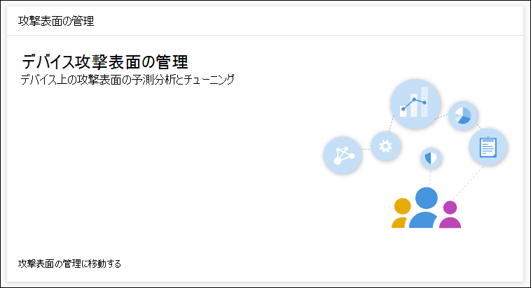

# ASR ルールの展開と検出を最適化するOptimize ASR rule deployment and detections

[!INCLUDE [Microsoft 365 Defender rebranding](../../includes/microsoft-defender.md)]

**適用対象:****Applies to:**
- [Microsoft Defender for EndpointMicrosoft Defender for Endpoint](https://go.microsoft.com/fwlink/p/?linkid=2154037)
- [Microsoft 365 DefenderMicrosoft 365 Defender](https://go.microsoft.com/fwlink/?linkid=2118804)

> Defender for Endpoint を体験してみませんか?Want to experience Defender for Endpoint? [無料試用版にサインアップします](https://www.microsoft.com/en-us/WindowsForBusiness/windows-atp?ocid=docs-wdatp-onboardconfigure-abovefoldlink)。[Sign up for a free trial](https://www.microsoft.com/en-us/WindowsForBusiness/windows-atp?ocid=docs-wdatp-onboardconfigure-abovefoldlink).

[攻撃表面の縮小 (ASR) ルールは、一](./attack-surface-reduction.md) 般的なマルウェアの悪用を特定して防止します。[Attack surface reduction (ASR) rules](./attack-surface-reduction.md) identify and prevent typical malware exploits. 悪意のあるコードを実行できる可能性のある時間と方法を制御します。They control when and how potentially malicious code can run. たとえば、JavaScript または VBScript がダウンロードした実行可能ファイルを起動したり、Office マクロからの Win32 API 呼び出しをブロックしたり、USB ドライブから実行されるプロセスをブロックしたりすることができます。For example, they can prevent JavaScript or VBScript from launching a downloaded executable, block Win32 API calls from Office macros, and block processes that run from USB drives.

 
*攻撃表面管理カード**Attack surface management card*

攻撃 *表面管理カードは* 、Microsoft 365 セキュリティ センターのツールのエントリ ポイントで、次の使用が可能です。The *Attack surface management card* is an entry point to tools in Microsoft 365 security center that you can use to:

* ASR ルールが現在組織に展開されている方法について説明します。Understand how ASR rules are currently deployed in your organization.
* ASR 検出を確認し、誤った検出の可能性を特定します。Review ASR detections and identify possible incorrect detections.
* 除外の影響を分析し、除外するファイル パスの一覧を生成します。Analyze the impact of exclusions and generate the list of file paths to exclude.

[Go **to attack surface management**  >  **Monitoring] &レポート>[除外の>追加] を選択します**。Select **Go to attack surface management** > **Monitoring & reports > Attack surface reduction rules > Add exclusions**. そこから、Microsoft 365 セキュリティ センターの他のセクションに移動できます。From there, you can navigate to other sections of Microsoft 365 security center.

![Microsoft 365 セキュリティ センターの [攻撃表面の縮小ルール] ページの [除外] タブを追加する](images/secconmgmt_asr_m365exlusions.png) 
Microsoft 365 セキュリティ センターの [攻撃表面縮小ルール] ページの [*除外の追加] タブ*The ***Add exclusions** tab in the Attack surface reduction rules page in Microsoft 365 security center*

> [!NOTE]
> Microsoft 365 セキュリティ センターにアクセスするには、Microsoft 365 E3 または E5 ライセンスと、Azure Active Directory で特定の役割を持つアカウントが必要です。To access Microsoft 365 security center, you need a Microsoft 365 E3 or E5 license and an account that has certain roles on Azure Active Directory. [必要なライセンスとアクセス許可についてお読みください](https://docs.microsoft.com/office365/securitycompliance/microsoft-security-and-compliance#required-licenses-and-permissions)。[Read about required licenses and permissions](https://docs.microsoft.com/office365/securitycompliance/microsoft-security-and-compliance#required-licenses-and-permissions).

Microsoft 365 セキュリティ センターでの ASR ルールの展開の詳細については [、「ASR](https://docs.microsoft.com/office365/securitycompliance/monitor-devices#monitor-and-manage-asr-rule-deployment-and-detections)ルールの展開と検出の監視と管理」を参照してください。For more information about ASR rule deployment in Microsoft 365 security center, see [Monitor and manage ASR rule deployment and detections](https://docs.microsoft.com/office365/securitycompliance/monitor-devices#monitor-and-manage-asr-rule-deployment-and-detections).

**関連トピック****Related topics**

* [デバイスが正しく構成されていることを確認するEnsure your devices are configured properly](configure-machines.md)
* [Microsoft Defender for Endpoint にオンボードされているデバイスを取得するGet devices onboarded to Microsoft Defender for Endpoint](configure-machines-onboarding.md)
* [Microsoft Defender for Endpoint セキュリティ ベースラインへのコンプライアンスを監視するMonitor compliance to the Microsoft Defender for Endpoint security baseline](configure-machines-security-baseline.md)
