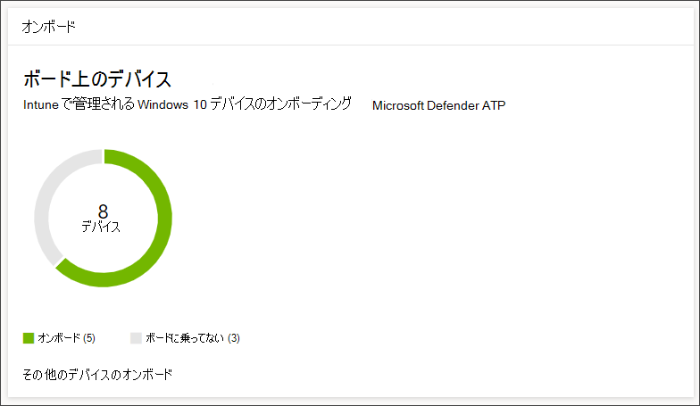
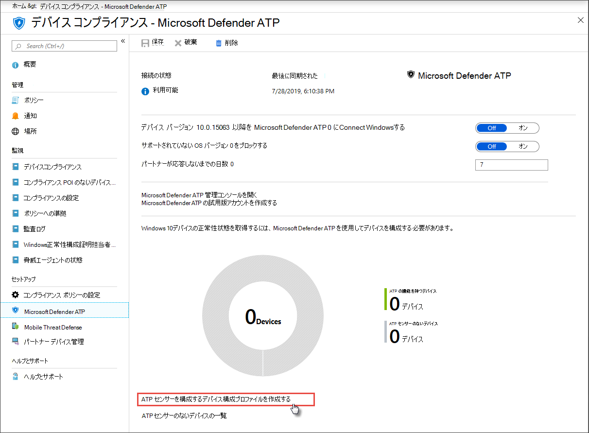

# Microsoft Defender for Endpoint にオンボードされているデバイスを取得する

[!INCLUDE [Microsoft 365 Defender rebranding](../../includes/microsoft-defender.md)]

**適用対象:**
- [Microsoft Defender for Endpoint Plan 1](https://go.microsoft.com/fwlink/p/?linkid=2154037)
- [Microsoft Defender for Endpoint Plan 2](https://go.microsoft.com/fwlink/p/?linkid=2154037)
- [Microsoft 365 Defender](https://go.microsoft.com/fwlink/?linkid=2118804)

> Microsoft Defender ATP を試してみたいですか? [無料試用版にサインアップしてください。](https://signup.microsoft.com/create-account/signup?products=7f379fee-c4f9-4278-b0a1-e4c8c2fcdf7e&ru=https://aka.ms/MDEp2OpenTrial?ocid=docs-wdatp-onboardconfigure-abovefoldlink)

オンボードされた各デバイスは、追加のエンドポイント検出と応答 (EDR) センサーを追加し、ネットワーク内の侵害アクティビティに対する可視性を向上します。 また、オンボーディングにより、デバイスで脆弱なコンポーネントやセキュリティ構成の問題をチェックし、攻撃中に重大な修復アクションを受け取る可能性があります。

デバイスのオンボーディングを追跡および管理する前に、

- [Intune 管理にデバイスを登録する](configure-machines.md#enroll-devices-to-intune-management)
- [必要なアクセス許可を持っている必要があります。](configure-machines.md#obtain-required-permissions)

## 保護されていないデバイスの検出と追跡

オンボーディング カードは、実際に Defender for Endpoint にオンボードされた Windows デバイスの数と Intune で管理される Windows デバイスの総数を比較することで、オンボーディング レートの概要を示します。

*Intune で管理されているデバイスのデバイスの総数と比較したオンボード デバイスをWindowsするカード*

> [!NOTE]
> Configuration Manager、オンボーディング スクリプト、または Intune プロファイルを使用しない他のオンボーディング メソッドを使用した場合、データの不一致が発生する可能性があります。 これらの不一致を解決するには、Defender for Endpoint オンボーディングに対応する Intune 構成プロファイルを作成し、そのプロファイルをデバイスに割り当てる必要があります。

## Intune プロファイルを使用して他のデバイスをオンボードする

Defender for Endpoint には、デバイスをオンボーディングするための便利な[Windowsがあります](onboard-configure.md)。 ただし、Intune で管理されるデバイスの場合は、Intune プロファイルを活用して Defender for Endpoint センサーを便利に展開してデバイスを選択し、これらのデバイスをサービスに効果的にオンボーディングできます。

[オンボード] **カードで、[** その他のデバイス **の** オンボード] を選択して、Intune でプロファイルを作成して割り当てる。 このリンクを使用すると、Intune のデバイス コンプライアンス ページに移動し、オンボーディング状態の同様の概要を示します。

*Intune デバイス管理の Microsoft Defender for Endpoint デバイスコンプライアンス ページ*

> [!TIP]
> または **、Microsoft Defender ATP** のすべてのサービス > Intune > デバイス コンプライアンス > から [Microsoft Azure](https://portal.azure.com/)ポータルの [Defender for Endpoint オンボーディング コンプライアンス] ページに移動することもできます。

> [!NOTE]
> 最新のデバイス データを表示する場合は、[ATP センサーのないデバイスの一覧 **] をクリックします**。

[デバイスコンプライアンス] ページで、Defender for Endpoint センサーの展開専用の構成プロファイルを作成し、そのプロファイルをオンボードするデバイスに割り当てる。 これを行うには、次のいずれかを実行できます。

- [ **デバイス構成プロファイルの作成] を選択して、定義済** みのデバイス構成プロファイルから開始する ATP センサーを構成します。
- デバイス構成プロファイルを最初から作成します。

詳細については [、「Intune デバイス構成プロファイルを使用してデバイスを Defender for Endpoint にオンボードする」を参照してください](/intune/advanced-threat-protection#onboard-devices-by-using-a-configuration-profile)。

> Microsoft Defender ATP を試してみたいですか? [無料試用版にサインアップしてください。](https://signup.microsoft.com/create-account/signup?products=7f379fee-c4f9-4278-b0a1-e4c8c2fcdf7e&ru=https://aka.ms/MDEp2OpenTrial?ocid=docs-wdatp-onboardconfigure-belowfoldlink)

## 関連トピック

- [デバイスが正しく構成されていることを確認する](configure-machines.md)
- [Defender for Endpoint セキュリティ ベースラインへのコンプライアンスを強化する](configure-machines-security-baseline.md)
- [ASR ルールの展開と検出を最適化する](configure-machines-asr.md)
