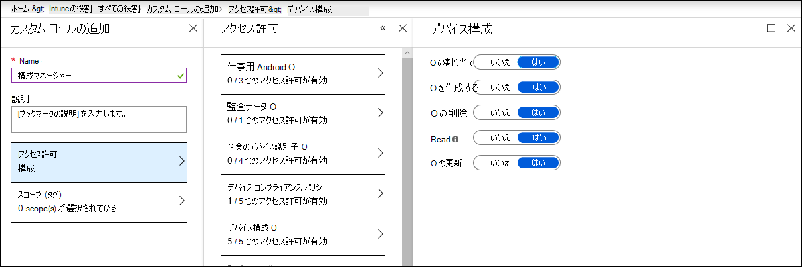

# デバイスが正しく構成されていることを確認する

[!INCLUDE [Microsoft 365 Defender rebranding](../../includes/microsoft-defender.md)]

**適用対象:**
- [Microsoft Defender for Endpoint](https://go.microsoft.com/fwlink/p/?linkid=2154037)
- [Microsoft 365 Defender](https://go.microsoft.com/fwlink/?linkid=2118804)

> Defender for Endpoint を試す場合は、 [無料試用版にサインアップしてください。](https://signup.microsoft.com/create-account/signup?products=7f379fee-c4f9-4278-b0a1-e4c8c2fcdf7e&ru=https://aka.ms/MDEp2OpenTrial?ocid=docs-wdatp-onboardconfigure-abovefoldlink)

適切に構成されたデバイスを使用すると、脅威に対する全体的な回復力を高め、攻撃を検出して対応する機能を強化できます。 セキュリティ構成管理は、デバイスが次の条件を確実に実行するのに役立ちます。

- Microsoft Defender for Endpoint にオンボードする
- Defender for Endpoint セキュリティ ベースライン構成を満たすか超過する
- 戦略的な攻撃表面の軽減策を設定する

ナビゲーション **メニューから [構成の** 管理] をクリックして、[デバイス構成管理] ページを開きます。

![[セキュリティ構成管理] ページ。](images/secconmgmt_main.png)

*デバイス構成管理ページ*

Microsoft Intune および Microsoft 365 Defender ポータルのデバイス管理ページへの直接の深いリンクを通じて、組織レベルで構成状態を追跡し、オンボーディングカバレッジの不備、コンプライアンスの問題、および最適化が不十分な攻撃表面の軽減策に対応して迅速<a href="https://go.microsoft.com/fwlink/p/?linkid=2077139" target="_blank">に</a>アクションを実行できます。

そうすることで、次の利点があります。

- デバイス上のイベントの包括的な可視性
- 堅牢な脅威インテリジェンスと、生のイベントを処理し、侵害アクティビティと脅威インジケーターを特定するための強力なデバイス学習テクノロジ
- 悪意のあるインプラントのインストールを効率的に停止するように構成されたセキュリティ機能の完全なスタック、システム ファイルとプロセスのハイジャック、データの侵入、その他の脅威アクティビティ
- 最適化された攻撃表面の軽減、脅威アクティビティに対する戦略的防御を最大化し、生産性への影響を最小限に抑える

## Intune 管理へのデバイスの登録

デバイス構成管理は、Intune デバイス管理と密接に関係して、組織内のデバイスのインベントリとベースライン セキュリティ構成を確立します。 Intune で管理されているデバイス上の構成の問題を追跡およびWindowsできます。

デバイスが適切に構成されていることを確認する前に、デバイスを Intune 管理に登録します。 Intune の登録は堅牢で、複数のデバイスに対してWindowsがあります。 Intune 登録オプションの詳細については、「デバイスの登録の設定」[を参照Windowsしてください](/intune/windows-enroll)。

> [!NOTE]
> Intune にWindows登録するには、管理者にライセンスが既に割り当てられている必要があります。 [デバイス登録のライセンスの割り当てに関する記事をご覧ください](/intune/licenses-assign)。

> [!TIP]
> Intune を使用してデバイス管理を最適化するには [、Intune を Defender for Endpoint に接続します](/intune/advanced-threat-protection#enable-windows-defender-atp-in-intune)。

## 必要なアクセス許可を取得する

既定では、Azure AD のグローバル管理者または Intune Service Administrator の役割が割り当てられているユーザーだけが、デバイスのオンボーディングとセキュリティ ベースラインの展開に必要なデバイス構成プロファイルを管理および割り当てることができます。

他の役割が割り当てられている場合は、必要なアクセス許可を持っている必要があります。

- デバイス構成に対する完全なアクセス許可
- セキュリティ 基準に対する完全なアクセス許可
- デバイス コンプライアンス ポリシーへの読み取りアクセス許可
- 組織へのアクセス許可の読み取り

*Intune のデバイス構成のアクセス許可*

> [!TIP]
> Intune にアクセス許可を割り当てる方法の詳細については、「カスタム [ロールの作成」を参照してください](/intune/create-custom-role#to-create-a-custom-role)。

## このセクションの内容

トピック|説明
:---|:---
[Defender for Endpoint にオンボードされているデバイスを取得する](configure-machines-onboarding.md)|Intune で管理されているデバイスのオンボーディング状態を追跡し、Intune を介してその他のデバイスをオンボードします。 
[Defender for Endpoint セキュリティ ベースラインへのコンプライアンスを強化する](configure-machines-security-baseline.md)|ベースラインのコンプライアンスと非準拠を追跡します。 セキュリティ ベースラインを Intune で管理されるその他のデバイスに展開します。
[ASR ルールの展開と検出を最適化する](configure-machines-asr.md)|ルールの展開を確認し、ポータルで影響分析ツールを使用して<a href="https://go.microsoft.com/fwlink/p/?linkid=2077139" target="_blank">Microsoft 365 Defender調整します</a>。

> Defender for Endpoint を試す場合は、 [無料試用版にサインアップしてください。](https://signup.microsoft.com/create-account/signup?products=7f379fee-c4f9-4278-b0a1-e4c8c2fcdf7e&ru=https://aka.ms/MDEp2OpenTrial?ocid=docs-wdatp-onboardconfigure-belowfoldlink)
