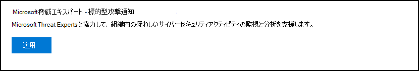
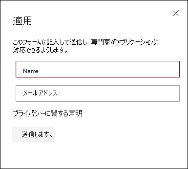
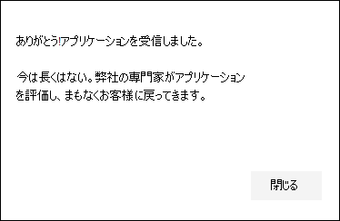
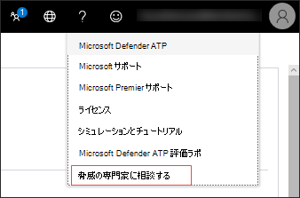
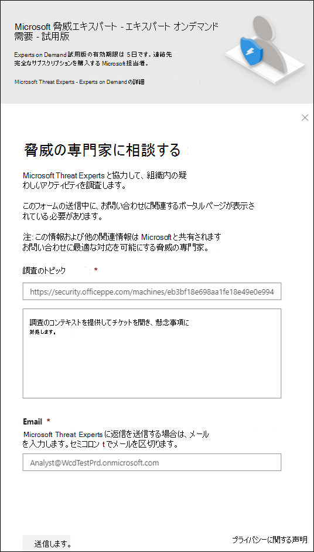

# Microsoft 脅威エキスパートの機能を構成および管理する

[!INCLUDE [Microsoft 365 Defender rebranding](../../includes/microsoft-defender.md)]

**適用対象:**
- [Microsoft Defender for Endpoint](https://go.microsoft.com/fwlink/p/?linkid=2154037)
- [Microsoft 365 Defender](https://go.microsoft.com/fwlink/?linkid=2118804)

> Defender for Endpoint を体験してみませんか? [無料試用版にサインアップしてください。](https://signup.microsoft.com/create-account/signup?products=7f379fee-c4f9-4278-b0a1-e4c8c2fcdf7e&ru=https://aka.ms/MDEp2OpenTrial?ocid=docs-wdatp-assignaccess-abovefoldlink)

## はじめに

> [!NOTE]
> Microsoft 脅威エキスパート - ターゲット攻撃通知管理脅威検出サービスに適用する前に、Microsoft Technical Service プロバイダーおよびアカウント チームと適格性要件について話し合います。

ラボのセットアップではなく、デバイスが登録された環境に Defender for Endpoint が展開されている必要があります。

Defender for Endpoint のお客様の場合は **、Microsoft 脅威エキスパート -** ターゲット攻撃通知を申請して、最も重大な脅威を特定するのに役立つ特別な分析情報と分析を取得し、迅速に対応する必要があります。 アカウント チームまたは Microsoft 担当者に問 **い合わせ、Microsoft 脅威エキスパート - Experts on Demand** を購読し、関連する検出および敵対者に関する脅威の専門家と相談してください。

## [ターゲット攻撃通知Microsoft 脅威エキスパートを適用する]

Defender for Endpoint のお客様が既に存在する場合は、アプリケーションを使用してMicrosoft Defender セキュリティ センター。

1. ナビゲーション ウィンドウから、[全般] 設定 > [ > - ターゲット攻撃通知> Microsoft 脅威エキスパート **] に移動します**。

2. **[適用]** をクリックします。

    

3. 自分の名前とメール アドレスを入力して、Microsoft がアプリケーションに戻ってきます。

    

4. プライバシーに [関する声明を読み](https://privacy.microsoft.com/privacystatement)、完了 **したら [送信** ] をクリックします。 アプリケーションが承認されると、ウェルカム メールが届きます。

    

受け入れられると、ウェルカム メールが届き、[ **適用** ] ボタンが "オン" のトグルに変更されます。 ターゲット攻撃通知サービスから自分を取り出す場合は、トグルをスライド "off" にし、ページの下部にある [設定の保存] をクリックします。

## ユーザーからのターゲット攻撃通知が表示Microsoft 脅威エキスパート

Microsoft 脅威エキスパートから、以下の媒体を通じて、標的型攻撃通知を受信できます。

- Defender for Endpoint portal's **Incidents page**
- Defender for Endpoint ポータルの **アラート** ダッシュボード
- OData アラート [API と](/windows/security/threat-protection/microsoft-defender-atp/get-alerts) REST [API](/windows/security/threat-protection/microsoft-defender-atp/pull-alerts-using-rest-api)
- [高度な検索の DeviceAlertEvents](/windows/security/threat-protection/microsoft-defender-atp/advanced-hunting-devicealertevents-table) テーブル
- ユーザーのメール(構成することにした場合)

メールにて標的型攻撃通知を受信するには、メール通知ルールを作成します。

### 電子メール通知ルールの作成

通知受信者の電子メール通知を送信するルールを作成できます。 詳細  [については、「アラート通知を構成](configure-email-notifications.md) して電子メール通知を作成、編集、削除、またはトラブルシューティングする」を参照してください。

## ターゲット攻撃の通知を表示する

電子メール通知を受信するようにシステムを構成したMicrosoft 脅威エキスパートから、電子メール内のターゲット攻撃通知の受信を開始します。

1. メール内のリンクをクリックして、脅威の専門家とタグ付けされたダッシュボードの対応するアラート コンテキスト **に移動します**。

2. ダッシュボードから、メールから受け取ったのと同じアラート トピックを選択して、詳細を表示します。

## ユーザー登録Microsoft 脅威エキスパート - エキスパート オンデマンド

これはサブスクリプション サービスとして使用できます。 すでに Defender for Endpoint のお客様である場合は、Microsoft の担当者に連絡して、Microsoft 脅威エキスパート - エキスパート オンデマンドに登録することができます。

## 組織内の疑わしいサイバーセキュリティアクティビティについて Microsoft の脅威専門家に相談する

迅速かつ正確なMicrosoft 脅威エキスパート対応を行う場合は、Microsoft Defender セキュリティ センター内から直接関与できるユーザーと提携できます。 エキスパートは、複雑な脅威、取得した標的型攻撃通知、またはポータル ダッシュボードに表示されるアラート、潜在的に侵害されたデバイス、または脅威インテリジェンス コンテキストに関する詳細が必要な場合について、より深く理解するために分析情報を提供します。

> [!NOTE]
>
> - 組織のカスタマイズされた脅威インテリジェンス データに関連するアラートの問い合わせは現在サポートされていません。 詳細については、セキュリティ操作またはインシデント対応チームに問い合わせください。
> - 「脅威の専門家に相談 **する** 」問い合わせを提出するには、セキュリティ センター ポータルの [セキュリティ設定の管理] アクセス許可が必要です。

1. 調査する関連情報 (インシデント ページなど) を含むポータル ページ **に移動** します。 調査要求を送信する前に、関連するアラートまたはデバイスのページが表示されている必要があります。

2. 右上のメニューから 、 をクリックします **。** 選択します。 次に、[脅威 **の専門家に相談する] を選択します**。

    

    フライアウト画面が開きます。 次の画面は、試用版サブスクリプションの場合に表示されます。

    

    次の画面は、完全なサブスクリプションを使用している場合Microsoft 脅威エキスパートエキスパート オンデマンド サブスクリプションを表示します。

    

    [ **問い合わせ** ] トピック フィールドには、調査要求の関連ページへのリンクが事前に入力されています。 たとえば、要求を行った時点で発生したインシデント、アラート、またはデバイスの詳細ページへのリンクです。

3. 次のフィールドで、調査を開始するのに十分なコンテキストMicrosoft 脅威エキスパート情報を提供します。

4. メール アドレスに対応するために使用するメール アドレスを入力Microsoft 脅威エキスパート。

> [!NOTE]
> Microsoft Services Hub を通じてエキスパート オンデマンド ケースの状態を追跡する場合は、テクニカル アカウント マネージャーに連絡してください。

Microsoft Services Hub の概要については、このビデオをご覧ください。

> [!VIDEO https://www.microsoft.com/videoplayer/embed/RE4pk9f]

## 調査に関するトピックのサンプルを参照Microsoft 脅威エキスパート - Experts on Demand

### アラート情報

- 新しい種類のアラートが、生きている土地のバイナリ ([AlertID]) に表示されます。 このアラートの詳細と、さらに調査する方法について教えてください。
- 悪意のある PowerShell スクリプトを実行しようとして、異なるアラートを生成する 2 つの同様の攻撃を確認しました。 1 つは "不審な PowerShell コマンド ライン" で、もう 1 つは "O365 によって提供される指示に基づいて悪意のあるファイルが検出されました" です。 違いは何ですか?
- プロファイルの高いユーザーのデバイスから失敗したログインの数が異常な場合、今日は奇数の警告が表示されます。 これらのサインイン試行に関するそれ以上の証拠は見つからなっています。 Defender for Endpoint では、これらの試行を確認する方法を説明します。 監視対象のサインインの種類
- このアラートに関するコンテキストや分析情報を追加できます。"システム ユーティリティによる疑わしい動作が観察されました"。

### コンピューターの侵害の可能性

- 「不明なプロセスが観察された」と表示される理由に答えるのに役立ちますか? このメッセージまたはアラートは、多くのデバイスで頻繁に表示されます。 このメッセージまたはアラートが悪意のあるアクティビティに関連するかどうかを明確にするための任意の入力に感謝します。
- [月] の同じシステムで以前の [マルウェア名] マルウェア検出と同様の動作を使用して、次のシステムで侵害の可能性を検証できますか?

### 脅威インテリジェンスの詳細

- 悪意のある Word 文書をユーザーに配信したフィッシングメールが検出されました。 悪意のある Word ドキュメントによって、一連の疑わしいイベントが発生し、[マルウェア名] マルウェアに対する複数の Microsoft Defender アラートがトリガーされました。 このマルウェアに関する情報はありますか? はいの場合、リンクを送信できますか?
- 最近、自分の業界を標的にしている脅威に関する [ソーシャル メディア参照( Twitter やブログなど) の投稿を見ました。 この脅威アクターに対して Defender for Endpoint が提供する保護を理解するのに役立ちますか?

### Microsoft 脅威エキスパートのアラート通信

- インシデント対応チームは、対象となる攻撃通知に対処するのに役立ちますか?
- この標的型攻撃の通知を受け取ったのは、Microsoft 脅威エキスパート。 独自のインシデント対応チームは持ち合わせください。 ここで何を行い、インシデントを含めるのか。
- ターゲット攻撃の通知を受け取ったのは、Microsoft 脅威エキスパート。 インシデント対応チームに渡すデータを提供できますか?

  > [!NOTE]
  > Microsoft 脅威エキスパートは、インシデント対応サービスではなく、管理されたサイバーセキュリティハンティング サービスです。 ただし、専門家は必要に応じて、調査を Microsoft サイバーセキュリティ ソリューション グループ (CSG) の検出および応答チーム (DART) サービスにシームレスに移行できます。 また、インシデント対応チームと関わり、インシデント対応が必要な問題に対処できます。

## シナリオ

### 管理された狩猟に関する問い合わせに関する進行状況レポートを受け取る

お問い合Microsoft 脅威エキスパート、お問い合わせに応じて異なります。 2 日以内に脅威専門家の問い合わせに問い合わせて、次のカテゴリから調査状況を伝える進行状況レポートを電子メールで送信します。

- 調査を続行するには、さらに詳しい情報が必要です。
- 技術的なコンテキストを決定するには、ファイルまたは複数のファイル サンプルが必要です
- 調査にはより多くの時間が必要
- 最初の情報は、調査を終了するのに十分でした

調査を動かし続けるには、迅速に対応することが重要です。

## 関連トピック

- [Microsoft 脅威エキスパートの概要](microsoft-threat-experts.md)
- [Microsoft 脅威エキスパートのMicrosoft 365概要](/microsoft-365/security/mtp/microsoft-threat-experts)
