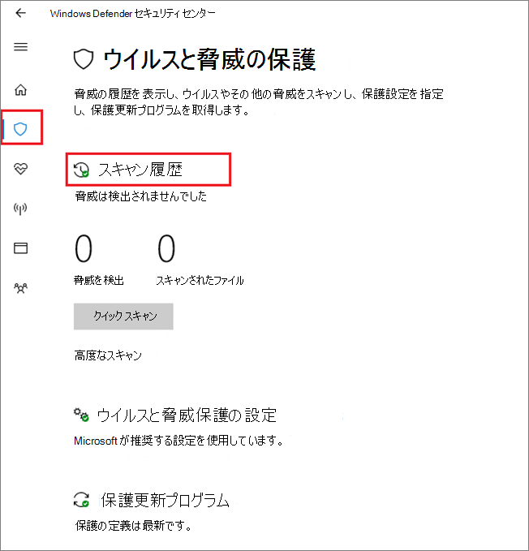

# <a name="configure-and-validate-microsoft-defender-antivirus-network-connections"></a>Microsoft Defender ウイルス対策 ネットワーク接続を構成および検証する

[!INCLUDE [Microsoft 365 Defender rebranding](../../includes/microsoft-defender.md)]


**適用対象:**

- [Microsoft Defender for Endpoint](/microsoft-365/security/defender-endpoint/)

Microsoft Defender ウイルス対策クラウド配信保護が適切に機能するには、エンドポイントと特定の Microsoft サーバー間の接続を許可するネットワークを構成する必要があります。

この記事では、ファイアウォール ルールの使用など、許可する必要がある接続の一覧と、接続の検証手順を示します。 保護を適切に構成すると、クラウド配信の保護サービスから最高の価値を確実に受け取るのに役立ちます。

ネットワーク接続の詳細については [、「Microsoft Active Protection Services](https://techcommunity.microsoft.com/t5/Configuration-Manager-Archive/Important-changes-to-Microsoft-Active-Protection-Service-MAPS/ba-p/274006) エンドポイントの重要な変更点」を参照してください。

>[!TIP]
>Microsoft Defender for Endpoint のデモ Web サイトにアクセス [して、demo.wd.microsoft.com](https://demo.wd.microsoft.com?ocid=cx-wddocs-testground) 機能が動作しているのを確認できます。
>
>- クラウドによる保護
>- 高速学習 (一目でブロックを含む)
>- 望ましくない可能性があるアプリケーションのブロック

## <a name="allow-connections-to-the-microsoft-defender-antivirus-cloud-service"></a>Microsoft Defender ウイルス対策クラウド サービスへの接続を許可する

Microsoft Defender ウイルス対策クラウド サービスは、エンドポイントに高速で強力な保護を提供します。 クラウド配信保護サービスの有効化はオプションですが、エンドポイントやネットワーク全体のマルウェアに対する重要な保護を提供しますので、強くお勧めします。

>[!NOTE]
>Microsoft Defender ウイルス対策クラウド サービスは、ネットワークとエンドポイントに更新された保護を提供するためのメカニズムです。 クラウド サービスと呼ばれるのはクラウド サービスですが、クラウドに保存されているファイルの保護ではなく、分散リソースと機械学習を使用して、従来のセキュリティ インテリジェンス更新プログラムよりもはるかに高速な速度でエンドポイントに保護を提供します。

[Intune、Microsoft](enable-cloud-protection-microsoft-defender-antivirus.md) Endpoint Configuration Manager、グループ ポリシー、PowerShell コマンドレット、または Windows セキュリティ アプリの個々のクライアントでサービスを有効にする方法の詳細については、「クラウドによる保護を有効にする」を参照してください。 

サービスを有効にした後、ネットワークまたはファイアウォールを構成して、ネットワークとエンドポイント間の接続を許可する必要がある場合があります。

保護はクラウド サービスなので、コンピューターはインターネットにアクセスし、365 機械学習サービスを利用Office Microsoft Defender にアクセスする必要があります。 任意の種類のネットワーク 検査から URL `*.blob.core.windows.net` を除外しない。 

次の表に、サービスと関連付けられている URL の一覧を示します。 これらの URL へのアクセスを拒否するファイアウォールまたはネットワーク フィルター ルールが存在しないか、または(URL を除く) 許可ルールを作成する必要がある場合があります `*.blob.core.windows.net` 。 以下に示す URL は、通信にポート 443 を使用しています。


| **サービス**| **説明** |**URL** |
| :--: | :-- | :-- |
| Microsoft Defender ウイルス対策クラウド配信保護サービス (MICROSOFT Active Protection Service (MAPS) とも呼ばれます)|Microsoft Defender ウイルス対策によってクラウド配信の保護を提供するために使用される|`*.wdcp.microsoft.com` <br/> `*.wdcpalt.microsoft.com` <br/> `*.wd.microsoft.com`|
| Microsoft Update Service (MU) <br/> Windows Update Service (WU)|  セキュリティ インテリジェンスと製品の更新   |`*.update.microsoft.com` <br/> `*.delivery.mp.microsoft.com`<br/> `*.windowsupdate.com` <br/><br/> 詳細については [、「Windows Update の接続エンドポイント」を参照してください。](/windows/privacy/manage-windows-1709-endpoints#windows-update)|
|セキュリティ インテリジェンスの更新代替ダウンロード場所 (ADL)|   Microsoft Defender ウイルス対策セキュリティ インテリジェンスの更新プログラムの別の場所 (インストールされているセキュリティ インテリジェンスが最新でなされていない場合 )(7 日以上遅れる)|    `*.download.microsoft.com`  </br> `*.download.windowsupdate.com`</br> `https://fe3cr.delivery.mp.microsoft.com/ClientWebService/client.asmx`|
| マルウェアの送信ストレージ|申請フォームまたは自動サンプル送信を介して Microsoft に送信されたファイルのアップロード場所    | `ussus1eastprod.blob.core.windows.net` <br/>    `ussus2eastprod.blob.core.windows.net` <br/>    `ussus3eastprod.blob.core.windows.net` <br/>    `ussus4eastprod.blob.core.windows.net` <br/>    `wsus1eastprod.blob.core.windows.net` <br/>    `wsus2eastprod.blob.core.windows.net` <br/>    `ussus1westprod.blob.core.windows.net` <br/>    `ussus2westprod.blob.core.windows.net` <br/>    `ussus3westprod.blob.core.windows.net` <br/>    `ussus4westprod.blob.core.windows.net` <br/>    `wsus1westprod.blob.core.windows.net` <br/>    `wsus2westprod.blob.core.windows.net` <br/>    `usseu1northprod.blob.core.windows.net` <br/>    `wseu1northprod.blob.core.windows.net` <br/>    `usseu1westprod.blob.core.windows.net` <br/>    `wseu1westprod.blob.core.windows.net` <br/>    `ussuk1southprod.blob.core.windows.net` <br/>    `wsuk1southprod.blob.core.windows.net` <br/>    `ussuk1westprod.blob.core.windows.net` <br/>    `wsuk1westprod.blob.core.windows.net` |
| 証明書失効リスト (CRL)|CRL を更新するために MAPS への SSL 接続を作成するときに Windows で使用される   | `http://www.microsoft.com/pkiops/crl/` <br/> `http://www.microsoft.com/pkiops/certs` <br/>   `http://crl.microsoft.com/pki/crl/products` <br/> `http://www.microsoft.com/pki/certs` |
| シンボル ストア|修復フロー中に特定の重要なファイルを復元するために Microsoft Defender ウイルス対策によって使用される  | `https://msdl.microsoft.com/download/symbols` |
| ユニバーサル テレメトリ クライアント| Windows がクライアント診断データを送信するために使用します。Microsoft Defender ウイルス対策は、製品品質の監視の目的で利用統計情報を使用します。   | この更新プログラムは SSL (TCP ポート 443) を使用してマニフェストをダウンロードし、次の DNS エンドポイントを使用する診断データを Microsoft にアップロードします。   `vortex-win.data.microsoft.com` <br/>   `settings-win.data.microsoft.com`|

## <a name="validate-connections-between-your-network-and-the-cloud"></a>ネットワークとクラウド間の接続を検証する

上記の URL を許可した後、Microsoft Defender Antivirus クラウド サービスに接続しており、情報を正しく報告および受信して、完全に保護されていることを確認できます。

**cmdline ツールを使用して、クラウド配信の保護を検証します。**

Microsoft Defender ウイルス対策コマンド ライン ユーティリティ ( ) で次の引数を使用して、ネットワークが Microsoft Defender ウイルス対策クラウド サービスと通信できると `mpcmdrun.exe` 確認します。

```console
"%ProgramFiles%\Windows Defender\MpCmdRun.exe" -ValidateMapsConnection
```

> [!NOTE]
> 管理者レベルのバージョンのコマンド プロンプトを開く必要があります。 [スタート] メニューのアイテムを右クリックし、[管理者として実行] をクリック **し、アクセス** 許可のプロンプト **で [は** い] をクリックします。 このコマンドは、Windows 10 バージョン 1703 以上でのみ動作します。

詳細については、「Microsoft Defender Antivirus with the mpcmdrun.exe コマンド ライン [ツール」を参照してください](command-line-arguments-microsoft-defender-antivirus.md)。

**Microsoft から偽のマルウェア ファイルをダウンロードします。**

クラウドに適切に接続されている場合、Microsoft Defender Antivirus が検出してブロックするサンプル ファイルをダウンロードできます。

にアクセスしてファイルをダウンロードします [https://aka.ms/ioavtest](https://aka.ms/ioavtest) 。

>[!NOTE]
>このファイルは、実際のマルウェアではありません。 これは、クラウドに適切に接続されている場合にテストするように設計された偽のファイルです。

適切に接続されている場合は、警告の Microsoft Defender ウイルス対策通知が表示されます。

Microsoft Edge を使用している場合は、次の通知メッセージも表示されます。


次のようなメッセージが表示されます。次のコマンドを使用Internet Explorer。


また、Windows セキュリティ アプリの[スキャン履歴]セクションの [検疫された脅威] の下に検出が表示されます。

1. タスク バーのシールド アイコンをクリックするか、Defender のスタート メニューを検索して、Windows セキュリティ アプリを開 **きます**。

2. [ウイルス **対策] &タイル** (または左側のメニュー バーのシールド アイコン) を選択し、[スキャン履歴] **ラベルを選択** します。

    

3. [検疫された **脅威] セクションで** 、[完全な履歴を **表示** ] を選択して、検出された偽のマルウェアを確認します。

   > [!NOTE]
   > バージョン 1703 より前のバージョンの Windows 10 では、ユーザー インターフェイスが異なります。 Windows セキュリティ [アプリで Microsoft Defender ウイルス対策を参照してください](microsoft-defender-security-center-antivirus.md)。

   Windows イベント ログには、クライアント [Windows Defender ID 1116 も表示されます](troubleshoot-microsoft-defender-antivirus.md)。

## <a name="related-articles"></a>関連記事

- [Windows 10 の Microsoft Defender ウイルス対策](microsoft-defender-antivirus-in-windows-10.md)

- [クラウドによる保護を有効にする](enable-cloud-protection-microsoft-defender-antivirus.md)

- [コマンド ラインの引数](command-line-arguments-microsoft-defender-antivirus.md)

- [Microsoft Active Protection Services エンドポイントの重要な変更点](https://techcommunity.microsoft.com/t5/Configuration-Manager-Archive/Important-changes-to-Microsoft-Active-Protection-Service-MAPS/ba-p/274006)