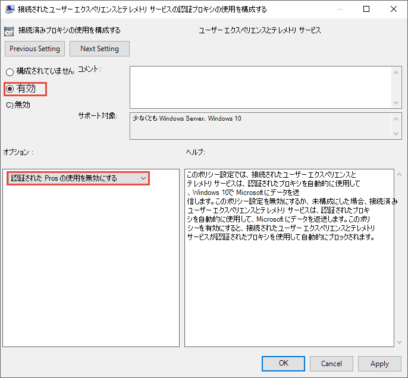
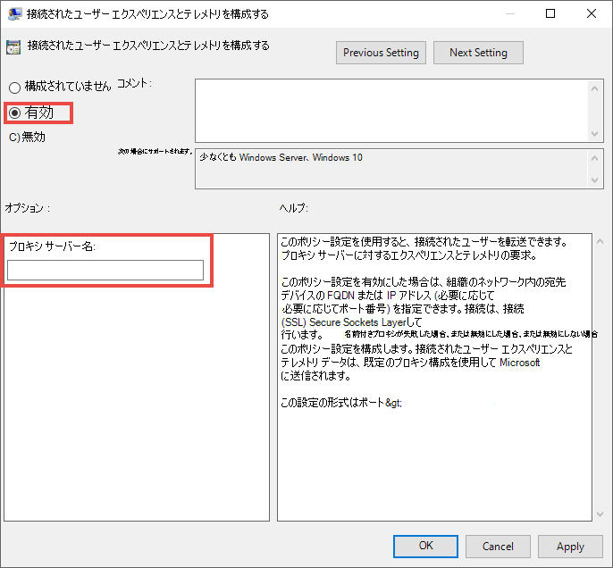
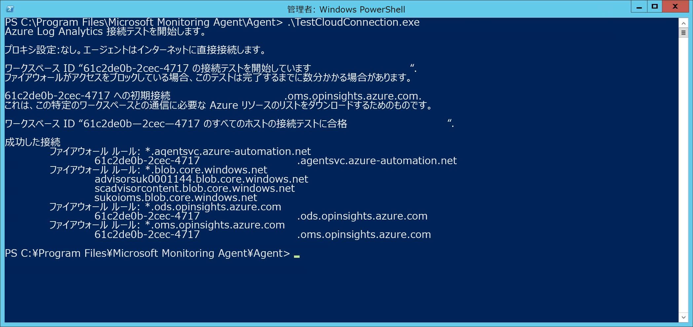

# <a name="configure-device-proxy-and-internet-connectivity-settings"></a>デバイス プロキシとインターネット接続の設定を構成する

[!INCLUDE [Microsoft 365 Defender rebranding](../../includes/microsoft-defender.md)]

**適用対象:**
- [Microsoft Defender for Endpoint Plan 2](https://go.microsoft.com/fwlink/p/?linkid=2154037)
- [Microsoft 365 Defender](https://go.microsoft.com/fwlink/?linkid=2118804)

> Defender for Endpoint を試す場合は、 [無料試用版にサインアップしてください。](https://www.microsoft.com/WindowsForBusiness/windows-atp?ocid=docs-wdatp-configureendpointsscript-abovefoldlink)

Defender for Endpoint センサーでは、センサー データWindowsレポートし、Defender for Endpoint サービスと通信するために Microsoft Windows HTTP (WinHTTP) が必要です。 埋め込み Defender for Endpoint センサーは、LocalSystem アカウントを使用してシステム コンテキストで実行されます。 センサーは Microsoft Windows HTTP Services (WinHTTP) を使用して、Defender for Endpoint クラウド サービスとの通信を有効にしています。

> [!TIP]
> インターネットへのゲートウェイとして転送プロキシを使用する組織では、ネットワーク保護を使用して、転送プロキシの背後で発生する接続イベント [を調査できます](investigate-behind-proxy.md)。

WinHTTP 構成設定は、Windows インターネット (WinINet) ブラウズ プロキシ設定[(WinINet vs. WinHTTP](/windows/win32/wininet/wininet-vs-winhttp)を参照) とは独立し、次の検出方法を使用してのみプロキシ サーバーを検出できます。

- 自動検出の方法:

  - 透過プロキシ
  
  - Web プロキシ自動発見プロトコル (WPAD)

    > [!NOTE]
    > ネットワーク トポロジで透過プロキシまたは WPAD を使用している場合は、特別な構成設定は必要ない。 プロキシの Defender for Endpoint URL 除外の詳細については、「プロキシ サーバーで Defender for Endpoint Service URL へのアクセスを有効にする」 [を参照してください](#enable-access-to-microsoft-defender-for-endpoint-service-urls-in-the-proxy-server)。

- 手動の静的プロキシの構成:

  - レジストリ ベースの構成
  
  - netsh コマンドを使用して構成された WinHTTP: 安定したトポロジのデスクトップにのみ適しています (たとえば、同じプロキシの背後にある企業ネットワーク内のデスクトップ)

> [!NOTE]
> Defender ウイルス対策EDRプロキシは個別に設定できます。  以下のセクションでは、これらの違いに注意してください。

## <a name="configure-the-proxy-server-manually-using-a-registry-based-static-proxy"></a>レジストリ ベースの静的プロキシを使用して、プロキシ サーバーを手動で構成します。

コンピューターがインターネットへの接続を許可されていない場合は、Defender for Endpoint 検出および応答 (EDR) センサー用のレジストリ ベースの静的プロキシを構成して、診断データを報告し、Defender for Endpoint サービスと通信します。

> [!NOTE]
> Windows 10、Windows 11、Windows Server 2019、または Windows Server 2022 でこのオプションを使用する場合は、次のビルドと累積的な更新プログラムのロールアップを使用してください。
>
> - Windows 11
> - Windows 10 Version 1809またはWindows Server 2019、または Windows Server 2022 -<https://support.microsoft.com/kb/5001384>
> - Windows 10バージョン 1909 -<https://support.microsoft.com/kb/4601380>
> - Windows 10バージョン 2004 -<https://support.microsoft.com/kb/4601382>
> - Windows 10バージョン 20H2 -<https://support.microsoft.com/kb/4601382>
>
> これらの更新プログラムは、CnC (Command and Control) チャネルの接続性と信頼性を向上します。

静的プロキシはグループ ポリシー (GP) を使用して構成することもできます。グループ ポリシー値の下の両方の設定を設定して、グループ ポリシーに使用するプロキシ サーバーを構成する必要EDR。 グループ ポリシーは次の場所にあります。

- **管理用> Windowsコンポーネント>データ** 収集とプレビュー ビルド>接続されたユーザー エクスペリエンスとテレメトリ サービスの認証プロキシの使用を構成します。

  [有効] に **設定し、[認証** された **プロキシの使用を無効にする] を選択します**。

  

- **管理用テンプレート > Windows コンポーネント**>およびプレビュー ビルド > 接続されたユーザー エクスペリエンスとテレメトリを構成する:

  プロキシを構成する

  


| グループ ポリシー | レジストリ キー | レジストリ エントリ | 値 |
|:---|:---|:---|:---|
| 接続されたユーザー エクスペリエンスとテレメトリ サービスの認証されたプロキシ使用状況を構成する | `HKLM\Software\Policies\Microsoft\Windows\DataCollection` | `DisableEnterpriseAuthProxy` | 1 (REG_DWORD) |
| 接続されたユーザー エクスペリエンスと利用統計情報を構成する | `HKLM\Software\Policies\Microsoft\Windows\DataCollection` | `TelemetryProxyServer` | ```servername:port or ip:port``` <br> <br> 例: ```10.0.0.6:8080``` (REG_SZ) |

## <a name="configure-a-static-proxy-for-microsoft-defender-antivirus"></a>サーバーの静的プロキシを構成Microsoft Defender ウイルス対策

Microsoft Defender ウイルス対策[提供される保護は](cloud-protection-microsoft-defender-antivirus.md)、新しい脅威や新たな脅威に対して、ほぼ瞬時に自動化された保護を提供します。 Defender Antivirus がアクティブなマルウェア対策ソリューションである場合[、](manage-indicators.md)カスタム インジケーターには接続が必要です。また、EDR[マルウェア](edr-in-block-mode.md)対策ソリューションとして Microsoft 以外のソリューションを使用する場合でも、ブロック モードで使用できます。

次に示すグループ ポリシーを使用して静的プロキシを構成します。

1. **管理用テンプレート > Windows コンポーネント > Microsoft Defender ウイルス対策 >ネットワークに接続するためのプロキシ サーバーを定義します**。 

2. [有効] に **設定し** 、プロキシ サーバーを定義します。 URL には、ユーザーまたはユーザーが http:// 必要 https://。 サポートされているバージョンについては、「https:// 更新プログラムの[管理」をMicrosoft Defender ウイルス対策してください](manage-updates-baselines-microsoft-defender-antivirus.md)。

   :::image type="content" source="images/proxy-server-mdav.png" alt-text="サーバーのプロキシ サーバー Microsoft Defender ウイルス対策。":::

3. レジストリ キーの下で `HKLM\Software\Policies\Microsoft\Windows Defender` 、ポリシーはレジストリ値をレジストリ `ProxyServer` 値としてREG_SZ。 

   レジストリ値は、 `ProxyServer` 次の文字列形式を取ります。

    ```text
    <server name or ip>:<port>

    For example: http://10.0.0.6:8080
    ```

> [!NOTE]
>
> 復元の目的と、クラウドによる保護のリアルタイムの性質のために、Microsoft Defender ウイルス対策は最後に既知の作業プロキシをキャッシュします。 セキュリティで保護されたクラウド接続が壊れるので、プロキシ ソリューションで SSL 検査が実行されていないことを確認します。 
>
> Microsoft Defender ウイルス対策更新プログラムまたは Microsoft Update に接続するために静的プロキシを使用Windows更新プログラムをダウンロードすることはできません。 代わりに、Windows Update を使用するように構成されている場合は、システム全体のプロキシを使用するか、構成済みのフォールバック順序に従って構成された内部更新元[を使用します](manage-protection-updates-microsoft-defender-antivirus.md)。 
>
> 必要に応じて、管理用テンプレート > Windows コンポーネント **> Microsoft Defender ウイルス対策 > Define proxy auto-config (.pac)** を使用して、複数のプロキシで高度な構成をセットアップする必要がある場合は、ネットワークに接続できます。[管理用テンプレートの使用] > Windows コンポーネント > **Microsoft Defender ウイルス対策 >プロキシ サーバー** をバイパスするアドレスを定義して、Microsoft Defender ウイルス対策プロキシ サーバーを使用しなけれ。 
>
> コマンドレットと一緒に PowerShell を使用 `Set-MpPreference` して、次のオプションを構成することもできます。 
>
> - ProxyBypass 
> - ProxyPacUrl 
> - ProxyServer 

> [!NOTE]
> プロキシを正しく使用するには、次の 3 つの異なるプロキシ設定を構成します。
>  - エンドポイント用 Microsoft Defender (MDE)
>  - AV (ウイルス対策)
>  - エンドポイントの検出と応答 (EDR)

## <a name="configure-the-proxy-server-manually-using-netsh-command"></a>netsh コマンドを使用してプロキシ サーバーを手動で構成する

netsh を使用して、システム全体の静的プロキシを構成します。

> [!NOTE]
>
> - これは、既定のプロキシで WinHTTP を使用する Windows サービスを含むすべてのアプリケーションに影響します。</br>
> - トポロジを変更しているラップトップ (たとえば、オフィスから自宅) は netsh に誤動作します。 レジストリ ベースの静的プロキシの構成を使用します。

1. 管理者特権でコマンド プロンプトを開きます。
   1. **[スタート]** をクリックし、「**cmd**」と入力します。
   1. **[コマンド プロンプト]** を右クリックして **[管理者として実行]** を選択します。

2. 次のコマンドを入力して、**Enter** キーを押します。

   ```PowerShell
   netsh winhttp set proxy <proxy>:<port>
   ```

   例: `netsh winhttp set proxy 10.0.0.6:8080`

winhttp プロキシをリセットするには、次のコマンドを入力し、**Enter** キーを押します。

```PowerShell
netsh winhttp reset proxy
```

詳細については、「[Netsh コマンドの構文、コンテキスト、およびフォーマット](/windows-server/networking/technologies/netsh/netsh-contexts)」を参照してください。

## <a name="enable-access-to-microsoft-defender-for-endpoint-service-urls-in-the-proxy-server"></a>プロキシ サーバーで Microsoft Defender for Endpoint サービス URL へのアクセスを有効にする

プロキシまたはファイアウォールが既定ですべてのトラフィックをブロックし、特定のドメインの通過だけを許可している場合は、ダウンロード可能シートに記載されているドメインを許可ドメインのリストに追加します。

次のダウンロード可能なスプレッドシートには、ネットワークが接続できる必要があるサービスと関連付けられている URL が一覧表示されます。 これらの URL へのアクセスを拒否するファイアウォールまたはネットワーク フィルター ルールが存在しないか、許可ルールを作成する必要がある場合があります。

<br>

**** 
|ドメインリストのスプレッドシート|説明|
|---|---|
||サービスの場所、地理的な場所、および OS の特定の DNS レコードのスプレッドシート。 <p> [ここにスプレッドシートをダウンロードします。](https://download.microsoft.com/download/8/a/5/8a51eee5-cd02-431c-9d78-a58b7f77c070/mde-urls.xlsx)|
|

プロキシまたはファイアウォールで HTTPS スキャン (SSL 検査) が有効になっている場合は、上記の表に示されているドメインを HTTPS スキャンから除外します。
ファイアウォールで、地理列が WW であるすべての URL を開きます。 地理列が WW ではない行の場合は、特定のデータの場所の URL を開きます。 データの場所の設定を確認するには、「データストレージの場所を確認し、Microsoft Defender for Endpoint のデータ保持設定 [を更新する」を参照してください](/microsoft-365/security/defender-endpoint/data-retention-settings)。

> [!NOTE]
> settings-win.data.microsoft.com は、バージョン 1803 以前Windowsデバイスを使用している場合にのみ必要です。<br>
>
> v20 を含む URL は、バージョン 1803 以降をWindowsデバイスを使用している場合にのみ必要です。 たとえば、バージョン 1803 以降をWindowsしているデバイスで、米国のデータ 転送地域にオンボードStorage `us-v20.events.data.microsoft.com` です。
>
> 上記のスプレッドシートは MDE EDRに関連します。環境で Microsoft Defender ウイルス対策 を使用している場合は、「configure network connections to the Microsoft Defender ウイルス対策 クラウド サービス」[を参照してください](/windows/security/threat-protection/microsoft-defender-antivirus/configure-network-connections-microsoft-defender-antivirus)。

Defender for Endpoint センサーがシステム コンテキストから接続している場合、プロキシまたはファイアウォールが匿名トラフィックをブロックしている場合は、以前にリストした URL で匿名トラフィックが許可されている必要があります。

> [!NOTE]
> Microsoft はプロキシ サーバーを提供しません。 これらの URL には、構成したプロキシ サーバーを介してアクセスできます。

### <a name="microsoft-monitoring-agent-mma---proxy-and-firewall-requirements-for-older-versions-of-windows-client-or-windows-server"></a>Microsoft Monitoring Agent (MMA) - クライアントまたはサーバーの古いバージョンのプロキシおよびファイアウォールWindows要件Windowsします。

以下の情報は、Windows 7 SP1、Windows 8.1、Windows Server 2008 R2* などの以前のバージョンの Windows の Log Analytics エージェント (Microsoft Monitoring Agent と呼ばれる) と通信するために必要なプロキシおよびファイアウォール構成情報を示しています。

<br>

****

|エージェント リソース|ポート|方向|HTTP 検査をバイパス|
|---|---|---|---|
|*.ods.opinsights.azure.com|ポート 443|送信|はい|
|*.oms.opinsights.azure.com|ポート 443|送信|はい|
|*.blob.core.windows.net|ポート 443|送信|はい|
|*.azure-automation.net|ポート 443|送信|はい|

> [!NOTE]
> *これらの接続要件は、MMA を必要とする以前の Microsoft Defender for Endpoint Windows Server 2016および Windows Server 2012 R2 にも適用されます。 新しい統合ソリューションを使用してこれらのオペレーティング システムをオンボードする手順は、オンボード[Windows](configure-server-endpoints.md)サーバー、または Microsoft Defender for [Endpoint](/microsoft-365/security/defender-endpoint/server-migration)のサーバー移行シナリオで新しい統合ソリューションに移行する手順です。

> [!NOTE]
> クラウドベースのソリューションとして、IP 範囲が変更される可能性があります。 DNS 解決設定に移動する必要があります。

## <a name="confirm-microsoft-monitoring-agent-mma-service-url-requirements"></a>[Microsoft Monitoring Agent (MMA) サービス URL の要件を確認する 

 以前のバージョンのアプリケーションに対して Microsoft Monitoring Agent (MMA) を使用する場合は、特定の環境のワイルドカード (*) 要件を排除するには、次のガイダンスを参照Windows。

1. Microsoft Monitoring Agent (MMA) を使用して以前のオペレーティング システムを Defender for Endpoint にオンボードします (詳細については、「Defender for Endpoint および Onboard Windows サーバーでの以前のバージョンの[Windows](https://go.microsoft.com/fwlink/p/?linkid=2010326)のオンボード」[を参照](configure-server-endpoints.md)してください。

2. コンピューターがポータルに正常に報告Microsoft 365 Defenderします。

3. "C:\Program Files\Microsoft Monitoring Agent\Agent" の TestCloudConnection.exe ツールを実行して、接続を検証し、特定のワークスペースに必要な URL を確認します。

4. Microsoft Defender for Endpoint URL リストで、地域の要件の完全な一覧を確認します (「サービス URL スプレッドシート」を参照[)。](https://download.microsoft.com/download/8/a/5/8a51eee5-cd02-431c-9d78-a58b7f77c070/mde-urls.xlsx)

    

.ods.opinsights.azure.com、.oms.opinsights.azure.com、および .agentsvc.azure-automation.net URL エンドポイントで使用されるワイルドカード ( ) は、特定の \* \* Workspace ID \* \* に置き換えます。 ワークスペース ID は環境とワークスペースに固有の ID で、テナントの [オンボーディング] セクションで、Microsoft 365 Defenderできます。

.blob.core.windows.net URL エンドポイントは、テスト結果の 「ファイアウォール ルール: .blob.core.windows.net」セクションに示されている URL に \* \* 置き換え可能です。

> [!NOTE]
> Microsoft Defender for Cloud を介してオンボーディングを行う場合、複数のワークスペースが使用されている可能性があります。 上記の TestCloudConnection.exe 手順を、各ワークスペースのオンボード コンピューターで実行する必要があります (ワークスペース間で *.blob.core.windows.net URL に変更が加わるかどうかを判断するには)。

## <a name="verify-client-connectivity-to-microsoft-defender-for-endpoint-service-urls"></a>エンドポイント サービス URL 用 Microsoft Defender へのクライアント接続を確認する

プロキシ構成が正常に完了したことを確認します。WinHTTP は環境内のプロキシ サーバーを介して検出および通信でき、プロキシ サーバーは Defender for Endpoint サービス URL へのトラフィックを許可します。

1. エンドポイント センサー [の Defender が実行](https://aka.ms/mdeanalyzer) されている PC に Microsoft Defender for Endpoint Client Analyzer ツールをダウンロードします。

2. デバイス上のMDEClientAnalyzer.zipを抽出します。

3. 管理者特権でのコマンド ラインを開きます。
   1. **[スタート]** をクリックし、「**cmd**」と入力します。
   1. **[コマンド プロンプト]** を右クリックして **[管理者として実行]** を選択します。

4. 次のコマンドを入力して、**Enter** キーを押します。

    ```PowerShell
    HardDrivePath\MDEClientAnalyzer.cmd
    ```

    *HardDrivePath を*、次のような MDEClientAnalyzer ツールがダウンロードされたパスに置き換える。

    ```PowerShell
    C:\Work\tools\MDEClientAnalyzer\MDEClientAnalyzer.cmd
    ```

5. *HardDrivePath**でMDEClientAnalyzerResult.zip* フォルダーにツールによって作成されたファイルを抽出します。

6. サーバー *MDEClientAnalyzerResult.txt* 開き、サーバーの検出とサービス URL へのアクセスを有効にするプロキシ構成手順を実行したと確認します。

   このツールは、Defender for Endpoint クライアントが相互作用するように構成されている Defender for Endpoint サービス URL の接続を確認します。 次に、Defender for Endpoint サービスとの通信に使用される可能性 *のある* URL ごとに、MDEClientAnalyzerResult.txtファイルに結果を出力します。 次に例を示します。

   ```text
   Testing URL : https://xxx.microsoft.com/xxx
   1 - Default proxy: Succeeded (200)
   2 - Proxy auto discovery (WPAD): Succeeded (200)
   3 - Proxy disabled: Succeeded (200)
   4 - Named proxy: Doesn't exist
   5 - Command line proxy: Doesn't exist
   ```

少なくとも 1 つの接続オプションが (200) ステータスを返した場合、Defender for Endpoint クライアントはこの接続方法を使用してテスト済み URL と正しく通信できます。

ただし、接続を確認した結果が失敗を示している場合は、HTTP エラーが表示されます (「HTTP ステータス コード」を参照)。 次に、「プロキシ サーバーの Defender for Endpoint サービス URL へのアクセスを有効にする」に示されている表の [URL を使用できます](#enable-access-to-microsoft-defender-for-endpoint-service-urls-in-the-proxy-server)。 使用する URL は、オンボーディング手順で選択された地域によって異なります。

> [!NOTE]
> Connectivity Analyzer ツールのクラウド接続チェックは [、PSExec](attack-surface-reduction-rules-reference.md#block-process-creations-originating-from-psexec-and-wmi-commands)および WMI コマンドから発生する攻撃表面の縮小ルールブロック プロセスの作成と互換性がありません。 接続ツールを実行するには、この規則を一時的に無効にする必要があります。 または、アナライザーの実行中に [ASR 除外を](customize-attack-surface-reduction.md#exclude-files-and-folders) 一時的に追加できます。
>
> TelemetryProxyServer がレジストリまたはグループ ポリシーを介して設定されている場合、Defender for Endpoint は、定義されたプロキシにアクセスできない場合、直接に戻されます。

## <a name="related-topics"></a>関連項目

- [Microsoft Defender ウイルス対策 ネットワーク接続を構成および検証する](configure-network-connections-microsoft-defender-antivirus.md)
- [グループ ポリシー設定を使用して、グループ ポリシーの構成とMicrosoft Defender ウイルス対策](use-group-policy-microsoft-defender-antivirus.md)
- [Windows デバイスのオンボード](configure-endpoints.md)
- [Microsoft Defender for Endpoint オンボーディングの問題のトラブルシューティング](troubleshoot-onboarding.md)
