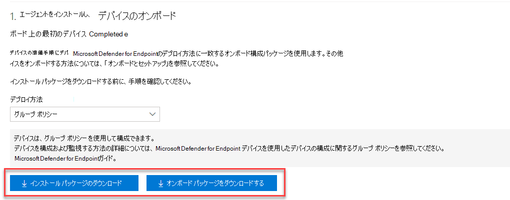

# <a name="onboard-windows-servers-to-the-microsoft-defender-for-endpoint-service"></a>Windows サーバーを Microsoft Defender for Endpoint にオンボードします

[!INCLUDE [Microsoft 365 Defender rebranding](../../includes/microsoft-defender.md)]

**適用対象:**

- Windows Server 2012 R2
- Windows Server 2016
- Windows サーバー半期エンタープライズ チャネル
- Windows Server 2019 以降
- Windows Server 2019 Core Edition
- Windows Server 2022
- [Microsoft Defender for Endpoint](https://go.microsoft.com/fwlink/p/?linkid=2154037)

> Defender for Endpoint を試す場合は、 [無料試用版にサインアップしてください。](https://signup.microsoft.com/create-account/signup?products=7f379fee-c4f9-4278-b0a1-e4c8c2fcdf7e&ru=https://aka.ms/MDEp2OpenTrial?ocid=docs-wdatp-configserver-abovefoldlink)

Defender for Endpoint では、サポートが拡張され、Windows サーバー オペレーティング システムも含まれます。 このサポートにより、Microsoft 365 Defender コンソールを介して高度な攻撃の検出と調査の機能がシームレスに提供されます。 Windows Server のサポートにより、サーバーアクティビティに関するより深い分析情報、カーネルとメモリの攻撃検出の対象範囲が提供され、対応アクションが可能になります。

このトピックでは、特定の Windows サーバーを Microsoft Defender for Endpoint にオンボードする方法について説明します。

Windows サーバーのWindows セキュリティベースラインをダウンロードして使用する方法については、「[Windows セキュリティ ベースライン](/windows/device-security/windows-security-baselines)」 を参照してください。

## <a name="windows-server-onboarding-overview"></a>Windows サーバーのオンボードの概要

サーバーを正常にオンボードするには、次の一般的な手順を完了する必要があります。

:::image type="content" source="images/server-onboarding-tools-methods.png" alt-text="Windows サーバー および Windows 10 デバイスのオンボード フローの図" lightbox="images/server-onboarding-tools-methods.png":::

## <a name="integration-with-microsoft-defender-for-servers"></a>Microsoft Defender for Servers との統合

Microsoft Defender for Endpointは、Microsoft Defender for Servers とシームレスに統合されます。 サーバーを自動的にオンボードしたり、Microsoft Defender for Cloud で監視されているサーバーを Defender for Endpoint に表示したり、Microsoft Defender for Cloud のお客様として詳細な調査を行うことができます。

詳細については、「[Microsoft Defender for Cloud での統合](azure-server-integration.md)」 を参照してください。

> [!NOTE]
> 最新の統合ソリューションを実行している Windows Server 2012 R2 と 2016 の場合は、これらのコンピューターに新しいソリューションを手動でインストールまたはアップグレードするか、統合を使用して、それぞれの Microsoft Defender for Server プランの対象となるサーバーを自動的に展開またはアップグレードできます。 [Defender for Cloud の統合 EDR ソリューションを使用してエンドポイントを保護](/azure/defender-for-cloud/integration-defender-for-endpoint?tabs=windows)する方法について詳しくは、「Microsoft Defender for Endpoint」をご覧ください。
> - Microsoft Defender for Cloud を使用してサーバーを監視すると、Defender for Endpoint テナントが自動的に作成されます (米国のユーザーの場合は米国、ヨーロッパのユーザーの場合は EU、英国のユーザーの場合は英国)。
Defender for Endpoint によって収集されたデータは、プロビジョニング中に識別されたテナントの地理的な場所に格納されます。
> - Microsoft Defender for Cloud を使用する前に Defender for Endpoint を使用する場合、後で Microsoft Defender for Cloud と統合した場合でも、テナントの作成時に指定した場所にデータが格納されます。
> - 構成が完了すると、データの格納場所を変更することはできません。 データを別の場所に移動する必要がある場合は、Microsoft サポートに連絡してテナントをリセットする必要があります。
> - Microsoft Defender for servers と Microsoft Defender for Endpoint の統合は、Windows Server 2022、[Windows Server 2019、および Windows Virtual Desktop (WVD)](/azure/security-center/release-notes#microsoft-defender-for-endpoint-integration-with-azure-defender-now-supports-windows-server-2019-and-windows-10-virtual-desktop-wvd-in-preview) をサポートするように拡張されました。
> - この統合を利用するサーバー エンドポイントの監視は、Office 365 GCC の顧客に対して無効になっています。

**R2 とWindows Server 2016 Windows Server 2012**:

- インストール パッケージとオンボード パッケージをダウンロードする
- インストール パッケージを適用する
- 対応するツールのオンボード手順に従う

**Windows Server Semi-Annual エンタープライズ チャネルと Windows Server 2019**:

- オンボーディング パッケージをダウンロードする
- 対応するツールのオンボード手順に従う

>[!IMPORTANT]
>Microsoft Defender for Endpoint Server SKU を購入するためには、以下のいずれか、Windows E5/A5、Microsoft 365 E5/A5、Microsoft 365 E5 Security のサブスクリプションライセンスを組み合わせて購入しておくことが必要です。  ライセンスの詳細については、「[製品使用条件](https://www.microsoft.com/licensing/terms/productoffering/MicrosoftDefenderforEndpointServer/all)」 を参照してください。

### <a name="new-windows-server-2012-r2-and-2016-functionality-in-the-modern-unified-solution"></a>最新の統合ソリューションの新しいWindows Server 2012 R2 と 2016 の機能

R2 とWindows Server 2016 Windows Server 2012オンボードの以前の実装では、Microsoft Monitoring Agent (MMA) の使用が必要でした。

新しい統合ソリューション パッケージでは、依存関係とインストール手順を削除することで、サーバーのオンボードが容易になります。 さらに、この統合ソリューション パッケージには、次の主な機能強化が含まれています。

- Windows Server 2012 R2 用 [次世代保護機能](/microsoft-365/security/defender-endpoint/next-generation-protection) 付き [Microsoft Defender ウイルス対策](/microsoft-365/security/defender-endpoint/microsoft-defender-antivirus-windows)
- [攻撃面の減少 (ASR) ルール](/microsoft-365/security/defender-endpoint/attack-surface-reduction-rules)
- [ネットワーク保護](/microsoft-365/security/defender-endpoint/network-protection)
- [コントロールされたフォルダー アクセス](/microsoft-365/security/defender-endpoint/controlled-folders)
- [望ましくない可能性があるアプリケーションのブロック](/microsoft-365/security/defender-endpoint/detect-block-potentially-unwanted-apps-microsoft-defender-antivirus)
- [検出能力の向上](/microsoft-365/security/defender-endpoint/overview-endpoint-detection-response)
- デバイスと [ファイル](/microsoft-365/security/defender-endpoint/respond-file-alerts) 上の[拡張応答機能](/microsoft-365/security/defender-endpoint/respond-machine-alerts)
- [ブロック モードの EDR](/microsoft-365/security/defender-endpoint/edr-in-block-mode)
- [ライブ応答](/microsoft-365/security/defender-endpoint/live-response)
- [自動調査と応答 (AIR) ](/microsoft-365/security/defender-endpoint/automated-investigations)
- [改ざん防止](/microsoft-365/security/defender-endpoint/prevent-changes-to-security-settings-with-tamper-protection)

オンボーディングするサーバーに応じて、統合ソリューションは Microsoft Defender Antivirus および/または EDR センサーをインストールします。 次の表は、インストールされているコンポーネントと、既定で組み込まれているコンポーネントを示しています。

|サーバーのバージョン|AV|EDR|
|----|----|----|
|Windows Server 2012 R2 SP1|||
|Windows Server 2016|組み込み||
|Windows Server 2019 以降。|組み込み|組み込み|

MMA を使用してサーバーをオンボードしたことがある場合は、 [サーバーの移行](server-migration.md) に関するガイダンスに従って新しいソリューションに移行します。

#### <a name="known-issues-and-limitations-in-the-new-unified-solution-package-for-windows-server-2012-r2-and-2016"></a>Windows Server 2012 R2 および 2016 の新しい統合ソリューション パッケージの既知の問題と制限事項

Windows Server 2012 R2 および 2016 の新しい統合ソリューション パッケージには、次の詳細が適用されます。

- [［プロキシ サーバーの Microsoft Defender for Endpoint サービス URL へのアクセスを有効にする］](/microsoft-365/security/defender-endpoint/configure-proxy-internet?enable-access-to-microsoft-defender-for-endpoint-service-urls-in-the-proxy-server) で指定されている接続要件が満たされていることを確認します。 これらは、Windows Server 2019 の要件と同等です。
- 静的 TelemetryProxyServer **が使用され**、証明書失効リスト (CRL) URL が SYSTEM アカウント コンテキストから到達できない場合、クラウドへの R2 接続Windows Server 2012に関する問題が特定されました。 当面の軽減策は、このような接続を提供する代替プロキシ オプション ("システム全体" ) を使用するか、SYSTEM アカウント コンテキストの WinInet 設定を使用して同じプロキシを構成することです。
または、 [切断されたマシン上の TelemetryProxyServer に関する既知の問題の回避策に関する回避策に](#workaround-for-a-known-issue-with-telemetryproxyserver-on-disconnected-machines) 記載されている手順を使用して、回避策として証明書をインストールします。
- 以前は、Windows Server 2016 以下で Microsoft Monitoring Agent (MMA) を使用すると、OMS/Log Analytics ゲートウェイで Defender クラウド サービスへの接続を提供することができました。 Windows Server 2019、Windows Server 2022、Windows 10のMicrosoft Defender for Endpointなどの新しいソリューションでは、このゲートウェイはサポートされていません。
- Windows Server 2016 で、Microsoft Defender ウイルス対策がインストールされており、アクティブで最新であることを確認します。 Windows Update を使用して、最新のプラットフォーム バージョンをダウンロードしてインストールできます。 または、[Microsoft Update カタログ](https://www.catalog.update.microsoft.com/Search.aspx?q=KB4052623) もしくは [MMPC](https://go.microsoft.com/fwlink/?linkid=870379&arch=x64) から手動で更新プログラム パッケージをダウンロードします。
- Windows Server 2012 R2 では、Microsoft Defender ウイルス対策用のユーザー インターフェイスはありません。 さらに、Windows Server 2016 のユーザー インターフェイスでは、基本的な操作のみが許可されます。 デバイスの操作をローカルで実行するには、「[PowerShell、WMI、MPCmdRun.exe を使用して Microsoft Defender for Endpoint を管理する](/microsoft-365/security/defender-endpoint/manage-mde-post-migration-other-tools)」 を参照してください。 その結果、ユーザーが決定を下したり、特定のタスクを実行したりするように求められる場所など、ユーザーの操作に特に依存する機能が期待どおりに動作しない可能性があります。 保護機能に影響を与える可能性があるため、ユーザー インターフェイスを無効にするか、有効にしないか、マネージド サーバーでユーザー操作を必要としないことをお勧めします。
- すべてのオペレーティング システムですべての 「攻撃面の減少ルール」 を使用できるわけではありません。 「[攻撃面の減少 (ASR) ルール](/microsoft-365/security/defender-endpoint/attack-surface-reduction-rules)」 を参照してください。
- [Network Protection](/microsoft-365/security/defender-endpoint/network-protection) を有効にするには、より多くの構成が必要です。
  - `Set-MpPreference -EnableNetworkProtection Enabled`
  - `Set-MpPreference -AllowNetworkProtectionOnWinServer 1`
  - `Set-MpPreference -AllowNetworkProtectionDownLevel 1`
  - `Set-MpPreference -AllowDatagramProcessingOnWinServer 1`

  さらに、大量のネットワーク トラフィックを持つマシンでは、この機能を広範に有効にする前に、使用環境でのパフォーマンス テストを強くお勧めします。 追加のリソース使用量を考慮する必要がある場合があります。
- Windows Server 2012 R2 では、ネットワーク イベントがタイムラインに設定されない場合があります。 この問題には、「[2021年 10 月 12 日のマンスリー ロールアップ (KB5006714)](https://support.microsoft.com/topic/october-12-2021-kb5006714-monthly-rollup-4dc4a2cd-677c-477b-8079-dcfef2bda09e)」 の一部としてリリースされた Windows Update が必要です。
- オペレーティング システムのアップグレードはサポートされていません。 アップグレードする前にオフボードしてからアンインストールします。
- **サーバー ロール** の自動除外は、Windows Server 2012 R2 ではサポートされていません。ただし、オペレーティング システム ファイルの組み込みの除外はサポートされています。 除外の追加の詳細については「[現在サポートされているバージョンの Windows を実行しているエンタープライズ用コンピューターのウイルススキャンに関する推奨事項](https://support.microsoft.com/topic/virus-scanning-recommendations-for-enterprise-computers-that-are-running-currently-supported-versions-of-windows-kb822158-c067a732-f24a-9079-d240-3733e39b40bc)」 を参照してください。
- 以前の MMA ベースのソリューションからアップグレードされたマシンと EDR センサーが 10.8047.22439.1056 より前の (プレビュー) バージョンである場合、MMA ベースのソリューションをアンインストールして元に戻すと、クラッシュが発生する可能性があります。 このようなプレビュー バージョンの場合は、KB5005292 を使用して更新します。
- Microsoft エンドポイント マネージャーを使用して新しいソリューションをデプロイしてオンボードするには、現在、このプロセスでパッケージを作成する必要があります。 Configuration Managerでプログラムとスクリプトを展開する方法の詳細については、「Configuration Manager[のパッケージとプログラム](/configmgr/apps/deploy-use/packages-and-programs)」を参照してください。 Endpoint Protection ノードを使用したポリシー構成管理をサポートするには、修正プログラムロールアップ以降の MECM 2107 が必要です。

## <a name="workaround-for-a-known-issue-with-telemetryproxyserver-on-disconnected-machines"></a>切断されたマシンでの TelemetryProxyServer に関する既知の問題の回避策

問題の説明: TelemetryProxyServer 設定を使用して、Microsoft Defender for Endpointの EDR コンポーネントによって使用されるプロキシを指定する場合、証明書失効リスト (CRL) URL にアクセスする他の方法がないマシンでは、中間証明書が見つからないと、EDR センサーがクラウド サービスに正常に接続されなくなります。

影響を受けるシナリオ: -Microsoft Defender for Endpoint Sense バージョン番号 10.8048.22439.1065 以前のプレビュー バージョンが Windows Server 2012 R2 で実行されている -TelemetryProxyServer プロキシ構成を使用している場合、他の方法は影響を受けません

回避 策：
1. マシンが Sense バージョン 10.8048.22439.1065 以降を実行していることを確認するには、オンボード ページから入手できる最新のパッケージを使用してインストールするか、KB5005292 を適用します。
2. 証明書をダウンロードして解凍します。 https://github.com/microsoft/mdefordownlevelserver/blob/main/InterCA.zip
3. 証明書をローカル コンピューターの信頼できる "中間証明機関" ストアにインポートします。
PowerShell コマンドを使用できます:Import-Certificate -FilePath .\InterCA.cer -CertStoreLocation Cert:\LocalMachine\Ca

## <a name="integration-with-microsoft-defender-for-cloud"></a>Microsoft Defender for Cloudとの統合

Microsoft Defender for Endpoint は、Microsoft Defender for Cloud とシームレスに統合されます。 サーバーを自動的にオンボードしたり、Microsoft Defender for Cloud で監視されているサーバーを Defender for Endpoint に表示したり、Microsoft Defender for Cloud のお客様として詳細な調査を行うことができます。 

詳細については、「[Microsoft Defender for Cloud での統合](azure-server-integration.md)」 を参照してください。 Microsoft Defender for Cloud を介してオンボードされた Linux サーバーには、Defender ウイルス対策を [パッシブ モード](/defender-endpoint/microsoft-defender-antivirus-compatibility#microsoft-defender-antivirus-and-non-microsoft-antivirusantimalware-solutions)で実行するように初期構成が設定されます。

> [!NOTE]
> - Microsoft Defender for servers と Microsoft Defender for Endpoint の統合は、Windows Server 2022、[Windows Server 2019、および Windows Virtual Desktop (WVD)](/azure/security-center/release-notes#microsoft-defender-for-endpoint-integration-with-azure-defender-now-supports-windows-server-2019-and-windows-10-virtual-desktop-wvd-in-preview) をサポートするように拡張されました。
> - この統合を利用するサーバー エンドポイントの監視は、Office 365 GCC の顧客に対して無効になっています。

## <a name="windows-server-2012-r2-and-windows-server-2016"></a>Windows Server 2012 R2 および Windows Server 2016

### <a name="prerequisites"></a>前提条件

#### <a name="prerequisites-for-windows-server-2012-r2"></a>Windows Server 2012 R2 の前提条件

最新の [月次ロールアップ](https://support.microsoft.com/topic/october-12-2021-kb5006714-monthly-rollup-4dc4a2cd-677c-477b-8079-dcfef2bda09e) パッケージを使用してマシンを完全に更新した場合は、他の前提条件 **はありません** 。

インストーラー パッケージは、次のコンポーネントが更新プログラムによって既にインストールされているかどうかを確認します。

- [カスタマー エクスペリエンスと診断テレメトリの更新](https://support.microsoft.com/help/3080149/update-for-customer-experience-and-diagnostic-telemetry)
- [Windows での Universal C Runtime の更新](https://support.microsoft.com/topic/update-for-universal-c-runtime-in-windows-c0514201-7fe6-95a3-b0a5-287930f3560c)

#### <a name="prerequisites-for-windows-server-2016"></a>Windows Server 2016 の前提条件

- 2021 年 9 月 14 日以降のサービス スタック更新プログラム (SSU) をインストールする必要があります。
- 2018 年 9 月 20 日以降の最新の累積更新プログラム (LCU) をインストールする必要があります。  サーバーに最新の SSU と LCU をインストールすることをお勧めします
- Microsoft Defender ウイルス対策 (MDAV) 機能を有効にして、最新の状態であることを確認します。 Windows Server で Defender ウイルス対策を有効にする方法の詳細については、「Windows Server で [Defender ウイルス対策が無効になっている場合は Defender ウイルス対策を再度有効に](enable-update-mdav-to-latest-ws.md#re-enable-microsoft-defender-antivirus-on-windows-server-if-it-was-disabled) し、 [アンインストールした場合は Windows Server で Defender ウイルス対策を再度有効にする](enable-update-mdav-to-latest-ws.md#re-enable-microsoft-defender-antivirus-on-windows-server-if-it-was-uninstalled)」を参照してください。
- Windows Updateを使用して、最新のプラットフォーム バージョンをダウンロードしてインストールします。 または、[Microsoft Update カタログ](https://www.catalog.update.microsoft.com/Search.aspx?q=KB4052623) もしくは [MMPC](https://go.microsoft.com/fwlink/?linkid=870379&arch=x64) から手動で更新プログラム パッケージをダウンロードします。

#### <a name="prerequisites-for-running-with-third-party-security-solutions"></a>サードパーティのセキュリティ ソリューションを使用して実行するための前提条件

サードパーティのマルウェア対策ソリューションを使用する場合は、Microsoft Defender ウイルス対策をパッシブ モードで実行する必要があります。 インストールとオンボードのプロセス中は、必ずパッシブ モードに設定する必要があります。

> [!NOTE]
> McAfee Endpoint Security (ENS) または VirusScan Enterprise (VSE) を使用してサーバーにMicrosoft Defender for Endpointをインストールする場合は、Microsoft Defender ウイルス対策が削除または無効にならないように、McAfee プラットフォームのバージョンを更新する必要がある場合があります。 必要な特定のバージョン番号を含む詳細については、 [McAfee ナレッジ センターの記事](https://kcm.trellix.com/corporate/index?page=content&id=KB88214)を参照してください。

#### <a name="update-package-for-microsoft-defender-for-endpoint-on-windows-server-2012-r2-and-2016"></a>Windows Server 2012 R2 および 2016 のMicrosoft Defender for Endpointのパッケージを更新する

EDR センサー コンポーネントの定期的な製品改善と修正プログラムを受け取るには、Windows Update [ KB5005292](https://go.microsoft.com/fwlink/?linkid=2168277) が適用または承認されていることを確認してください。 さらに、保護コンポーネントを最新の状態に保つには、「[Microsoft Defender ウイルス対策更新プログラムの管理とベースラインの適用](/microsoft-365/security/defender-endpoint/manage-updates-baselines-microsoft-defender-antivirus#monthly-platform-and-engine-versions)」 を参照してください。

Windows Server Update Services (WSUS) または Microsoft Endpoint Configuration Managerを使用している場合は、この新しい "Microsoft Defender for Endpoint EDR センサーの更新プログラム" がカテゴリの下で利用できます。Microsoft Defender for Endpoint」

### <a name="onboarding-steps-summary"></a>オンボード手順の概要

- 手順 1: [インストール パッケージとオンボード パッケージをダウンロードします](#step-1-download-installation-and-onboarding-packages)
- 手順 2: [インストールとオンボード パッケージを適用します](#step-2-apply-the-installation-and-onboarding-package)
- 手順 3: [オンボード手順を完了します](#step-3-complete-the-onboarding-steps)

### <a name="step-1-download-installation-and-onboarding-packages"></a>手順 1: インストールとオンボード パッケージをダウンロードする

**インストール** パッケージとオンボード パッケージの両方をポータルからダウンロード **する** 必要があります。

> [!NOTE]
> インストール パッケージは毎月更新されます。 使用する前に、必ず最新のパッケージをダウンロードしてください。

> [!div class="mx-imgBorder"]
> 

   > [!NOTE]
   > Windows Server 2012R2 では、Microsoft Defender ウイルス対策はインストール パッケージによってインストールされ、パッシブ モードに設定しない限りアクティブになります。 Windows Server 2016 では、まず Microsoft Defender ウイルス対策を機能としてインストールしなければならず (「[MDE に切り替える](/microsoft-365/security/defender-endpoint/switch-to-mde-phase-2#re-enable-microsoft-defender-antivirus-on-windows-server-2016)」 を参照)、インストールを続行する前に完全に更新する必要があります。
   >
   > Microsoft 以外のマルウェア対策ソリューションを実行している場合は、インストール前に Microsoft Defender ウイルス対策の除外を ([[Defender プロセス] タブの Microsoft Defender プロセスの一覧から](https://download.microsoft.com/download/6/b/f/6bfff670-47c3-4e45-b01b-64a2610eaefa/mde-urls-commercial.xlsx)) Microsoft 以外のソリューションに追加してください。  Microsoft 以外のセキュリティ ソリューションを Defender ウイルス対策の除外リストに追加することもお勧めします。

**インストール パッケージ** には、Microsoft Defender for Endpoint エージェントをインストールする MSI ファイルが含まれています。

**オンボード パッケージ** には、次のファイルが含まれています。

- `OptionalParamsPolicy` - サンプルコレクションを有効にする設定が含まれています
- `WindowsDefenderATPOnboardingScript.cmd` - オンボード スクリプトが含まれています

パッケージをダウンロードするには、次の手順に従います。

1. **Microsoft 365 Defender で、［設定］ > ［デバイス管理］ > ［オンボーディング］ に移動します**。

2. **Windows Server 2012 R2 および 2016** を選択します。

3. **［インストール パッケージのダウンロード］** を選択し、.msi ファイルを保存します。

4. **［オンボード パッケージのダウンロード］** を選択し、.zip ファイルを保存します。

5. Microsoft Defender Antivirus をインストールするために、いずれかの方法でインストールパッケージをインストールしてください。 インストールには管理アクセス許可が必要です。

### <a name="step-2-apply-the-installation-and-onboarding-package"></a>手順 2: インストールとオンボード パッケージを適用する

この手順では、デバイスをMicrosoft Defender for Endpointクラウド環境にオンボードする前に必要な防止コンポーネントと検出コンポーネントをインストールして、オンボード用のマシンを準備します。 すべての[前提条件](#prerequisites) が満たされていることを確認します。

   > [!NOTE]
   > Microsoft Defender ウイルス対策はインストールされ、パッシブ モードに設定しない限りアクティブになります。

#### <a name="options-to-install-the-microsoft-defender-for-endpoint-packages"></a>Microsoft Defender for Endpoint パッケージをインストールするオプション

前のセクションでは、インストール パッケージをダウンロードしました。 インストール パッケージには、すべての Microsoft Defender for Endpoint コンポーネントのインストーラーが含まれています。

エージェントをインストールするには、次のいずれかのオプションを使用できます。

- [コマンド ラインを使用してインストールします](#install-microsoft-defender-for-endpoint-using-the-command-line)
- [スクリプトを使用してインストールします](#install-microsoft-defender-for-endpoint-using-a-script)
- [グループ ポリシーを使用したパッケージのインストールとオンボードを適用します](#apply-the-microsoft-defender-for-endpoint-installation-and-onboarding-packages-using-group-policy)

##### <a name="install-microsoft-defender-for-endpoint-using-the-command-line"></a>コマンド ラインを使用して Microsoft Defender For Endpoint をインストールする

前の手順のインストール パッケージを使用して、Microsoft Defender for Endpoint をインストールします。

次のコマンドを実行して、Microsoft Defender for Endpoint をインストールします。

```console
Msiexec /i md4ws.msi /quiet
```

アンインストールするには、まず適切なオフボード スクリプトを使用してマシンがオフボードされていることを確認します。 次に、［コントロール パネル］ \>［プログラム］\> ［プログラムと機能］ を使用してアンインストールを実行します。

または、次のアンインストールコマンドを実行し、Microsoft Defender for Endpoint をアンインストールしてください。

```console
Msiexec /x md4ws.msi /quiet
```

上記のコマンドを正常に実行するには、インストールに使用したものと同じパッケージを使用する必要があります。

`/quiet` スイッチは、すべての通知を抑制します。

> [!NOTE]
> Microsoft Defender ウイルス対策は自動的にパッシブ モードになりません。 Microsoft 以外のウイルス対策/マルウェア対策ソリューションを実行している場合は、パッシブ モードで実行するようにMicrosoft Defender ウイルス対策を設定できます。 コマンド ライン インストールの場合、オプションの `FORCEPASSIVEMODE=1` は、干渉を避けるためにMicrosoft Defender ウイルス対策 コンポーネントをパッシブ モードにすぐに設定します。 次に、オンボード後も Defender ウイルス対策がパッシブ モードのままになるようにし、EDR ブロックなどの機能をサポートするには、「ForceDefenderPassiveMode」 レジストリ キーを設定します。

Windows Server のサポートにより、サーバーアクティビティに関するより深い分析情報、カーネルとメモリの攻撃検出の対象範囲が提供され、対応アクションが可能になります。

##### <a name="install-microsoft-defender-for-endpoint-using-a-script"></a>スクリプトを使用して Microsoft Defender for Endpoint をインストールする

[インストーラー スクリプト](server-migration.md#installer-script) を使用すると、インストール、アンインストール、オンボードを自動化できます。 
> [!NOTE]
> インストール スクリプトが署名されています。 スクリプトを変更すると、署名が無効になります。 GitHub からスクリプトをダウンロードする場合、誤って変更を加えないようにするには、ソース ファイルを zip アーカイブとしてダウンロードしてから展開し、install.ps1 ファイルを取得することをお勧めします (メインの [コード] ページで、[コード] ドロップダウン メニューをクリックし、[ZIP のダウンロード] を選択します)。

このスクリプトは、[前の MMA ベースのMicrosoft Defender for Endpoint ソリューションのサーバー移行シナリオで説明したシナリオや、](/microsoft-365/security/defender-endpoint/server-migration)以下で説明するようにグループ ポリシーを使用したデプロイなど、さまざまなシナリオで使用できます。

##### <a name="apply-the-microsoft-defender-for-endpoint-installation-and-onboarding-packages-using-group-policy"></a>グループ ポリシーを使用して Microsoft Defender for Endpoint のインストールパッケージとオンボード パッケージを適用する

1. グループ ポリシーを作成します。 <br> [グループ ポリシー管理コンソール](/internet-explorer/ie11-deploy-guide/group-policy-and-group-policy-mgmt-console-ie11) (GPMC) を開き、**グループ ポリシー オブジェクト** を右クリックし **［新規作成］** をクリックします。 表示されるダイアログ ボックスに新しい GPO の名前を入力し、**［OK］** をクリックします。

2. [グループ ポリシー管理コンソール](/internet-explorer/ie11-deploy-guide/group-policy-and-group-policy-mgmt-console-ie11) (GPMC) を開き、構成するグループ ポリシー オブジェクト (GPO) を右クリックし、**［編集］** をクリックします。

3. **［グループ ポリシー管理エディター］** で、**［コンピューター構成］** に移動します。そして **［ユーザー設定］** をし、**［コントロール パネルの設定］** を行ないます。

4. **［スケジュールされたタスク］** を右クリックします。**［新規作成］** をポイントし、**［イミディエイト タスク］ (Windows 7 以上)** をクリックします。

5. **［タスク］** ウィンドウが開いたら、**［一般］** タブに移動します。**［セキュリティ オプション］** で、**［ユーザーまたはグループを変更］** をクリックし、「SYSTEM」と入力します。**［名前を確認］** をクリックし、**［OK］** をクリックします。 NT AUTHORITY\SYSTEM は、タスクを実行するユーザー アカウントとして表示されます。

6. **［ユーザーがログオンしているかどうかに関係なく実行する］** を選択し、**［最高の権限で実行する］** チェックボックスをオンにします。

7. [名前] フィールドに、スケジュールされたタスクの適切な名前 (たとえば Defender for Endpoint Deployment など) を入力します。

8. **［アクション］** タブに移動し、**［新規作成］** を選択し、**［プログラムの開始］** が **［アクション］** フィールドで選択されていることを確認します。 [［インストーラー スクリプト］](server-migration.md#installer-script) はインストールを処理し、インストールが完了したらすぐにオンボード手順を実行します。 *C:\Windows\System32\WindowsPowerShell\v1.0\powershell.exe* を選択し、引数を指定します。

    ```console
     -ExecutionPolicy RemoteSigned \\servername-or-dfs-space\share-name\install.ps1 -OnboardingScript \\servername-or-dfs-space\share-name\windowsdefenderatponboardingscript.cmd
    ```

    > [!NOTE]

    > 推奨される実行ポリシー設定は、`Allsigned` です。 スクリプトがエンドポイントで SYSTEM として実行されている場合は、スクリプトの署名証明書をローカル コンピューターの信頼された発行元ストアにインポートする必要があります。

    \\servername-or-dfs-space-tea-share-name を、共有 *install.ps1* ファイルのUNC パス （ファイルサーバーの完全修飾ドメイン名 （FQDN） を使用） に置き換えてください。 インストーラー パッケージ md4ws.msi は、同じディレクトリに配置する必要があります。  UNC パスのアクセス許可によって、パッケージをインストールしているコンピューター アカウントへの書き込みアクセスが許可され、ログ ファイルの作成がサポートされていることを確認します。 ログ ファイルの作成を無効にする (推奨されない) 場合は、-noETL -noETW パラメーターを使用できます。

    Microsoft Defender ウイルス対策が Microsoft 以外のマルウェア対策ソリューションと共存する場合は、$Passive パラメーターを追加して、インストール中にパッシブ モードを設定します。

9. **［OK］** を選択し、開いている GPMC ウィンドウをすべて閉じます。

10. GPO を組織単位 (OU) にリンクするには、右クリックして 既存の **［GPO をリンク］** を選択します。 表示されるダイアログ ボックスで、リンクする グループ ポリシー オブジェクトを選択します。 **[OK]** をクリックします。

その他の構成設定については、「 [サンプル コレクション設定の構成](configure-endpoints-gp.md#configure-sample-collection-settings) 」と「 [その他の推奨される構成設定](configure-endpoints-gp.md#other-recommended-configuration-settings)」を参照してください。

### <a name="step-3-complete-the-onboarding-steps"></a>手順 3: オンボード手順を完了する

次の手順は、サードパーティ製のマルウェア対策ソリューションを使用している場合にのみ適用されます。 次の Microsoft Defender ウイルス対策パッシブ モード設定を適用する必要があります。 正しく構成されていることを検証します。

1. 次のレジストリ エントリを設定します。
    - パス: `HKLM\SOFTWARE\Policies\Microsoft\Windows Advanced Threat Protection`
    - 名前: `ForceDefenderPassiveMode`
    - 種類`REG_DWORD`
    - 値: `1`

   :::image type="content" source="images/atp-verify-passive-mode.png" alt-text="パッシブ モードの検証結果" lightbox="images/atp-verify-passive-mode.png":::

> [!IMPORTANT]
>
> - Windows Server 2012 R2、2016、2019、2022 用のオンボード パッケージは、現在、Microsoft エンドポイント マネージャーを通じてスクリプトとして出荷されています。 Configuration Managerでプログラムとスクリプトを展開する方法の詳細については、「Configuration Manager[のパッケージとプログラム](/configmgr/apps/deploy-use/packages-and-programs)」を参照してください。
> - ローカル スクリプトは概念実証に適していますが、運用環境のデプロイには使用しないでください。 運用環境のデプロイでは、グループ ポリシーまたは Microsoft Endpoint Configuration Manager を使用することをお勧めします。

## <a name="windows-server-semi-annual-enterprise-channel-sac-windows-server-2019-and-windows-server-2022"></a>Windows Server Semi-Annual エンタープライズ チャネル (SAC)、Windows Server 2019、Windows Server 2022

### <a name="download-package"></a>パッケージをダウンロード

1. **Microsoft 365 Defender で、［設定］ > ［デバイス管理］ > ［オンボーディング］ に移動します**。

2. **Windows Server 1803 および 2019** を選択します。

3. **ダウンロード パッケージ** を選択します。 WindowsDefenderATPOnboardingPackage.zip として保存します。

4. [［オンボーディングステップを完了する］](#step-3-complete-the-onboarding-steps) セクションに記載されている手順に従います。

## <a name="verify-the-onboarding-and-installation"></a>オンボードとインストールを検証する

Microsoft Defender ウイルス対策と Microsoft Defender for Endpoint が実行されていることを検証します。

## <a name="run-a-detection-test-to-verify-onboarding"></a>検出テストを実行してオンボードを検証する

デバイスのオンボード後、検出テストを実行して、デバイスがサービスに適切にオンボードされていることを確認できます。 詳細については、「[新しくオンボードされた Microsoft Defender for Endpoint デバイスで検出テストを実行する](run-detection-test.md)」 を参照してください。

> [!NOTE]
> Microsoft Defender ウイルス対策を実行する必要はありませんが、推奨されています。 別のウイルス対策ベンダー製品が主要なエンドポイント保護ソリューションである場合は、パッシブ モードで Defender ウイルス対策を実行できます。 パッシブ モードがオンになっていることを確認できるのは、Microsoft Defender for Endpoint センサー (SENSE) が実行されていることを確認した後のみです。

1. 次のコマンドを実行して、Microsoft Defender ウイルス対策がインストールされていることを検証します。

    > [!NOTE]
    > この確認手順は、アクティブなマルウェア対策ソリューションとして Microsoft Defender ウイルス対策を使用している場合にのみ必要です。

    ```DOS
    sc.exe query Windefend
    ```

    結果が 「指定されたサービスはインストール済みサービスとして存在しません」 の場合は、Microsoft Defender ウイルス対策をインストールする必要があります。

    グループ ポリシーを使用して Windows サーバーのMicrosoft Defender ウイルス対策を構成および管理する方法については、「[グループ ポリシー設定を使用してMicrosoft Defender ウイルス対策を構成および管理する方法](use-group-policy-microsoft-defender-antivirus.md)」 を参照してください。

2. 次のコマンドを実行して、Microsoft Defender for Endpoint が実行されていることを検証します。

    ```DOS
    sc.exe query sense
    ```

    結果は、実行中であることを示す必要があります。 オンボーディングで問題が発生した場合は、「[オンボードのトラブルシューティング](troubleshoot-onboarding.md)」 を参照してください。

## <a name="run-a-detection-test"></a>検出テストの実行

[［新しくオンボードされたデバイスで検出テストを実行する］](run-detection-test.md) の手順に従って、サーバーが Defender for the Endpoint サービスに報告していることを検証します。

## <a name="next-steps"></a>次の手順

デバイスをサービスに正常にオンボードしたら、Microsoft Defender for Endpoint の個々のコンポーネントを構成する必要があります。 [［導入順序］](prepare-deployment.md#adoption-order) に従って、さまざまなコンポーネントを有効にする方法について説明します。

## <a name="offboard-windows-servers"></a>Windows サーバーのオフボード

Windows Server 2012 R2、Windows Server 2016、Windows Server (SAC)、Windows Server 2019、および Windows Server 2019 Core エディションは、Windows 10クライアント デバイスで使用できるのと同じ方法でオフボードできます。

- [グループ ポリシーを使用してデバイスをオフボードする](configure-endpoints-gp.md#offboard-devices-using-group-policy)
- [構成マネージャーを使用してデバイスをオフボードする](configure-endpoints-sccm.md#offboard-devices-using-configuration-manager)
- [モバイル デバイス管理ツールを使用してデバイスをオフボードする](configure-endpoints-mdm.md#offboard-devices-using-mobile-device-management-tools)
- [ローカル スクリプトを使用してデバイスをオフボードする](configure-endpoints-script.md#offboard-devices-using-a-local-script)

オフボーディング後は、Windows Server 2012 R2 とWindows Server 2016で統合ソリューション パッケージをアンインストールできます。

他の Windows サーバー バージョンの場合、サービスから Windows サーバーをオフボードするには、次の 2 つのオプションがあります。

- MMA エージェントをアンインストールする
- Defender for Endpoint ワークスペースの構成を削除する

> [!NOTE]
> MMA を必要とする Windows Server 2016 および Windows Server 2012 R2 用の以前の Microsoft Defender for Endpoint を実行している場合は、他の Windows サーバー バージョンのこれらのオフボード手順も適用されます。 新しい統合ソリューションに移行する手順は、「[Microsoft Defender for Endpoint のサーバー移行シナリオ](/microsoft-365/security/defender-endpoint/server-migration)」 にあります。

## <a name="related-topics"></a>関連項目

- [以前のバージョンの Windows をオンボードする](onboard-downlevel.md)
- [Windows 10 デバイスのオンボード](configure-endpoints.md)
- [Windows 以外のデバイスをオンボードする](configure-endpoints-non-windows.md)
- [プロキシとインターネット接続の設定を構成する](configure-proxy-internet.md)
- [新しくオンボードされた Defender for Endpoint デバイスで検出テストを実行します](run-detection-test.md)
- [Microsoft Defender for Endpoint のオンボードの問題のトラブルシューティング](troubleshoot-onboarding.md)
