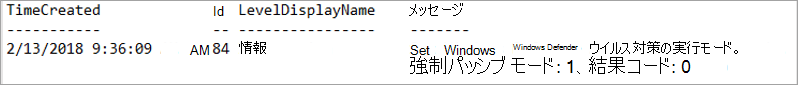
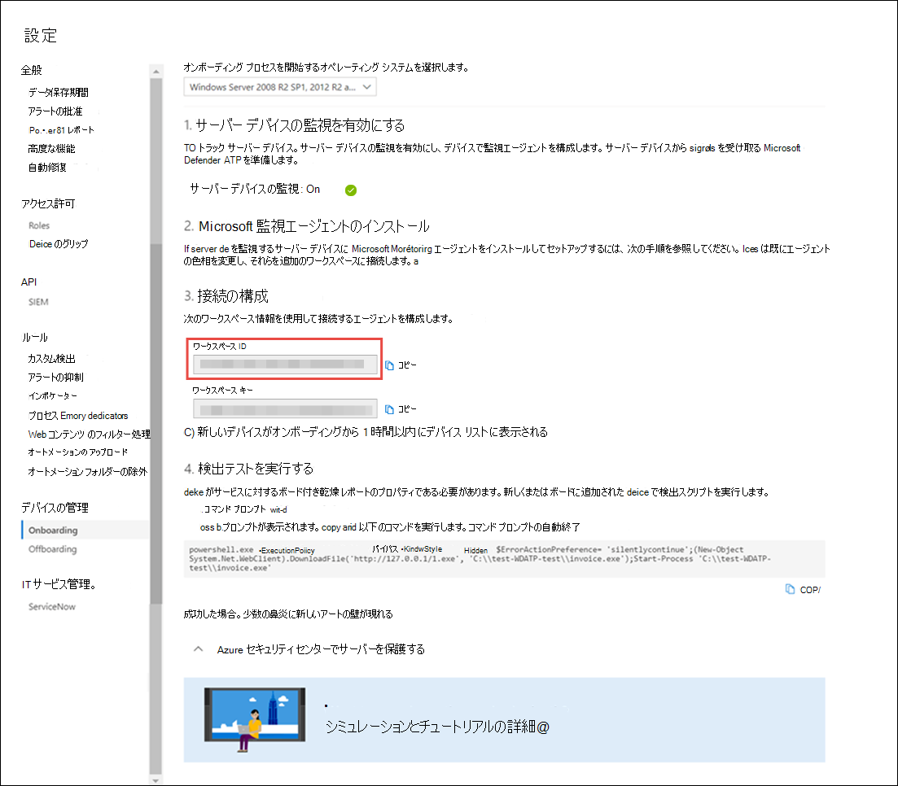

# <a name="onboard-windows-servers-to-the-microsoft-defender-for-endpoint-service"></a>Microsoft Defender Windowsエンドポイント サービスへのオンボード サーバー

[!INCLUDE [Microsoft 365 Defender rebranding](../../includes/microsoft-defender.md)]

**適用対象:**

- Windows Server 2008 R2 SP1
- Windows Server 2012 R2
- Windows Server 2016
- Windows Server (SAC) バージョン 1803 以降
- Windows Server 2019 以降
- Windows Server 2019 Core Edition

> Defender for Endpoint を体験してみませんか? [無料試用版にサインアップしてください。](https://www.microsoft.com/microsoft-365/windows/microsoft-defender-atp?ocid=docs-wdatp-configserver-abovefoldlink)

Defender for Endpoint では、サポートを拡張して、サーバー オペレーティング Windowsも含まれます。 このサポートは、高度な攻撃の検出と調査機能を、Microsoft 365 Defender提供します。

ライセンスとインフラストラクチャに必要な機能に関する実践的なガイダンスについては、「Defender for Endpoint Windowsサーバーの保護」[を参照してください](https://techcommunity.microsoft.com/t5/What-s-New/Protecting-Windows-Server-with-Windows-Defender-ATP/m-p/267114#M128)。

サーバーのベースラインをダウンロードして使用する方法Windows セキュリティについては、「Windowsベースライン[Windows セキュリティ」を参照してください](/windows/device-security/windows-security-baselines)。

## <a name="windows-server-2008-r2-sp1-windows-server-2012-r2-and-windows-server-2016"></a>WindowsServer 2008 R2 SP1、Windows Server 2012 R2、およびWindows Server 2016

次のオプションWindowsを使用して、Defender for Endpoint Windows Server 2008 R2 SP1、Windows Server 2012 R2、Windows Server 2016 を Defender にオンボードできます。

- **オプション 1**:[インストールおよび構成によるオンボード Microsoft Monitoring Agent (MMA)](#option-1-onboard-by-installing-and-configuring-microsoft-monitoring-agent-mma)
- **オプション 2**: [Azure セキュリティ センター経由でオンボードする](#option-2-onboard-windows-servers-through-azure-security-center)
- **オプション 3**:[バージョン 2002 以降Microsoft エンドポイント マネージャーオンボード](#option-3-onboard-windows-servers-through-microsoft-endpoint-manager-version-2002-and-later)

提供されているオプションを使用してオンボーディング手順を完了した後、クライアントの構成と更新[System Center Endpoint Protection必要があります](#configure-and-update-system-center-endpoint-protection-clients)。

> [!NOTE]
> Windows サーバーを Microsoft Monitoring Agent (オプション 1) または Microsoft エンドポイント マネージャー (オプション 3) を介してオンボードするには、ノードごとにエンドポイントのスタンドアロン サーバー ライセンスの Defender が必要です。 または、Azure セキュリティ センター (オプション 2) を介して Windows サーバーをオンボードするには、ノードごとに Azure Defender for Servers ライセンスが必要です[。「Azure Defender](/azure/security-center/security-center-services)で利用可能なサポートされる機能」を参照してください。

### <a name="option-1-onboard-by-installing-and-configuring-microsoft-monitoring-agent-mma"></a>オプション 1: インストールと構成を行 Microsoft Monitoring Agentってオンボードする (MMA)

センサー データを Defender for Endpoint に報告するには、Windowsサーバー用に MMA をインストールして構成する必要があります。 詳細については [、「Azure Log Analytics エージェントを使用してログ データを収集する」を参照してください](/azure/azure-monitor/platform/log-analytics-agent)。

System Center Operations Manager (SCOM) または Azure Monitor (旧称:Operations Management Suite (OMS)) を既に使用している場合は、Microsoft Monitoring Agent (MMA) を添付して、マルチホミング サポートを通じて Defender for Endpoint ワークスペースに報告します。

一般に、次の手順を実行する必要があります。

1. 「始める前に」で説明されているオンボーディング要件 **を満た** します。
2. ポータルからサーバーの監視Microsoft 365 Defenderします。
3. センサー データを Defender for Endpoint に報告するサーバーの MMA をインストールして構成します。
4. クライアントの構成と更新System Center Endpoint Protectionします。

> [!TIP]
> デバイスのオンボード後、検出テストを実行して、サービスに適切にオンボードされていることを確認できます。 詳細については、「新しくオンボードされた Defender for Endpoint エンドポイントで検出テストを実行 [する」を参照してください](run-detection-test.md)。

#### <a name="before-you-begin"></a>開始する前に

オンボーディング要件を満たすために、次の手順を実行します。

Windows Server 2008 R2 SP1 または R2 のWindows Server 2012、次の修正プログラムをインストールしてください。

- [カスタマー エクスペリエンスと診断テレメトリの更新](https://support.microsoft.com/help/3080149/update-for-customer-experience-and-diagnostic-telemetry)

Server 2008 R2 SP1 Windows、次の要件を満たしていることを確認します。

- 2 [月の月次更新プログラムのロールアップをインストールする](https://support.microsoft.com/help/4074598/windows-7-update-kb4074598)
- [.NET framework 4.5](https://www.microsoft.com/download/details.aspx?id=30653) (以降) または[KB3154518](https://support.microsoft.com/help/3154518/support-for-tls-system-default-versions-included-in-the-net-framework)のいずれかをインストールする

    > [!NOTE]
    > SCCM を使用して Windows Server 2008 R2 SP1 を管理している場合、SCCM クライアント エージェントは .Net Framework 4.5.2 をインストールします。 そのため、.NET framework 4.5 (以降) をインストールする必要はないので、

サーバー Windows 2008 R2 SP1 および Windows Server 2012 R2 の場合: クライアントSystem Center Endpoint Protection[構成および更新します](#configure-and-update-system-center-endpoint-protection-clients)。

> [!NOTE]
> この手順は、組織で System Center Endpoint Protection (SCEP) を使用し、Windows Server 2008 R2 SP1 および R2 をオンボーディングする場合Windows Server 2012です。

### <a name="install-and-configure-microsoft-monitoring-agent-mma-to-report-sensor-data-to-microsoft-defender-for-endpoint"></a>センサー データを Microsoft Defender for Endpoint にMicrosoft Monitoring Agentレポートするデバイス (MMA) をインストールして構成する

1. エージェント セットアップ ファイルをダウンロードします[。Windows 64 ビット エージェントをダウンロードします](https://go.microsoft.com/fwlink/?LinkId=828603)。

2. 前の手順で取得した Workspace ID と Workspace キーを使用して、次のインストール方法を選択して、エージェントをサーバーにインストールWindowsします。
    - [セットアップを使用してエージェントを手動でインストールします](/azure/log-analytics/log-analytics-windows-agents#install-agent-using-setup-wizard)。 
    [エージェント **のセットアップ オプション]** ページで、[エージェント **Connect Azure Log Analytics (OMS) に移動する] を選択します**。
    - [コマンド ラインを使用してエージェントをインストールします](/azure/log-analytics/log-analytics-windows-agents#install-agent-using-command-line)。
    - [スクリプトを使用してエージェントを構成します](/azure/log-analytics/log-analytics-windows-agents#install-agent-using-dsc-in-azure-automation)。

> [!NOTE]
> 米国政府機関のお客様[](gov.md)の場合は、[Azure Cloud] の下で、セットアップ ウィザードを使用する場合は "Azure US Government" を選択するか、コマンド ラインまたはスクリプトを使用する場合は、"OPINSIGHTS_WORKSPACE_AZURE_CLOUD_TYPE" パラメーターを 1 に設定する必要があります。

### <a name="configure-windows-server-proxy-and-internet-connectivity-settings-if-needed"></a>必要にWindowsサーバー プロキシとインターネット接続の設定を構成する

サーバーが Defender for Endpoint と通信するためにプロキシを使用する必要がある場合は、次のいずれかの方法を使用して、プロキシ サーバーを使用する MMA を構成します。

- [プロキシ サーバーを使用する MMA を構成する](/azure/azure-monitor/platform/agent-windows#install-agent-using-setup-wizard)

- [すべてのWindowsプロキシ サーバーを使用するサーバーを構成する](configure-proxy-internet.md)

プロキシまたはファイアウォールが使用されている場合は、サーバーが SSL インターセプトなしで直接 Microsoft Defender for Endpoint サービス URL にアクセスできます。 詳細については、「Defender for Endpoint Service URL へのアクセス [を有効にする」を参照してください](configure-proxy-internet.md#enable-access-to-microsoft-defender-for-endpoint-service-urls-in-the-proxy-server)。 SSL インターセプトを使用すると、システムは Defender for Endpoint サービスと通信できません。

完了すると、1 時間以内にポータルにオンボード Windowsサーバーが表示されます。

### <a name="option-2-onboard-windows-servers-through-azure-security-center"></a>オプション 2: Azure セキュリティ センター Windowsサーバーをオンボードする

1. [デバイスのMicrosoft 365 Defender] ウィンドウで、[エンドポイント **デバイス** 設定  >    >  **オンボーディング]**  >  **を選択します**。

2. オペレーティング **Windowsサーバー 2008 R2 SP1、2012 R2、2016** を選択します。

3. **[Azure セキュリティ センターのオンボード サーバー] をクリックします**。

4. [「Microsoft Defender for Endpoint with Azure Defender」](/azure/security-center/security-center-wdatp)のオンボーディング手順に従い、Azure ARC を使用している場合は[、「Microsoft Defender for](/azure/security-center/security-center-wdatp#enabling-the-microsoft-defender-for-endpoint-integration)Endpoint 統合を有効にする」のオンボーディング手順に従います。

オンボーディングの手順を完了した後、クライアントの構成と[更新System Center Endpoint Protection必要があります](#configure-and-update-system-center-endpoint-protection-clients)。

> [!NOTE]
>
> - Azure Defender for Servers によるオンボーディングが期待通り動作するには、サーバーに適切なワークスペースとキーが構成されている必要があります。Microsoft Monitoring Agent (MMA) の設定で構成します。
> - 構成が完了すると、適切なクラウド管理パックがコンピューターに展開され、センサー プロセス (MsSenseS.exe) が展開され、開始されます。
> - これは、サーバーが OMS ゲートウェイ サーバーをプロキシとして使用するように構成されている場合にも必要です。

### <a name="option-3-onboard-windows-servers-through-microsoft-endpoint-manager-version-2002-and-later"></a>オプション 3: Windows 2002 以降Microsoft エンドポイント マネージャーサーバーにオンボードする

R2 と Windows Server 2012バージョン 2002 以降Windows Server 2016使用Microsoft エンドポイント マネージャーオンボードできます。 詳細については[、「Microsoft Defender for Endpoint in Microsoft エンドポイント マネージャー」を参照してください](/mem/configmgr/protect/deploy-use/defender-advanced-threat-protection)。

オンボーディングの手順を完了した後、クライアントの構成と[更新System Center Endpoint Protection必要があります](#configure-and-update-system-center-endpoint-protection-clients)。

## <a name="windows-server-sac-version-1803-windows-server-2019-and-windows-server-2019-core-edition"></a>Windowsサーバー (SAC) バージョン 1803、Windows Server 2019、Windows Server 2019 Core Edition

次の展開方法を使用して、Windows Server (SAC) バージョン 1803、Windows Server 2019、または Windows Server 2019 Core Edition をオンボードできます。

- [ローカル スクリプト](configure-endpoints-script.md)
- [グループ ポリシー](configure-endpoints-gp.md)
- [Microsoft Endpoint Configuration Manager](configure-endpoints-sccm.md)
- [System Center Configuration Manager 2012 / 2012 R2 1511 / 1602](configure-endpoints-sccm.md#onboard-devices-using-system-center-configuration-manager)
- [永続的でないデバイスの VDI オンボーディング スクリプト](configure-endpoints-vdi.md)

> [!NOTE]
>
> - 現在、スクリプトがWindowsサーバー 2019 Microsoft エンドポイント マネージャーオンボーディング パッケージ。 Configuration Manager でスクリプトを展開する方法の詳細については、「Configuration Manager の [パッケージとプログラム」を参照してください](/configmgr/apps/deploy-use/packages-and-programs)。
> - ローカル スクリプトは概念実証に適していますが、実稼働展開には使用できません。 実稼働展開の場合は、グループ ポリシーまたはグループ ポリシーを使用Microsoft Endpoint Configuration Manager。

サーバーのWindowsは、サーバーアクティビティ、カーネル攻撃とメモリ攻撃検出の範囲に関するより深い洞察を提供し、応答アクションを有効にします。

1. デバイスの同じツールとメソッドを使用して、Windows サーバー上の Defender for Endpoint オンボーディング設定をWindows 10します。 詳細については、「Onboard [Windows 10 デバイス」を参照してください](configure-endpoints.md)。

2. サードパーティのマルウェア対策ソリューションを実行している場合は、次の Microsoft Defender AV パッシブ モード設定を適用する必要があります。 正しく構成されていることを確認します。

    1. 次のレジストリ エントリを設定します。
       - パス: `HKLM\SOFTWARE\Policies\Microsoft\Windows Advanced Threat Protection`
       - 名前: ForceDefenderPassiveMode
       - 種類: REG_DWORD
       - Value: 1

    1. 次の PowerShell コマンドを実行して、パッシブ モードが構成されていることを確認します。

       ```PowerShell
       Get-WinEvent -FilterHashtable @{ProviderName="Microsoft-Windows-Sense" ;ID=84}
       ```

    1. パッシブ モード イベントを含む最近のイベントが見つかったこと確認します。

       

3. 次のコマンドを実行して、Microsoft Defender AV がインストールされていることを確認します。

   ```sc.exe query Windefend```

    結果が '指定されたサービスがインストールされたサービスとして存在しない' の場合は、Microsoft Defender AV をインストールする必要があります。 詳細については[、「Microsoft Defender ウイルス対策」をWindows 10。](/windows/security/threat-protection/microsoft-defender-antivirus/microsoft-defender-antivirus-in-windows-10)

    グループ ポリシーを使用 Microsoft Defender ウイルス対策して Windows サーバーでグループ ポリシーを構成および管理する方法については、「グループ ポリシー設定を使用してグループ ポリシーを構成および管理する」を参照[Microsoft Defender ウイルス対策。](/windows/security/threat-protection/microsoft-defender-antivirus/use-group-policy-microsoft-defender-antivirus)

## <a name="integration-with-azure-defender"></a>Azure Defender との統合

Defender for Endpoint は、Azure Defender と統合して、包括的なサーバー保護Windows提供できます。 この統合により、Azure Defender は Defender for Endpoint の機能を使用して、サーバーの脅威検出を強化Windowsできます。

この統合には、次の機能が含まれています。

- 自動オンボーディング - Defender for Endpoint センサーは、Azure Defender にオンボードWindowsサーバーで自動的に有効になります。 Azure Defender オンボーディングの詳細については、「統合 Microsoft Defender for Endpoint ライセンスを使用する [」を参照してください](/azure/security-center/security-center-wdatp)。

    > [!NOTE]
    > Azure Defender for Servers と Microsoft Defender for Endpoint の統合は[、Windows Server 2019 と Windows Virtual Desktop (WVD)](/azure/security-center/release-notes#microsoft-defender-for-endpoint-integration-with-azure-defender-now-supports-windows-server-2019-and-windows-10-virtual-desktop-wvd-in-preview)をサポートするように拡張されました。

- Windows監視されるサーバーは、Defender for Endpoint でも利用できます 。 Azure Defender は Defender for Endpoint テナントにシームレスに接続し、クライアントとサーバー間で 1 つのビューを提供します。  さらに、Defender for Endpoint アラートは Azure Defender コンソールで利用できます。
- サーバー調査 - Azure Defender のお客様は、Microsoft 365 Defenderポータルにアクセスして詳細な調査を実行し、潜在的な侵害の範囲を明らかにできます。

> [!IMPORTANT]
> - Azure Defender を使用してサーバーを監視すると、Defender for Endpoint テナントが自動的に作成されます (米国のユーザーは米国、EU ではヨーロッパおよび英国のユーザー)。<br>
Defender for Endpoint によって収集されたデータは、プロビジョニング中に特定されたテナントの地理的位置に格納されます。
> - Azure Defender を使用する前に Defender for Endpoint を使用する場合、後で Azure Defender と統合した場合でも、テナントの作成時に指定した場所にデータが格納されます。
> - 構成が完了すると、データの保存場所を変更できません。 データを別の場所に移動する必要がある場合は、Microsoft サポートに問い合わせ、テナントをリセットする必要があります。 <br>
この統合を利用したサーバー エンドポイントの監視は、ユーザーのOffice 365 GCCされています。

## <a name="configure-and-update-system-center-endpoint-protection-clients"></a>クライアントの構成と更新System Center Endpoint Protectionする

Defender for Endpoint は、エンドポイントとSystem Center Endpoint Protection。 この統合により、マルウェアの検出を可視化し、悪意のある可能性のあるファイルや疑わしいマルウェアを禁止することで、組織内の攻撃の伝達を停止できます。

この統合を有効にするには、次の手順が必要です。

- [2017 年 1](https://support.microsoft.com/help/3209361/january-2017-anti-malware-platform-update-for-endpoint-protection-clie)月のマルウェア対策プラットフォーム更新プログラムをクライアントEndpoint Protectionします。

- [SCEP クライアント Cloud Protection Service メンバーシップを Advanced](/windows/security/threat-protection/microsoft-defender-antivirus/enable-cloud-protection-microsoft-defender-antivirus) 設定に **構成** します。

## <a name="offboard-windows-servers"></a>オフボード Windows サーバー

Windows クライアント デバイスで使用できるのと同じ方法で、Windows サーバー (SAC)、Windows Server 2019、および Windows Server 2019 Core edition をオフボードWindows 10できます。

他のサーバー Windowsの場合は、サービスからサーバーをオフボードWindows 2 つのオプションがあります。

- MMA エージェントのアンインストール
- Defender for Endpoint ワークスペース構成を削除する

> [!NOTE]
> オフボードにより、Windows サーバーはセンサー データのポータルへの送信を停止しますが、Windows サーバーからのデータ (通知への参照を含む) は最大 6 か月間保持されます。

### <a name="uninstall-windows-servers-by-uninstalling-the-mma-agent"></a>MMA Windowsをアンインストールして、サーバーをアンインストールする

サーバーをオフWindowsするには、MMA エージェントを Windows サーバーからアンインストールするか、レポートから Defender for Endpoint ワークスペースに切り離します。 エージェントのオフボード後、Windowsサーバーは Defender for Endpoint にセンサー データを送信しなくなりました。
詳細については、「エージェントを無効 [にするには」を参照してください](/azure/log-analytics/log-analytics-windows-agents#to-disable-an-agent)。

### <a name="remove-the-defender-for-endpoint-workspace-configuration"></a>Defender for Endpoint ワークスペース構成を削除する

サーバーをオフボードWindows、次のいずれかの方法を使用できます。

- DEFENDER for Endpoint ワークスペース構成を MMA エージェントから削除する
- PowerShell コマンドを実行して構成を削除する

#### <a name="remove-the-defender-for-endpoint-workspace-configuration-from-the-mma-agent"></a>DEFENDER for Endpoint ワークスペース構成を MMA エージェントから削除する

1. [プロパティ **Microsoft Monitoring Agent] で****、[Azure Log Analytics (OMS) タブを選択** します。

2. [Defender for Endpoint] ワークスペースを選択し、[削除] を **クリックします**。

    

#### <a name="run-a-powershell-command-to-remove-the-configuration"></a>PowerShell コマンドを実行して構成を削除する

1. ワークスペース ID を取得します。

   1. [デバイスのMicrosoft 365 Defender] ウィンドウで、[エンドポイント **デバイス** 設定  >    >  **オンボーディング]**  >  **を選択します**。

   1. オペレーティング **システムWindows Server 2008 R2 SP1、2012 R2、2016** を選択し、ワークスペース ID を取得します。

      

2. 管理者特権の PowerShell を開き、次のコマンドを実行します。 取得して置き換えたワークスペース ID を使用します `WorkspaceID` 。

    ```powershell
    $ErrorActionPreference = "SilentlyContinue&quot;
    # Load agent scripting object
    $AgentCfg = New-Object -ComObject AgentConfigManager.MgmtSvcCfg
    # Remove OMS Workspace
    $AgentCfg.RemoveCloudWorkspace(&quot;WorkspaceID")
    # Reload the configuration and apply changes
    $AgentCfg.ReloadConfiguration()

    ```

## <a name="onboarding-servers-with-no-management-solution"></a>管理ソリューションを使用してサーバーをオンボーディングする

### <a name="using-group-policy"></a>グループ ポリシーの使用

**手順-1: サーバーにコピーするために必要なファイルを作成します。**

1. c:\windows\sysvol\domain\scripts に移動します (ドメイン コントローラーの 1 つで変更コントロールが必要になる場合があります)。
1. MMA という名前のフォルダーを作成します。
1. 以下をダウンロードし、MMA フォルダーに配置します。

    **カスタマー エクスペリエンスと診断テレメトリの更新 (Windows Server 2008 R2 および Windows Server 2012 R2)**

    [2008 Windows R2 x64 の場合](https://www.microsoft.com/download/details.aspx?familyid=1bd1d18d-4631-4d8e-a897-327925765f71)

    [2012 Windows R2 x64 の場合](https://www.microsoft.com/download/details.aspx?familyid=94cf6d85-017a-4c4c-afca-7d00721b500f)

    > [!NOTE]
    > この記事では、x64 ベースのサーバー (MMA エージェント .exe X64 新 [しい SHA-2 準拠バージョン) を使用している必要があります](https://go.microsoft.com/fwlink/?LinkId=828603)。

**手順-2: ファイル名 DeployMMA.cmd を作成する (メモ帳を使用)** cmd ファイルに次の行を追加します。 ワークスペース ID と KEY が必要です。

```dos
@echo off 
cd "C:"
IF EXIST "C:\Program Files\Microsoft Monitoring Agent\Agent\MonitoringHost.exe" ( 
exit
) ELSE (
wusa.exe c:\Windows\MMA\Windows6.1-KB123456-x86.msu /quiet /norestart
wusa.exe c:\Windows\MMA\Windows8.1-KB123456-x86.msu /quiet /norestart
"c:\windows\MMA\MMASetup-AMD64.exe" /C:"setup.exe /qn ADD_OPINSIGHTS_WORKSPACE=1
OPINSIGHTS_WORKSPACE_ID=<your workspace ID>
OPINSIGHTS_WORKSPACE_KEY=<your workspace key>== AcceptEndUserLicenseAgreement=1"
)
```

## <a name="group-policy-configuration"></a>グループ ポリシーの構成

「Microsoft Defender for Endpoint Onboarding」などのオンボード デバイス専用の新しいグループ ポリシーを作成します。

- "c:\windows\MMA" という名前のグループ ポリシー フォルダーを作成する

     :::image type="content" source="images/grppolicyconfig1.png" alt-text="フォルダー":::

    **これにより、GPO が適用され、MMA と呼ばれるすべてのサーバーに新しいフォルダーが追加され、c:\windows に格納されます。これには、MMA、前提条件、およびインストール スクリプトのインストール ファイルが含まれる。**

- Net ログオンに格納されている各ファイルのグループ ポリシー ファイルの基本設定を作成します。

     :::image type="content" source="images/grppolicyconfig2.png" alt-text="グループ ポリシーイメージ1":::

DOMAIN\NETLOGON\MMA\filename から C:\windows\MMA\filename にファイルをコピーします。そのため、インストール ファイルはサーバー **にローカルです**。

:::image type="content" source="images/deploymma.png" alt-text="mma cmd を展開する":::

2 つの KB (1 つは Windows Server 2008R2/Windows 7、もう 1 つは Windows Server 2012 R2) の場合は、このプロセスを繰り返しますが、[COMMON] タブでアイテム レベルのターゲット設定を作成します。そのため、ファイルはスコープ内の適切なプラットフォーム/オペレーティング システム バージョンにのみコピーされます。

:::image type="content" source="images/targeteditor.png" alt-text="ターゲット エディター":::

- サーバー 2008 R2 Windows Windows6.1-BJ3080149-x64.msu が必要です (コピーダウンのみ)
- たとえばWindows Server 2012 R2 Windows8.1-BJ3080149-x64.msu が必要です (コピーダウンのみ)。

これが完了したら、起動スクリプト ポリシーを作成する必要があります。

:::image type="content" source="images/startupprops.png" alt-text="プロパティの起動":::

ここで実行するファイルの名前は c:\windows\MMA\DeployMMA.cmd です。
サーバーが起動プロセスの一部として再起動すると、カスタマー エクスペリエンスと診断テレメトリ KB の更新プログラムがインストールされ、MMA エージェントがインストールされ、ワークスペース ID とキーが設定され、サーバーがオンボードされます。

すべてのサーバーを再起動 **しない** 場合は、即時タスクを使用して deployMMA.cmd を実行することもできます。
これは、2 つのフェーズで実行できます。 まず **、GPO でファイルと** フォルダーを作成します。GPO が適用され、すべてのサーバーにインストール ファイルが含まれています。 次に、イミディエイト タスクを追加します。 これにより、再起動を必要とせずに同じ結果が得られます。

スクリプトは exit メソッドを持ち、MMA がインストールされている場合は再び実行されませんので、毎日スケジュールされたタスクを使用して同じ結果を得る場合も可能です。 Configuration Manager コンプライアンス ポリシーと同様に、MMA が存在しているのを確認するために毎日チェックされます。

:::image type="content" source="images/schtask.png" alt-text="スケジュール タスク":::

:::image type="content" source="images/newtaskprops.png" alt-text="新しいタスクのプロパティ":::

:::image type="content" source="images/deploymmadowmload.png" alt-text="mma ダウンロード の小道具を展開する":::

:::image type="content" source="images/tasksch.png" alt-text="タスク スケジューラ":::

Server 2008 R2 のオンボーディングに関するドキュメントで特に説明したように、以下を参照してください。

サーバー Windows 2008 R2 PS1 の場合は、次の要件を満たしていることを確認してください。

- [2018 年 2 月の更新プログラムのロールアップをインストールする](https://support.microsoft.com/help/4074598/windows-7-update-kb4074598)
  
- [.NET framework 4.5](https://www.microsoft.com/download/details.aspx?id=30653) (以降) または[KB3154518](https://support.microsoft.com/help/3154518/support-for-tls-system-default-versions-included-in-the-net-framework)のいずれかをインストールする

Windows Server 2008 R2 をオンボーディングする前に、KB が存在する必要があります。

## <a name="related-topics"></a>関連項目

- [Windows 10 デバイスのオンボード](configure-endpoints.md)
- [Windows 以外のデバイスをオンボードする](configure-endpoints-non-windows.md)
- [プロキシとインターネット接続の設定を構成する](configure-proxy-internet.md)
- [新しくオンボードされた Defender for Endpoint デバイスで検出テストを実行する](run-detection-test.md)
- [Microsoft Defender for Endpoint オンボーディングの問題のトラブルシューティング](troubleshoot-onboarding.md)
