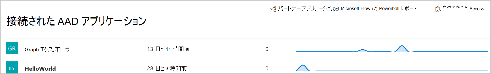

# Microsoft Defender for Endpoint の接続アプリケーション

[!INCLUDE [Microsoft 365 Defender rebranding](../../includes/microsoft-defender.md)]

**適用対象:**
- [Microsoft Defender for Endpoint](https://go.microsoft.com/fwlink/p/?linkid=2154037)
- [Microsoft 365 Defender](https://go.microsoft.com/fwlink/?linkid=2118804)

> Defender for Endpoint を体験してみませんか? [無料試用版にサインアップしてください。](https://signup.microsoft.com/create-account/signup?products=7f379fee-c4f9-4278-b0a1-e4c8c2fcdf7e&ru=https://aka.ms/MDEp2OpenTrial?ocid=docs-wdatp-assignaccess-abovefoldlink)

接続されたアプリケーションは、API を使用して Defender for Endpoint プラットフォームと統合されます。 

アプリケーションは、標準の OAuth 2.0 プロトコルを使用して認証を行い、Microsoft Defender for Endpoint API で使用するためのトークンを提供します。  さらに、Azure Active Directory (Azure AD) アプリケーションを使用すると、テナント管理者は、対応するアプリを使用してアクセスできる API を明示的に制御できます。
 
接続されているアプリケーションで API [を使用](/microsoft-365/security/defender-endpoint/apis-intro) するには、次の手順に従う必要があります。
 
左側のナビゲーション メニューから、[ **パートナー** ] を選択& API ([ **エンドポイント**] の下) >接続済み **アプリケーションです**。
 
## 接続されているアプリケーションの詳細を表示する
[接続されたアプリケーション] ページには、組織内の Microsoft Defender for Endpoint に接続AD Azure アプリケーションに関する情報が表示されます。 接続されているアプリケーションの使用状況を確認できます。前回の表示、過去 24 時間の要求数、過去 30 日間の傾向の要求を行います。

 
## 接続されているアプリケーションの編集、再構成、または削除
[ **アプリケーションの設定を開** く] リンクをクリックすると、対応する Azure ADアプリケーション管理ページが Azure portal で開きます。 Azure portal から、接続されているアプリケーションのアクセス許可の管理、再構成、または削除を行います。
