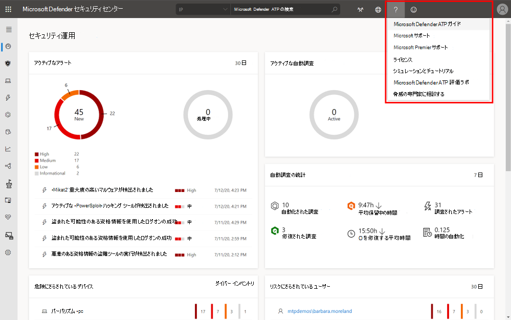
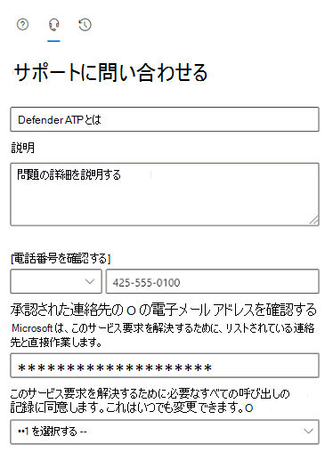

# Microsoft Defender for Endpoint サポートに連絡するContact Microsoft Defender for Endpoint support

[!INCLUDE [Microsoft 365 Defender rebranding](../../includes/microsoft-defender.md)]

**適用対象:****Applies to:**
- [Microsoft Defender for EndpointMicrosoft Defender for Endpoint](https://go.microsoft.com/fwlink/p/?linkid=2154037)
- [Microsoft 365 DefenderMicrosoft 365 Defender](https://go.microsoft.com/fwlink/?linkid=2118804)

>Defender for Endpoint を体験してみませんか?Want to experience Defender for Endpoint? [無料試用版にサインアップしてください。Sign up for a free trial.](https://www.microsoft.com/microsoft-365/windows/microsoft-defender-atp?ocid=docs-wdatp-assignaccess-abovefoldlink)

Defender for Endpoint は最近、サポート プロセスをアップグレードして、よりモダンで高度なサポート エクスペリエンスを提供しました。Defender for Endpoint has recently upgraded the support process to offer a more modern and advanced support experience.

新しいウィジェットを使用すると、顧客は次の機能を使用できます。The new widget allows customers to:

- 一般的な問題の解決策を見つけるFind solutions to common problems
- サポート ケースを Microsoft サポート チームに提出するSubmit a support case to the Microsoft support team

## 前提条件Prerequisites

サポート ケースを開く権限を持つ特定の役割を知る必要があります。It's important to know the specific roles that have permission to open support cases.

少なくとも、サービス サポート管理者またはヘルプ **デスク管理者の** 役割が必要です。At a minimum, you must have a Service Support Administrator **OR** Helpdesk Administrator role.

アクセス許可を持つ役割の詳細については、「 [セキュリティ管理者のアクセス許可」を参照してください](/azure/active-directory/users-groups-roles/directory-assign-admin-roles#security-administrator-permissions)。For more information on which roles have permission see, [Security Administrator permissions](/azure/active-directory/users-groups-roles/directory-assign-admin-roles#security-administrator-permissions). アクションを含むロールは `microsoft.office365.supportTickets/allEntities/allTasks` 、ケースを送信できます。Roles that include the action `microsoft.office365.supportTickets/allEntities/allTasks` can submit a case.

管理者ロールの一般的な情報については、「管理者ロール [について」を参照してください](/microsoft-365/admin/add-users/about-admin-roles)。For general information on admin roles, see [About admin roles](/microsoft-365/admin/add-users/about-admin-roles).

## ウィジェットにアクセスするAccess the widget
新しいサポート ウィジェットにアクセスするには、次の 2 つの方法のいずれかを使用します。Accessing the new support widget can be done in one of two ways:

1. ポータルの右上部にある疑問符をクリックし、[Microsoft サポート] をクリックします。Clicking on the question mark on the top right of the portal and then clicking on "Microsoft support":

    

2. [ヘルプが必要 **] をクリックします。**Clicking on the **Need help?**  ポータルの右下にあるボタンMicrosoft 365 Defenderします。button in the bottom right of the Microsoft 365 Defender portal:

    ![[必要なヘルプ] ボタンの画像](images/need-help-option.png)

ウィジェットでは、次の 2 つのオプションが提供されます。In the widget you will be offered two options:

- 一般的な問題の解決策を見つけるFind solutions to common problems
- 問い合わせを行うOpen a service request

## 一般的な問題の解決策を見つけるFind solutions to common problems
このオプションには、質問に関連する可能性がある記事が含まれます。This option includes articles that might be related to the question you may ask. 検索ボックスに質問を入力し始めるだけで、検索に関連する記事が表示されます。Just start typing the question in the search box and articles related to your search will be surfaced.

提案された記事が十分でない場合は、サービス要求を開く必要があります。In case the suggested articles are not sufficient, you can open a service request.

## 問い合わせを行うOpen a service request

Defender for Endpoint サポートに問い合わせ、サポート チケットを開く方法について説明します。Learn how to open support tickets by contacting Defender for Endpoint support.

> [!Note]
> Microsoft とのパーミエ サポート契約がある場合は、ウィジェットにプレミア タグが表示されます。If you have a permier support contract with Microsoft, you will see the premier tag on the widget. 設定されていない場合は、Microsoft アカウント マネージャーに問い合わせください。If not, contact your Microsoft account manager.

### サポートにお問い合せくださいContact support

このオプションは、ヘッドセットのように見えるアイコンをクリックして使用できます。This option is available by clicking the icon that looks like a headset. 次に、サポート ケースを提出する次のページが表示されます。You will then get the following page to submit your support case:

1. 直面している問題のタイトルと説明、およびお客様に連絡する可能性がある電話番号と電子メール アドレスを入力します。Fill in a title and description for the issue you are facing, as well as a phone number and email address where we may reach you.

2. (省略可能)サポート ケースに追加のコンテキストを提供するために、問題に関連する添付ファイルを最大 5 つ含める。(Optional) Include up to five attachments that are relevant to the issue in order to provide additional context for the support case.

3. 該当する場合は、タイム ゾーンと別の言語を選択します。Select your time zone and an alternative language, if applicable. 要求は Microsoft サポート チームに送信されます。The request will be sent to Microsoft Support Team. チームは、サービス要求にまもなく応答します。The team will respond to your service request shortly.

## 関連項目Related topics

- [サービスに関する問題のトラブルシューティングTroubleshoot service issues](troubleshoot-mdatp.md)
- [サービス正常性の確認Check service health](service-status.md)
