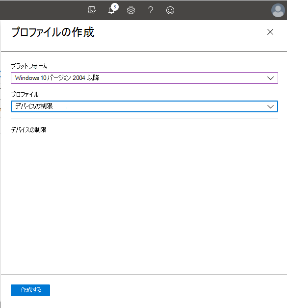
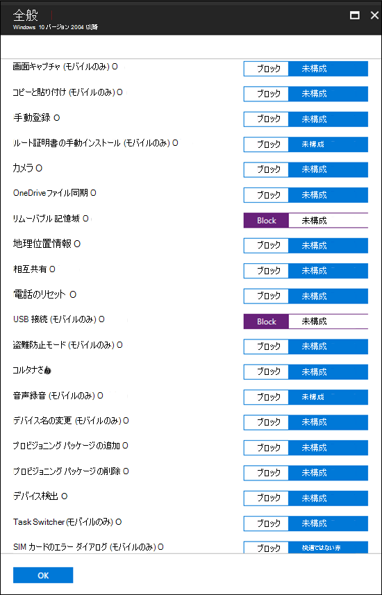
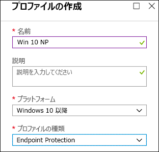
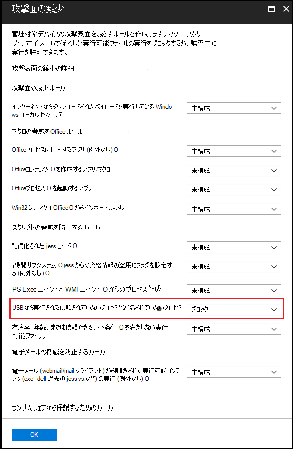

# <a name="how-to-control-usb-devices-and-other-removable-media-using-microsoft-defender-for-endpoint"></a>Microsoft Defender for Endpoint を使用して USB デバイスや他のリムーバブル メディアを制御する方法

**適用対象:** [Microsoft Defender for Endpoint](https://go.microsoft.com/fwlink/p/?linkid=2069559)

Microsoft では、 [リムーバブル](https://aka.ms/devicecontrolblog)メディアのセキュリティ保護に対する層的なアプローチをお勧めします。Microsoft Defender for Endpoint には、承認されていない周辺機器の脅威がデバイスを侵害するのを防ぐのに役立つ複数の監視機能と制御機能があります。

1. Microsoft Defender for Endpoint Advanced Hunting で周辺機器のプラグ アンド プレイ接続[イベントを検出します](#discover-plug-and-play-connected-events)。 疑わしい利用状況を特定または調査します。

2. 特定のリムーバブル デバイスのみを許可またはブロックし、脅威を防止するために構成します。
    1. [詳細な構成に基づいてリムーバブル](#allow-or-block-removable-devices) デバイスを許可またはブロックして、リムーバブル ディスクへの書き込みアクセスを拒否し、USB デバイスの ID を使用してデバイスを承認または拒否します。 デバイスインストール設定の柔軟なポリシー割り当ては、Azure Azure Active Directory (Azure AD) ユーザーとデバイスのグループに基づいて行います。

    2. [次の機能を有効に](#prevent-threats-from-removable-storage) することで、リムーバブル 記憶域デバイスによって導入されたリムーバブル 記憶域からの脅威を防止します。
        - Microsoft Defender ウイルス対策保護 (RTP) を使用して、リムーバブル 記憶域をスキャンしてマルウェアを検出します。
        - USB から実行される信頼されていないプロセスと署名されていないプロセスをブロックする攻撃表面縮小 (ASR) USB ルール。
        - ユーザーがサインインするまで、カーネル DMA Protection for Thunderbolt やブロック DMA など、DMA 攻撃を軽減するためのダイレクト メモリ アクセス (DMA) 保護設定。

3. [カスタム検出ルールを使用して](#create-customized-alerts-and-response-actions) 、これらのプラグ アンド プレイ イベントまたは他の Microsoft Defender for Endpoint イベントに基づいてリムーバブル デバイスの使用状況を監視するために、カスタマイズされたアラートと応答アクション [を作成します](/microsoft-365/security/defender-endpoint/custom-detection-rules)。

4. [各周辺機器から報告](#respond-to-threats) されたプロパティに基づいて、周辺機器からの脅威にリアルタイムで対応します。

> [!NOTE]
> これらの脅威の軽減策は、マルウェアが環境に入り込むのを防ぐのに役立ちます。 エンタープライズ データを環境から保護するために、データ損失防止対策を構成できます。 たとえば、Windows 10 デバイスで[BitLocker](/windows/security/information-protection/bitlocker/bitlocker-overview.md)と Windows Information [Protection](/windows/security/information-protection/create-wip-policy-using-intune-azure.md)を構成すると、個人のデバイスに保存されている場合でも会社のデータを暗号化したり[、Storage/RemovableDiskDenyWriteAccess CSP](/windows/client-management/mdm/policy-csp-storage#storage-removablediskdenywriteaccess)を使用してリムーバブル ディスクへの書き込みアクセスを拒否できます。 さらに、Microsoft Defender for Endpoint および Azure Information Protection を使用して、Windows デバイス[(マウント](/windows/security/threat-protection/windows-defender-atp/information-protection-in-windows-overview)されている USB デバイスを含む) 上のファイルを分類および保護できます。

## <a name="discover-plug-and-play-connected-events"></a>接続されたイベントのプラグ アンド プレイを検出する

Microsoft Defender for Endpoint Advanced Hunting で接続されたイベントを表示して、疑わしい利用状況を特定したり、内部調査を実行したりできます。
Defender for Endpoint Advanced Hunting クエリの例については[、「Microsoft Defender for Endpoint hunting queries for endpoint」](https://github.com/Microsoft/WindowsDefenderATP-Hunting-Queries)を参照GitHubしてください。

レポート Power BIサンプルは、高度な検索クエリに使用できる Microsoft Defender for Endpoint で使用できます。 デバイス制御用のテンプレートを含むこれらのサンプル テンプレートを使用すると、高度なハンティングの機能をデバイスに統合Power BI。 詳細については[、GitHubテンプレートPower BIリポジトリを](https://github.com/microsoft/MDATP-PowerBI-Templates)参照してください。 統合の[詳細については、「カスタム レポートを使用](/microsoft-365/security/defender-endpoint/api-power-bi)Power BI作成する」をPower BIしてください。

## <a name="allow-or-block-removable-devices"></a>リムーバブル デバイスを許可またはブロックする
次の表では、Microsoft Defender for Endpoint が詳細な構成に基づいてリムーバブル デバイスを許可またはブロックする方法について説明します。

<br>

****

|コントロール|説明|
|---|---|
|[USB ドライブなどの周辺機器を制限する](#restrict-usb-drives-and-other-peripherals)|許可または承認されていないデバイスまたはデバイスの種類の一覧に含まれる USB ドライブと他の周辺機器のみをインストールするユーザーを許可/防止できます。|
|[リムーバブル 記憶域のインストールと使用をブロックする](#block-installation-and-usage-of-removable-storage)|リムーバブル 記憶域をインストールまたは使用することはできません。|
|[特別に承認された周辺機器のインストールと使用を許可する](#allow-installation-and-usage-of-specifically-approved-peripherals)|ファームウェア内の特定のプロパティを報告する承認済み周辺機器のみをインストールして使用できます。|
|[特に禁止されている周辺機器のインストールを防止する](#prevent-installation-of-specifically-prohibited-peripherals)|ファームウェア内の特定のプロパティを報告する禁止された周辺機器をインストールまたは使用することはできません。|
|[デバイス インスタンスの一致する ID を使用して、特に承認された周辺機器のインストールと使用を許可する](#allow-installation-and-usage-of-specifically-approved-peripherals-with-matching-device-instance-ids)|これらのデバイス インスタンスの ID に一致する承認済み周辺機器のみをインストールして使用できます。|
|[デバイス インスタンスの一致する ID を使用して、特に禁止されている周辺機器のインストールと使用を防止する](#prevent-installation-and-usage-of-specifically-prohibited-peripherals-with-matching-device-instance-ids)|これらのデバイス インスタンスの ID に一致する禁止周辺機器をインストールまたは使用することはできません。|
|[サービスを使用するサービスBluetooth](#limit-services-that-use-bluetooth)|サービスを使用できるサービスを制限Bluetooth。|
|

### <a name="restrict-usb-drives-and-other-peripherals"></a>USB ドライブなどの周辺機器を制限する

マルウェアの感染やデータ損失を防ぐため、組織は USB ドライブや他の周辺機器を制限する場合があります。 次の表では、Microsoft Defender for Endpoint が USB ドライブなどの周辺機器のインストールと使用を防止する方法について説明します。

<br>

****

|コントロール|説明
|---|---|
|[USB ドライブなどの周辺機器のインストールと使用を許可する](#allow-installation-and-usage-of-usb-drives-and-other-peripherals)|承認されたデバイスまたはデバイスの種類の一覧に含まれる USB ドライブと他の周辺機器のみをインストールするユーザーを許可する|
|[USB ドライブなどの周辺機器のインストールと使用を防止する](#prevent-installation-and-usage-of-usb-drives-and-other-peripherals)|承認されていないデバイスとデバイスの種類の一覧に含まれる USB ドライブや他の周辺機器をユーザーがインストールするのを防ぐ|
|

上記のすべてのコントロールは、Intune 管理用テンプレートを [使用して設定できます](/intune/administrative-templates-windows)。 関連するポリシーは、Intune 管理者テンプレートに含められます。


> [!NOTE]
> Intune を使用すると、デバイス構成ポリシーを Azure ADまたはデバイス グループに適用できます。
上記のポリシーは、デバイス インストール [CSP](/windows/client-management/mdm/policy-csp-deviceinstallation) 設定とデバイス インストール [GPO を使用して設定することもできます](/previous-versions/dotnet/articles/bb530324(v=msdn.10))。
>
> これらの設定を実稼働環境で適用する前に、ユーザーとデバイスのパイロット グループを使用して、必ずテストして調整してください。
USB デバイスの制御の詳細については [、「Microsoft Defender for Endpoint ブログ」を参照してください](https://www.microsoft.com/security/blog/2018/12/19/windows-defender-atp-has-protections-for-usb-and-removable-devices/)。

#### <a name="allow-installation-and-usage-of-usb-drives-and-other-peripherals"></a>USB ドライブなどの周辺機器のインストールと使用を許可する

USB ドライブや他の周辺機器のインストールと使用を許可する方法の 1 つは、すべてを許可する方法から始める方法です。 その後、許容される USB ドライバーや他の周辺機器の削減を開始できます。

> [!NOTE]
> 承認されていない USB 周辺機器は、USB プロパティをスプーフィングするファームウェアを持つ可能性があるため、特に承認された USB 周辺機器のみを許可し、アクセスできるユーザーを制限することをお勧めします。

1. [他 **のポリシー設定で説明されていない** デバイスをすべてのユーザーにインストールしない] を有効にします。
2. [すべての **デバイス セットアップ クラスに対して** 、これらのデバイス セットアップ クラスに一致するドライバーを使用してデバイスのインストール [を許可する] を有効にします](/windows-hardware/drivers/install/system-defined-device-setup-classes-available-to-vendors)。

既にインストールされているデバイスにポリシーを適用するには、この設定を持つポリシーの防止を適用します。

デバイスのインストール許可ポリシーを構成する場合は、すべての親属性も許可する必要があります。 デバイスの親を表示するには、[デバイス マネージャー] を開き、接続別に表示します。


この例では、HID、キーボード、および {36fc9e60-c465-11cf-8056-44455354000}のクラスを追加する必要がありました。 詳細 [については、「Microsoft が提供する USB ドライバー](/windows-hardware/drivers/usbcon/supported-usb-classes) 」を参照してください。


特定のデバイスに制限する場合は、制限する周辺機器のデバイス セットアップ クラスを削除します。 次に、追加するデバイス ID を追加します。 デバイス ID は、デバイスのベンダー ID と製品 ID の値に基づいて設定されます。 デバイス ID 形式の詳細については、「Standard [USB Identifiers」を参照してください](/windows-hardware/drivers/install/standard-usb-identifiers)。

デバイス ID を検索するには、「デバイス [ID を検索する」を参照してください](#look-up-device-id)。

以下に例を示します。

1. これらのデバイスのセットアップに一致するドライバーを使用してデバイスのインストールを許可するからクラス USBDevice **を削除します**。
2. [これらのデバイス ID に一致するデバイスのインストールを許可する] で、許可するデバイス **ID を追加します**。

#### <a name="prevent-installation-and-usage-of-usb-drives-and-other-peripherals"></a>USB ドライブなどの周辺機器のインストールと使用を防止する

デバイス クラスまたは特定のデバイスのインストールを防止する場合は、デバイスのインストールを防止するポリシーを使用できます。

1. [ **これらのデバイスの ID に一致** するデバイスのインストールを防止する] を有効にして、これらのデバイスを一覧に追加します。
2. [これらの **デバイス セットアップ クラスに一致するドライバーを使用してデバイスをインストールしない] を有効にします**。

> [!NOTE]
> デバイスのインストールを防止するポリシーは、デバイスのインストールを許可するポリシーよりも優先されます。

[**これらのデバイスの ID** と一致するデバイスのインストールを防止する] ポリシーを使用すると、インストールが妨Windowsデバイスの一覧を指定できます。

これらのデバイスの ID に一致するデバイスのインストールを防止するには、次の手順を実行します。

1. [インストールを防止](#look-up-device-id)するために必要なデバイスWindowsデバイス ID を参照します。

   

2. [ **これらのデバイスの ID に一** 致するデバイスのインストールを防止する] を有効にして、ベンダーまたは製品の ID を一覧に追加します。

    

#### <a name="look-up-device-id"></a>デバイス ID の参照

デバイス マネージャーを使用してデバイス ID を参照できます。

1. デバイス マネージャーを開きます。
2. [表示 **] をクリック** し、[ **接続によるデバイス] を選択します**。
3. ツリーでデバイスを右クリックし、[プロパティ] を **選択します**。
4. 選択したデバイスのダイアログ ボックスで、[詳細] タブ **をクリック** します。
5. [プロパティ] **ドロップダウン リスト** をクリックし、[ハードウェア **ID] を選択します**。
6. 上部の ID 値を右クリックし、[コピー] を **選択します**。

デバイス ID 形式の詳細については、「Standard [USB Identifiers」を参照してください](/windows-hardware/drivers/install/standard-usb-identifiers)。

ベンダーの ID については、「USB メンバー」 [を参照してください](https://www.usb.org/members)。

PowerShell を使用してデバイス ベンダー ID または製品 ID (デバイス ID の一部) を参照する例を次に示します。

```powershell
Get-WMIObject -Class Win32_DiskDrive | Select-Object -Property *
```

[**これらのデバイス セットアップ クラス** に一致するドライバーを使用したデバイスのインストールを防止する] ポリシーを使用すると、インストールが妨Windowsデバイス セットアップ クラスを指定できます。

特定のクラスのデバイスのインストールを防止するには、次の手順を実行します。

1. ベンダーが利用できるシステム定義デバイス セットアップ クラスからデバイス セットアップ クラスの [GUID を検索します](/windows-hardware/drivers/install/system-defined-device-setup-classes-available-to-vendors)。

2. [ **これらのデバイス セットアップ クラスに一致する** ドライバーを使用してデバイスをインストールしない] を有効にし、クラス GUID をリストに追加します。

    > [!div class="mx-imgBorder"]
    > 

### <a name="block-installation-and-usage-of-removable-storage"></a>リムーバブル 記憶域のインストールと使用をブロックする

1. Microsoft エンドポイント マネージャー管理センター

2. [デバイス **構成** \> **プロファイル] [プロファイル** \> **の作成] をクリックします**。

    > [!div class="mx-imgBorder"]
    > 

3. 次に示す設定を使用します。
   - 名前: プロファイルの名前を入力します。
   - 説明: 説明を入力する
   - プラットフォーム: Windows 10以降
   - プロファイルの種類: デバイスの制限

   > [!div class="mx-imgBorder"]
   > 

4. [全般 **の構成]** \> **をクリックします**。

5. リムーバブル **ストレージと** USB 接続 **(モバイルのみ)** の場合は、[ブロック] を **選択します**。 **リムーバブル ストレージ** には USB ドライブが含まれますが **、USB** 接続 (モバイルのみ) では USB 充電は除外されますが、モバイル デバイス上の他の USB 接続だけが含まれます。

   

6. **[OK] を** クリックして [**全般設定]** と [**デバイスの制限] を閉じます**。

7. [作成 **] を** クリックしてプロファイルを保存します。

### <a name="allow-installation-and-usage-of-specifically-approved-peripherals"></a>特別に承認された周辺機器のインストールと使用を許可する

インストールが許可されている周辺機器は、ハードウェア ID で [指定できます](/windows-hardware/drivers/install/device-identification-strings)。 一般的な識別子構造の一覧については、「 [デバイス識別子の形式」を参照してください](/windows-hardware/drivers/install/device-identifier-formats)。 構成を展開する前に、構成をテストして、期待されるデバイスをブロックして許可します。 ハードウェアのさまざまなインスタンスをテストするのが理想的です。 たとえば、1 つではなく複数の USB キーをテストします。

特定のデバイス ID のインストールを許可する SyncML の例については [、「DeviceInstallation/AllowInstallationOfMatchingDeviceIDs CSP」を参照してください](/windows/client-management/mdm/policy-csp-deviceinstallation#deviceinstallation-allowinstallationofmatchingdeviceids)。 特定のデバイス クラスを許可するには [、「DeviceInstallation/AllowInstallationOfMatchingDeviceSetupClasses CSP」を参照してください](/windows/client-management/mdm/policy-csp-deviceinstallation#deviceinstallation-allowinstallationofmatchingdevicesetupclasses)。
特定のデバイスのインストールを許可するには [、DeviceInstallation/PreventInstallationOfDevicesNotDescribedByOtherPolicySettings も有効にする必要があります](/windows/client-management/mdm/policy-csp-deviceinstallation#deviceinstallation-preventinstallationofdevicesnotdescribedbyotherpolicysettings)。

### <a name="prevent-installation-of-specifically-prohibited-peripherals"></a>特に禁止されている周辺機器のインストールを防止する

Microsoft Defender for Endpoint は、次のいずれかのオプションを使用して、禁止されている周辺機器のインストールと使用をブロックします。

- [管理用テンプレートは、](/intune/administrative-templates-windows) 一致するハードウェア ID またはセットアップ クラスを持つデバイスをブロックできます。
- [Intune のカスタム プロファイル](/windows/client-management/mdm/policy-csp-deviceinstallation) を使用したデバイス インストール CSP の設定。 特定の[デバイスの ID のインストールを防ぐか、特定](/windows/client-management/mdm/policy-csp-deviceinstallation#deviceinstallation-preventinstallationofmatchingdeviceids)[のデバイス クラスを防止できます](/windows/client-management/mdm/policy-csp-deviceinstallation#deviceinstallation-preventinstallationofmatchingdevicesetupclasses)。

### <a name="allow-installation-and-usage-of-specifically-approved-peripherals-with-matching-device-instance-ids"></a>デバイス インスタンスの一致する ID を使用して、特に承認された周辺機器のインストールと使用を許可する

インストールが許可されている周辺機器は、デバイス インスタンス [の ID で指定できます](/windows-hardware/drivers/install/device-instance-ids)。 展開する前に構成をテストして、期待されるデバイスを許可します。 ハードウェアのさまざまなインスタンスをテストするのが理想的です。 たとえば、1 つではなく複数の USB キーをテストします。

[DeviceInstallation/AllowInstallationOfMatchingDeviceInstanceIDs](/windows/client-management/mdm/policy-csp-deviceinstallation#deviceinstallation-allowinstallationofmatchingdeviceinstanceids)ポリシー設定を構成することで、一致するデバイス インスタンスの ID で承認済み周辺機器のインストールと使用を許可できます。

### <a name="prevent-installation-and-usage-of-specifically-prohibited-peripherals-with-matching-device-instance-ids"></a>デバイス インスタンスの一致する ID を使用して、特に禁止されている周辺機器のインストールと使用を防止する

インストールが禁止されている周辺機器は、デバイス インスタンス [の ID で指定できます](/windows-hardware/drivers/install/device-instance-ids)。 展開する前に構成をテストして、期待されるデバイスを許可します。 ハードウェアのさまざまなインスタンスをテストするのが理想的です。 たとえば、1 つではなく複数の USB キーをテストします。

[DeviceInstallation/PreventInstallationOfMatchingDeviceInstanceIDs](/windows/client-management/mdm/policy-csp-deviceinstallation#deviceinstallation-preventinstallationofmatchingdeviceinstanceids)ポリシー設定を構成することで、一致するデバイス インスタンスの ID を使用して禁止されている周辺機器のインストールを防止できます。

### <a name="limit-services-that-use-bluetooth"></a>サービスを使用するサービスBluetooth

Intune を使用すると、"許可されたサービス" を使用して、Bluetoothを[使用Bluetoothを制限できます](/windows/client-management/mdm/policy-csp-bluetooth#servicesallowedlist-usage-guide)。 "許可されているサービス" Bluetoothの既定の状態は、すべてが許可されているという意味です。  サービスが追加されたとすぐに、それが許可リストになります。 ユーザーがキーボードとマウスの値を追加し、ファイル転送 GUID を追加しない場合は、ファイル転送をブロックする必要があります。

> [!div class="mx-imgBorder"]
> ![[設定] ページBluetoothスクリーンショットを参照してください。](images/bluetooth.png)

## <a name="prevent-threats-from-removable-storage"></a>リムーバブル 記憶域からの脅威を防止する

リムーバブル ストレージ デバイスでは、組織に追加のセキュリティ リスクが発生する可能性があります。 Microsoft Defender for Endpoint は、リムーバブル ストレージ デバイス上の悪意のあるファイルを識別してブロックするのに役立ちます。

Microsoft Defender for Endpoint は、USB 周辺機器がデバイスで使用されるのを防ぎ、外部の脅威を防ぐのにも役立ちます。 これは、USB 周辺機器によって報告されたプロパティを使用して、デバイスにインストールして使用できるかどうかを判断することで行います。

デバイス インストール ポリシーを使用して USB デバイスや他のデバイス クラスをブロックした場合でも、接続されているデバイス (電話など) は充電できます。

> [!NOTE]
> 組織に広く配布する前に、まずユーザーとデバイスのパイロット グループでこれらの設定をテストし、調整してください。

次の表は、Microsoft Defender for Endpoint がリムーバブル 記憶域からの脅威を防ぐ方法を示しています。

USB デバイスの制御の詳細については [、「Microsoft Defender for Endpoint ブログ」を参照してください](https://aka.ms/devicecontrolblog)。

<br>

****

|コントロール|説明|
|---|---|
|[スキャンMicrosoft Defender ウイルス対策有効にする](#enable-microsoft-defender-antivirus-scanning)|リアルタイムMicrosoft Defender ウイルス対策スキャンまたはスケジュールされたスキャンのスキャンを有効にします。|
|[USB 周辺機器で信頼されていないプロセスと署名されていないプロセスをブロックする](#block-untrusted-and-unsigned-processes-on-usb-peripherals)|署名されていないまたは信頼されていない USB ファイルをブロックします。|
|[ダイレクト メモリ アクセス (DMA) 攻撃から保護する](#protect-against-direct-memory-access-dma-attacks)|DMA 攻撃から保護するための設定を構成します。|
|

> [!NOTE]
> 承認されていない USB 周辺機器は、USB プロパティをスプーフィングするファームウェアを持つ可能性があるため、特に承認された USB 周辺機器のみを許可し、アクセスできるユーザーを制限することをお勧めします。

### <a name="enable-microsoft-defender-antivirus-scanning"></a>スキャンMicrosoft Defender ウイルス対策有効にする

認証されたリムーバブル ストレージを Microsoft Defender ウイルス対策するには、リアルタイム保護[](/microsoft-365/security/defender-endpoint/configure-real-time-protection-microsoft-defender-antivirus)を有効にするか、スキャンをスケジュールし、リムーバブル ドライブをスキャン用に構成する必要があります。

- リアルタイム保護が有効になっている場合、ファイルにアクセスして実行する前にファイルがスキャンされます。 スキャンスコープには、USB ドライブなどのマウントされたリムーバブル デバイス上のファイルを含むすべてのファイルが含まれます。 必要に応じて[PowerShell](/samples/browse/?redirectedfrom=TechNet-Gallery)スクリプトを実行して、マウント後に USB ドライブのカスタム スキャンを実行し、リムーバブル デバイスが接続されると、Microsoft Defender ウイルス対策 がリムーバブル デバイス上のすべてのファイルのスキャンを開始できます。 ただし、特に大容量ストレージ デバイスの場合は、スキャンパフォーマンスを向上させるリアルタイム保護を有効にすることをお勧めします。

- スケジュールされたスキャンを使用する場合は、フル スキャン中にリムーバブル デバイスをスキャンするには、DisableRemovableDriveScanning 設定 (既定で有効) を無効にする必要があります。 リムーバブル デバイスは、DisableRemovableDriveScanning 設定に関係なく、クイック スキャンまたはカスタム スキャン中にスキャンされます。

> [!NOTE]
> スキャンのリアルタイム監視を有効にすることをお勧めします。 Intune では、[デバイス制限の構成] で[デバイスのWindows 10リアルタイム監視Microsoft Defender ウイルス対策 \>  \>  \> **監視を有効にできます**。

<!-- Need to build out point in the preceding note.
-->

### <a name="block-untrusted-and-unsigned-processes-on-usb-peripherals"></a>USB 周辺機器で信頼されていないプロセスと署名されていないプロセスをブロックする

エンド ユーザーは、マルウェアに感染しているリムーバブル デバイスをプラグインする場合があります。
感染を防ぐために、会社は署名されていないまたは信頼されていない USB ファイルをブロックできます。
または、企業は攻撃表面縮小ルールの監査[](/microsoft-365/security/defender-endpoint/attack-surface-reduction)機能を利用して、USB 周辺機器で実行される信頼されていないプロセスと署名されていないプロセスのアクティビティを監視できます。
これは、USB から実行される **信頼** されていないプロセスと署名されていないプロセスをそれぞれ [ブロック] または [監査のみ]**に** 設定することで実行できます。
このルールを使用すると、管理者は署名されていない実行可能ファイルまたは信頼されていない実行可能ファイルが SD カードを含む USB リムーバブル ドライブから実行されるのを防止または監査できます。
影響を受けるファイルの種類には、実行可能ファイル (.exe、.dll、.scr など) と、PowerShell (.ps)、VisualBasic (.vbs)、JavaScript (.js) ファイルなどのスクリプト ファイルが含まれます。

これらの設定では、 [リアルタイム保護を有効にする必要があります](/microsoft-365/security/defender-endpoint/configure-real-time-protection-microsoft-defender-antivirus)。

1. ユーザーにサインイン[Microsoft エンドポイント マネージャー。](https://endpoint.microsoft.com/)

2. [デバイス **] Windows** \>  \> **構成ポリシー プロファイル** \> **の作成] をクリックします**。

    

3. 次に示す設定を使用します。
   - プラットフォーム: Windows 10以降
   - プロファイルの種類: デバイスの制限

   > [!div class="mx-imgBorder"]
   > 

4. **[作成]** をクリックします。

5. USB **から実行される署名されていないプロセスと信頼** されていないプロセスの場合は、[ブロック] を **選択します**。

   

6. **[OK] を** クリックして設定とデバイス **の制限を閉じます**。

### <a name="protect-against-direct-memory-access-dma-attacks"></a>ダイレクト メモリ アクセス (DMA) 攻撃から保護する

DMA 攻撃は、PC に存在する機密情報の開示や、攻撃者がロック画面をバイパスしたり、PC をリモートで制御したりできるマルウェアの注入につながる可能性があります。 次の設定は、DMA 攻撃を防ぐのに役立ちます。

1. Microsoft はWindows 10バージョン 1803 から、Thunderbolt ポートを介した DMA 攻撃に対するネイティブ保護を提供するために[、Thunderbolt](/windows/security/information-protection/kernel-dma-protection-for-thunderbolt.md)のカーネル DMA 保護を導入しました。 Thunderbolt のカーネル DMA 保護は、システム製造元によって有効にされ、ユーザーがオンまたはオフにすることはできません。

   バージョン 1809 Windows 10から、DMA Guard CSP を構成することでカーネル DMA 保護のレベル[を調整できます](/windows/client-management/mdm/policy-csp-dmaguard#dmaguard-deviceenumerationpolicy)。 これは、デバイス メモリの分離 (DMA-remapping とも呼ばれる) をサポートしない周辺機器の追加コントロールです。 メモリ分離により、OS はデバイスの I/O メモリ管理ユニット (IOMMU) を利用して、周辺機器 (メモリ サンドボックス) によって許可されていない I/O またはメモリ アクセスをブロックできます。 つまり、OS は周辺機器に特定のメモリ範囲を割り当てるのです。 周辺機器が割り当てられた範囲外のメモリへの読み取り/書き込みを試みる場合、OS はメモリの読み取り/書き込みをブロックします。

   デバイスのメモリ分離をサポートする周辺機器は、常に接続できます。 ユーザーがサインインした後にのみブロック、許可、または許可できない周辺機器 (既定)。

2. カーネル DMA Windows 10サポートしていないシステムでは、次の操作を実行できます。

   - [ユーザーがサインインするまで DMA をブロックする](/windows/client-management/mdm/policy-csp-dataprotection#dataprotection-allowdirectmemoryaccess)
   - [Thunderbolt ポート経由のすべての接続をブロックする (USB デバイスを含む)](https://support.microsoft.com/help/2516445/blocking-the-sbp-2-driver-and-thunderbolt-controllers-to-reduce-1394-d)

## <a name="create-customized-alerts-and-response-actions"></a>カスタマイズされたアラートと応答アクションを作成する

WDATP Connector とカスタム検出ルールを使用して、カスタムアラートと応答アクションを作成できます。

**Wdatp Connector の応答アクション:**

**調査:** 調査を開始し、調査パッケージを収集し、コンピューターを分離します。

**USB デバイスでの** 脅威スキャン。

**定義済みのセットを除く** コンピューター上のすべてのアプリケーションの実行を制限する

MDATP コネクタは、200 を超える定義済みコネクタの 1 つで、Outlook、Teams、Slack などです。カスタム コネクタを構築できます。

- [WDATP コネクタ応答アクションの詳細](/connectors/wdatp/)

**カスタム検出ルールの応答アクション:**

コンピューター とファイル レベルの両方のアクションを適用できます。

- [カスタム検出ルールの応答アクションの詳細](/microsoft-365/security/defender-endpoint/custom-detection-rules)

デバイス制御に関連する事前ハンティング イベントとカスタム アラートの作成方法の例については [、「Advanced hunting updates: USB イベント](https://techcommunity.microsoft.com/t5/Microsoft-Defender-ATP/Advanced-hunting-updates-USB-events-machine-level-actions-and/ba-p/824152)、マシン レベルのアクション、スキーマの変更」を参照してください。

## <a name="respond-to-threats"></a>脅威への対応

Microsoft Defender for Endpoint カスタム検出ルールを使用して、カスタムアラートと自動 [応答アクションを作成できます](/microsoft-365/security/defender-endpoint/custom-detection-rules)。 カスタム検出内の応答アクションは、コンピューターとファイル レベルの両方のアクションをカバーします。 Microsoft Defender for Endpoint コネクタを[](https://powerapps.microsoft.com/)使用して、Power Appsと[Flow自動応答](https://flow.microsoft.com/)アクション[を作成することもできます](/connectors/wdatp/)。 コネクタは、調査、脅威スキャン、実行中のアプリケーションの制限に関するアクションをサポートします。 これは、200 を超える定義済みコネクタの 1 つで、Outlook、Teams、Slack などです。 カスタム コネクタも構築できます。 コネクタ [の詳細については、「Connectors」](/connectors/) を参照してください。

たとえば、どちらの方法でも、USB デバイスがコンピューターにマウントMicrosoft Defender ウイルス対策自動的に実行できます。

## <a name="related-topics"></a>関連項目

- [ユーザーのリアルタイム保護を構成Microsoft Defender ウイルス対策](/microsoft-365/security/defender-endpoint/configure-real-time-protection-microsoft-defender-antivirus)
- [Defender/AllowFullScanRemovableDriveScanning](/windows/client-management/mdm/policy-csp-defender#defender-allowfullscanremovabledrivescanning)
- [Policy/DeviceInstallation CSP](/windows/client-management/mdm/policy-csp-deviceinstallation)
- [リムーバブル デバイスのカスタム スキャンを実行する](/samples/browse/?redirectedfrom=TechNet-Gallery)
- [カスタム レポートPower BIデバイスコントロールテンプレート](https://github.com/microsoft/MDATP-PowerBI-Templates)
- [BitLocker](/windows/security/information-protection/bitlocker/bitlocker-overview.md)
- [Windows 情報保護](/windows/security/information-protection/windows-information-protection/create-wip-policy-using-intune-azure.md)
