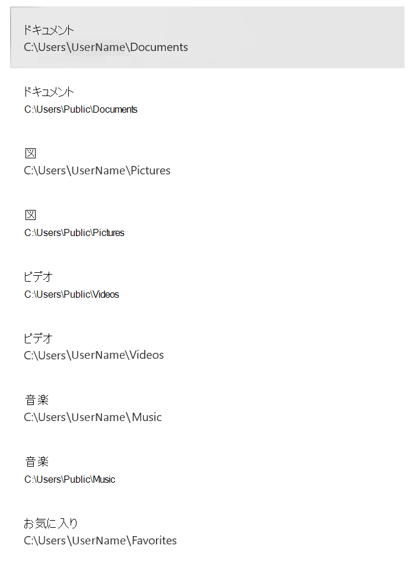

# <a name="protect-important-folders-with-controlled-folder-access"></a>フォルダーへのアクセス制御で重要なフォルダーを保護する

[!INCLUDE [Microsoft 365 Defender rebranding](../../includes/microsoft-defender.md)]

**適用対象:**

- [Microsoft Defender for Endpoint Plan 2](https://go.microsoft.com/fwlink/p/?linkid=2154037)
- [Microsoft 365 Defender](https://go.microsoft.com/fwlink/?linkid=2118804)
- Microsoft Defender ウイルス対策

**適用対象**
- Windows


> Defender for Endpoint を試す場合は、 [無料試用版にサインアップしてください。](https://signup.microsoft.com/create-account/signup?products=7f379fee-c4f9-4278-b0a1-e4c8c2fcdf7e&ru=https://aka.ms/MDEp2OpenTrial?ocid=docs-wdatp-assignaccess-abovefoldlink)

## <a name="what-is-controlled-folder-access"></a>フォルダー アクセスの制御とは何ですか?

フォルダー アクセスの制御は、ランサムウェアなどの悪意のあるアプリや脅威から貴重なデータを保護するのに役立ちます。 フォルダー アクセスの制御は、既知の信頼できるアプリの一覧に対してアプリをチェックすることで、データを保護します。 Windows Server 2019、Windows Server 2022、Windows 10、およびWindows 11 クライアントでサポートされており、Windows セキュリティ アプリを使用してフォルダー アクセスを制御できます。Microsoft Endpoint Configuration Manager、またはIntune (マネージド デバイスの場合)。

> [!NOTE]
> スクリプト エンジンは信頼されておらず、制御された保護されたフォルダーへのアクセスを許可することはできません。 たとえば、 [証明書とファイルインジケーター](/microsoft-365/security/defender-endpoint/indicator-certificates)を使用して許可する場合でも、PowerShell はフォルダー アクセスの制御によって信頼されません。

フォルダー アクセスの制御は[Microsoft Defender for Endpoint](microsoft-defender-endpoint.md)に最適です。これにより、通常の[アラート調査シナリオ](investigate-alerts.md)の一環として、フォルダー アクセスの制御イベントとブロックに関する詳細なレポートが提供されます。

> [!TIP]
> フォルダー アクセス ブロックが制御されている場合、 [アラート はアラート キュー](alerts-queue.md)に生成されません。 ただし、 [デバイスのタイムライン ビュー](investigate-machines.md)で、 [高度な捜索](advanced-hunting-overview.md)や [カスタム検出ルール](custom-detection-rules.md)を使用して、制御されたフォルダー アクセス ブロックに関する情報を表示できます。

## <a name="how-does-controlled-folder-access-work"></a>フォルダー アクセスの制御はどのように機能しますか?

フォルダー アクセスの制御は、信頼されたアプリが保護されたフォルダーにアクセスできるようにするだけで機能します。 保護されたフォルダーは、フォルダー アクセスの制御が構成されている場合に指定されます。 通常、ドキュメント、画像、ダウンロードなどに使用されるフォルダーなど、一般的に使用されるフォルダーは、制御されたフォルダーの一覧に含まれます。

フォルダー アクセスの制御は、信頼されたアプリの一覧で機能します。 信頼されたソフトウェアの一覧に含まれるアプリは、期待どおりに動作します。 一覧に含まれていないアプリは、保護されたフォルダー内のファイルに変更を加えることができなくなります。

アプリは、その普及率と評判に基づいて一覧に追加されます。 組織全体で非常に一般的であり、悪意があると見なされる動作を表示したことがないアプリは、信頼できるものと見なされます。 これらのアプリは自動的に一覧に追加されます。

アプリは、Configuration ManagerまたはIntuneを使用して、信頼できるリストに手動で追加することもできます。 追加のアクションは、Microsoft 365 Defender ポータルから実行できます。

## <a name="why-controlled-folder-access-is-important"></a>フォルダー アクセスの制御が重要な理由

フォルダー アクセスの制御は、 [ランサムウェア](https://www.microsoft.com/wdsi/threats/ransomware)からドキュメントや情報を保護するのに特に役立ちます。 ランサムウェア攻撃では、ファイルが暗号化され、人質に保持される可能性があります。 フォルダーへのアクセスを制御すると、アプリが保護されたフォルダー内のファイルに変更を加えようとしたコンピューターに通知が表示されます。 会社の詳細や連絡先情報を使用して[通知をカスタマイズ](attack-surface-reduction-rules-deployment-implement.md#customize-attack-surface-reduction-rules)することができます。 個別のルールを有効にすることで、この機能が監視するテクニックをカスタマイズすることもできます。

[保護されたフォルダー](#review-controlled-folder-access-events-in-windows-event-viewer)には、共通のシステム フォルダー (ブート セクターを含む) が含まれており、[さらにフォルダーを追加](customize-controlled-folders.md#protect-additional-folders)できます。 また、保護されたフォルダーへのアクセス権を [アプリ](customize-controlled-folders.md#allow-specific-apps-to-make-changes-to-controlled-folders) に付与することもできます。

[監査モード](audit-windows-defender.md)を使用して、フォルダー アクセスが有効になっている場合に組織に与える影響を評価できます。 demo.wd.microsoft.com のWindows Defenderテスト グラウンド Web [サイトにアクセス](https://demo.wd.microsoft.com?ocid=cx-wddocs-testground)して、機能が動作していることを確認し、動作を確認することもできます。

> [!NOTE]
> demo.wd.microsoft.com の Defender for Endpoint デモ サイトは非推奨であり、将来削除される予定です。

フォルダー アクセスの制御は、次のバージョンのWindowsでサポートされています。

- [Windows 10バージョン 1709](/windows/whats-new/whats-new-windows-10-version-1709) 以降
- Windows 11
- Windows 2012 R2
- Windows 2016
- [Windows Server 2019](/windows-server/get-started-19/whats-new-19)
- Windows Server 2022

## <a name="windows-system-folders-are-protected-by-default"></a>Windows システム フォルダーは既定で保護されています

Windows システム フォルダーは、既定で他のいくつかのフォルダーと共に保護されます。

保護されたフォルダーには、共通のシステム フォルダー (ブート セクターを含む) が含まれており、追加のフォルダーを追加できます。 また、保護されたフォルダーへのアクセス権をアプリに付与することもできます。  既定で保護されているWindows システム フォルダーは次のとおりです。

- `c:\Users\<username>\Documents`
- `c:\Users\Public\Documents`
- `c:\Users\<username>\Pictures`
- `c:\Users\Public\Pictures`
- `c:\Users\Public\Videos`
- `c:\Users\<username>\Videos`
- `c:\Users\<username>\Music`
- `c:\Users\Public\Music`
- `c:\Users\<username>\Favorites`

既定のフォルダーは、ユーザーのプロファイルの [ **この PC**] の下に表示されます。
   > [!div class="mx-imgBorder"]
   > 

> [!NOTE]
> 追加のフォルダーは保護済みとして構成できますが、既定で保護されているWindowsシステム フォルダーは削除できません。

## <a name="requirements-for-controlled-folder-access"></a>フォルダー アクセスの制御に関する要件

フォルダー アクセスを制御するには、[リアルタイム保護Microsoft Defender ウイルス対策](configure-real-time-protection-microsoft-defender-antivirus.md)有効にする必要があります。

## <a name="review-controlled-folder-access-events-in-the-microsoft-365-defender-portal"></a>Microsoft 365 Defender ポータルで制御されたフォルダー アクセス イベントを確認する

Defender for Endpoint は、Microsoft 365 Defender ポータルの[アラート調査シナリオ](investigate-alerts.md)の一部として、イベントとブロックに対する詳細なレポートを提供します。[Microsoft 365 DefenderのMicrosoft Defender for Endpointを](../defender/microsoft-365-security-center-mde.md)参照してください。

[高度な捜索](advanced-hunting-overview.md)を使用して、Microsoft Defender for Endpoint データに対してクエリを実行できます。 [監査モード](audit-windows-defender.md)を使用している場合は、[高度な検索](advanced-hunting-overview.md)を使用して、フォルダー アクセス設定が有効になっている場合に、フォルダー アクセス設定が環境にどのような影響を与えるかを確認できます。

クエリ例:

```PowerShell
DeviceEvents
| where ActionType in ('ControlledFolderAccessViolationAudited','ControlledFolderAccessViolationBlocked')
```

## <a name="review-controlled-folder-access-events-in-windows-event-viewer"></a>Windows イベント ビューアーで制御されたフォルダー アクセス イベントを確認する

Windows イベント ログを確認して、フォルダー アクセスブロックの制御 (または監査) 時にアプリが作成されたイベントを確認できます。

1. [評価パッケージ](https://aka.ms/mp7z2w)をダウンロードし、デバイス上の簡単にアクセスできる場所にファイル *cfa-events.xml* を抽出します。
2. スタート メニューに **イベント ビューアー** を入力して、Windows イベント ビューアーを開きます。
3. 左側のパネルの [ **アクション]** で、[ **カスタム ビューのインポート]...** を選択します。
4. *cfa-events.xml* 抽出した場所に移動し、選択します。 または、 [XML を直接コピーします](event-views.md)。
5. **[OK]** を選択します。

次の表は、フォルダー アクセスの制御に関連するイベントを示しています。

<br/><br/>

|イベント ID|説明|
|---|---|
|5007|設定が変更された場合のイベント|
|1124|監査されたフォルダー アクセスの制御イベント|
|1123|ブロックされたフォルダー アクセス イベント|

## <a name="view-or-change-the-list-of-protected-folders"></a>保護されたフォルダーの一覧を表示または変更する

Windows セキュリティ アプリを使用すると、制御されたフォルダー アクセスによって保護されているフォルダーの一覧を表示できます。

1. Windows 10またはWindows 11デバイスで、Windows セキュリティ アプリを開きます。
2. **[ウイルスと脅威の防止]** を選択します。
3. [ **ランサムウェア保護**] で、[ **ランサムウェア保護の管理**] を選択します。
4. フォルダーアクセスの制御がオフになっている場合は、オンにする必要があります。 **保護されたフォルダーを選択します**。
5. 次のいずれかの手順を実行します。
   - フォルダーを追加するには、[ **+ 保護されたフォルダーの追加**] を選択します。
   - フォルダーを削除するには、フォルダーを選択し、[削除] を選択 **します**。

> [!NOTE]
> [Windowsシステム フォルダー](#windows-system-folders-are-protected-by-default)は既定で保護されており、一覧から削除することはできません。
