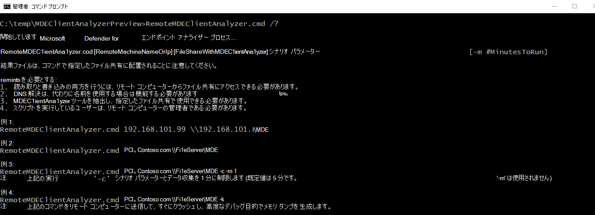

# Windows で高度なトラブルシューティングを行うためのデータ収集

**適用対象:**
- [Microsoft Defender for Endpoint](https://go.microsoft.com/fwlink/p/?linkid=2146631)

Microsoft サポート 担当者と共同作業する場合は、クライアント アナライザーを使用して、より複雑なシナリオのトラブルシューティングのためにデータを収集する必要があります。 アナライザー スクリプトは、その目的のために他のパラメーターをサポートし、調査が必要な観察された現象に基づいて特定のログ セットを収集できます。

Run '**MDEClientAnalyzer.cmd /?**' をクリックして、使用可能なパラメーターとその説明の一覧を表示します。

> [!NOTE]
> 高度なトラブルシューティング パラメーターを使用すると、アナライザーは関連するサポート ログ[MpCmdRun.exe収集Microsoft Defender ウイルス対策](/windows/security/threat-protection/microsoft-defender-antivirus/collect-diagnostic-data-update-compliance)呼び出します。

**-h** -[標準ログ](/windows-hardware/test/wpt/wpr-command-line-options)セットWindows詳細な一般的なパフォーマンス トレースを収集するために、パフォーマンス レコーダーを呼び出します。

**-l** - 組み込みのパフォーマンス モニター Windows [呼](/windows-server/remote/remote-desktop-services/rds-rdsh-performance-counters)び出して、軽量の perfmon トレースを収集します。 これは、時間の間に発生するパフォーマンス低下の問題を診断する場合に役立ちますが、オンデマンドで再現するのは難しい場合があります。

**-c** - リアルタイム ファイル [システム、](/sysinternals/downloads/procmon) レジストリ、およびプロセス/スレッド アクティビティの高度な監視を行うプロセス モニターへの呼び出し。 これは、さまざまなアプリケーション互換性シナリオのトラブルシューティングに特に役立ちます。

**-i** - 組み込 みのnetsh.exeコマンドを呼び出して、さまざまなネットワーク関連の問題のトラブルシューティングに役立つネットワークおよび Windows ファイアウォール トレースを開始します。

**-b** - '-c' と同じですが、プロセス モニター トレースは次の起動時に開始され、-b が再び使用された場合にのみ停止されます。

**-a** - ウイルス対策 [プロセス (Windows)](/windows-hardware/test/wpt/wpr-command-line-options)に関連する CPU の高い問題の分析に固有の詳細なパフォーマンス トレースを収集するために、パフォーマンス レコーダーを呼び出MsMpEng.exe。

**-v** - ほとんどの詳細 [ な -trace フラグMpCmdRun.exeコマンド ライン引数に](/windows/security/threat-protection/microsoft-defender-antivirus/command-line-arguments-microsoft-defender-antivirus) 対してウイルス対策を使用します。

**-t** - エンドポイント DLP に関連するすべてのクライアント側コンポーネントの詳細なトレースを開始します。 これは、ファイルに対して [DLP](/microsoft-365/compliance/endpoint-dlp-learn-about#endpoint-activities-you-can-monitor-and-take-action-on) アクションが想定通り実行されないシナリオで役立ちます。

**-q** - エンドポイント DLP DLPDiagnose.ps1構成と要件を検証するアナライザー 'Tools' ディレクトリからスクリプトを呼び出します。

**-d** - MsSense **S**.exe (Windows Server 2016以上の OS のセンサー プロセス) と関連するプロセスのメモリ ダンプを収集します。

- \* このフラグは、上記のフラグと組み合わせて使用できます。
- \*\*[PPL](/windows-hardware/drivers/install/early-launch-antimalware)で保護されたプロセス (MsSense.exe や MsMpEng.exe などのメモリ ダンプのキャプチャは、現時点ではアナライザーではサポートされていません。

**-z** - [CrashOnCtrlScroll](/windows-hardware/drivers/debugger/forcing-a-system-crash-from-the-keyboard)を介してマシンのメモリ ダンプ コレクション全体に備えるレジストリ キーをコンピューターに構成します。 これは、コンピューターのフリーズの問題を分析する場合に役立ちます。

\* 右端の Ctrl キーを押したまま、SCROLL LOCK キーを 2 回押します。

**-k** - [NotMyFault ツールを使用](/sysinternals/downloads/notmyfault) して、システムを強制的にクラッシュし、マシン メモリ ダンプを生成します。 これは、さまざまな OS の安定性の問題を分析する場合に役立ちます。

アナライザーと上記のすべてのシナリオ フラグは、"RemoteMDEClientAnalyzer.cmd' を実行することでリモートから開始できます。これはアナライザー ツールセットにもバンドルされています。

> [!NOTE]
>
> - RemoteMDEClientAnalyzer.cmd を使用する場合は、psexec を呼び出して、構成されたファイル共有からツールをダウンロードし、そのツールをローカルで PsExec.exe。
    CMD スクリプトは '-r' フラグを使用して、SYSTEM コンテキスト内でリモートで実行するように指定します。そのため、ユーザーに対するプロンプトは表示されません。
> - この同じフラグを MDEClientAnalyzer.cmd と一緒に使用すると、データ収集の分数の指定を要求するユーザーに対するプロンプトを回避できます。 例:
>
>    **MDEClientAnalyzer.cmd -r -i -m 5**
>
>   - **-r** - ツールがリモート (または非対話型コンテキスト) から実行されているかどうかを示します。
>   - **-i** - 他の関連ログと共にネットワーク トレースを収集するシナリオ フラグ
>   - **-m** \# - 実行する分数 (上記の例では 5 分)
