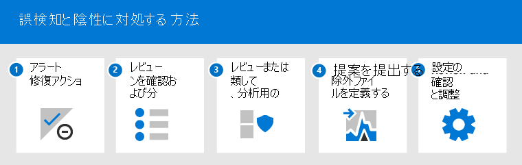
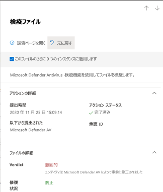
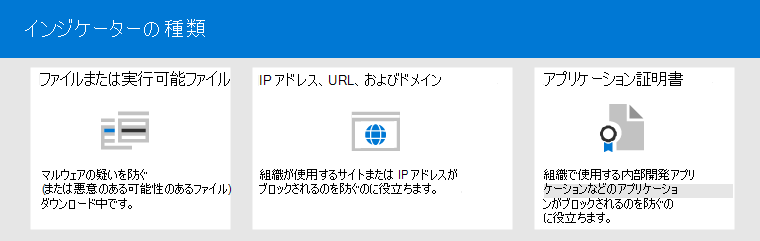

# <a name="address-false-positivesnegatives-in-microsoft-defender-for-endpoint"></a>Microsoft Defender for Endpoint での誤検出/検出漏れに対処する

[!INCLUDE [Microsoft 365 Defender rebranding](../../includes/microsoft-defender.md)]

**適用対象**

- [Microsoft Defender for Endpoint](https://go.microsoft.com/fwlink/p/?linkid=2146806)

エンドポイント保護ソリューションでは、誤検知とは、ファイルやプロセスなどのエンティティであり、実際には脅威ではないにもかかわらず、悪意のあるエンティティとして検出され、識別されました。 偽陰性とは、実際には悪意があるにもかかわらず、脅威として検出されていないエンティティです。 False positives/negatives は、Microsoft Defender for Endpoint を含む脅威保護 [ソリューションで発生する可能性があります](microsoft-defender-endpoint.md)。


幸いなことに、これらの種類の問題に対処し、削減するための手順を実行できます。 [Microsoft 365 Defender](microsoft-defender-security-center.md) (以前は Microsoft Defender セキュリティ センター) で誤検知/負の値が表示される場合、セキュリティ操作は次のプロセスを使用して対処する手順を実行できます。

1. [アラートの確認と分類](#part-1-review-and-classify-alerts)
2. [実行された修復アクションを確認する](#part-2-review-remediation-actions)
3. [除外の確認と定義](#part-3-review-or-define-exclusions)
4. [分析のためにエンティティを送信する](#part-4-submit-a-file-for-analysis)
5. [脅威保護の設定を確認して調整する](#part-5-review-and-adjust-your-threat-protection-settings)

この記事で説明するタスクを実行した後も、誤検知/負の問題がある場合は、ヘルプを受け取る必要があります。 「引 [き続きヘルプが必要か」を参照してください。](#still-need-help)



> [!NOTE]
> この記事は、Microsoft Defender for Endpoint を使用しているセキュリティオペレーターおよびセキュリティ管理者向 [けガイダンスです](microsoft-defender-endpoint.md)。

## <a name="part-1-review-and-classify-alerts"></a>パート 1: アラートの確認と分類

悪意 [のある、または](alerts.md) 疑わしいと検出されたためトリガーされたアラートが表示された場合は、そのエンティティのアラートを抑制できます。 また、必ずしも誤検知ではないが重要ではないアラートを抑制することもできます。 アラートも分類することをお勧めします。

アラートを管理し、true/false positive を分類すると、脅威保護ソリューションのトレーニングに役立ち、時間の間に誤検知または誤検知の数を減らします。 これらの手順を実行すると、セキュリティ運用ダッシュボードのノイズを軽減し、セキュリティ チームが優先度の高い作業項目に集中できます。

### <a name="determine-whether-an-alert-is-accurate"></a>アラートが正確かどうかを判断する

アラートを分類または抑制する前に、アラートが正確か、誤検知か良性かを判断します。

1. ポータル ( ) にMicrosoft 365 Defenderサインイン <https://security.microsoft.com> します。

2. ナビゲーション ウィンドウで、[通知キュー] **を選択します**。

3. アラートの詳細については、アラートを選択します。 [(「Microsoft Defender for Endpoint でアラートを確認する」を参照](review-alerts.md)してください。

4. アラートの状態に応じて、次の表に示す手順を実行します。

<br/><br/>

   |アラートの状態|操作|
   |---|---|
   |アラートは正確です|アラートを割り当て、さらに [調査](investigate-alerts.md) します。|
   |アラートは誤検知です|<ol><li>[アラートを誤検知](#classify-an-alert) として分類します。</li><li>[アラートを抑制します](#suppress-an-alert)。</li><li>[Microsoft](#indicators-for-microsoft-defender-for-endpoint) Defender for Endpoint のインジケーターを作成します。</li><li>[分析のためにファイルを Microsoft に提出します](#part-4-submit-a-file-for-analysis)。</li></ol>|
   |アラートは正確ですが、良性 (重要ではない)|[アラートを正の](#classify-an-alert) 値として分類し、アラート [を抑制します](#suppress-an-alert)。|

### <a name="classify-an-alert"></a>アラートの分類

アラートは、誤検知または正陽性に分類Microsoft 365 Defender。 アラートを分類すると、Microsoft Defender for Endpoint のトレーニングに役立ちます。これにより、時間がたつ間に、より多くの真のアラートと少ない誤ったアラートが表示されます。

1. ポータル ( ) にMicrosoft 365 Defenderサインイン <https://security.microsoft.com> します。

2. [ **アラート キュー] を** 選択し、アラートを選択します。

3. 選択したアラートに対して、[アクションの管理 **]** \> **アラートを選択します**。 フライアウト ウィンドウが開きます。

4. [警告の **管理] セクション** で、[True アラート] または **[False アラート** ] **を選択します**。 (False **アラートを使用して** 誤検知を分類します)。

> [!TIP]
> アラートの抑制の詳細については [、「Manage Microsoft Defender for Endpoint alerts」を参照してください](/microsoft-365/security/defender-endpoint/manage-alerts)。 また、組織でセキュリティ情報とイベント管理 (SIEM) サーバーを使用している場合は、抑制ルールも必ず定義してください。

### <a name="suppress-an-alert"></a>アラートを抑制する

誤検知または正陽性のアラートがあるが、重要ではないイベントの場合は、これらのアラートを非表示にMicrosoft 365 Defender。 アラートを抑制すると、セキュリティ操作ダッシュボードのノイズを軽減できます。

1. ポータル ( ) にMicrosoft 365 Defenderサインイン <https://security.microsoft.com> します。

2. ナビゲーション ウィンドウで、[アラート キュー] **を選択します**。

3. 非表示にしたいアラートを選択して、[詳細] ウィンドウ **を開** きます。

4. [詳細 **] ウィンドウ** で省略記号 (**...**) を選択し、[抑制 **ルールの作成] を選択します**。

5. 抑制ルールのすべての設定を指定し、[保存] を **選択します**。

> [!TIP]
> 抑制ルールのヘルプが必要ですか? 「アラート [を抑制し、新しい抑制ルールを作成する」を参照してください](/microsoft-365/security/defender-endpoint/manage-alerts#suppress-an-alert-and-create-a-new-suppression-rule)。

## <a name="part-2-review-remediation-actions"></a>パート 2: 修復アクションの確認

[ファイルの](manage-auto-investigation.md#remediation-actions)検疫やプロセスの停止などの修復アクションは、脅威として検出されたエンティティ (ファイルなど) に対して実行されます。 いくつかの種類の修復アクションは、自動調査と管理によって自動的にMicrosoft Defender ウイルス対策。

- ファイルの検疫
- レジストリ キーを削除する
- プロセスを終了する
- サービスを停止する
- ドライバーを無効にする
- スケジュールされたタスクを削除する

ウイルス対策スキャンの開始や調査パッケージの収集などのその他のアクションは、手動で、または Live Response を介して [実行されます](live-response.md)。 Live Response を使用して実行されるアクションは元に戻すことはできません。

アラートを確認した後、次に修復アクション [を確認します](manage-auto-investigation.md)。 誤検知の結果として何かアクションが実行された場合は、ほとんどの種類の修復アクションを元に戻すことができます。 具体的には、次の方法を使用できます。

- [アクション センターから検疫済みファイルを復元する](#restore-a-quarantined-file-from-the-action-center)
- [複数の操作を一度に元に戻す](#undo-multiple-actions-at-one-time)
- [複数のデバイス間で検疫からファイルを削除します](#remove-a-file-from-quarantine-across-multiple-devices)。 and
- [検疫からファイルを復元する](#restore-file-from-quarantine)

誤検知の結果として実行されたアクションの確認と元に戻す操作が完了したら、除外の確認または [定義に進みます](#part-3-review-or-define-exclusions)。

### <a name="review-completed-actions"></a>完了したアクションを確認する

1. ポータルの左側のナビゲーション ウィンドウで、[Microsoft 365 Defender]**をクリックします**。

2. [履歴] **タブを** 選択して、実行されたアクションの一覧を表示します。

3. アイテムを選択すると、実行された修復アクションの詳細が表示されます。

### <a name="restore-a-quarantined-file-from-the-action-center"></a>アクション センターから検疫済みファイルを復元する

1. ポータルの左側のナビゲーション ウィンドウで、[Microsoft 365 Defender]**をクリックします**。

2. [履歴 **] タブ** で、元に戻す操作を選択します。

3. フライアウト ウィンドウで、[元に戻す] を **選択します**。 このメソッドで操作を元に戻すことができない場合は、[元に戻す] ボタン **は表示** できません。 (詳細については、「完了した操作を [元に戻す」を参照](manage-auto-investigation.md#undo-completed-actions)してください。

### <a name="undo-multiple-actions-at-one-time"></a>複数の操作を一度に元に戻す

1. ポータルの左側のナビゲーション ウィンドウで、[Microsoft 365 Defender]**をクリックします**。

2. [履歴 **] タブ** で、元に戻す操作を選択します。

3. 画面の右側のウィンドウで、[元に戻す] を **選択します**。

### <a name="remove-a-file-from-quarantine-across-multiple-devices"></a>複数のデバイスで検疫からファイルを削除する

> [!div class="mx-imgBorder"]
> 

1. ポータルの左側のナビゲーション ウィンドウで、[Microsoft 365 Defender]**をクリックします**。

2. [履歴 **] タブ** で、アクションの種類が [検疫ファイル] のファイルを **選択します**。

3. 画面の右側のウィンドウで、[このファイルのインスタンスを **X** に適用する] を選択し、[元に戻す] を **選択します**。

### <a name="restore-file-from-quarantine"></a>検疫からファイルを復元する

調査後にファイルがクリーンだと判断した場合は、ファイルをロールバックして検疫から削除できます。 ファイルが検疫された各デバイスで次のコマンドを実行します。

1. デバイスで管理者特権のコマンド ライン プロンプトを開きます。

   1. **[スタート]** をクリックし、「_cmd_」と入力します。
   2. **[コマンド プロンプト]** を右クリックして **[管理者として実行]** を選択します。

2. 次のコマンドを入力し、Enter キーを **押します**。

    ```console
    "ProgramFiles%\Windows Defender\MpCmdRun.exe" -Restore -Name EUS:Win32/CustomEnterpriseBlock -All
    ```

    > [!IMPORTANT]
    > シナリオによっては **、ThreatName がとして** 表示される場合があります `EUS:Win32/CustomEnterpriseBlock!cl` 。 Defender for Endpoint は、過去 30 日間にこのデバイスで検疫されたカスタム ブロックされたファイルを復元します。
    >
    > 潜在的なネットワーク脅威として検疫されたファイルは、回復できない可能性があります。 検疫後にユーザーがファイルを復元しようとすると、そのファイルにアクセスできない可能性があります。 これは、システムがファイルにアクセスするためのネットワーク資格情報を持たなくなった場合に発生する可能性があります。 通常、これはシステムまたは共有フォルダーに一時的にログオンし、アクセス トークンの有効期限が切れた結果です。

3. 画面の右側のウィンドウで、[このファイルのインスタンスを **X** に適用する] を選択し、[元に戻す] を **選択します**。

## <a name="part-3-review-or-define-exclusions"></a>パート 3: 除外を確認または定義する

除外とは、修復アクションの例外として指定するファイルや URL などのエンティティです。 除外されたエンティティは引き続き検出できますが、そのエンティティに対して修復アクションは実行されません。 つまり、検出されたファイルまたはプロセスは、Microsoft Defender for Endpoint によって停止、検疫、削除、または変更に送信されません。

Microsoft Defender for Endpoint 全体で除外を定義するには、次のタスクを実行します。

- [ユーザーの除外を定義Microsoft Defender ウイルス対策](#exclusions-for-microsoft-defender-antivirus)
- [Microsoft Defender for Endpoint の "許可" インジケーターを作成する](#indicators-for-microsoft-defender-for-endpoint)

> [!NOTE]
> Microsoft Defender ウイルス対策除外はウイルス対策保護にのみ適用されます。他の Microsoft Defender for Endpoint 機能には適用されません。 ファイルを広く除外するには、Microsoft Defender for Endpoint [Microsoft Defender ウイルス対策カスタム](/microsoft-365/security/defender-endpoint/manage-indicators)インジケーターの除外を使用します。

このセクションの手順では、除外とインジケーターを定義する方法について説明します。

### <a name="exclusions-for-microsoft-defender-antivirus"></a>ユーザーの除外Microsoft Defender ウイルス対策

一般に、ユーザーの除外を定義する必要Microsoft Defender ウイルス対策。 除外を定義し、誤検知の結果として生じるファイル、フォルダー、プロセス、およびプロセスで開いたファイルのみを含める必要があります。 また、定義済みの除外を定期的に確認してください。 ウイルス対策の除外を[定義Microsoft エンドポイント マネージャー](/mem/endpoint-manager-overview)編集するには、この設定を使用することをお勧めします。ただし、グループ ポリシーなどの他のメソッドを使用[](/azure/active-directory-domain-services/manage-group-policy)できます (「Manage [Microsoft Defender for Endpoint」を参照)。](manage-atp-post-migration.md)

> [!TIP]
> ウイルス対策の除外に関するヘルプが必要ですか? 詳細については[、「除外の構成と検証」を参照Microsoft Defender ウイルス対策してください](configure-exclusions-microsoft-defender-antivirus.md)。

#### <a name="use-microsoft-endpoint-manager-to-manage-antivirus-exclusions-for-existing-policies"></a>[Microsoft エンドポイント マネージャーを使用してウイルス対策の除外を管理する (既存のポリシーの場合)

1. 管理センター ( ) Microsoft エンドポイント マネージャーに移動し <https://endpoint.microsoft.com> 、サインインします。

2. [ **エンドポイント セキュリティ** \> **ウイルス対策]** を選択し、既存のポリシーを選択します。 (既存のポリシーを使用しない場合、または新しいポリシーを作成する場合は、次の手順[に進む)。](#use-microsoft-endpoint-manager-to-create-a-new-antivirus-policy-with-exclusions)

3. [プロパティ **] を** 選択し、[構成設定] **の横にある [** 編集] を **選択します**。

4. [除外 **Microsoft Defender ウイルス対策] を展開** し、除外を指定します。

5. [ **確認] + [保存] の** 順に選択し、[保存] を **選択します**。

#### <a name="use-microsoft-endpoint-manager-to-create-a-new-antivirus-policy-with-exclusions"></a>[Microsoft エンドポイント マネージャーを使用して、除外を含む新しいウイルス対策ポリシーを作成する

1. 管理センター ( ) Microsoft エンドポイント マネージャーに移動し <https://endpoint.microsoft.com> 、サインインします。

2. [エンドポイント **セキュリティウイルス** \> **対策** \> **] + [ポリシーの作成] を選択します**。

3. プラットフォーム (Windows 10以降 **、macOS、または** Windows 10サーバー Windows **選択します**。 

4. [**プロファイル]** で、[除外 **Microsoft Defender ウイルス対策選択し**、[作成] を **選択します**。

5. プロファイルの名前と説明を指定し、[次へ] を **選択します**。

6. [構成 **設定] タブ** で、ウイルス対策の除外を指定し、[次へ] を **選択します**。

7. [スコープ **タグ] タブ** で、組織でスコープ タグを使用している場合は、作成するポリシーのスコープ タグを指定します。 [(「Scope tags .」を](/mem/intune/fundamentals/scope-tags)参照)

8. [割 **り当て]** タブで、ポリシーを適用するユーザーとグループを指定し、[次へ] を **選択します**。 (割り当てのヘルプが必要な場合は、「ユーザープロファイルとデバイス プロファイルを割り当てる」を参照[Microsoft Intune.)](/mem/intune/configuration/device-profile-assign)

9. [確認 **と作成] タブで** 設定を確認し、[作成] を **選択します**。

### <a name="indicators-for-microsoft-defender-for-endpoint"></a>エンドポイント用 Microsoft Defender のインジケーター

[インジケーター](/microsoft-365/security/defender-endpoint/manage-indicators) (特に、侵害の指標、または IoC) を使用すると、セキュリティ運用チームはエンティティの検出、防止、除外を定義できます。 たとえば、Microsoft Defender for Endpoint のスキャンおよび修復アクションから除外する特定のファイルを指定できます。 または、インジケーターを使用して、特定のファイル、IP アドレス、または URL に対するアラートを生成できます。

Microsoft Defender for Endpoint の除外としてエンティティを指定するには、それらのエンティティの "許可" インジケーターを作成します。 Microsoft Defender for Endpoint のこのような "[](microsoft-defender-antivirus-in-windows-10.md)許可" インジケーターは[](overview-endpoint-detection-response.md)、次世代の保護、エンドポイントの検出と応答、および修復の自動化された調査&[適用されます](/microsoft-365/security/defender-endpoint/automated-investigations)。

"許可" インジケーターは、次の場合に作成できます。

- [Files](#indicators-for-files)
- [IP アドレス、URL、およびドメイン](#indicators-for-ip-addresses-urls-or-domains)
- [アプリケーション証明書](#indicators-for-application-certificates)



#### <a name="indicators-for-files"></a>ファイルのインジケーター

実行可能ファイル [などのファイルの "許可"](/microsoft-365/security/defender-endpoint/indicator-file)インジケーターを作成すると、組織で使用しているファイルがブロックされるのを防ぐのに役立ちます。 ファイルには、ポータブル実行可能ファイル (PE) ファイル (ファイルなど) `.exe` を含 `.dll` めることもできます。

ファイルのインジケーターを作成する前に、次の要件を満たしていることを確認してください。

- Microsoft Defender ウイルス対策保護が有効になっていると構成されている場合 (「クラウドベースの保護の管理[」を参照)](/windows/security/threat-protection/microsoft-defender-antivirus/deploy-manage-report-microsoft-defender-antivirus)
- マルウェア対策クライアントのバージョンは 4.18.1901.x 以降です
- デバイスはバージョン Windows 10 1703 以降で実行されています。Windows Server 2016;または Windows Server 2019
- [ [ブロックまたは許可] 機能がオンになっている](/microsoft-365/security/defender-endpoint/advanced-features)

#### <a name="indicators-for-ip-addresses-urls-or-domains"></a>IP アドレス、URL、またはドメインのインジケーター

IP アドレス [、URL、](/microsoft-365/security/defender-endpoint/indicator-ip-domain)またはドメインの "許可" インジケーターを作成すると、組織が使用するサイトまたは IP アドレスがブロックされるのを防ぐのに役立ちます。

IP アドレス、URL、またはドメインのインジケーターを作成する前に、次の要件を満たしていることを確認してください。

- Defender for Endpoint のネットワーク保護がブロック モードで有効になっている (「ネットワーク保護を有効[にする」を参照)](/microsoft-365/security/defender-endpoint/enable-network-protection)
- マルウェア対策クライアントのバージョンは 4.18.1906.x 以降です
- デバイスは、Windows 10バージョン 1709 以降で実行されています

カスタム ネットワーク インジケーターは、カスタム ネットワーク インジケーターで[オンMicrosoft 365 Defender。](microsoft-defender-security-center.md) 詳細については、「高度な機能 [」を参照してください](/microsoft-365/security/defender-endpoint/advanced-features)。

#### <a name="indicators-for-application-certificates"></a>アプリケーション証明書のインジケーター

アプリケーション証明書 [の "許可"](/microsoft-365/security/defender-endpoint/indicator-certificates)インジケーターを作成すると、組織が使用する内部開発アプリケーションなどのアプリケーションがブロックされるのを防ぐのに役立ちます。 `.CER` または `.PEM` ファイル拡張子がサポートされています。

アプリケーション証明書のインジケーターを作成する前に、次の要件を満たしていることを確認してください。

- Microsoft Defender ウイルス対策保護が有効になっていると構成されている場合 (「クラウドベースの保護の管理[」を参照)](deploy-manage-report-microsoft-defender-antivirus.md)
- マルウェア対策クライアントのバージョンは 4.18.1901.x 以降です
- デバイスはバージョン Windows 10 1703 以降で実行されています。Windows Server 2016;または Windows Server 2019
- ウイルスと脅威の保護の定義が最新

> [!TIP]
> インジケーターを作成する場合は、それらを 1 つ 1 つ定義するか、複数のアイテムを一度にインポートできます。 1 つのテナントには 15,000 のインジケーターの制限があります。 また、ファイル ハッシュ情報など、特定の詳細を最初に収集する必要がある場合があります。 インジケーターを作成する前に前提条件を確認 [してください](manage-indicators.md)。

## <a name="part-4-submit-a-file-for-analysis"></a>パート 4: 分析用にファイルを送信する

分析のために、ファイルやファイルレス検出などのエンティティを Microsoft に送信できます。 Microsoft セキュリティ研究者は、すべての申請を分析し、その結果は Microsoft Defender for Endpoint の脅威保護機能を知らせるのに役立ちます。 申請サイトでサインインすると、申請を追跡できます。

### <a name="submit-a-file-for-analysis"></a>分析用にファイルを送信する

悪意のあるファイルとして誤って検出された、または見つからないファイルがある場合は、次の手順に従ってファイルを送信して分析します。

1. 「分析用にファイルを [送信する」のガイドラインを確認します](/windows/security/threat-protection/intelligence/submission-guide)。

2. [提出サイトMicrosoft セキュリティ インテリジェンスにアクセスし <https://www.microsoft.com/wdsi/filesubmission> 、ファイルを提出します。

### <a name="submit-a-fileless-detection-for-analysis"></a>分析用にファイルレス検出を送信する

動作に基づいてマルウェアとして検出され、ファイルを持ってない場合は、ファイルを送信して分析 `Mpsupport.cab` することができます。 Microsoft Malware Command-Line Protection *.cab* ユーティリティ (MPCmdRun.exe) ツールを使用して、.cabファイルを取得Windows 10。

1. に移動 ` C:\ProgramData\Microsoft\Windows Defender\Platform\<version>` し、管理者 `MpCmdRun.exe` として実行します。

2. を `mpcmdrun.exe -GetFiles` 入力し、Enter キーを **押します**。

   さまざまな.cabを含むファイルが生成されます。 ファイルの場所は、コマンド プロンプトの出力で指定されます。 既定では、場所は `C:\ProgramData\Microsoft\Microsoft Defender\Support\MpSupportFiles.cab` .

3. 「分析用にファイルを [送信する」のガイドラインを確認します](/windows/security/threat-protection/intelligence/submission-guide)。

4. [提出サイトMicrosoft セキュリティ インテリジェンスにアクセスし <https://www.microsoft.com/wdsi/filesubmission> 、ファイルを送信.cabします。

### <a name="what-happens-after-a-file-is-submitted"></a>ファイルが送信された後は何が起こりますか?

アナリストがケースの処理を開始する前に、お客様の提出が直ちにシステムによってスキャンされ、最新の判断が下されます。 ファイルがアナリストによって既に送信および処理されている可能性があります。 そのような場合、決定は迅速に行います。

処理されていない申請の場合、次のように分析の優先順位が設定されます。

- 多数のコンピューターに影響を与える可能性のある一般的なファイルの優先度が高くなります。
- 認証された顧客、特に有効なソフトウェア アシュアランス [ID (SAID)](https://www.microsoft.com/licensing/licensing-programs/software-assurance-default.aspx)を持つエンタープライズのお客様には、優先度が高くなります。
- SAID 所有者による優先度の高いフラグが付いた申請は、直ちに注意を払います。

申請に関する更新プログラムを確認するには、申請サイトでサインインMicrosoft セキュリティ インテリジェンス[します](https://www.microsoft.com/wdsi/filesubmission)。

> [!TIP]
> 詳細については、「分析用に [ファイルを送信する」を参照してください](/windows/security/threat-protection/intelligence/submission-guide#how-does-microsoft-prioritize-submissions)。

## <a name="part-5-review-and-adjust-your-threat-protection-settings"></a>パート 5: 脅威保護の設定を確認して調整する

Microsoft Defender for Endpoint には、さまざまな機能や機能の設定を微調整する機能など、さまざまなオプションがあります。 多数の誤検知が発生している場合は、必ず組織の脅威保護設定を確認してください。 次の調整が必要になる場合があります。

- [クラウドによる保護](#cloud-delivered-protection)
- [望ましくない可能性のあるアプリケーションの修復](#remediation-for-potentially-unwanted-applications)
- [調査と修復の自動化](#automated-investigation-and-remediation)

### <a name="cloud-delivered-protection"></a>クラウドによる保護

クラウドが提供する保護レベルで、クラウドにMicrosoft Defender ウイルス対策。 既定では、クラウド配信の保護は [ **構成** されていません] に設定されています。これは、ほとんどの組織の通常のレベルの保護に対応します。 クラウド配信の保護が高、高 **+、** またはゼロ許容値に設定されている場合は、誤検知の数が多くなる可能性があります。

> [!TIP]
> クラウド配信保護の構成の詳細については、「クラウド配信の保護レベルを指定する [」を参照してください](/windows/security/threat-protection/microsoft-defender-antivirus/specify-cloud-protection-level-microsoft-defender-antivirus)。

クラウド配信の保護[Microsoft エンドポイント マネージャー](/mem/endpoint-manager-overview)設定するには、この設定を使用することをお勧めします。ただし、グループ ポリシーなどの他のメソッドを使用[](/azure/active-directory-domain-services/manage-group-policy)できます (「Manage [Microsoft Defender for Endpoint」を参照)。](manage-atp-post-migration.md)

#### <a name="use-microsoft-endpoint-manager-to-review-and-edit-cloud-delivered-protection-settings-for-existing-policies"></a>クラウドMicrosoft エンドポイント マネージャーの保護設定を確認および編集するには、既存のポリシーを使用します。

1. 管理センター ( ) Microsoft エンドポイント マネージャーに移動し <https://endpoint.microsoft.com> 、サインインします。

2. [ **エンドポイント セキュリティウイルス** \> **対策] を** 選択し、既存のポリシーを選択します。 (既存のポリシーを使用しない場合、または新しいポリシーを作成する場合は、次の手順[に進む)。](#use-microsoft-endpoint-manager-to-set-cloud-delivered-protection-settings-for-a-new-policy)

3. [管理 **] で**、[プロパティ] **を選択します**。 次に、[構成設定] **の横にある**[編集] を **選択します**。

4. [ **クラウド保護] を** 展開し、[クラウド配信の保護レベル] 行で現在 **の設定を確認** します。 クラウド配信の保護を **[構成** されていない] に設定することをお勧めします。これは強力な保護を提供し、誤検知を受け取る可能性を減らします。

5. [ **確認] + [保存] の** 順に選択し、[保存] **を選択します**。

#### <a name="use-microsoft-endpoint-manager-to-set-cloud-delivered-protection-settings-for-a-new-policy"></a>[Microsoft エンドポイント マネージャーを使用して、クラウド配信の保護設定を設定する (新しいポリシーの場合)

1. 管理センター ( ) Microsoft エンドポイント マネージャーに移動し <https://endpoint.microsoft.com> 、サインインします。

2. [エンドポイント **セキュリティの** \> **ウイルス対策** \> **] + [ポリシーの作成] を選択します**。

3. [**プラットフォーム]** でオプションを選択し、[プロファイル]で [ウイルス対策] または [ウイルス対策 **Microsoft Defender ウイルス対策を選択** します (特定のオプションは、[プラットフォーム] で選択した内容によって **異** なります)。次に、[作成]**を選択します**。

4. [基本 **] タブで** 、ポリシーの名前と説明を指定します。 **[次へ]** を選択します。

5. [構成設定 **] タブで** 、[クラウド保護] **を展開** し、次の設定を指定します。

   - [クラウド **配信の保護を有効にする] を [はい** ] に **設定します**。
   - **[クラウド配信の保護レベル]** を **[未構成]** に設定します。 (このレベルは、既定では強力なレベルの保護を提供し、誤検知を受け取る可能性を減らします)。

6. [スコープ **タグ] タブ** で、組織でスコープ タグを使用している場合は、ポリシーのスコープ タグを指定します。 [(「Scope tags .」を](/mem/intune/fundamentals/scope-tags)参照)

7. [割 **り当て]** タブで、ポリシーを適用するユーザーとグループを指定し、[次へ] を **選択します**。 (割り当てのヘルプが必要な場合は、「ユーザープロファイルとデバイス プロファイルを割り当てる」を参照[Microsoft Intune.)](/mem/intune/configuration/device-profile-assign)

8. [確認 **と作成] タブで** 設定を確認し、[作成] を **選択します**。

### <a name="remediation-for-potentially-unwanted-applications"></a>望ましくない可能性のあるアプリケーションの修復

望ましくない可能性のあるアプリケーション (PUA) は、デバイスの動作が遅くなる、予期しない広告を表示する、または予期しない、または望ましくない可能性のある他のソフトウェアをインストールするソフトウェアのカテゴリです。 PUA の例としては、広告ソフトウェア、バンドル ソフトウェア、セキュリティ製品の動作が異なる回避ソフトウェアがあります。 PUA はマルウェアとは見なされませんが、一部の種類のソフトウェアは、その動作と評判に基づいて PUA です。

> [!TIP]
> PUA の詳細については、「望ましくない可能性のあるアプリケーションを検出して [ブロックする」を参照してください](/windows/security/threat-protection/microsoft-defender-antivirus/detect-block-potentially-unwanted-apps-microsoft-defender-antivirus)。

組織が使用しているアプリによっては、PUA 保護設定の結果として誤検知が発生する可能性があります。 必要に応じて、監査モードで PUA 保護をしばらく実行するか、組織内のデバイスのサブセットに PUA 保護を適用します。 PUA 保護は、ブラウザーとMicrosoft Edge構成Microsoft Defender ウイルス対策。

PUA[保護設定](/mem/endpoint-manager-overview)Microsoft エンドポイント マネージャー設定するには、この設定を使用することをお勧めします。ただし、グループ ポリシーなどの他のメソッドを使用[](/azure/active-directory-domain-services/manage-group-policy)できます (「Manage [Microsoft Defender for Endpoint」を参照)。](manage-atp-post-migration.md)

#### <a name="use-microsoft-endpoint-manager-to-edit-pua-protection-for-existing-configuration-profiles"></a>PUA Microsoft エンドポイント マネージャー (既存の構成プロファイルの場合) を編集するには、次のコマンドを使用します。

1. 管理センター ( ) Microsoft エンドポイント マネージャーに移動し <https://endpoint.microsoft.com> 、サインインします。

2. [ **デバイス** \> **構成プロファイル] を選択** し、既存のポリシーを選択します。 (既存のポリシーを使用しない場合、または新しいポリシーを作成する場合は、次の手順 [に進む必要があります](#use-microsoft-endpoint-manager-to-set-pua-protection-for-a-new-configuration-profile)。)

3. [ **管理] で**、[ **プロパティ]** を選択し、[構成設定] の横にある **[編集**] を **選択します**。

4. [構成設定 **] タブで**、下にスクロールして [設定]**をMicrosoft Defender ウイルス対策。**

5. [望 **ましくない可能性のあるアプリケーションを検出する] を [監査]** に **設定します**。 (オフにできますが、監査モードを使用すると、検出を確認できます)。

6. [ **確認] + [保存] の** 順に選択し、[保存] を **選択します**。

#### <a name="use-microsoft-endpoint-manager-to-set-pua-protection-for-a-new-configuration-profile"></a>PUA Microsoft エンドポイント マネージャー (新しい構成プロファイルの場合) を設定するには、次のコマンドを使用します。

1. 管理センター ( ) Microsoft エンドポイント マネージャーに移動し <https://endpoint.microsoft.com> 、サインインします。

2. [デバイス \> **構成プロファイル] +** \> **[プロファイルの作成] を選択します**。

3. [プラットフォーム **] で**、[デバイスの **Windows 10]** を選択し、[**プロファイル**] で [デバイスの制限 **] を選択します**。

4. [基本 **] タブで** 、ポリシーの名前と説明を指定します。 **[次へ]** を選択します。

5. [構成設定 **] タブで**、下にスクロールして [設定]**をMicrosoft Defender ウイルス対策。**

6. [ **望ましくない可能性のあるアプリケーションを検出する] を** **[監査**] に設定し、[次へ] を **選択します**。 (PUA 保護をオフにできますが、監査モードを使用すると、検出を確認できます)。

7. [割 **り当て]** タブで、ポリシーを適用するユーザーとグループを指定し、[次へ] を **選択します**。 (割り当てのヘルプが必要な場合は、「ユーザープロファイルとデバイス プロファイルを割り当てる」を参照[Microsoft Intune.)](/mem/intune/configuration/device-profile-assign)

8. [適用 **ルール] タブ** で、ポリシーに含めるか除外する OS エディションまたはバージョンを指定します。 たとえば、ポリシーをすべてのデバイスの特定のエディションのデバイスに適用Windows 10。 **[次へ]** を選択します。

9. [確認 **と作成] タブ** で、設定を確認し、[作成] を **選択します**。

### <a name="automated-investigation-and-remediation"></a>調査と修復の自動化

[自動調査と修復](automated-investigations.md) (AIR) 機能は、アラートを調べ、侵害を解決するために直ちに対応するように設計されています。 アラートがトリガーされ、自動調査が実行されると、調査された証拠ごとに評決が生成されます。 評決には、悪意のある *、疑わしい、* または検出 *された脅威がない可能性があります*。 

組織およびその他の [セキュリティ](/microsoft-365/security/defender-endpoint/automation-levels) 設定のオートメーション セットのレベルに応じて、悪意のあるまたは疑わしいと見なされるアーティファクトに対して修復 *アクションが* 実行 *されます*。 修復アクションが自動的に実行される場合があります。それ以外の場合、修復アクションは手動で実行するか、セキュリティ運用チームの承認を得た場合にのみ実行されます。

- [オートメーション レベルについて詳しくは、次の情報を参照してください](/microsoft-365/security/defender-endpoint/automation-levels)。それから
- [Defender for Endpoint で AIR 機能を構成します](/microsoft-365/security/defender-endpoint/configure-automated-investigations-remediation)。

> [!IMPORTANT]
> 自動調査と *修復には、* 完全自動化を使用することをお勧めします。 誤検知のため、これらの機能をオフにしない。 代わりに [、"許可"](#indicators-for-microsoft-defender-for-endpoint)インジケーターを使用して例外を定義し、自動的に適切なアクションを実行するために自動調査と修復を設定します。 この [ガイダンスに従って](automation-levels.md#levels-of-automation) 、セキュリティ運用チームが処理する必要があるアラートの数を減らすのに役立ちます。

## <a name="still-need-help"></a>さらにヘルプが必要ですか?

この記事のすべての手順を実行し、引き続きヘルプが必要な場合は、テクニカル サポートにお問い合わせください。

1. [Microsoft 365 Defender ] に <https://security.microsoft.com> 移動し、サインインします。

2. 右上隅で、疑問符 (**?**) を選択し、[Microsoft サポート] **を選択します**。

3. [サポート **アシスタント] ウィンドウ** で、問題について説明し、メッセージを送信します。 そこから、サービス要求を開きます。

## <a name="see-also"></a>関連項目

[エンドポイント用 Microsoft Defender の管理](manage-atp-post-migration.md)

[ポータルのMicrosoft 365 Defender概要](/microsoft-365/security/defender-endpoint/use)
