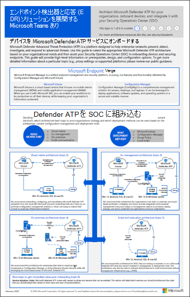

# Microsoft Defender for Endpoint をリングに展開する

[!INCLUDE [Microsoft 365 Defender rebranding](../../includes/microsoft-defender.md)]

**適用対象:**
- [Microsoft Defender for Endpoint](https://go.microsoft.com/fwlink/p/?linkid=2154037)
- [Microsoft 365 Defender](https://go.microsoft.com/fwlink/?linkid=2118804)

> Defender for Endpoint を試す場合は、 [無料試用版にサインアップしてください。](https://signup.microsoft.com/create-account/signup?products=7f379fee-c4f9-4278-b0a1-e4c8c2fcdf7e&ru=https://aka.ms/MDEp2OpenTrial?ocid=docs-wdatp-assignaccess-abovefoldlink)

Microsoft Defender for Endpoint の展開は、リング ベースの展開方法を使用して実行できます。

展開リングは、次のシナリオで適用できます。

- [新しい展開](#new-deployments)
- [既存の展開](#existing-deployments)

## 新しい展開

リング ベースのアプローチは、オンボードする一連のエンドポイントを識別し、より大きなデバイス セットにサービスを展開する前に特定の条件が満たされるのを確認する方法です。 各リングの終了条件を定義し、次のリングに進む前に満たされた条件を満たします。

リング ベースの展開を採用すると、サービスの展開中に発生する可能性のある潜在的な問題を減らすのに役立ちます。 最初に特定の数のデバイスをパイロットすることで、潜在的な問題を特定し、発生する可能性のあるリスクを軽減できます。

表 1 に、使用できる展開リングの例を示します。

**表 1:**

 

****

|展開リング|説明|
|---|---|
|評価|リング 1: パイロット テスト用の 50 のシステムを特定する|
|パイロット|リング 2: 実稼働環境の次の 50 ~ 100 エンドポイントを特定する|
|完全な展開|リング 3: より大きな増分でサービスを残りの環境にロールアウトする|
|

### 終了条件

これらのリングの終了条件のセットの例を次に示します。

- デバイスがデバイス インベントリ リストに表示される
- ダッシュボードにアラートが表示される
- [検出テストを実行する](run-detection-test.md)
- [デバイスに対してシミュレートされた攻撃を実行する](attack-simulations.md)

### 評価

サービスにオンボードする環境内のテスト マシンの数が少ない場合を特定します。 理想的には、これらのコンピューターは 50 未満のエンドポイントです。

### パイロット

Microsoft Defender for Endpoint は、サービスにオンボードできるさまざまなエンドポイントをサポートしています。 このリングで、オンボードする複数のデバイスを特定し、定義した終了条件に基づいて、次の展開リングに進みます。

次の表に、サポートされているエンドポイントと、サービスにデバイスをオンボードするために使用できる対応するツールを示します。

 

****

|Endpoint|展開ツール|
|---|---|
|**Windows**|[ローカル スクリプト (最大 10 台のデバイス)](configure-endpoints-script.md) 
 **注**: 10 台を超えるデバイスを実稼働環境に展開する場合は、代わりに Group Policy メソッドを使用するか、以下に示す他のサポートされているツールを使用します。 
 [グループ ポリシー](configure-endpoints-gp.md) 
 [Microsoft エンドポイント マネージャー/ モバイル デバイス マネージャー](configure-endpoints-mdm.md) 
 [Microsoft Endpoint Configuration Manager](configure-endpoints-sccm.md) 
 [VDI スクリプト](configure-endpoints-vdi.md) 
 [Azure Defender との統合](configure-server-endpoints.md#integration-with-azure-defender)|
|**macOS**|[ローカル スクリプト](mac-install-manually.md) 
 [Microsoft エンドポイント マネージャー](mac-install-with-intune.md) 
 [JAMF Pro](mac-install-with-jamf.md) 
 [モバイル デバイス管理](mac-install-with-other-mdm.md)|
|**Linux Server**|[ローカル スクリプト](linux-install-manually.md) 
 [Puppet](linux-install-with-puppet.md) 
 [Ansible](linux-install-with-ansible.md)|
|**iOS**|[アプリベース](ios-install.md)|
|**Android**|[Microsoft エンドポイント マネージャー](android-intune.md)|
|

### 完全な展開

この段階では、展開 [の計画に](deployment-strategy.md) 役立つ展開の計画資料を使用できます。

次の資料を使用して、組織に最適な Microsoft Defender for Endpoint アーキテクチャを選択します。

|**項目**|**説明**|
|:-----|:-----|
|  [PDF](https://github.com/MicrosoftDocs/microsoft-365-docs/raw/public/microsoft-365/security/defender-endpoint/downloads/mdatp-deployment-strategy.pdf)  \| [Visio](https://github.com/MicrosoftDocs/microsoft-365-docs/raw/public/microsoft-365/security/defender-endpoint/downloads/mdatp-deployment-strategy.vsdx) | アーキテクチャ教材は、次のアーキテクチャの展開を計画するのに役立ちます。 <ul><li> クラウド-ネイティブ </li><li> 共同管理 </li><li> オンプレミス</li><li>評価とローカル オンボード</li></ul>

## 既存の展開

### Windowsエンドポイント

サーバー Windowsおよび/または Windows サーバーの場合は、セキュリティ更新プログラム検証プログラム **(SUVP)** を使用して、(パッチ火曜日の前に) テストする複数のコンピューターを選択します。

詳しくは、次のトピックを参照してください。

- [セキュリティ更新プログラムの検証プログラムとは](https://techcommunity.microsoft.com/t5/windows-it-pro-blog/what-is-the-security-update-validation-program/ba-p/275767)
- [ソフトウェア更新プログラムの検証プログラムとMicrosoft マルウェア プロテクション センター設定 - TwC 対話型タイムライン パート 4](https://www.microsoft.com/security/blog/2012/03/28/software-update-validation-program-and-microsoft-malware-protection-center-establishment-twc-interactive-timeline-part-4/)

### 非エンドポイントWindowsエンドポイント

macOS と Linux を使用すると、いくつかのシステムを使用してベータ チャネルで実行できます。

> [!NOTE]
> ビルドが現在のチャネルに入る前に互換性、パフォーマンス、および信頼性の問題を見つけ出せそうとして、少なくとも 1 人のセキュリティ管理者と 1 人の開発者が理想的です。

チャネルの選択により、デバイスに提供される更新プログラムの種類と頻度が決まります。 ベータ版のデバイスは、更新プログラムと新機能を最初に受け取ったデバイスで、後でプレビュー、最後に現在のデバイスが続きます。

新機能をプレビューし、早期のフィードバックを提供するには、ベータ版またはプレビュー版を使用する一部のデバイスをエンタープライズで構成する必要があります。

> [!WARNING]
> 初期インストール後にチャネルを切り替えるには、製品を再インストールする必要があります。 製品チャネルを切り替えるには: 既存のパッケージをアンインストールし、新しいチャネルを使用するようにデバイスを再構成し、このドキュメントの手順に従って新しい場所からパッケージをインストールします。
