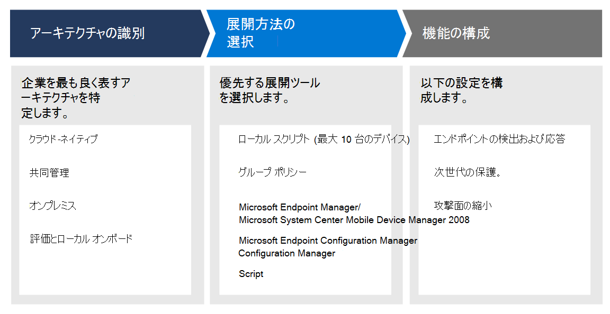

# Microsoft Defender for Endpoint 展開の計画

[!INCLUDE [Microsoft 365 Defender rebranding](../../includes/microsoft-defender.md)]

**適用対象:**
- [Microsoft Defender for Endpoint](https://go.microsoft.com/fwlink/p/?linkid=2154037)
- [Microsoft 365 Defender](https://go.microsoft.com/fwlink/?linkid=2118804)

> Defender for Endpoint を試す場合は、 [無料試用版にサインアップしてください。](https://signup.microsoft.com/create-account/signup?products=7f379fee-c4f9-4278-b0a1-e4c8c2fcdf7e&ru=https://aka.ms/MDEp2OpenTrial?ocid=docs-wdatp-secopsdashboard-abovefoldlink)

Microsoft Defender for Endpoint の展開を計画して、スイート内のセキュリティ機能を最大限に活用し、企業をサイバー脅威からより良く保護できます。

このソリューションでは、環境アーキテクチャを特定する方法、ニーズに最も適した展開ツールの種類を選択する方法、および機能を構成する方法に関するガイダンスを提供します。

## 手順 1: アーキテクチャを識別する

すべてのエンタープライズ環境は一意なので、サービスの展開方法を柔軟に選択するためのオプションがいくつか用意されています。

環境に応じて、一部のツールは特定のアーキテクチャに適しています。

次の資料を使用して、組織に最適なエンドポイント向け Defender アーキテクチャを選択します。

| アイテム | 説明 |
|:-----|:-----|
|  [PDF](https://download.microsoft.com/download/5/6/0/5609001f-b8ae-412f-89eb-643976f6b79c/mde-deployment-strategy.pdf)  \| [Visio](https://download.microsoft.com/download/5/6/0/5609001f-b8ae-412f-89eb-643976f6b79c/mde-deployment-strategy.vsdx) | アーキテクチャ教材は、次のアーキテクチャの展開を計画するのに役立ちます。 <ul><li> クラウド-ネイティブ </li><li> 共同管理 </li><li> オンプレミス</li><li>評価とローカル オンボード</li>

## 手順 2: 展開方法の選択

| エンドポイント     | 展開ツール                       |
|--------------|------------------------------------------|
| **Windows**  |  [ローカル スクリプト (最大 10 台のデバイス)](configure-endpoints-script.md)    [グループ ポリシー](configure-endpoints-gp.md)    [Microsoft エンドポイント マネージャー/ モバイル デバイス マネージャー](configure-endpoints-mdm.md)     [Microsoft Endpoint Configuration Manager](configure-endpoints-sccm.md)   [VDI スクリプト](configure-endpoints-vdi.md)   [Azure Defender との統合](configure-server-endpoints.md#integration-with-azure-defender)  |
| **macOS**    | [ローカル スクリプト](mac-install-manually.md)   [Microsoft エンドポイント マネージャー](mac-install-with-intune.md)   [JAMF Pro](mac-install-with-jamf.md)   [モバイル デバイス管理](mac-install-with-other-mdm.md) |
| **Linux Server** | [ローカル スクリプト](linux-install-manually.md)   [Puppet](linux-install-with-puppet.md)   [Ansible](linux-install-with-ansible.md)|
| **iOS**      | [Microsoft エンドポイント マネージャー](ios-install.md)                                |
| **Android**  | [Microsoft エンドポイント マネージャー](android-intune.md)               | 

次の表に、サポートされているエンドポイントと、適切に展開を計画するために使用できる対応する展開ツールの一覧を示します。

|エンドポイント|展開ツール|
|---|---|
|**Windows**|[ローカル スクリプト (最大 10 台のデバイス)](configure-endpoints-script.md)    [グループ ポリシー](configure-endpoints-gp.md)    [Microsoft エンドポイント マネージャー/ モバイル デバイス マネージャー](configure-endpoints-mdm.md)     [Microsoft Endpoint Configuration Manager](configure-endpoints-sccm.md)   [VDI スクリプト](configure-endpoints-vdi.md)   [Azure Defender との統合](configure-server-endpoints.md#integration-with-azure-defender)|
|**macOS**|[ローカル スクリプト](mac-install-manually.md)   [Microsoft エンドポイント マネージャー](mac-install-with-intune.md)   [JAMF Pro](mac-install-with-jamf.md)   [モバイル デバイス管理](mac-install-with-other-mdm.md)|
|**Linux Server**|[ローカル スクリプト](linux-install-manually.md)   [Puppet](linux-install-with-puppet.md)   [Ansible](linux-install-with-ansible.md)|
|**iOS**|[アプリベース](ios-install.md)|
|**Android**|[Microsoft エンドポイント マネージャー](android-intune.md)|

## 手順 3: 機能を構成する

エンドポイントのオンボード後、Defender for Endpoint のセキュリティ機能を構成して、スイートで使用可能な堅牢なセキュリティ保護を最大限に活用できます。 機能には、次のものが含まれます。

- エンドポイントの検出および応答
- 次世代の保護
- 攻撃面の縮小

## 関連項目

- [展開フェーズ](deployment-phases.md)
