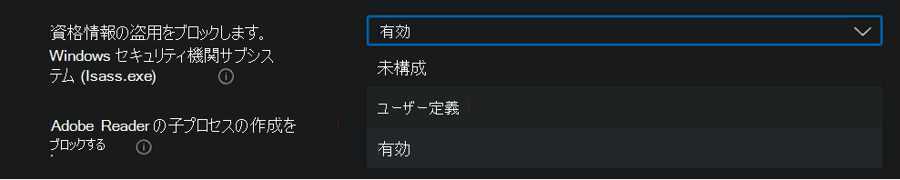

# <a name="enable-attack-surface-reduction-rules"></a>攻撃面の減少ルールを有効にする

**適用対象:**

- [Microsoft Defender for Endpoint Plan 2](https://go.microsoft.com/fwlink/p/?linkid=2154037)
- [Microsoft 365 Defender](https://go.microsoft.com/fwlink/?linkid=2118804)

> [!TIP]
> Defender for Endpoint を試す場合は、 [無料試用版にサインアップしてください。](https://signup.microsoft.com/create-account/signup?products=7f379fee-c4f9-4278-b0a1-e4c8c2fcdf7e&ru=https://aka.ms/MDEp2OpenTrial?ocid=docs-wdatp-assignaccess-abovefoldlink)

[攻撃表面の縮小ルール](attack-surface-reduction.md) (ASR ルール) は、マルウェアが頻繁にデバイスやネットワークを侵害するアクションを防ぐのに役立ちます。

## <a name="requirements"></a>要件

複数のバージョンの攻撃表面Windows機能

次のエディションとバージョンのデバイスを実行しているデバイスに対して攻撃表面の縮小ルールをWindows。

- Windows 10 Proバージョン [1709](/windows/whats-new/whats-new-windows-10-version-1709) 以降
- Windows 10 Enterpriseバージョン [1709](/windows/whats-new/whats-new-windows-10-version-1709) 以降
- Windows Server [バージョン 1803 (半期チャネル)](/windows-server/get-started/whats-new-in-windows-server-1803) 以降
- [Windows Server 2019](/windows-server/get-started-19/whats-new-19)
- [Windows Server 2016](/windows-server/get-started/whats-new-in-windows-server-2016)
- [Windows Server 2012 R2](/win32/srvnodes/what-s-new-for-windows-server-2012-r2) 
- Windows Server 2022

攻撃表面の縮小ルールの機能セット全体を使用するには、以下が必要です。

- Windows Defender ウイルス対策 AV として設定する (リアルタイム保護オン)
- [Cloud-Delivery Protection on](/windows/security/threat-protection/microsoft-defender-antivirus/enable-cloud-protection-microsoft-defender-antivirus) (一部のルールでは必要)
- Windows 10 Enterprise E5 または E3 ライセンス

攻撃表面の縮小ルールでは、Windows E5 ライセンスを使用した [Windows E5](/windows/deployment/deploy-enterprise-licenses) ライセンスは必要とされませんが、Defender for Endpoint で使用できる監視、分析、ワークフロー、および <a href="https://go.microsoft.com/fwlink/p/?linkid=2077139" target="_blank">Microsoft 365 Defender</a> ポータルのレポート機能と構成機能などの高度な管理機能を利用できます。 これらの高度な機能は E3 ライセンスでは使用できませんが、イベント ビューアーを使用して攻撃表面の縮小ルール イベントを確認できます。

各 ASR ルールには、次の 4 つの設定のいずれかを含む。

- **構成されていません**: ASR ルールを無効にする
- **ブロック**: ASR ルールを有効にする
- **監査**: ASR ルールが有効な場合に組織に与える影響を評価する
- **警告**: ASR ルールを有効にするが、エンド ユーザーがブロックをバイパスできる

> [!IMPORTANT]
> 現在、警告モードは、3 つの ASR ルール (MEM) で ASR ルールを構成するときにMicrosoft エンドポイント マネージャーサポートされていません。 詳細については、「警告モード [がサポートされていないケース」を参照してください](attack-surface-reduction.md#cases-where-warn-mode-is-not-supported)。

microsoft [Defender for Endpoint](microsoft-defender-endpoint.md) (Defender for Endpoint) で利用可能な高度な監視およびレポート機能を利用するには、Windows E5 ライセンス (または類似のライセンス SKU) で ASR ルールを使用することをお勧めします。 ただし、高度な監視機能やレポート機能を含む Windows Professional や Windows E3 などの別のライセンスがある場合は、ASR ルールがトリガーされる際に各エンドポイントで生成されるイベント (イベント転送など) の上に独自の監視およびレポート ツールを開発できます。

> [!TIP]
> ライセンスの詳細については、「Windowsライセンス」をWindows 10ボリューム ライセンス [](https://www.microsoft.com/licensing/product-licensing/windows10?activetab=windows10-pivot:primaryr5) ガイドを参照[Windows 10。](https://download.microsoft.com/download/2/D/1/2D14FE17-66C2-4D4C-AF73-E122930B60F6/Windows-10-Volume-Licensing-Guide.pdf)

攻撃表面の縮小ルールは、次の方法で有効にできます。

- [Microsoft Intune](#intune)
- [モバイル デバイス管理 (MDM)](#mdm)
- [Microsoft Endpoint Configuration Manager](#microsoft-endpoint-configuration-manager)
- [グループ ポリシー](#group-policy)
- [PowerShell](#powershell)

Enterprise、Intune などのレベルのMicrosoft エンドポイント マネージャーをお勧めします。 Enterpriseレベルの管理では、起動時に競合するグループ ポリシーまたは PowerShell 設定が上書きされます。

## <a name="exclude-files-and-folders-from-asr-rules"></a>ASR ルールからファイルとフォルダーを除外する

ほとんどの攻撃表面の縮小ルールによってファイルとフォルダーが評価されるのを除外できます。 つまり、ASR ルールがファイルまたはフォルダーに悪意のある動作が含まれていると判断した場合でも、ファイルの実行をブロックしません。 これにより、安全でないファイルを実行してデバイスに感染する可能性があります。

指定された Defender for Endpoint ファイルと証明書インジケーターを許可することで、証明書とファイル ハッシュに基づいて ASR ルールをトリガーから除外することもできます。 (「指標 [の管理」を](manage-indicators.md)参照してください)。

> [!IMPORTANT]
> ファイルまたはフォルダーを除外すると、ASR ルールによって提供される保護が大幅に低下する可能性があります。 除外されたファイルの実行が許可され、レポートやイベントは記録されません。
> ASR ルールで検出すべきではないと思うファイルが検出されている場合は、まず監査モードを使用して [ルールをテストする必要があります](evaluate-attack-surface-reduction.md)。

個々のファイルまたはフォルダー (フォルダー パスまたは完全修飾リソース名を使用) を指定できますが、除外が適用されるルールを指定することはできません。 除外は、除外されたアプリケーションまたはサービスが開始された場合にのみ適用されます。 たとえば、既に実行されている更新サービスの除外を追加すると、サービスが停止して再起動されるまで、更新サービスはイベントをトリガーし続ける。

ASR ルールは、環境変数とワイルドカードをサポートします。 ワイルドカードの使用の詳細については、「ファイル名とフォルダー パスまたは拡張子の除外リストでワイルドカードを使用 [する」を参照してください](configure-extension-file-exclusions-microsoft-defender-antivirus.md#use-wildcards-in-the-file-name-and-folder-path-or-extension-exclusion-lists)。

ASR ルールを有効にする次の手順には、ファイルとフォルダーを除外する方法の手順が含まれます。

## <a name="intune"></a>Intune

**デバイス構成プロファイル**

1. [ **デバイス構成プロファイル]** \> **を選択します**。 既存のエンドポイント保護プロファイルを選択するか、新しいエンドポイント保護プロファイルを作成します。 新しいプロファイルを作成するには、[プロファイルの作成] **を選択し** 、このプロファイルの情報を入力します。 [プロファイル **の種類] で**、[ **エンドポイント保護] を選択します**。 既存のプロファイルを選択した場合は、[プロパティ] を **選択** し、[プロパティ] **を** 選択設定。

2. [エンドポイント保護 **] ウィンドウで**、[Exploit **Guard Windows Defender] を** 選択し、[攻撃表面 **の縮小] を選択します**。 各 ASR ルールの目的の設定を選択します。

3. [ **攻撃表面の縮小の例外] で、** 個々のファイルとフォルダーを入力します。 [インポート] を **選択して** 、ASR ルールから除外するファイルとフォルダーを含む CSV ファイルをインポートすることもできます。 CSV ファイルの各行は、次のように書式設定する必要があります。

   `C:\folder`, `%ProgramFiles%\folder\file`, `C:\path`

4. 3 **つの構成** ウィンドウで [OK] を選択します。 次に、**新しい** エンドポイント保護ファイルを作成する場合は [作成] を選択し、既存のエンドポイント保護ファイルを編集する場合は [保存] を選択します。

**エンドポイント セキュリティ ポリシー**

1. [ **エンドポイント セキュリティ攻撃] サーフェス** \> **の縮小を選択します**。 既存の ASR ルールを選択するか、新しい ASR ルールを作成します。 新しいプロファイルを作成するには、[ポリシーの作成] **を選択し** 、このプロファイルの情報を入力します。 [ **プロファイルの種類] で**、[ **攻撃表面の縮小ルール] を選択します**。 既存のプロファイルを選択した場合は、[プロパティ] を **選択** し、[プロパティ] **を** 選択設定。

2. [構成設定 **] ウィンドウで** 、[ **攻撃表面** の縮小] を選択し、各 ASR ルールの目的の設定を選択します。

3. [**保護する必要** がある追加のフォルダーの一覧] で、保護されたフォルダーにアクセスできるアプリの一覧、および攻撃表面の縮小ルールからファイルとパスを除外し、個々のファイルとフォルダーを **入力** します。 [インポート] を **選択して** 、ASR ルールから除外するファイルとフォルダーを含む CSV ファイルをインポートすることもできます。 CSV ファイルの各行は、次のように書式設定する必要があります。

   `C:\folder`, `%ProgramFiles%\folder\file`, `C:\path`

4. **3 つの** 構成ウィンドウで [次へ] を選択し、新しいポリシーを作成する場合は  [作成] を選択し、既存のポリシーを編集する場合は [保存] を選択します。

## <a name="mem"></a>MEM

カスタム ASR ルールMicrosoft エンドポイント マネージャー(MEM) OMA-URI を使用して構成できます。 次の手順では、この例で「悪用された脆弱な署名済みドライバーの悪用を [ブロックする」](attack-surface-reduction-rules-reference.md#block-abuse-of-exploited-vulnerable-signed-drivers) というルールを使用します。

1. 新しいMicrosoft エンドポイント マネージャー (MEM) 管理センターを開きます。 [ホーム **] メニューの [** デバイス]  **をクリックし**、[構成プロファイル] **を選択** し、[プロファイルの作成] **をクリックします**。

   > [!div class="mx-imgBorder"]
   > 

2. [ **プロファイルの作成]** で、次の 2 つのドロップダウン リストで、次の項目を選択します。

   - [**プラットフォーム] で**、[Windows 10 **以降] を選択します。**
   - [ **プロファイルの種類] で**、[ **テンプレート] を選択します。**

   [カスタム **] を** 選択し、[作成] を **選択します**。

   > [!div class="mx-imgBorder"]
   > 

3. [カスタム テンプレート] ツールが開き、手順 **1 [基本] に進みます**。 **[1 基本]** の **[名前**] にテンプレートの名前を入力し、[説明]  に説明を入力できます (省略可能)。

   > [!div class="mx-imgBorder"]
   > 

4. **[次へ]** をクリックします。 手順 **2 構成設定が開** きます。 [OMA-URI] の設定をクリック **します**。 [追加] と [エクスポート] の 2 **つの** オプションが **表示されます**。

   > [!div class="mx-imgBorder"]
   > 

5. [追加 **] を再度クリック** します。 [**行 OMA-URI の追加] 設定** 開きます。 [ **行の追加] で**、次の操作を行います。

   - [ **名前]** に、ルールの名前を入力します。
   - [ **説明]** に簡単な説明を入力します。
   - **OMA-URI で**、追加するルールの特定の OMA-URI リンクを入力または貼り付けます。 このルール例で使用する OMA-URI については、この記事の MDM セクションを参照してください。 攻撃表面の縮小ルール GUIDS については、[](attack-surface-reduction-rules-reference.md#per-rule-descriptions)トピック「攻撃表面縮小ルール」の「ルールごとの説明」を参照してください。
   - [ **データの種類] で**、[文字列] を **選択します**。
   - [ **値]** で、GUID \= 値、記号、およびスペースを含む State 値 (_GUID=StateValue) を入力または貼り付けます_。 ここで、
     
     - 0 : 無効にする (ASR ルールを無効にする)
     - 1 : ブロック (ASR ルールを有効にする)
     - 2 : 監査 (ASR ルールが有効な場合に組織に与える影響を評価する)
     - 6 : 警告 (ASR ルールを有効にするが、エンド ユーザーがブロックをバイパスできる)

   > [!div class="mx-imgBorder"]
   > 

6. **[保存]** を選択します。 **[行の追加]** が閉じます。 [カスタム **] で**、[次へ] を **選択します**。 手順 **3 スコープ タグでは、** スコープ タグは省略可能です。 次のいずれかの操作を行います。

   - [ **スコープ タグの選択] を** 選択し、スコープ タグ (オプション) を選択し、[次へ] を **選択します**。
   - または、[次へ] を **選択します。**

7. 手順 **4 [割り当** て] の [含まれる **グループ] で**、このルールを適用するグループについて、次のオプションから選択します。

   - **グループの追加**
   - **すべてのユーザーを追加する**
   - **すべてのデバイスを追加する**

   > [!div class="mx-imgBorder"]
   > 

8. [ **除外グループ] で**、このルールから除外するグループを選択し、[次へ] を選択 **します**。

9. 手順 **5 次の設定の** 適用ルールで、次の操作を行います。

   - [ **ルール] で**、[プロファイルを **割り当てる場合**] または [プロファイルを割り当てない場合 **] を選択します。**
   - [ **プロパティ**] で、このルールを適用するプロパティを選択します。
   - [ **値]** に、該当する値または値の範囲を入力します。

   > [!div class="mx-imgBorder"]
   > 

10. **[次へ]** を選択します。 手順 **6 [レビューと作成**] で、選択して入力した設定と情報を確認し、[作成] を選択 **します**。

    > [!div class="mx-imgBorder"]
    > 

    > [!NOTE]
    > ルールはアクティブで、数分以内に有効です。

> [!NOTE]
> 競合の処理:
>
> デバイスに 2 つの異なる ASR ポリシーを割り当てると、競合の処理方法は、異なる状態が割り当てられたルールであり、競合管理が行われるので、結果はエラーになります。
>
> 競合しないルールではエラーが発生し、ルールが正しく適用されます。 その結果、最初のルールが適用され、それ以降の競合しないルールがポリシーにマージされます。

## <a name="mdm"></a>MDM

各ルールのモードを個別に有効にして設定するには、. [/Vendor/MSFT/Policy/Config/Defender/AttackSurfaceReductionRules](/windows/client-management/mdm/policy-csp-defender#defender-attacksurfacereductionrules) 構成サービス プロバイダー (CSP) を使用します。

攻撃表面縮小ルールの参照に GUID 値を使用して、参照 [のサンプルを次に示します](attack-surface-reduction-rules-reference.md)。

`OMA-URI path: ./Vendor/MSFT/Policy/Config/Defender/AttackSurfaceReductionRules`

`Value: 75668c1f-73b5-4cf0-bb93-3ecf5cb7cc84=2|3b576869-a4ec-4529-8536-b80a7769e899=1|d4f940ab-401b-4efc-aadc-ad5f3c50688a=2|d3e037e1-3eb8-44c8-a917-57927947596d=1|5beb7efe-fd9a-4556-801d-275e5ffc04cc=0|be9ba2d9-53ea-4cdc-84e5-9b1eeee46550=1`

監査モードで有効 (ブロック)、無効化、警告、または有効にする値は次のとおりです。

- 0 : 無効にする (ASR ルールを無効にする)
- 1 : ブロック (ASR ルールを有効にする)
- 2 : 監査 (ASR ルールが有効な場合に組織に与える影響を評価する)
- 6 : 警告 (ASR ルールを有効にするが、エンド ユーザーがブロックをバイパスできる)。 警告モードは、ほとんどの ASR ルールで使用できます。

除外を追加するには [、./Vendor/MSFT/Policy/Config/Defender/AttackSurfaceReductionOnlyExclusions](/windows/client-management/mdm/policy-csp-defender#defender-attacksurfacereductiononlyexclusions) 構成サービス プロバイダー (CSP) を使用します。

例:

`OMA-URI path: ./Vendor/MSFT/Policy/Config/Defender/AttackSurfaceReductionOnlyExclusions`

`Value: c:\path|e:\path|c:\Exclusions.exe`

> [!NOTE]
> スペースを使用せずに OMA-URI 値を入力してください。

## <a name="microsoft-endpoint-configuration-manager"></a>Microsoft Endpoint Configuration Manager

1. このMicrosoft Endpoint Configuration Manager、**Exploit** \> Guard の [アセットと **コンプライアンス]** \> Endpoint Protection Windows Defender **移動します**。

2. [ホーム **エクスプロイト** \> **ガード ポリシーの作成] を選択します**。

3. 名前と説明を入力し、[攻撃表面の縮小] **を選択** し、[次へ] を **選択します**。

4. アクションをブロックまたは監査するルールを選択し、[次へ] を **選択します**。

5. 設定を確認し、[次へ] **を選択** してポリシーを作成します。

6. ポリシーを作成したら、[閉じる] を **選択します**。

## <a name="group-policy"></a>グループ ポリシー

> [!WARNING]
> Intune、Configuration Manager、または他のエンタープライズ レベルの管理プラットフォームを使用してコンピューターとデバイスを管理する場合、管理ソフトウェアは起動時に競合するグループ ポリシー設定を上書きします。

1. グループ ポリシー管理コンピューターで、[[グループ ポリシー管理コンソール]](https://technet.microsoft.com/library/cc731212.aspx) を開き、構成するグループ ポリシー オブジェクトを右クリックして、**[編集]** をクリックします。

2. **[グループ ポリシー管理エディター]** で、**[コンピューターの構成]** に移動し、**[管理用テンプレート]** を選択します。

3. ツリーを展開して、**攻撃Windows Microsoft Defender ウイルス対策** \>  \> **Microsoft Defender Exploit Guard** \> **を表示します**。

4. [攻撃 **表面縮小ルールの構成] を選択し、[** 有効] を **選択します**。 その後、[オプション] セクションで各ルールの個別の状態を設定できます。 [**Show....]** を選択し、[値名] 列にルール ID を入力し、[値] 列に選択した状態 **を** 次のように入力します。

   - 0 : 無効にする (ASR ルールを無効にする)
   - 1 : ブロック (ASR ルールを有効にする)
   - 2 : 監査 (ASR ルールが有効な場合に組織に与える影響を評価する)
   - 6 : 警告 (ASR ルールを有効にするが、エンド ユーザーがブロックをバイパスできる)

   :::image type="content" source="images/asr-rules-gp.png" alt-text="グループ ポリシーの ASR ルール。":::

5. ASR ルールからファイルとフォルダーを除外するには、[攻撃表面の縮小ルールからファイルとパスを除外する] 設定を選択し、オプションを [有効] に設定 **します**。 [ **表示] を** 選択し、[値の名前] 列に各ファイル **またはフォルダーを入力** します。 各 **アイテムの [** 値] **列に** 0 を入力します。

   > [!WARNING]
   > [値の名前] 列または [値] 列でサポートされていない引用符は **使用** しません。

## <a name="powershell"></a>PowerShell

> [!WARNING]
> Intune、Configuration Manager、または別のエンタープライズ レベルの管理プラットフォームを使用してコンピューターとデバイスを管理すると、起動時に競合する PowerShell 設定が管理ソフトウェアによって上書きされます。 PowerShell を使用して値を定義するには、管理プラットフォームのルールに "User Defined" オプションを使用します。
> "User Defined" を使用すると、ローカル管理者ユーザーがルールを構成できます。
> [ユーザー定義] オプションの設定を次の図に示します。

> [!div class="mx-imgBorder"]
> 


1. [**powershell]** と入力スタート メニュー **右クリックし**、[管理者Windows PowerShell **実行] を選択します**。

2. 次のいずれかのコマンドレットを入力します。 (ルール ID [など、詳細については、「攻撃](attack-surface-reduction-rules-reference.md) 表面の縮小ルールリファレンス」を参照してください)。

    ```PowerShell
    Set-MpPreference -AttackSurfaceReductionRules_Ids <rule ID> -AttackSurfaceReductionRules_Actions Enabled
    ```

    監査モードで ASR ルールを有効にするには、次のコマンドレットを使用します。

    ```PowerShell
    Add-MpPreference -AttackSurfaceReductionRules_Ids <rule ID> -AttackSurfaceReductionRules_Actions AuditMode
    ```

    警告モードで ASR ルールを有効にするには、次のコマンドレットを使用します。

    ```PowerShell
    Add-MpPreference -AttackSurfaceReductionRules_Ids <rule ID> -AttackSurfaceReductionRules_Actions Warn
    ```

    悪用された脆弱な署名済みドライバーの ASR ブロックの悪用を有効にするには、次のコマンドレットを使用します。

   ```PowerShell
   Add-MpPreference -AttackSurfaceReductionRules_Ids 56a863a9-875e-4185-98a7-b882c64b5ce5 -AttackSurfaceReductionRules_Actions Enabled
   ```

    ASR ルールをオフにするには、次のコマンドレットを使用します。

    ```PowerShell
    Add-MpPreference -AttackSurfaceReductionRules_Ids <rule ID> -AttackSurfaceReductionRules_Actions Disabled
    ```

    > [!IMPORTANT]
    > ルールごとに状態を個別に指定する必要がありますが、コンマ区切りのリストでルールと状態を組み合わせて使用できます。
    >
    > 次の例では、最初の 2 つのルールが有効になり、3 番目のルールが無効になり、4 番目のルールが監査モードで有効になります。
    >
    > ```PowerShell
    > Set-MpPreference -AttackSurfaceReductionRules_Ids <rule ID 1>,<rule ID 2>,<rule ID 3>,<rule ID 4> -AttackSurfaceReductionRules_Actions Enabled, Enabled, Disabled, AuditMode
    > ```

    PowerShell 動詞を使用して `Add-MpPreference` 、既存のリストに新しいルールを追加することもできます。

    > [!WARNING]
    > `Set-MpPreference` ルールの既存のセットは常に上書きされます。 既存のセットに追加する場合は、代わりに使用 `Add-MpPreference` します。
    > を使用して、ルールとその現在の状態の一覧を取得できます `Get-MpPreference`。

3. ASR ルールからファイルとフォルダーを除外するには、次のコマンドレットを使用します。

    ```PowerShell
    Add-MpPreference -AttackSurfaceReductionOnlyExclusions "<fully qualified path or resource>"
    ```

    引き続き使用 `Add-MpPreference -AttackSurfaceReductionOnlyExclusions` して、リストにファイルとフォルダーを追加します。

    > [!IMPORTANT]
    > リスト `Add-MpPreference` にアプリを追加または追加する場合に使用します。 コマンドレットを使用 `Set-MpPreference` すると、既存のリストが上書きされます。

## <a name="related-articles"></a>関連記事

- [攻撃表面の縮小ルールのリファレンス](attack-surface-reduction-rules-reference.md)
- [攻撃表面の縮小を評価する](evaluate-attack-surface-reduction.md)
- [攻撃面の減少の FAQ](attack-surface-reduction.md)
