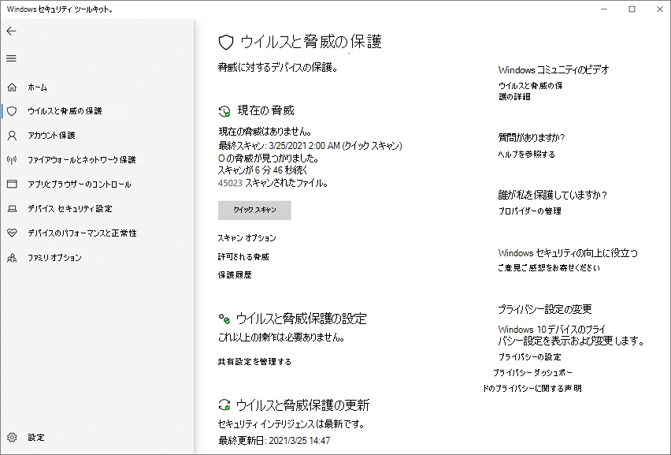

# <a name="turn-on-cloud-delivered-protection"></a><span data-ttu-id="440d6-104">クラウドによる保護を有効にする</span><span class="sxs-lookup"><span data-stu-id="440d6-104">Turn on cloud-delivered protection</span></span>

[!INCLUDE [Microsoft 365 Defender rebranding](../../includes/microsoft-defender.md)]

<span data-ttu-id="440d6-105">**適用対象:**</span><span class="sxs-lookup"><span data-stu-id="440d6-105">**Applies to:**</span></span>

- [<span data-ttu-id="440d6-106">Microsoft Defender for Endpoint</span><span class="sxs-lookup"><span data-stu-id="440d6-106">Microsoft Defender for Endpoint</span></span>](/microsoft-365/security/defender-endpoint/)

> [!NOTE]
> <span data-ttu-id="440d6-107">クラウド Microsoft Defender ウイルス対策は、ネットワークとエンドポイントに更新された保護を提供するためのメカニズムです。</span><span class="sxs-lookup"><span data-stu-id="440d6-107">The Microsoft Defender Antivirus cloud service is a mechanism for delivering updated protection to your network and endpoints.</span></span> <span data-ttu-id="440d6-108">クラウド サービスと呼ばれるが、単にクラウドに保存されているファイルの保護ではありません。むしろ、分散リソースと機械学習を使用して、従来のセキュリティ インテリジェンス更新プログラムよりもはるかに高速な速度でエンドポイントに保護を提供します。</span><span class="sxs-lookup"><span data-stu-id="440d6-108">Although it is called a cloud service, it is not simply protection for files stored in the cloud; rather, it uses distributed resources and machine learning to deliver protection to your endpoints at a rate that is far faster than traditional Security intelligence updates.</span></span>

<span data-ttu-id="440d6-109">Microsoft Defender ウイルス対策は、複数の検出および防止テクノロジを使用して、正確でリアルタイムでインテリジェントな保護を提供します。</span><span class="sxs-lookup"><span data-stu-id="440d6-109">Microsoft Defender Antivirus uses multiple detection and prevention technologies to deliver accurate, real-time, and intelligent protection.</span></span> <span data-ttu-id="440d6-110">Microsoft Defender for Endpoint 次世代保護の中核となる高度なテクノロジ[を知る](https://www.microsoft.com/security/blog/2019/06/24/inside-out-get-to-know-the-advanced-technologies-at-the-core-of-microsoft-defender-atp-next-generation-protection/)。</span><span class="sxs-lookup"><span data-stu-id="440d6-110">[Get to know the advanced technologies at the core of Microsoft Defender for Endpoint next-generation protection](https://www.microsoft.com/security/blog/2019/06/24/inside-out-get-to-know-the-advanced-technologies-at-the-core-of-microsoft-defender-atp-next-generation-protection/).</span></span>
<span data-ttu-id="440d6-111"></span><span class="sxs-lookup"><span data-stu-id="440d6-111"></span></span>  

<span data-ttu-id="440d6-112">クラウドによる保護Microsoft Defender ウイルス対策オンまたはオフを切り替える方法は、次に示します。</span><span class="sxs-lookup"><span data-stu-id="440d6-112">You can turn Microsoft Defender Antivirus cloud-delivered protection on or off in several ways:</span></span>

- <span data-ttu-id="440d6-113">Microsoft Intune</span><span class="sxs-lookup"><span data-stu-id="440d6-113">Microsoft Intune</span></span>
- <span data-ttu-id="440d6-114">Microsoft エンドポイント マネージャー</span><span class="sxs-lookup"><span data-stu-id="440d6-114">Microsoft Endpoint Manager</span></span>
- <span data-ttu-id="440d6-115">グループ ポリシー</span><span class="sxs-lookup"><span data-stu-id="440d6-115">Group Policy</span></span>
- <span data-ttu-id="440d6-116">PowerShell コマンドレット。</span><span class="sxs-lookup"><span data-stu-id="440d6-116">PowerShell cmdlets.</span></span>

 <span data-ttu-id="440d6-117">また、アプリを使用して個々のクライアントで有効またはWindows セキュリティすることもできます。</span><span class="sxs-lookup"><span data-stu-id="440d6-117">You can also turn it on or off in individual clients with the Windows Security app.</span></span>

<span data-ttu-id="440d6-118">クラウド[で配信される保護の](cloud-protection-microsoft-defender-antivirus.md)概要については、「Microsoft クラウドによる保護を使用するMicrosoft Defender ウイルス対策」を参照してください。</span><span class="sxs-lookup"><span data-stu-id="440d6-118">See [Use Microsoft cloud-delivered protection](cloud-protection-microsoft-defender-antivirus.md) for an overview of Microsoft Defender Antivirus cloud-delivered protection.</span></span>

<span data-ttu-id="440d6-119">エンドポイントがクラウド配信保護サービスに接続できるネットワーク接続要件の詳細については、「ネットワーク接続の構成と検証」を [参照してください](configure-network-connections-microsoft-defender-antivirus.md)。</span><span class="sxs-lookup"><span data-stu-id="440d6-119">For more information about the specific network-connectivity requirements to ensure your endpoints can connect to the cloud-delivered protection service, see [Configure and validate network connections](configure-network-connections-microsoft-defender-antivirus.md).</span></span>

> [!NOTE]
> <span data-ttu-id="440d6-120">このWindows 10、このトピックで説明する **Basic** レポート オプションと **Advanced** レポート オプションの違いはありません。</span><span class="sxs-lookup"><span data-stu-id="440d6-120">In Windows 10, there is no difference between the **Basic** and **Advanced** reporting options described in this topic.</span></span> <span data-ttu-id="440d6-121">これは従来の違いであり、どちらかの設定を選択すると、クラウドによる保護の同じレベルになります。</span><span class="sxs-lookup"><span data-stu-id="440d6-121">This is a legacy distinction and choosing either setting will result in the same level of cloud-delivered protection.</span></span> <span data-ttu-id="440d6-122">共有される情報の種類や量に違いはありません。</span><span class="sxs-lookup"><span data-stu-id="440d6-122">There is no difference in the type or amount of information that is shared.</span></span> <span data-ttu-id="440d6-123">収集する情報の詳細については [、「Microsoft Privacy Statement」を参照してください](https://go.microsoft.com/fwlink/?linkid=521839)。</span><span class="sxs-lookup"><span data-stu-id="440d6-123">For more information on what we collect, see the [Microsoft Privacy Statement](https://go.microsoft.com/fwlink/?linkid=521839).</span></span>

## <a name="use-intune-to-turn-on-cloud-delivered-protection"></a><span data-ttu-id="440d6-124">Intune を使用してクラウド配信の保護を有効にする</span><span class="sxs-lookup"><span data-stu-id="440d6-124">Use Intune to turn on cloud-delivered protection</span></span>

1. <span data-ttu-id="440d6-125">管理センター ( ) Microsoft エンドポイント マネージャーに移動し [https://endpoint.microsoft.com](https://endpoint.microsoft.com) 、ログインします。</span><span class="sxs-lookup"><span data-stu-id="440d6-125">Go to the Microsoft Endpoint Manager admin center ([https://endpoint.microsoft.com](https://endpoint.microsoft.com)) and log in.</span></span>

2. <span data-ttu-id="440d6-126">[ホーム **] ウィンドウで** 、[デバイス **構成] >選択します**。</span><span class="sxs-lookup"><span data-stu-id="440d6-126">On the **Home** pane, select **Device configuration > Profiles**.</span></span>

3. <span data-ttu-id="440d6-127">構成する **デバイス制限プロファイル** の種類を選択します。</span><span class="sxs-lookup"><span data-stu-id="440d6-127">Select the **Device restrictions** profile type you want to configure.</span></span> <span data-ttu-id="440d6-128">新しいデバイス制限プロファイルの種類を作成 **する** 必要がある場合は、「デバイス制限の設定を構成する」を参照 [Microsoft Intune。](/intune/device-restrictions-configure)</span><span class="sxs-lookup"><span data-stu-id="440d6-128">If you need to create a new **Device restrictions** profile type, see [Configure device restriction settings in Microsoft Intune](/intune/device-restrictions-configure).</span></span>

4. <span data-ttu-id="440d6-129">[プロパティ **の**  >  **構成設定] を選択します。[プロパティ**  >  **のMicrosoft Defender ウイルス対策** します。</span><span class="sxs-lookup"><span data-stu-id="440d6-129">Select **Properties** > **Configuration settings: Edit** > **Microsoft Defender Antivirus**.</span></span>

5. <span data-ttu-id="440d6-130">[クラウド配信 **の保護] スイッチで、[** 有効にする] を **選択します**。</span><span class="sxs-lookup"><span data-stu-id="440d6-130">On the **Cloud-delivered protection** switch, select **Enable**.</span></span>

6. <span data-ttu-id="440d6-131">[サンプル申請 **の前にユーザーに確認する** ] ドロップダウンで、[すべてのデータを **自動的に送信する] を選択します**。</span><span class="sxs-lookup"><span data-stu-id="440d6-131">In the **Prompt users before sample submission** dropdown, select **Send all data automatically**.</span></span>

<span data-ttu-id="440d6-132">Intune デバイス プロファイルの作成および構成方法など、Intune デバイス プロファイルの詳細については、「デバイス プロファイルのMicrosoft Intune[参照してください。](/intune/device-profiles)</span><span class="sxs-lookup"><span data-stu-id="440d6-132">For more information about Intune device profiles, including how to create and configure their settings, see [What are Microsoft Intune device profiles?](/intune/device-profiles)</span></span>

## <a name="use-microsoft-endpoint-manager-to-turn-on-cloud-delivered-protection"></a><span data-ttu-id="440d6-133">クラウドMicrosoft エンドポイント マネージャー保護を有効にする方法</span><span class="sxs-lookup"><span data-stu-id="440d6-133">Use Microsoft Endpoint Manager to turn on cloud-delivered protection</span></span>

1. <span data-ttu-id="440d6-134">管理センター ( ) Microsoft エンドポイント マネージャーに移動し [https://endpoint.microsoft.com](https://endpoint.microsoft.com) 、ログインします。</span><span class="sxs-lookup"><span data-stu-id="440d6-134">Go to the Microsoft Endpoint Manager admin center ([https://endpoint.microsoft.com](https://endpoint.microsoft.com)) and log in.</span></span>

2. <span data-ttu-id="440d6-135">[エンドポイント **セキュリティウイルス**  >  **対策] を選択します**。</span><span class="sxs-lookup"><span data-stu-id="440d6-135">Choose **Endpoint security** > **Antivirus**.</span></span>

3. <span data-ttu-id="440d6-136">ウイルス対策プロファイルを選択します。</span><span class="sxs-lookup"><span data-stu-id="440d6-136">Select an antivirus profile.</span></span> <span data-ttu-id="440d6-137">(まだプロファイルを持っていない場合、または新しいプロファイルを作成する場合は、「デバイス制限設定を構成する」を参照[Microsoft Intune。](/intune/device-restrictions-configure)</span><span class="sxs-lookup"><span data-stu-id="440d6-137">(If you don't have one yet, or if you want to create a new profile, see [Configure device restriction settings in Microsoft Intune](/intune/device-restrictions-configure).</span></span>

4. <span data-ttu-id="440d6-138">[プロパティ **] を選択します**。</span><span class="sxs-lookup"><span data-stu-id="440d6-138">Select **Properties**.</span></span> <span data-ttu-id="440d6-139">次に、[構成設定] **の横にある**[編集] を **選択します**。</span><span class="sxs-lookup"><span data-stu-id="440d6-139">Then, next to **Configuration settings**, choose **Edit**.</span></span>

5. <span data-ttu-id="440d6-140">[ **クラウド保護]** を展開し、[クラウド配信の保護レベル] ボックス **の一覧** で、次のいずれかを選択します。</span><span class="sxs-lookup"><span data-stu-id="440d6-140">Expand **Cloud protection**, and then in the **Cloud-delivered protection level** list, select one of the following:</span></span>
   - <span data-ttu-id="440d6-141">**高**: 強力なレベルの検出を適用します。</span><span class="sxs-lookup"><span data-stu-id="440d6-141">**High**: Applies a strong level of detection.</span></span>
   - <span data-ttu-id="440d6-142">**High plus**: High level **を使用し** 、追加の保護手段を適用します (クライアントのパフォーマンスに影響を与える可能性があります)。</span><span class="sxs-lookup"><span data-stu-id="440d6-142">**High plus**: Uses the **High** level and applies additional protection measures (may impact client performance).</span></span>
   - <span data-ttu-id="440d6-143">**ゼロ許容値**: 不明なすべての実行可能ファイルをブロックします。</span><span class="sxs-lookup"><span data-stu-id="440d6-143">**Zero tolerance**: Blocks all unknown executables.</span></span>

6. <span data-ttu-id="440d6-144">[確認 **] + [保存] の** 順に選択し、[保存] **を選択します**。</span><span class="sxs-lookup"><span data-stu-id="440d6-144">Select **Review + save**, then choose **Save**.</span></span>

<span data-ttu-id="440d6-145">マルウェア対策ポリシーの構成Microsoft Endpoint Configuration Manager詳細については、「マルウェア対策ポリシーを作成および展開する方法[: クラウド保護サービス」を参照してください](/configmgr/protect/deploy-use/endpoint-antimalware-policies#cloud-protection-service)。</span><span class="sxs-lookup"><span data-stu-id="440d6-145">For more information about configuring Microsoft Endpoint Configuration Manager, see [How to create and deploy antimalware policies: Cloud-protection service](/configmgr/protect/deploy-use/endpoint-antimalware-policies#cloud-protection-service).</span></span>

## <a name="use-group-policy-to-turn-on-cloud-delivered-protection"></a><span data-ttu-id="440d6-146">グループ ポリシーを使用してクラウド配信の保護を有効にする</span><span class="sxs-lookup"><span data-stu-id="440d6-146">Use Group Policy to turn on cloud-delivered protection</span></span>

1. <span data-ttu-id="440d6-147">グループ ポリシー管理デバイスで、グループ ポリシー [管理](/previous-versions/windows/it-pro/windows-server-2008-R2-and-2008/cc731212(v=ws.11))コンソールを開き、構成するグループ ポリシー オブジェクトを右クリックし、[編集] を選択 **します**。</span><span class="sxs-lookup"><span data-stu-id="440d6-147">On your Group Policy management device, open the [Group Policy Management Console](/previous-versions/windows/it-pro/windows-server-2008-R2-and-2008/cc731212(v=ws.11)), right-click the Group Policy Object you want to configure and select **Edit**.</span></span>

2. <span data-ttu-id="440d6-148">グループ ポリシー **管理エディターで、[コンピューター** の構成] **に移動します**。</span><span class="sxs-lookup"><span data-stu-id="440d6-148">In the **Group Policy Management Editor**, go to **Computer configuration**.</span></span>

3. <span data-ttu-id="440d6-149">[管理 **用テンプレート] を選択します**。</span><span class="sxs-lookup"><span data-stu-id="440d6-149">Select **Administrative templates**.</span></span>

4. <span data-ttu-id="440d6-150">ツリーを展開して **、MAPS Windowsコンポーネント> Microsoft Defender ウイルス対策 >します。**</span><span class="sxs-lookup"><span data-stu-id="440d6-150">Expand the tree to **Windows components > Microsoft Defender Antivirus > MAPS**</span></span>

5. <span data-ttu-id="440d6-151">[Microsoft **MAPS に参加する] をダブルクリックします**。</span><span class="sxs-lookup"><span data-stu-id="440d6-151">Double-click **Join Microsoft MAPS**.</span></span> <span data-ttu-id="440d6-152">オプションがオンになっていることを確認し、[基本マップ] または **[高度なマップ** ] **に設定します**。</span><span class="sxs-lookup"><span data-stu-id="440d6-152">Ensure the option is turned on and set to **Basic MAPS** or **Advanced MAPS**.</span></span> <span data-ttu-id="440d6-153">[**OK**] を選択します。</span><span class="sxs-lookup"><span data-stu-id="440d6-153">Select **OK**.</span></span>

6. <span data-ttu-id="440d6-154">詳細な分析が **必要な場合は、[ファイル サンプルの送信] をダブルクリックします**。</span><span class="sxs-lookup"><span data-stu-id="440d6-154">Double-click **Send file samples when further analysis is required**.</span></span> <span data-ttu-id="440d6-155">最初のオプションが [有効] に設定 **され** 、他のオプションが次のどちらかに設定されている必要があります。</span><span class="sxs-lookup"><span data-stu-id="440d6-155">Ensure that the first option is set to **Enabled** and that the other options are set to either:</span></span>

    1. <span data-ttu-id="440d6-156">**安全なサンプルの送信** (1)</span><span class="sxs-lookup"><span data-stu-id="440d6-156">**Send safe samples** (1)</span></span>
    2. <span data-ttu-id="440d6-157">**すべてのサンプルを送信** する (3)</span><span class="sxs-lookup"><span data-stu-id="440d6-157">**Send all samples** (3)</span></span>

        >[!NOTE]
        > <span data-ttu-id="440d6-158">[ **安全なサンプルを送信する** (1)] オプションは、ほとんどのサンプルが自動的に送信されるという意味です。</span><span class="sxs-lookup"><span data-stu-id="440d6-158">The **Send safe samples** (1) option means that most samples will be sent automatically.</span></span> <span data-ttu-id="440d6-159">個人情報が含まれている可能性があるファイルは、引き続きプロンプトが表示され、追加の確認が必要です。</span><span class="sxs-lookup"><span data-stu-id="440d6-159">Files that are likely to contain personal information will still prompt and require additional confirmation.</span></span>
        > <span data-ttu-id="440d6-160">オプションを Always **Prompt** (0) に設定すると、デバイスの保護状態が低下します。</span><span class="sxs-lookup"><span data-stu-id="440d6-160">Setting the option to **Always Prompt** (0) will lower the protection state of the device.</span></span> <span data-ttu-id="440d6-161">[送信しない **]** (2) に設定 [](configure-block-at-first-sight-microsoft-defender-antivirus.md)すると、Microsoft Defender for Endpoint の一目でブロック機能が機能しません。</span><span class="sxs-lookup"><span data-stu-id="440d6-161">Setting it to **Never send** (2) means that the [Block at First Sight](configure-block-at-first-sight-microsoft-defender-antivirus.md) feature of Microsoft Defender for Endpoint won't work.</span></span>

7. <span data-ttu-id="440d6-162">[**OK**] を選択します。</span><span class="sxs-lookup"><span data-stu-id="440d6-162">Select **OK**.</span></span>

## <a name="use-powershell-cmdlets-to-turn-on-cloud-delivered-protection"></a><span data-ttu-id="440d6-163">PowerShell コマンドレットを使用してクラウド配信の保護を有効にする</span><span class="sxs-lookup"><span data-stu-id="440d6-163">Use PowerShell cmdlets to turn on cloud-delivered protection</span></span>

<span data-ttu-id="440d6-164">次のコマンドレットは、クラウド配信の保護を有効にできます。</span><span class="sxs-lookup"><span data-stu-id="440d6-164">The following cmdlets can turn on cloud-delivered protection:</span></span>

```PowerShell
Set-MpPreference -MAPSReporting Advanced
Set-MpPreference -SubmitSamplesConsent SendAllSamples
```

<span data-ttu-id="440d6-165">PowerShell を Microsoft Defender ウイルス対策と一緒に使用する方法の詳細については[、「Use PowerShell](use-powershell-cmdlets-microsoft-defender-antivirus.md)コマンドレットを使用して、PowerShell コマンドレットと Defender コマンドレットを構成およびMicrosoft Defender ウイルス対策実行する」を[参照してください](/powershell/module/defender/)。</span><span class="sxs-lookup"><span data-stu-id="440d6-165">For more information on how to use PowerShell with Microsoft Defender Antivirus, see [Use PowerShell cmdlets to configure and run Microsoft Defender Antivirus](use-powershell-cmdlets-microsoft-defender-antivirus.md) and [Defender cmdlets](/powershell/module/defender/).</span></span> <span data-ttu-id="440d6-166">[ポリシー CSP - Defender](/windows/client-management/mdm/policy-csp-defender) には、-SubmitSamplesConsent に関する詳細 [な情報があります](/windows/client-management/mdm/policy-csp-defender#defender-submitsamplesconsent)。</span><span class="sxs-lookup"><span data-stu-id="440d6-166">[Policy CSP - Defender](/windows/client-management/mdm/policy-csp-defender) also has more information specifically on [-SubmitSamplesConsent](/windows/client-management/mdm/policy-csp-defender#defender-submitsamplesconsent).</span></span>

>[!NOTE]
> <span data-ttu-id="440d6-167">また **、-SubmitSamplesConsent** を `SendSafeSamples` (既定の設定) 、または `NeverSend` に設定できます `AlwaysPrompt` 。</span><span class="sxs-lookup"><span data-stu-id="440d6-167">You can also set **-SubmitSamplesConsent** to `SendSafeSamples` (the default setting), `NeverSend`, or `AlwaysPrompt`.</span></span> <span data-ttu-id="440d6-168">この `SendSafeSamples` 設定は、ほとんどのサンプルが自動的に送信されるという意味です。</span><span class="sxs-lookup"><span data-stu-id="440d6-168">The `SendSafeSamples` setting means that most samples will be sent automatically.</span></span> <span data-ttu-id="440d6-169">個人情報が含まれている可能性があるファイルは、引き続きプロンプトが表示され、追加の確認が必要です。</span><span class="sxs-lookup"><span data-stu-id="440d6-169">Files that are likely to contain personal information will still prompt and require additional confirmation.</span></span>

>[!WARNING]
> <span data-ttu-id="440d6-170">**[-SubmitSamplesConsent] を** 設定するか、デバイス `NeverSend` `AlwaysPrompt` の保護レベルを下げる。</span><span class="sxs-lookup"><span data-stu-id="440d6-170">Setting **-SubmitSamplesConsent** to `NeverSend` or `AlwaysPrompt` will lower the protection level of the device.</span></span> <span data-ttu-id="440d6-171">さらに、Microsoft Defender for Endpoint の一目でブロック機能が機能しない場合に `NeverSend` 設定します。 [](configure-block-at-first-sight-microsoft-defender-antivirus.md)</span><span class="sxs-lookup"><span data-stu-id="440d6-171">In addition, setting it to `NeverSend` means that the [Block at First Sight](configure-block-at-first-sight-microsoft-defender-antivirus.md) feature of Microsoft Defender for Endpoint won't work.</span></span>

## <a name="use-windows-management-instruction-wmi-to-turn-on-cloud-delivered-protection"></a><span data-ttu-id="440d6-172">クラウドWindows保護を有効にする場合は、管理命令 (WMI) を使用します。</span><span class="sxs-lookup"><span data-stu-id="440d6-172">Use Windows Management Instruction (WMI) to turn on cloud-delivered protection</span></span>

<span data-ttu-id="440d6-173">次の [**プロパティ** に対して **、MSFT_MpPreference**](/previous-versions/windows/desktop/defender/set-msft-mppreference) クラスの Set メソッドを使用します。</span><span class="sxs-lookup"><span data-stu-id="440d6-173">Use the [**Set** method of the **MSFT_MpPreference**](/previous-versions/windows/desktop/defender/set-msft-mppreference) class for the following properties:</span></span>

```WMI
MAPSReporting
SubmitSamplesConsent
```

<span data-ttu-id="440d6-174">許可されるパラメーターの詳細については[、「WMIv2 API のWindows Defender参照してください。](/previous-versions/windows/desktop/defender/windows-defender-wmiv2-apis-portal)</span><span class="sxs-lookup"><span data-stu-id="440d6-174">For more information about allowed parameters, see [Windows Defender WMIv2 APIs](/previous-versions/windows/desktop/defender/windows-defender-wmiv2-apis-portal)</span></span>

## <a name="turn-on-cloud-delivered-protection-on-individual-clients-with-the-windows-security-app"></a><span data-ttu-id="440d6-175">アプリを使用して個々のクライアントでクラウド配信の保護Windows セキュリティする</span><span class="sxs-lookup"><span data-stu-id="440d6-175">Turn on cloud-delivered protection on individual clients with the Windows Security app</span></span>

> [!NOTE]
> <span data-ttu-id="440d6-176">[レポート用 **にローカル** 設定の上書きを構成する] 設定が[無効]に設定されている場合、Windows 設定 のクラウドベースの保護設定はグレー表示され、使用できなくなります。</span><span class="sxs-lookup"><span data-stu-id="440d6-176">If the **Configure local setting override for reporting Microsoft MAPS** Group Policy setting is set to **Disabled**, then the **Cloud-based protection** setting in Windows Settings will be greyed-out and unavailable.</span></span> <span data-ttu-id="440d6-177">グループ ポリシー オブジェクトを使用して行った変更は、最初に個々のエンドポイントに展開してから、その設定を新しいエンドポイントで更新するWindows 設定。</span><span class="sxs-lookup"><span data-stu-id="440d6-177">Changes made through a Group Policy Object must first be deployed to individual endpoints before the setting will be updated in Windows Settings.</span></span>

1. <span data-ttu-id="440d6-178">タスク バー Windows セキュリティ、または Defender のスタート メニューを検索して、アプリを開 **きます**。</span><span class="sxs-lookup"><span data-stu-id="440d6-178">Open the Windows Security app by selecting the shield icon in the task bar, or by searching the start menu for **Defender**.</span></span>

2. <span data-ttu-id="440d6-179">[ウイルス **対策] &タイル** (または左側のメニュー バーのシールド アイコン) を選択し、[ウイルス対策] &設定ラベルを **選択** します。</span><span class="sxs-lookup"><span data-stu-id="440d6-179">Select the **Virus & threat protection** tile (or the shield icon on the left menu bar) and then the **Virus & threat protection settings** label:</span></span>

    

3. <span data-ttu-id="440d6-181">[クラウドベース **の保護] と [自動** サンプル **送信] が** [オン] に切り替わるか確認 **します**。</span><span class="sxs-lookup"><span data-stu-id="440d6-181">Confirm that **Cloud-based Protection** and **Automatic sample submission** are switched to **On**.</span></span>

> [!NOTE]
> <span data-ttu-id="440d6-182">グループ ポリシーで自動サンプル送信が構成されている場合、設定は灰色表示され、使用できません。</span><span class="sxs-lookup"><span data-stu-id="440d6-182">If automatic sample submission has been configured with Group Policy then the setting will be greyed-out and unavailable.</span></span>

## <a name="related-articles"></a><span data-ttu-id="440d6-183">関連記事</span><span class="sxs-lookup"><span data-stu-id="440d6-183">Related articles</span></span>

- [<span data-ttu-id="440d6-184">クラウド ブロックのタイムアウト期間の構成</span><span class="sxs-lookup"><span data-stu-id="440d6-184">Configure the cloud block timeout period</span></span>](configure-cloud-block-timeout-period-microsoft-defender-antivirus.md)
- [<span data-ttu-id="440d6-185">ブロックを一目で構成する</span><span class="sxs-lookup"><span data-stu-id="440d6-185">Configure block at first sight</span></span>](configure-block-at-first-sight-microsoft-defender-antivirus.md)
- [<span data-ttu-id="440d6-186">PowerShell コマンドレットを使った Microsoft Defender ウイルス対策の管理</span><span class="sxs-lookup"><span data-stu-id="440d6-186">Use PowerShell cmdlets to manage Microsoft Defender Antivirus</span></span>](use-powershell-cmdlets-microsoft-defender-antivirus.md)
- <span data-ttu-id="440d6-187">[Pc のセキュリティWindowsセキュリティで保護Endpoint ProtectionをMicrosoft Intune](/intune/deploy-use/help-secure-windows-pcs-with-endpoint-protection-for-microsoft-intune)]</span><span class="sxs-lookup"><span data-stu-id="440d6-187">[Help secure Windows PCs with Endpoint Protection for Microsoft Intune](/intune/deploy-use/help-secure-windows-pcs-with-endpoint-protection-for-microsoft-intune)]</span></span>
- [<span data-ttu-id="440d6-188">Defender コマンドレット</span><span class="sxs-lookup"><span data-stu-id="440d6-188">Defender cmdlets</span></span>](/powershell/module/defender/)
- [<span data-ttu-id="440d6-189">Microsoft クラウドによる保護を使用する方法は、Microsoft Defender ウイルス対策</span><span class="sxs-lookup"><span data-stu-id="440d6-189">Use Microsoft cloud-delivered protection in Microsoft Defender Antivirus</span></span>](cloud-protection-microsoft-defender-antivirus.md)
- [<span data-ttu-id="440d6-190">マルウェア対策ポリシーを作成して展開する方法: クラウド保護サービス</span><span class="sxs-lookup"><span data-stu-id="440d6-190">How to create and deploy antimalware policies: Cloud-protection service</span></span>](/configmgr/protect/deploy-use/endpoint-antimalware-policies#cloud-protection-service)
- [<span data-ttu-id="440d6-191">Microsoft Defender ウイルス対策のWindows 10</span><span class="sxs-lookup"><span data-stu-id="440d6-191">Microsoft Defender Antivirus in Windows 10</span></span>](microsoft-defender-antivirus-in-windows-10.md)
